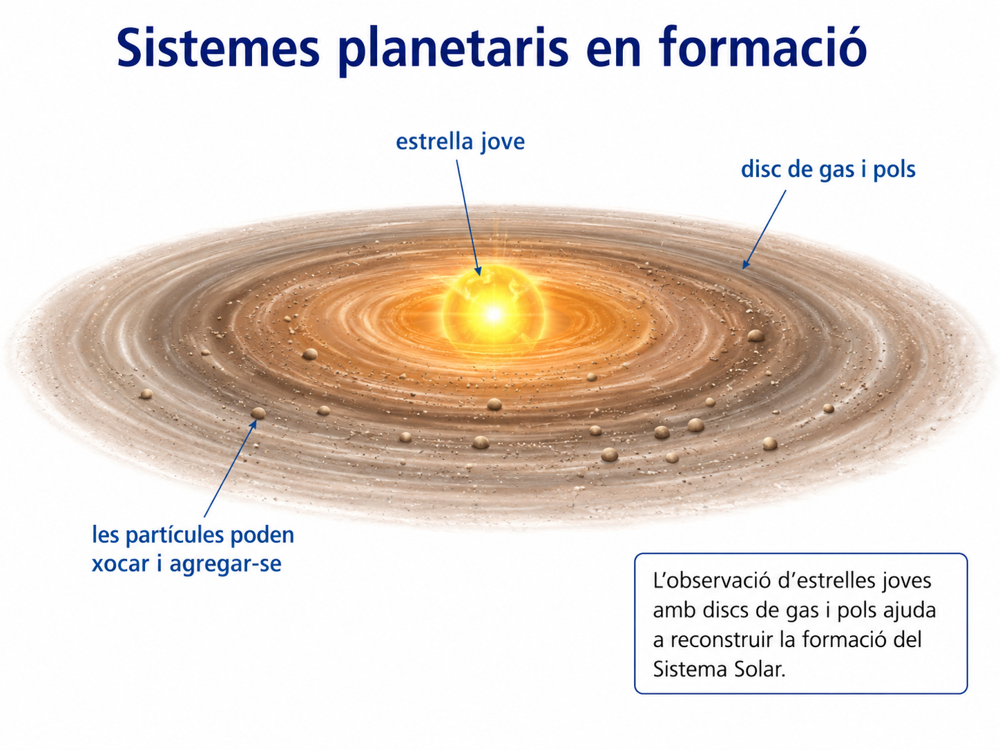

# A01 · Evidències del passat

**U.D. 1 · Com reconstruïm la història de la Terra?**

**Nom i llinatges:** __________________________________________  
**Data:** __________________

## El problema

La Terra es va formar fa aproximadament **4,54 Ga** i el Sistema Solar, fa aproximadament **4,6 Ga**. L'Univers és encara molt més antic.

Ningú no va observar directament aquests esdeveniments.

**Com podem reconstruir, aleshores, una història que va començar fa milers de milions d'anys?**

Al llarg d'aquesta activitat treballarem amb diferents evidències i intentarem distingir sempre entre:

- **allò que podem observar o mesurar**;
- **allò que inferim a partir de les observacions**;
- **els models científics que permeten construir una explicació coherent**.

---

# 1. Què observam i què inferim?

Treballau inicialment en grup. Per a cada evidència, distingiu amb cura entre les dades disponibles i les conclusions que en podem extreure.

## Evidència A · Galàxies

Les observacions astronòmiques mostren que, a gran escala, les galàxies tendeixen a allunyar-se les unes de les altres.

La taula següent representa un conjunt **simplificat de dades** que reprodueix aquest patró:

| Galàxia | Distància relativa | Velocitat d'allunyament relativa |
|---|---:|---:|
| A | 1 | 1 |
| B | 2 | 2 |
| C | 4 | 4 |
| D | 6 | 6 |

### 1.1. Descriu el patró que mostren les dades **sense explicar encara per què es produeix**.

____________________________________________________________________

____________________________________________________________________

### 1.2. Si actualment les distàncies entre les galàxies augmenten, què podem inferir sobre les distàncies que les separaven en el passat?

____________________________________________________________________

____________________________________________________________________

### 1.3. Un alumne afirma:

> «Aquestes dades demostren que totes les galàxies s'allunyen d'un punt central situat a la nostra galàxia.»

Podem arribar a aquesta conclusió a partir de les dades anteriors? Explica-ho.

____________________________________________________________________

____________________________________________________________________

---

## Evidència B · Una radiació que arriba de tot l'espai

Els instruments detecten una **radiació còsmica de fons molt feble que arriba de totes les direccions de l'espai**.

> **FIGURA A01-01B.** Representació esquemàtica de la radiació còsmica de fons observada en diferents direccions del cel.

### 1.4. Què constitueix en aquest cas una **observació**?

____________________________________________________________________

____________________________________________________________________

### 1.5. El model del Big Bang proposa que l'Univers va passar per una etapa inicial molt més **calenta i densa** que l'actual.

Quina relació hi pot haver entre aquest model i la radiació còsmica de fons que observam actualment?

____________________________________________________________________

____________________________________________________________________

### 1.6. Quina de les frases següents és una **observació** i quina és una **inferència**?

**A.** Arriba una radiació molt feble de totes les direccions de l'espai.

**B.** Aquesta radiació conserva informació d'una etapa molt primerenca de l'Univers.

| Frase | Observació o inferència? |
|---|---|
| A | |
| B | |

---

## Evidència C · Sistemes planetaris en formació

Actualment s'observen **estrelles joves envoltades per discs de gas i pols**.

> **FIGURA A01-01C.** Estrella jove envoltada per un disc de gas i pols.

### 1.7. Descriu exclusivament allò que podríem **observar** a la figura.

____________________________________________________________________

____________________________________________________________________

### 1.8. Ordena les etapes següents del model de formació del Sistema Solar:

**acreció · planetes · núvol interestel·lar · planetesimals · disc protoplanetari**

1. __________________________________
2. __________________________________
3. __________________________________
4. __________________________________
5. __________________________________

### 1.9. Quina etapa d'aquesta seqüència és especialment compatible amb l'evidència C?

____________________________________________________________________

### 1.10. Explica per què observar actualment una estrella jove amb un disc de gas i pols **no significa que estiguem observant directament la formació del nostre Sistema Solar**.

____________________________________________________________________

____________________________________________________________________

---

## Evidència D · Meteorits

Alguns meteorits conserven materials formats durant les primeres etapes del Sistema Solar.

Suposem que l'anàlisi d'un mineral d'un meteorit proporciona una edat aproximada de **4.560 Ma**.

### 1.11. Què s'ha observat o mesurat directament?

____________________________________________________________________

### 1.12. Què podem inferir a partir d'aquesta dada sobre l'antiguitat dels materials del Sistema Solar?

____________________________________________________________________

____________________________________________________________________

### 1.13. La major part de les roques de la superfície terrestre ha estat sotmesa durant milers de milions d'anys a processos geològics que les poden transformar o destruir.

Explica per què els meteorits poden conservar informació sobre etapes molt antigues que és difícil trobar en el registre geològic terrestre.

____________________________________________________________________

____________________________________________________________________

### 1.14. Seria correcte afirmar:

> «El valor de 4.560 Ma indica exactament el moment en què es va formar la Terra.»

Justifica la resposta.

____________________________________________________________________

____________________________________________________________________

---

# 2. De les evidències al model

Consulta ara l'apartat **1. De l'origen de l'Univers a la formació de la Terra** del material guia de la U.D. 1.

## 2.1. Completa la taula.

| Evidència observable actual | Què observam? | Què podem inferir? |
|---|---|---|
| Galàxies | | |
| Radiació còsmica de fons | | |
| Estrelles joves amb discs de gas i pols | | |
| Meteorits | | |

## 2.2. Ordena els elements següents per construir una seqüència simplificada des de les primeres etapes de l'Univers fins a la Terra:

**formació de la Terra · formació d'estrelles · Univers inicial calent i dens · formació del Sistema Solar · formació d'elements més pesants a les estrelles**

1. ________________________________________________________________
2. ________________________________________________________________
3. ________________________________________________________________
4. ________________________________________________________________
5. ________________________________________________________________

## 2.3. Explica breument què significa **acreció**.

____________________________________________________________________

____________________________________________________________________

## 2.4. Durant la formació de la Terra primitiva es va produir la **diferenciació planetària**.

Què va passar amb els materials més densos i amb els menys densos?

____________________________________________________________________

____________________________________________________________________

## 2.5. Completa la frase:

> La història inicial de l'Univers i del Sistema Solar no s'ha __________________ directament. S'ha __________________ a partir d'evidències observables i de models científics.

---

# 3. Quant són 4.540 milions d'anys?

La nostra experiència quotidiana fa difícil imaginar la magnitud del temps geològic.

Representarem els **4.540 Ma d'història de la Terra amb una línia de 454 cm**.

Per tant:

**1 cm representa 10 Ma.**

L'extrem actual de la línia representa el **present**.

## 3.1. Calcula a quina distància del present hauríem de situar cadascuna d'aquestes edats.

| Edat | Distància respecte del present |
|---:|---:|
| 4.000 Ma | |
| 500 Ma | |
| 66 Ma | |
| 1 Ma | |
| 0,2 Ma | |

## 3.2. Quants mil·límetres representarien **1 Ma**?

____________________________________________________________________

## 3.3. Quina distància representarien **200.000 anys**?

____________________________________________________________________

## 3.4. Compara aquesta distància amb els 454 cm que representen tota la història de la Terra.

Què ens mostra aquesta comparació sobre la magnitud del temps geològic?

____________________________________________________________________

____________________________________________________________________

---

# 4. El registre geològic no conserva tota la història

Consulta ara l'apartat **2. El temps geològic i el registre geològic** del material guia.

Imagina la història següent d'una zona:

### Etapa 1
Durant un llarg interval es dipositen sediments.

### Etapa 2
La sedimentació s'interromp durant milions d'anys.

### Etapa 3
Els materials que ja existien queden exposats i una part és eliminada per l'erosió.

### Etapa 4
La sedimentació es reprèn i es formen nous estrats damunt els materials antics.

## 4.1. Durant quines etapes es formen **nous materials sedimentaris** que poden quedar incorporats al registre geològic?

____________________________________________________________________

## 4.2. Durant l'etapa 2 no es formen nous estrats.

Significa això que durant aquell interval **no va transcórrer temps** o que **no va passar res**?

Explica-ho.

____________________________________________________________________

____________________________________________________________________

## 4.3. Quin efecte té l'erosió de l'etapa 3 sobre la informació que s'havia conservat prèviament?

____________________________________________________________________

____________________________________________________________________

## 4.4. Suposa que milions d'anys després un geòleg estudia exclusivament les roques que s'han conservat.

Podrà observar directament tot el temps que va transcórrer durant les quatre etapes?

Justifica-ho.

____________________________________________________________________

____________________________________________________________________

## 4.5. Explica amb les teves paraules aquesta afirmació:

> **L'absència de registre no significa absència d'història.**

____________________________________________________________________

____________________________________________________________________

____________________________________________________________________

---

# 5. Tancament individual

> **Evidència d’avaluació · CA 1.1**  
> Aquest tancament es resol **individualment** i genera evidència de **CA 1.1**, perquè l’alumnat ha d’analitzar una afirmació científica distingint **observació, inferència, evidència i model o reconstrucció científica**.  
> La resta de l’activitat té funció principalment **formativa i de construcció del criteri**.

Resol aquest apartat **individualment**.

Un grup d'investigadors estudia un procés que va tenir lloc fa milers de milions d'anys.

Actualment disposen de les evidències següents:

- una determinada estructura observable en materials antics;
- mesures obtingudes amb instruments actuals;
- exemples de processos semblants que es produeixen actualment.

Un alumne afirma:

> «Com que ningú no va observar directament aquell esdeveniment, no podem saber res científicament fiable sobre el que va passar.»

## 5.1. Explica per què aquesta afirmació no és correcta.

A la resposta has de diferenciar explícitament entre:

- **observació**;
- **inferència**;
- **evidència**;
- **model o reconstrucció científica**.

____________________________________________________________________

____________________________________________________________________

____________________________________________________________________

____________________________________________________________________

____________________________________________________________________

## Idea clau de l'activitat

**La ciència pot reconstruir esdeveniments que no hem observat directament si han deixat evidències que podem estudiar en el present.**

A la història de la Terra, però, aquestes evidències formen un **registre incomplet**. En les activitats següents aprendrem a interpretar aquest registre per ordenar i datar els esdeveniments geològics.
