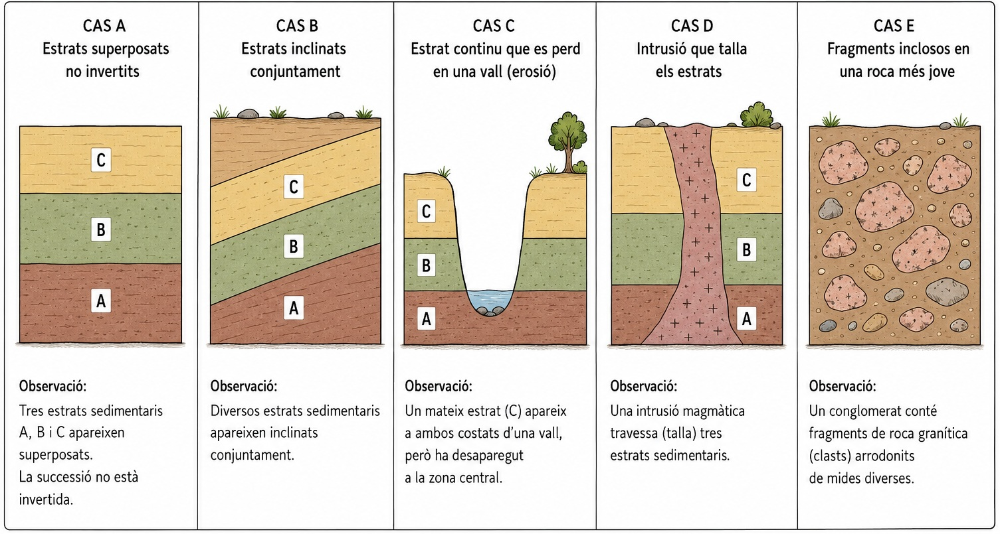
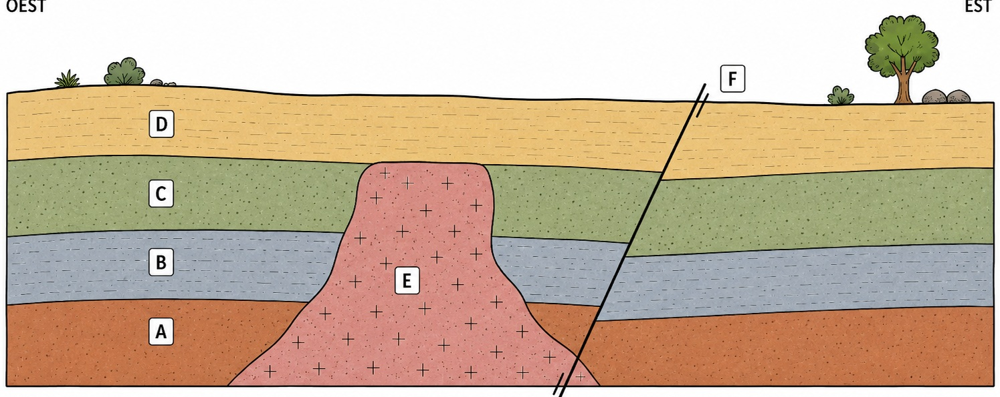
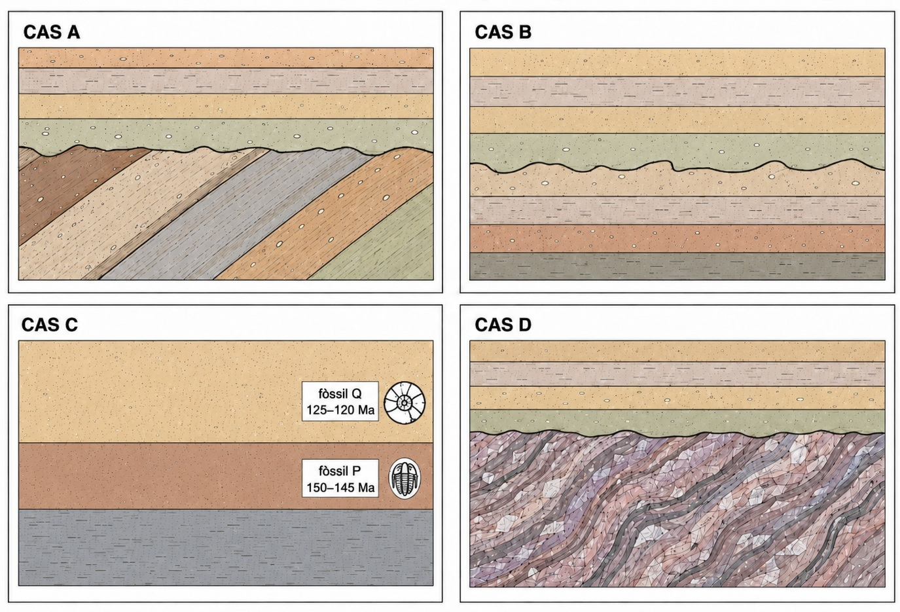
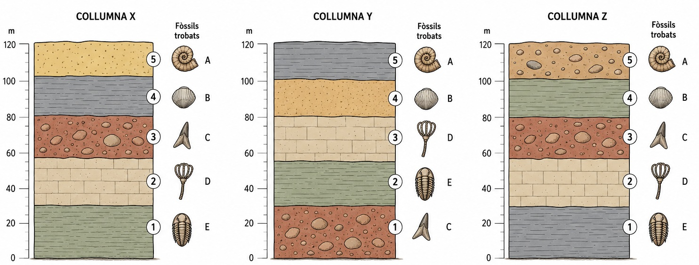
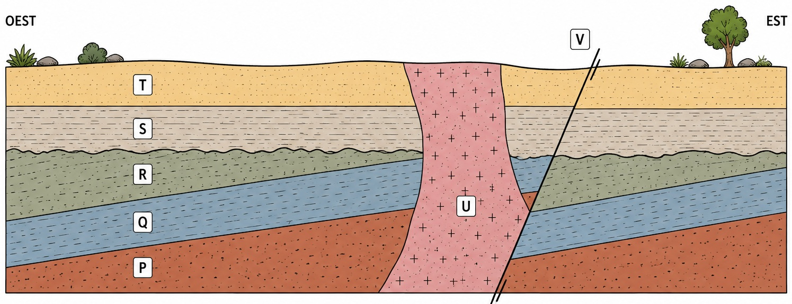

# A02 · Ordenam el registre geològic

**U.D. 1 · Com reconstruïm la història de la Terra?**

**Nom i llinatges:** __________________________________________  
**Data:** __________________

---

<!-- FULL 1 -->

## El problema

Les roques no duen escrita la data en què es varen formar. Tot i això, les seves **relacions espacials** ens poden permetre deduir quins esdeveniments geològics varen passar abans i quins després.

## 1. De l'observació a l'ordre temporal

### 1.1. El present ens ajuda a interpretar el passat

> «El principi d'actualisme diu que els processos geològics sempre han actuat a la mateixa velocitat i intensitat.»

És correcta aquesta afirmació? Explica què estableix realment el principi d'actualisme.

---

---

### 1.2. Cinc casos

Observa els cinc esquemes.

*Figura A02-01. Cinc situacions senzilles que permeten aplicar els principis de datació relativa.*

Per a cada cas, identifica què **observam**, què podem **inferir temporalment** i quin **principi geològic** aplicam.

### 1.3. Sistematitzam

| Principi o relació | Què ens permet inferir? |
|---|---|
| Superposició | |
| Horitzontalitat original | |
| Continuïtat lateral | |
| Relacions de tall | |
| Inclusió | |

### 1.4. Una distinció important

Un geòleg observa que una falla talla tres estrats.

**Observació:** la falla ___________________________________________

**Inferència:** la falla és _______________________________________

**Principi utilitzat:** ___________________________________________

Explica per què l'observació i la inferència no són el mateix.

---

---

---

<!-- FULL 2 -->

## 2. El nostre primer cas geològic

*Figura A02-02. Tall geològic amb quatre estrats sedimentaris A, B, C i D, una intrusió E i una falla F.*

### 2.1. Inventari

Abans d'intentar ordenar els esdeveniments, indica quins elements observables apareixen al tall.

**Estrats sedimentaris:**  
______________________________________________________________

______________________________________________________________

**Estructures o processos posteriors:**  
______________________________________________________________

______________________________________________________________

### 2.2. Ordenam els estrats

Ordena **A, B i C** de més antic a més recent.

________________ → ________________ → ________________

Quin principi has utilitzat?

______________________________________________________________

### 2.3. Situam la intrusió E

Quina relació observable hi ha entre E i els estrats A, B i C?

______________________________________________________________

______________________________________________________________

Què ens permet inferir?

______________________________________________________________

______________________________________________________________

### 2.4. I l'estrat D?

Quina opció concorda amb el que observam?

**a)** sedimentació de D → intrusió E  
**b)** intrusió E → sedimentació de D

Justifica la resposta a partir del tall.

______________________________________________________________

______________________________________________________________

### 2.5. Situam la falla F

Què podem afirmar sobre l'edat relativa de la falla F? Justifica-ho a partir d'una observació del tall.

______________________________________________________________

______________________________________________________________

### 2.6. Reconstruïm la seqüència

Ordena tots els esdeveniments geològics de més antic a més recent. Escriu una frase breu per a cada pas.

1. ___________________________________________________________
2. ___________________________________________________________
3. ___________________________________________________________
4. ___________________________________________________________
5. ___________________________________________________________
6. ___________________________________________________________

#### Què no podem saber?

Podem determinar quants milions d'anys varen transcórrer entre la sedimentació de C i la intrusió E? **Sí / No.** Justifica-ho.

______________________________________________________________

______________________________________________________________

---

<!-- FULL 3 -->

## 3. Quan falta una part de la història

Un **hiat** és un interval de temps que ha transcorregut però que no queda representat pels materials conservats.

*Figura A02-03. Quatre contactes geològics, identificats com A, B, C i D.*

### 3.1. Identificam les discontinuïtats

Assigna a cada cas: **discordança angular, disconformitat, paraconformitat o inconformitat**. Justifica-ho amb una evidència.

| Cas | Tipus | Evidència |
|---|---|---|
| A | | |
| B | | |
| C | | |
| D | | |

En el cas C, utilitza també la informació temporal dels fòssils.

### 3.2. Discordança angular

Ordena:

**sedimentació dels estrats antics · deformació · erosió · nova sedimentació**

1. ________________________________________________
2. ________________________________________________
3. ________________________________________________
4. ________________________________________________

Quina observació indica que la deformació es va produir **abans** de la nova sedimentació?

______________________________________________________________

______________________________________________________________

### 3.3. Disconformitat i paraconformitat

Si els estrats situats a banda i banda del contacte poden ser aproximadament paral·lels, quina evidència permet distingir una **disconformitat** d'una **paraconformitat**?

______________________________________________________________

______________________________________________________________

En el cas C, què et permeten inferir les edats dels fòssils P i Q? Si les dades ho permeten, calcula l'**interval mínim de temps no representat**.

______________________________________________________________

______________________________________________________________

### 3.4. Inconformitat

Quin tipus de roques trobam per davall dels sediments més recents en una inconformitat?

______________________________________________________________

Què havia de passar amb aquestes roques abans que s'hi dipositassin els sediments superiors?

______________________________________________________________

______________________________________________________________

---

<!-- FULL 4 -->

## 4. Els fòssils com a marcadors temporals

| Fòssil | Interval temporal conegut | Distribució geogràfica |
|---|---:|---|
| A | 190-110 Ma | àmplia |
| B | 165-160 Ma | àmplia |
| C | 170-150 Ma | molt reduïda |
| D | 200-120 Ma | àmplia |

### 4.1. Quin és el millor fòssil guia?

Quin dels quatre fòssils seria, en principi, el **millor fòssil guia**?

______________________________________________________________

Justifica la resposta emprant les dues característiques que fan especialment útil un fòssil guia.

______________________________________________________________

______________________________________________________________

### 4.2. Posam un interval a un estrat

Un estrat conté el fòssil B. Entre quines edats es va haver de formar?

______________________________________________________________

Podem afirmar que es va formar exactament fa **162 Ma**? **Sí / No.** Per què?

______________________________________________________________

______________________________________________________________

### 4.3. Dos fòssils dins el mateix estrat

| Fòssil | Interval temporal conegut |
|---|---:|
| X | 155-140 Ma |
| Y | 148-130 Ma |

Durant quin interval coincideixen tots dos organismes?

______________________________________________________________

Quin interval podem assignar a l'estrat si conté tots dos fòssils?

______________________________________________________________

Explica el raonament.

______________________________________________________________

______________________________________________________________

> **Recorda**  
> Un fòssil és especialment útil per datar i correlacionar estrats quan té una **distribució geogràfica àmplia** i una **distribució temporal relativament curta**.

---

<!-- FULL 5 -->

## 5. Correlacionam registres separats

Observa les tres columnes estratigràfiques i relaciona la informació dels fòssils amb la litologia dels estrats.

*Figura A02-04. Tres columnes estratigràfiques X, Y i Z, amb litologies i continguts fòssils diferents.*

### 5.1. Tenint en compte els intervals temporals i la distribució geogràfica de la taula anterior, quin dels fòssils **A, B, C o D** és més útil per correlacionar amb precisió les tres columnes? Justifica-ho.

______________________________________________________________

______________________________________________________________

### 5.2. Quins estrats de les columnes X, Y i Z es poden correlacionar amb més precisió emprant aquest fòssil?

______________________________________________________________

______________________________________________________________

### 5.3. Compara la **litologia** dels estrats que has correlacionat. Què ens mostra aquesta comparació sobre la relació entre **edat** i **tipus de roca**?

______________________________________________________________

______________________________________________________________

### 5.4. El fòssil D apareix en nivells diferents de les tres columnes. És això una contradicció? Justifica la resposta a partir del seu interval temporal conegut.

______________________________________________________________

______________________________________________________________

### 5.5. Podem concloure necessàriament que un organisme no vivia en una regió només perquè el seu fòssil no apareix en una de les columnes? Explica dues possibles raons.

1. ___________________________________________________________

2. ___________________________________________________________

---

<!-- FULL 6 -->

## 6. Repte integrador

Resol aquest apartat en parelles.

*Figura A02-05. Tall geològic.*

### 6.1. Ordenau els esdeveniments

Ordenau els esdeveniments representats de **més antic a més recent**.

1. ___________________________________________________________
2. ___________________________________________________________
3. ___________________________________________________________
4. ___________________________________________________________
5. ___________________________________________________________
6. ___________________________________________________________
7. ___________________________________________________________
8. ___________________________________________________________
9. ___________________________________________________________

### 6.2. Quin tipus de discontinuïtat hi ha entre R i S?

**Observació 1:**  
______________________________________________________________

**Observació 2:**  
______________________________________________________________

**Conclusió:**  
______________________________________________________________

### 6.3. Completa la cadena emprant observacions, no conclusions

> U és posterior a S perquè _______________________________________

> U és posterior a T perquè _______________________________________

> V és posterior a U perquè _______________________________________

### 6.4. Què podem saber sobre el temps transcorregut?

Podem saber exactament quant de temps va transcórrer entre la deformació de P, Q i R i la sedimentació de S?

Explica què ens permet establir realment el tall i què no ens permet determinar.

______________________________________________________________

______________________________________________________________

______________________________________________________________

---

<!-- FULL 7 -->

## 7. Tancament individual

> **Evidència d’avaluació · CA 6.2**  
> Aquest tancament es resol **individualment** i genera evidència de **CA 6.2**, perquè l’alumnat ha d’analitzar elements del registre geològic i fòssil per identificar una discontinuïtat, calcular un interval mínim de temps no representat, correlacionar estrats i distingir entre allò que es pot acotar i allò que no es pot determinar exactament.  
> La resta de l’activitat té funció principalment **formativa i de construcció del criteri**.

Els estrats **M** i **N** són sedimentaris i aproximadament paral·lels. Entre N i l'estrat superior **O** hi ha una superfície irregular d'erosió. N conté el fòssil **K** i O conté el fòssil **L**.

| Fòssil | Interval d'existència |
|---|---:|
| K | 180-172 Ma |
| L | 150-144 Ma |

### 7.1. Quin tipus de discontinuïtat existeix entre N i O? Justifica-ho a partir de les evidències descrites.

______________________________________________________________

______________________________________________________________

### 7.2. Quin és l'**interval mínim de temps** que no queda representat entre N i O? Mostra el raonament.

______________________________________________________________

______________________________________________________________

### 7.3. En una altra zona apareix un estrat de **lutites** que també conté el fòssil L. Què podem inferir sobre l'edat d'aquest estrat?

______________________________________________________________

______________________________________________________________

### 7.4. Explica per què les lutites poden haver-se format aproximadament al mateix temps que O encara que tenguin una litologia diferent.

______________________________________________________________

______________________________________________________________

### 7.5. Podem calcular la **durada exacta** del hiat entre N i O? **Sí / No.** Explica què sabem i què no sabem.

______________________________________________________________

______________________________________________________________

> **Abans de lliurar**  
> Comprova que has distingit **observacions i inferències**, que has justificat el **tipus de discontinuïtat** i que no has confós un **interval mínim** amb la **durada exacta del hiat**.
