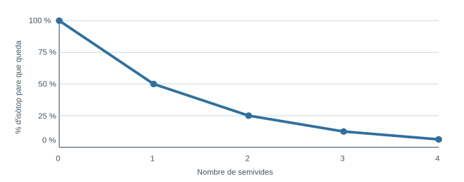

<section class="pv-seccio pv-portada" markdown>

# A03 · Posam edat al registre

## Com passam de «abans/després» a una edat numèrica?

**U.D. 1 · Com reconstruïm la història de la Terra?**

<!-- DOCENT: Activitat de construcció. Idea rectora: la datació radiomètrica no és només aplicar una fórmula; primer s'ha d'entendre el model de semivida, després controlar la plausibilitat del resultat i finalment interpretar quin esdeveniment geològic representa l'edat obtinguda. -->

</section>

<section class="pv-seccio" markdown>

# 1 · D'A02 a A03: ordre no és edat

A A02 podíem establir que una intrusió és **posterior** als estrats que talla o que una falla és **posterior** als materials que desplaça.

<strong>Què ens faltava per poder dir «això va passar fa aproximadament 300 Ma»?</strong>

  

    <button type="button" class="pv-opcio" data-feedback="edat-a" aria-pressed="false">A · Un principi de superposició més precís.</button>
    <button type="button" class="pv-opcio" data-feedback="edat-b" aria-pressed="false">B · Un procés físic que canviï amb el temps de manera quantitativament coneguda.</button>
  

  

    La superposició permet ordenar, però no proporciona per si sola una edat numèrica.
  

  

    <strong>Exacte.</strong> Alguns sistemes isotòpics poden funcionar com a rellotges perquè la desintegració radioactiva segueix una regularitat estadística coneguda.
  

datació relativa → ordre dels esdeveniments &nbsp;&nbsp;·&nbsp;&nbsp; datació radiomètrica → edats numèriques per a determinats processos

</section>

<section class="pv-seccio" markdown>

# 2 · Un rellotge que no fa tic-tac

Un **isòtop radioactiu pare** es transforma espontàniament en un **producte fill**.

No podem predir quan es desintegrarà un àtom concret. En canvi, en una quantitat molt gran d'àtoms, el conjunt segueix una regularitat molt precisa.

<strong>Què significa una semivida?</strong>

  

    <button type="button" class="pv-opcio" data-feedback="semi-a" aria-pressed="false">A · Cada àtom es desintegra exactament quan arriba al final de la semivida.</button>
    <button type="button" class="pv-opcio" data-feedback="semi-b" aria-pressed="false">B · Després d'aquest temps queda aproximadament la meitat dels àtoms pare que hi havia a l'inici de l'interval.</button>
  

  

    No. La desintegració d'un nucli individual és imprevisible.
  

  

    <strong>Correcte.</strong> La semivida descriu el comportament estadístic d'un conjunt molt gran d'àtoms.
  

</section>

<section class="pv-seccio" markdown>

# 3 · Construïm el patró abans de calcular

Començam amb el **100 %** d'isòtop pare.

| Semivides transcorregudes | Fracció de pare | Pare restant |
|---:|---:|---:|
| 0 | 1 | 100 % |
| 1 | 1/2 | 50 % |
| 2 | 1/4 | 25 % |
| 3 | 1/8 | 12,5 % |
| 4 | 1/16 | 6,25 % |

  
<strong>Tres minerals tenen el mateix isòtop: A conserva 50 %, B conserva 25 % i C conserva 12,5 %. Quin ordre és coherent de més antic a més recent?</strong>

  

    <button type="button" class="pv-opcio" data-feedback="ordreiso-a" aria-pressed="false">A · A → B → C</button>
    <button type="button" class="pv-opcio" data-feedback="ordreiso-b" aria-pressed="false">B · C → B → A</button>
  

  

    No. Si tots tres utilitzen el mateix sistema isotòpic, el mineral amb menys isòtop pare restant ha acumulat més semivides.
  

  

    <strong>Correcte.</strong> C ha acumulat 3 semivides, B 2 i A 1.
  

<strong>Quina dada encara necessitam per convertir 1, 2 o 3 semivides en milions d'anys?</strong>

> La **durada de la semivida** de l'isòtop utilitzat.

</section>

<section class="pv-seccio pv-visual" markdown>

# 4 · Llegim una corba de desintegració

<strong>Sense fórmula: quina fracció queda després de 2 semivides? I quantes semivides han passat quan queda un 12,5 %?</strong>

  

    <button type="button" class="pv-opcio" data-feedback="corba-a" aria-pressed="false">A · 1/4 i 3 semivides</button>
    <button type="button" class="pv-opcio" data-feedback="corba-b" aria-pressed="false">B · 1/2 i 2 semivides</button>
    <button type="button" class="pv-opcio" data-feedback="corba-c" aria-pressed="false">C · 1/8 i 4 semivides</button>
  

  
<strong>Correcte.</strong> 2 semivides deixen 25 % i 12,5 % correspon a 3 semivides.

  
Després de cada semivida queda la meitat del que quedava abans, no la meitat de la quantitat inicial cada vegada.

  
1/8 correspon a 3 semivides, no a 2.

</section>

<section class="pv-seccio" markdown>

# 5 · Quan el nombre de semivides és exacte

Un isòtop té una semivida de **500 Ma** i en un mineral queda el **25 %** de l'isòtop pare.

25 % = 1/4 → 2 semivides → 2 × 500 Ma = 1.000 Ma

  
<strong>Un altre isòtop té una semivida de 80 Ma i en queda el 12,5 %. Quina edat indica?</strong>

  

    <button type="button" class="pv-opcio" data-feedback="exacte-a" aria-pressed="false">A · 160 Ma</button>
    <button type="button" class="pv-opcio" data-feedback="exacte-b" aria-pressed="false">B · 240 Ma</button>
    <button type="button" class="pv-opcio" data-feedback="exacte-c" aria-pressed="false">C · 640 Ma</button>
  

  
160 Ma són 2 semivides i deixarien 25 %.

  
<strong>Correcte.</strong> 12,5 % = 1/8 = 3 semivides; 3 × 80 = 240 Ma.

  
Això correspondria a 8 semivides.

> Abans d'introduir una fórmula, convé poder **veure el patró**.

</section>

<section class="pv-seccio" markdown>

# 6 · Quan la proporció no encaixa exactament

Si queda, per exemple, un **35 %**, no correspon exactament a 1, 2, 3... semivides.

$$
\frac{N}{N_0}=\left(\frac12\right)^{t/T_{1/2}}
$$

I podem aïllar el temps:

$$
t=T_{1/2}\frac{\ln(N/N_0)}{\ln(1/2)}
$$

Un isòtop té una semivida de **600 Ma** i en un mineral queda el **35 %** del pare inicial.

<strong>Abans de calcular: entre quines dues edats ha de quedar necessàriament el resultat?</strong>

  

    <button type="button" class="pv-opcio" data-feedback="rang-a" aria-pressed="false">A · Entre 0 i 600 Ma</button>
    <button type="button" class="pv-opcio" data-feedback="rang-b" aria-pressed="false">B · Entre 600 i 1.200 Ma</button>
    <button type="button" class="pv-opcio" data-feedback="rang-c" aria-pressed="false">C · Entre 1.200 i 1.800 Ma</button>
  

  
Després d'una semivida encara quedaria 50 %, més del 35 % observat.

  
<strong>Correcte.</strong> 35 % està entre 50 % i 25 %, així que han passat entre 1 i 2 semivides.

  
Després de 2 semivides ja quedaria només el 25 %.

> El càlcul dona aproximadament **909 Ma**. L'estimació prèvia ens permet detectar resultats impossibles.

[Consulta el material guia: 6 · Datació radiomètrica](../../../material/ud1/ud1.md#6-datacio-radiometrica-assignar-edats-numeriques)

</section>

<section class="pv-seccio" markdown>

# 7 · La calculadora no decideix si el resultat té sentit

Semivida = **500 Ma** · Pare restant = **40 %**

<strong>Sense calcular exactament, quin interval és possible?</strong>

50 % després de 500 Ma &nbsp;&nbsp;→&nbsp;&nbsp; 40 % &nbsp;&nbsp;→&nbsp;&nbsp; 25 % després de 1.000 Ma

  
<strong>Un alumne obté 1.850 Ma. Què podem dir immediatament?</strong>

  

    <button type="button" class="pv-opcio" data-feedback="control-a" aria-pressed="false">A · Pot ser correcte si la calculadora ho ha donat.</button>
    <button type="button" class="pv-opcio" data-feedback="control-b" aria-pressed="false">B · No pot ser correcte: 1.850 Ma és molt més de 2 semivides i hauria de quedar molt menys del 25 %.</button>
  

  
Una calculadora pot reproduir perfectament una entrada de dades incorrecta.

  
<strong>Exacte.</strong> L'ordre de magnitud i el model físic permeten detectar l'error abans de revisar el càlcul.

> Valor aproximat correcte: **661 Ma**.

</section>

<section class="pv-seccio" markdown>

# 8 · Mateix percentatge no significa mateixa edat

Dos minerals:

| Mineral | Semivida | Pare restant |
|---|---:|---:|
| M1 | 200 Ma | 25 % |
| M2 | 500 Ma | 50 % |

<strong>Quin és més antic?</strong>

  

    <button type="button" class="pv-opcio" data-feedback="comp-a" aria-pressed="false">A · M1, perquè conserva menys isòtop pare.</button>
    <button type="button" class="pv-opcio" data-feedback="comp-b" aria-pressed="false">B · M2, perquè 1 semivida de 500 Ma és més temps que 2 semivides de 200 Ma.</button>
  

  
M1 ha passat 2 semivides: 2 × 200 = 400 Ma.

  
<strong>Correcte.</strong> M2 té 500 Ma i M1 400 Ma. El percentatge només té sentit si coneixem la semivida del sistema.

</section>

<section class="pv-seccio" markdown>

# 9 · Una data no parla tota sola

<strong>Què representa realment una edat radiomètrica?</strong>

  <button type="button" class="pv-terme" data-resposta="POT DATAR LA CRISTAL·LITZACIÓ DEL MAGMA">Mineral d'un granit cristal·litzat fa 310 Ma</button>
  <button type="button" class="pv-terme" data-resposta="NO DATA DIRECTAMENT LA SEDIMENTACIÓ DEL GRES">Zircó detrític de 850 Ma dins un gres</button>
  <button type="button" class="pv-terme" data-resposta="L'EDAT POT HAVER PERDUT EL SEU SIGNIFICAT ORIGINAL">Sistema isotòpic que ha guanyat o perdut isòtops</button>
  <button type="button" class="pv-terme" data-resposta="ELS ESTRATS QUE TALLA SÓN ANTERIORS A 180 Ma">Intrusió de 180 Ma que talla tres estrats</button>

> Una datació és útil geològicament només si sabem **què s'ha datat** i **quin esdeveniment representa el rellotge isotòpic**.

</section>

<section class="pv-seccio" markdown>

# 10 · Un gra pot ser molt més antic que la roca que el conté

Un **zircó detrític** dins un gres dona una edat de **850 Ma**.

  
<strong>Podem afirmar que el gres es va sedimentar fa 850 Ma?</strong>

  

    <button type="button" class="pv-opcio" data-feedback="zirco-a" aria-pressed="false">A · Sí, perquè el gra forma part del gres.</button>
    <button type="button" class="pv-opcio" data-feedback="zirco-b" aria-pressed="false">B · No. El gra havia d'existir abans de ser erosionat, transportat i incorporat al sediment.</button>
  

  
Confondríem l'edat del fragment amb l'edat del procés sedimentari que el va incorporar.

  
<strong>Correcte.</strong> L'edat del zircó proporciona, com a mínim, informació sobre la roca font i estableix un límit màxim possible per a la sedimentació, no una edat exacta del gres.

cristal·lització del zircó → erosió de la roca font → transport → sedimentació del gres

</section>

<section class="pv-seccio" markdown>

# 11 · Acotam una edat sense inventar-ne una

Un estrat sedimentari **S** es troba entre dues capes volcàniques:

V1 · 290 Ma → S → V2 · 245 Ma

<strong>Què podem afirmar sobre S?</strong>

  

    <button type="button" class="pv-opcio" data-feedback="acota-a" aria-pressed="false">A · S té exactament 267,5 Ma, el punt mitjà.</button>
    <button type="button" class="pv-opcio" data-feedback="acota-b" aria-pressed="false">B · S es va sedimentar en algun moment entre 290 i 245 Ma.</button>
  

  
No hi ha cap evidència que indiqui que la sedimentació es produís exactament a mig interval.

  
<strong>Correcte.</strong> Combinam les edats numèriques amb la posició relativa de S.

> **Acotar** no és el mateix que **datar exactament**.

[Consulta el material guia: 7 · Integrar datació relativa i radiomètrica](../../../material/ud1/ud1.md#7-integrar-la-datacio-relativa-i-la-datacio-radiometrica)

</section>

<section class="pv-seccio" markdown>

# 12 · El procediment complet

Quan resolgueu un problema de datació radiomètrica:

identifica què es data → estima l'interval → calcula → posa unitats → comprova la plausibilitat → interpreta geològicament

<strong>Quina passa és més fàcil oblidar si només pensam en «fer números»?</strong>

> La darrera: explicar **què significa geològicament l'edat calculada** i què no podem afirmar a partir d'ella.

</section>

<section class="pv-seccio" markdown>

# 13 · Tancament individual

En una successió geològica, la capa volcànica inferior **V1** conté un mineral en què queda el **37 %** de l'isòtop pare. La semivida és de **180 Ma**.

Per damunt hi ha un estrat sedimentari **S** i, sobre aquest, una capa volcànica **V2** datada independentment en **220 Ma**.

Dins S s'ha trobat també un **gra detrític** datat en **760 Ma**.

Resol individualment:

1. Calcula l'edat aproximada de **V1**. Mostra el procediment i comprova si el resultat és plausible.
2. A partir de V1 i V2, **acota l'edat de sedimentació de S**.
3. Explica per què els **760 Ma** del gra detrític no són l'edat de sedimentació de S.
4. Escriu una conclusió breu: **què podem afirmar** sobre la cronologia i **què no podem determinar** amb aquestes dades?

<!-- DOCENT: V1 ≈ 258 Ma; S queda acotat aproximadament entre 258 i 220 Ma. El gra detrític és anterior a la sedimentació. DECISIÓ PENDENT: no etiquetar encara aquest tancament com a evidència formal de CA 6.2 fins revisar el conjunt complet d'activitats de la UD1 i decidir quines evidències convé registrar. -->

</section>

<section class="pv-seccio pv-portada" markdown>

# Idea clau

## Una edat radiomètrica no és només un número: és la lectura d'un sistema físic que hem de situar dins una història geològica.

**Calcular bé és necessari. Interpretar què s'ha datat és imprescindible.**

[Consulta el material guia de la UD1](../../../material/ud1/ud1.md)

</section>

