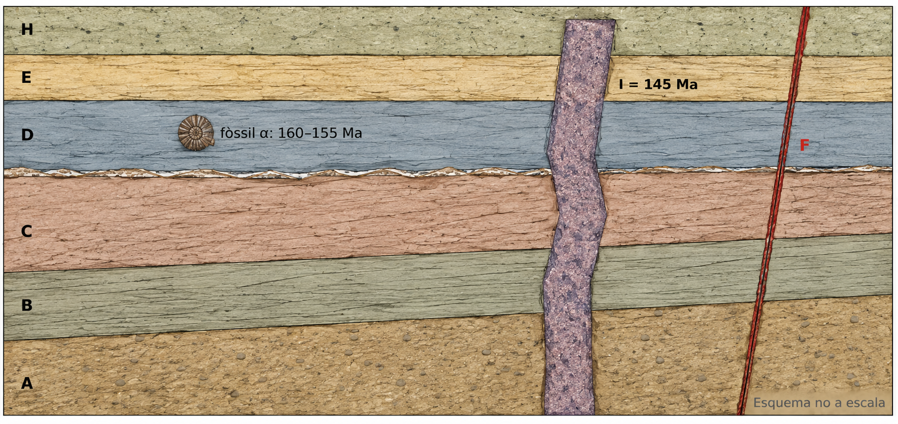
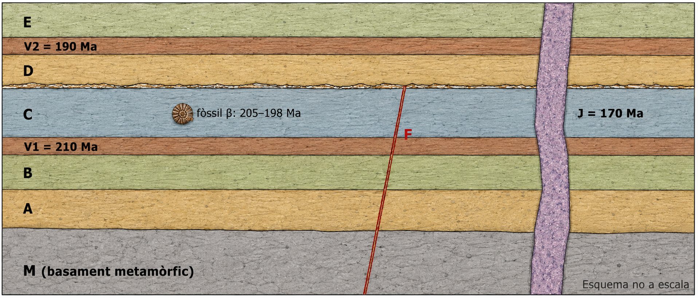
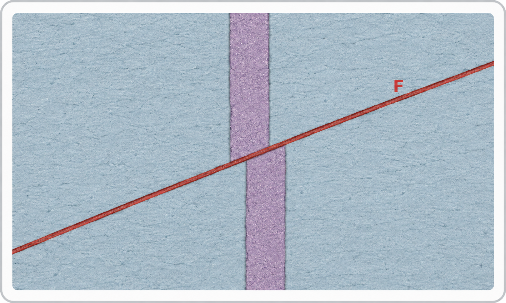
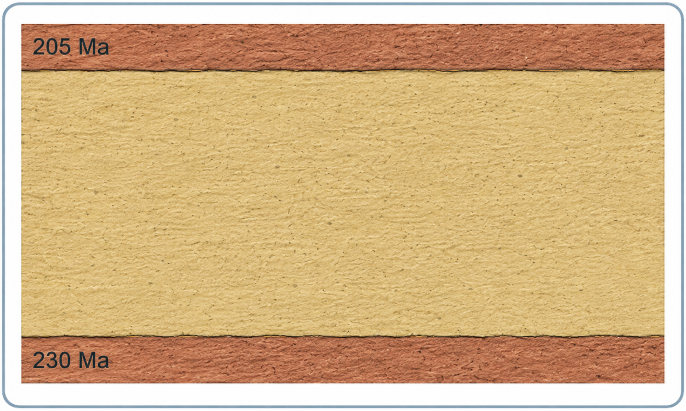
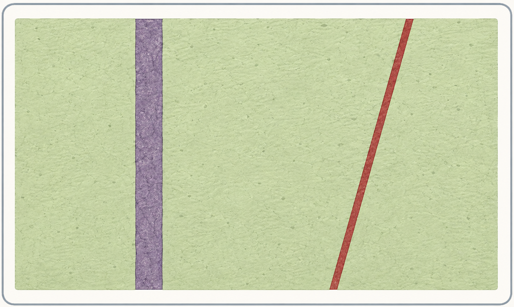

# A04 · Reconstruïm una història geològica

**Integram les evidències per explicar què va passar i en quin ordre**

> **Repte de l’activitat.** Ja has treballat els principis de datació relativa, les discontinuïtats, els fòssils i la datació radiomètrica. Ara no aprendrem una eina nova: hauràs de **decidir quines eines necessites i combinar-les** per reconstruir una història compatible amb totes les evidències.

## Una reconstrucció no és una llista

En un tall geològic podem observar roques, contactes i estructures. La història que proposam és una **inferència**: ha d’estar justificada per relacions observables. Per això, no basta encertar l’ordre dels esdeveniments; hem de poder explicar **com ho sabem**.

**1. Observa → 2. Relaciona → 3. Ordena → 4. Integra dates → 5. Justifica**

### La regla més important

> **No forcis una resposta.** Si dues estructures no mantenen cap relació que permeti ordenar-les, la resposta rigorosa és que **amb les evidències disponibles no es pot determinar** quina és anterior.

## Com treballarem

| Fase | Què farem |
|---|---|
| **1. Cas integrador en parelles** | Reconstruireu un tall complet combinant datació relativa, una discontinuïtat, un fòssil i una edat radiomètrica. |
| **2. Posada en comú** | Compararem les reconstruccions i ens centrarem en les evidències que permeten decidir entre interpretacions diferents. |
| **3. Repte individual** | Resoldràs un segon cas amb menys ajuda. Aquesta part és la principal evidència de treball individual de l’activitat. |
| **4. Clínica d’errors** | Revisaràs errors típics i identificaràs què permet afirmar cada evidència i què no. |

### Abans de començar

Tengues a mà el material guia i les activitats A02 i A03. Consulta’ls quan necessitis recuperar un principi, interpretar un fòssil o donar significat a una edat numèrica.

---

## 1 · Cas integrador en parelles

El tall següent representa una zona geològica simplificada. Les lletres identifiquen unitats o estructures. El fòssil α només va existir entre 160 i 155 Ma. La intrusió I ha estat datada radiomètricament en 145 Ma.

*Figura 1. Tall per reconstruir. L’esquema és didàctic i no està dibuixat a escala.*

### 1.1 · Comença només per allò que veus

**Escriu sis observacions que es puguin descriure directament al tall, sense convertir-les encara en una història. Evita expressions com «primer», «després» o «més antic» si encara són una inferència.**

<!-- Espai de resposta: aproximadament 6 línies -->

### 1.2 · Identifica les evidències que aporten informació temporal

| Evidència del tall | Quina informació temporal podria aportar? |
|---|---|
| Superposició d’estrats | |
| Discordança angular | |
| Fòssil α | |
| Intrusió I = 145 Ma | |
| Falla F | |

### 1.3 · Justifica les relacions clau

Completa la taula amb relacions que siguin necessàries per construir la cronologia. No cal omplir-la amb totes les parelles possibles: selecciona les que realment sostenen la reconstrucció.

| Observació | Inferència temporal | Principi o evidència |
|---|---|---|
| | | |
| | | |
| | | |
| | | |
| | | |

### 1.4 · Construeix la cronologia

**Construeix la cronologia de més antic a més recent. Inclou sedimentació, deformació, erosió/discontinuïtat, intrusió, falla i modelatge superficial quan correspongui. Si dues estructures no es poden ordenar amb les evidències disponibles, indica-ho explícitament.**

<!-- Espai de resposta -->

### 1.5 · Integra la informació numèrica

**a)** Què pots afirmar sobre l’edat de D gràcies al fòssil α?  
**b)** Què implica l’edat de 145 Ma de la intrusió I per als materials que talla?  
**c)** Què pots afirmar —i què no— sobre l’edat de la falla F?

<!-- Espai de resposta -->

> **Posada en comú.** Si dues parelles proposau seqüències diferents, no decidiu per votació. Cercau la relació observable que permet confirmar-ne una o concloure que el tall no permet decidir.

---

## 2 · Repte individual

Resol el cas següent sense copiar un procediment mecànic. L’objectiu és construir una explicació coherent utilitzant només allò que les evidències permeten afirmar.

*Figura 2. Tall del repte individual. El fòssil β té un interval temporal de 205–198 Ma. Les capes volcàniques V1 i V2 i la intrusió J tenen les edats indicades.*

### 2.1 · Identifica les evidències rellevants

**Selecciona almenys sis evidències del tall que faràs servir per reconstruir la història. Escriu-les com a observacions, no com a conclusions.**

<!-- Espai de resposta: aproximadament 6 línies -->

### 2.2 · Resol tres relacions temporals

| Relació que has d’establir | Conclusió i justificació |
|---|---|
| Basament M i sedimentació d’A | |
| Sedimentació de C i falla F | |
| Falla F i capa volcànica V2 | |

### 2.3 · Acota temporalment

Utilitza les datacions i el fòssil β per respondre. No confonguis «tenir una data» amb «saber l’edat exacta de tots els esdeveniments».

**a)** Quin límit temporal aporta V1 = 210 Ma als materials situats per damunt?  
**b)** Quin interval temporal és compatible amb la sedimentació de C segons el fòssil β?  
**c)** Quin és l’interval temporal més ampli en què pots situar la formació de la falla F amb les evidències disponibles? Justifica els dos límits.  
**d)** Què implica J = 170 Ma per als materials i estructures que talla?

<!-- Espai de resposta -->

### 2.4 · Cronologia completa

**Ordena els esdeveniments principals de més antic a més recent. Escriu una seqüència clara amb fletxes.**

<!-- Espai de resposta -->

### 2.5 · Explica la història geològica

**Redacta un text breu que transformi la cronologia en una explicació. Justifica almenys tres relacions temporals amb una observació o dada del tall.**

<!-- Espai de resposta -->

---

## 3 · Clínica d’errors i transferència

No es tracta de tornar a fer tot el tema. En cada situació, identifica exactament què permet afirmar l’evidència i quin error s’ha d’evitar.

| Dibuix 1 | Dibuix 2 | Dibuix 3 |
|---|---|---|
|  |  |  |

### 3.1 · «La falla i la intrusió són de la mateixa edat perquè apareixen juntes»

**Al dibuix 1, la falla talla la intrusió. Corregeix l’afirmació i indica quin principi utilitzes.**

<!-- Espai de resposta -->

### 3.2 · «L’estrat sedimentari té 217,5 Ma»

**Al dibuix 2, un estrat sedimentari està entre una capa volcànica inferior de 230 Ma i una superior de 205 Ma. Explica per què 217,5 Ma no és la seva edat coneguda i escriu la conclusió correcta.**

<!-- Espai de resposta -->

### 3.3 · «L’estructura vermella és posterior a la intrusió lila»

**Al dibuix 3, les dues estructures no es tallen ni mantenen cap altra relació observable. Quina és la resposta rigorosa?**

<!-- Espai de resposta -->

### 3.4 · Revisa una decisió teva

Torna al repte individual. Tria una relació temporal que hagis establert i completa:

| Jo havia conclòs que... | L’evidència que ho justifica és... | Ara estic... |
|---|---|---|
| | | ☐ segur/a  ☐ ho he corregit |

> **Idea final:** una bona reconstrucció és la més completa que permeten les evidències, no la que inventa més detalls.
