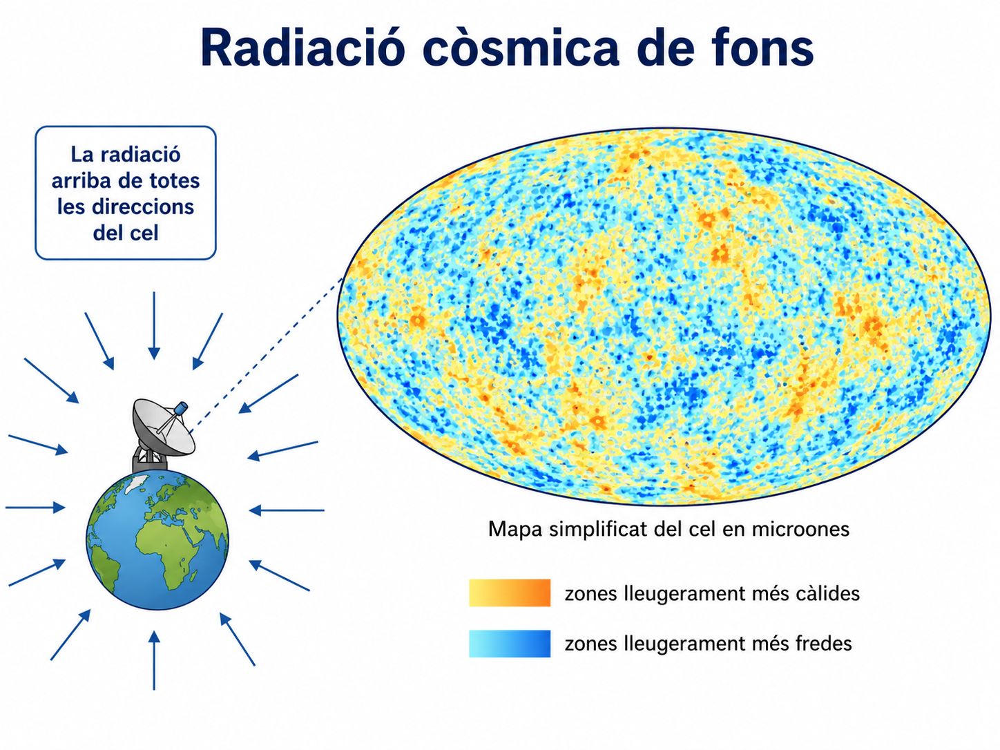

<section class="pv-seccio pv-portada" markdown>

# A01 · Evidències del passat

## Com podem saber què va passar si ningú no hi era?

**U.D. 1 · Com reconstruïm la història de la Terra?**

<!-- DOCENT: Activitat de construcció. Idea rectora: la ciència pot reconstruir processos del passat a partir d'observacions actuals, evidències, inferències i models. No començar definint els quatre conceptes; fer-los emergir dels casos. -->

</section>

<section class="pv-seccio" markdown>

# 1 · El problema

La Terra es va formar fa aproximadament **4,54 Ga** i el Sistema Solar fa aproximadament **4,6 Ga**.

Ningú no va observar directament aquests esdeveniments.

<strong>Podem saber científicament què va passar?</strong>

Pensau-hi individualment durant uns segons i comentau després una resposta amb la persona del costat.

  

    <button type="button" class="pv-opcio" data-feedback="problema-a" aria-pressed="false">A · No. Si ningú no ho va observar, només podem especular.</button>
    <button type="button" class="pv-opcio" data-feedback="problema-b" aria-pressed="false">B · Sí. Podem estudiar indicis actuals i construir explicacions contrastables.</button>
  

  

    Aquesta resposta confon <strong>observació directa de l'esdeveniment</strong> amb coneixement científic. Molts processos del passat deixen rastres que encara podem mesurar avui.
  

  

    <strong>Aquesta és la idea que posarem a prova.</strong> No veure directament un esdeveniment no impedeix estudiar-ne les conseqüències observables.
  

<!-- DOCENT: No donar encara les definicions d'observació, evidència, inferència i model. -->

</section>

<section class="pv-seccio" markdown>

# 2 · Evidència A: galàxies

La taula representa un conjunt **simplificat de dades** que reprodueix un patró observat a gran escala.

| Galàxia | Distància relativa | Velocitat d'allunyament relativa |
|---|---:|---:|
| A | 1 | 1 |
| B | 2 | 2 |
| C | 4 | 4 |
| D | 6 | 6 |

<strong>Descriu el patró sense explicar encara per què es produeix.</strong>

  

    <button type="button" class="pv-opcio" data-feedback="gal-a" aria-pressed="false">A · Les galàxies més llunyanes mostren una velocitat d'allunyament més gran.</button>
    <button type="button" class="pv-opcio" data-feedback="gal-b" aria-pressed="false">B · Les galàxies s'allunyen perquè varen sortir expulsades d'un punt central.</button>
  

  

    <strong>Exacte.</strong> Això descriu el patró de les dades sense introduir encara una explicació causal.
  

  

    Aquesta frase ja incorpora una <strong>interpretació</strong> que les dades de la taula, per si soles, no demostren.
  

<!-- DOCENT: Fer verbalitzar la diferència entre descriure una relació i explicar-ne la causa. -->

</section>

<section class="pv-seccio" markdown>

# 3 · Del que observam al que inferim

Si actualment, a gran escala, les distàncies entre galàxies augmenten...

<strong>què és raonable inferir sobre les distàncies que les separaven en el passat?</strong>

  

    <button type="button" class="pv-opcio" data-feedback="passat-a" aria-pressed="false">A · En general havien de ser menors.</button>
    <button type="button" class="pv-opcio" data-feedback="passat-b" aria-pressed="false">B · Havien de ser exactament iguals.</button>
    <button type="button" class="pv-opcio" data-feedback="passat-c" aria-pressed="false">C · Les dades demostren que totes varen sortir d'un punt situat a la Via Làctia.</button>
  

  

    <strong>Sí.</strong> Aquesta és una inferència compatible amb el patró observat.
  

  

    No seria compatible amb un augment sistemàtic de les distàncies.
  

  

    No. L'expansió còsmica no implica que la nostra galàxia ocupi un centre espacial de l'Univers.
  

> Una **inferència** va més enllà de descriure la dada, però ha d'estar limitada pel que les evidències permeten sostenir.

</section>

<section class="pv-seccio pv-visual" markdown>

# 4 · Evidència B: una radiació que arriba de tot l'espai

Els instruments detecten una **radiació còsmica de fons molt feble que arriba de totes les direccions de l'espai**.

  
<strong>Quina frase és una observació i quina ja és una interpretació?</strong>

  

    <button type="button" class="pv-opcio" data-feedback="radiacio-a" aria-pressed="false">A · Arriba una radiació molt feble de totes les direccions.</button>
    <button type="button" class="pv-opcio" data-feedback="radiacio-b" aria-pressed="false">B · Aquesta radiació conserva informació d'una etapa molt primerenca de l'Univers.</button>
  

  

    <strong>Observació.</strong> És allò que detectam amb instruments.
  

  

    <strong>Inferència o interpretació.</strong> Connecta l'observació amb un model sobre la història de l'Univers.
  

El model cosmològic actual proposa que l'Univers va passar per una etapa inicial molt més **calenta i densa** que l'actual.

<strong>Com encaixa aquesta radiació en aquest model?</strong>

<!-- DOCENT: Cercar una resposta del tipus “és una evidència compatible amb una etapa primerenca calenta”, evitant presentar una sola observació com a demostració completa del model. -->

</section>

<section class="pv-seccio pv-visual" markdown>

# 5 · Evidència C: sistemes planetaris en formació

<strong>Primer, descriviu només allò que podríem observar. Encara no expliqueu què significa.</strong>

Després provau d'ordenar mentalment aquesta seqüència:

núvol interestel·lar → disc protoplanetari → planetesimals → acreció → planetes

  
<strong>Observar avui una estrella jove amb un disc significa que estam veient directament la formació del nostre Sistema Solar?</strong>

  

    <button type="button" class="pv-opcio" data-feedback="disc-a" aria-pressed="false">A · Sí</button>
    <button type="button" class="pv-opcio" data-feedback="disc-b" aria-pressed="false">B · No</button>
  

  

    No. Estam observant <strong>un altre sistema actual</strong>, no un esdeveniment ocorregut al nostre Sistema Solar fa milers de milions d'anys.
  

  

    <strong>Correcte.</strong> Observam un procés actual comparable que ajuda a valorar si un model de formació planetària és plausible.
  

</section>

<section class="pv-seccio" markdown>

# 6 · Evidència D: meteorits

En un mineral d'un meteorit s'obté una edat radiomètrica aproximada de **4.560 Ma**.

<strong>Què mesuram realment i què inferim?</strong>

  

  **Mesura**

  Proporcions o abundàncies d'isòtops en una mostra.
  

  

  **Model físic**

  Coneixem el comportament de la desintegració radioactiva.
  

  

  **Inferència**

  A partir de les mesures i del model estimam una edat.
  

  
<strong>Quina conclusió és més prudent?</strong>

  

    <button type="button" class="pv-opcio" data-feedback="met-a" aria-pressed="false">A · La Terra es va formar exactament fa 4.560 Ma.</button>
    <button type="button" class="pv-opcio" data-feedback="met-b" aria-pressed="false">B · Alguns materials del Sistema Solar ja existien fa aproximadament 4.560 Ma.</button>
  

  

    És una conclusió massa forta. L'edat d'un mineral meteòritic no és automàticament l'edat exacta de formació de la Terra.
  

  

    <strong>Sí.</strong> La dada ajuda a acotar l'antiguitat dels primers materials del Sistema Solar sense identificar-la amb un únic instant exacte.
  

</section>

<section class="pv-seccio" markdown>

# 7 · Quatre idees que no són el mateix

<strong>Clica cada frase i comprova quin paper té en una reconstrucció científica.</strong>

  <button type="button" class="pv-terme" data-resposta="OBSERVACIÓ">Un instrument detecta radiació de totes les direccions.</button>
  <button type="button" class="pv-terme" data-resposta="EVIDÈNCIA">Aquesta detecció és rellevant per contrastar models sobre l'Univers primerenc.</button>
  <button type="button" class="pv-terme" data-resposta="INFERÈNCIA">En el passat les distàncies entre galàxies havien de ser, en general, menors.</button>
  <button type="button" class="pv-terme" data-resposta="MODEL">Una explicació coherent relaciona moltes observacions i permet fer prediccions contrastables.</button>

observacions i mesures → evidències rellevants → inferències → models que integren moltes evidències

> Una mateixa dada pot convertir-se en **evidència** quan l'utilitzam per valorar una hipòtesi o un model concret.

<!-- DOCENT: Important evitar presentar els quatre termes com quatre compartiments independents i rígids. “Evidència” descriu el paper que una dada o observació juga en un argument científic. -->

</section>

<section class="pv-seccio" markdown>

# 8 · De moltes evidències a una història coherent

Ordenau aquesta seqüència simplificada:

- formació de la Terra;
- formació d'estrelles;
- Univers inicial calent i dens;
- formació del Sistema Solar;
- formació d'elements més pesants a les estrelles.

  
<strong>Quina seqüència és coherent amb el model actual?</strong>

  

    <button type="button" class="pv-opcio" data-feedback="seq-a" aria-pressed="false">A · Univers inicial → estrelles → elements pesants → Sistema Solar → Terra</button>
    <button type="button" class="pv-opcio" data-feedback="seq-b" aria-pressed="false">B · Terra → Sistema Solar → estrelles → Univers inicial → elements pesants</button>
    <button type="button" class="pv-opcio" data-feedback="seq-c" aria-pressed="false">C · Estrelles → Univers inicial → Terra → elements pesants → Sistema Solar</button>
  

  

    <strong>Correcte.</strong> Els elements pesants que formen planetes com la Terra requereixen generacions prèvies d'estrelles.
  

  

    No. La Terra no pot precedir el Sistema Solar ni les generacions d'estrelles que varen produir molts dels seus elements.
  

  

    No. El model situa l'Univers inicial abans de la formació de les primeres estrelles.
  

<strong>On situaries l'acreció i la diferenciació planetària dins aquesta història?</strong>

<!-- DOCENT: Enllaçar amb l'apartat 1 del material guia només després que hagin intentat construir la seqüència. -->

</section>

<section class="pv-seccio" markdown>

# 9 · Quant són 4.540 milions d'anys?

Representam els **4.540 Ma** d'història de la Terra amb una línia de **454 cm**.

1 cm = 10 Ma &nbsp;&nbsp;·&nbsp;&nbsp; 1 mm = 1 Ma

<strong>Abans de calcular: quina distància representarien 200.000 anys?</strong>

  

    <button type="button" class="pv-opcio" data-feedback="temps-a" aria-pressed="false">A · 20 cm</button>
    <button type="button" class="pv-opcio" data-feedback="temps-b" aria-pressed="false">B · 2 cm</button>
    <button type="button" class="pv-opcio" data-feedback="temps-c" aria-pressed="false">C · 2 mm</button>
    <button type="button" class="pv-opcio" data-feedback="temps-d" aria-pressed="false">D · 0,2 mm</button>
  

  
Revisa l'escala: 1 mm ja representa un milió d'anys.

  
Revisa l'escala: 2 cm representarien 20 Ma.

  
2 mm representarien 2 Ma, no 0,2 Ma.

  
<strong>Correcte.</strong> 200.000 anys = 0,2 Ma = 0,2 mm en aquesta escala.

<strong>Què ens diu aquesta comparació sobre la nostra intuïció del temps geològic?</strong>

</section>

<section class="pv-seccio" markdown>

# 10 · El registre geològic no és una gravació contínua

Imaginau aquesta història:

sedimentació → interrupció de la sedimentació → erosió → nova sedimentació

  
<strong>Durant l'interval sense sedimentació, què passa amb el temps?</strong>

  

    <button type="button" class="pv-opcio" data-feedback="registre-a" aria-pressed="false">A · El temps s'atura perquè no es formen estrats.</button>
    <button type="button" class="pv-opcio" data-feedback="registre-b" aria-pressed="false">B · El temps continua transcorrent encara que no quedi registrat per nova sedimentació.</button>
  

  

    No. El procés de sedimentació pot aturar-se, però el temps continua transcorrent i poden passar altres processos.
  

  

    <strong>Exacte.</strong> Una absència d'estrats no és una absència de temps.
  

  
<strong>I si després hi ha erosió?</strong>

  

    <button type="button" class="pv-opcio" data-feedback="erosio-a" aria-pressed="false">A · Pot desaparèixer part de la informació que s'havia conservat.</button>
    <button type="button" class="pv-opcio" data-feedback="erosio-b" aria-pressed="false">B · El registre es fa necessàriament més complet.</button>
  

  
<strong>Sí.</strong> L'erosió pot eliminar materials i, amb ells, part del registre anterior.

  
No. L'erosió pot destruir una part del registre que ja existia.

> **Absència de registre ≠ absència d'història.**

</section>

<section class="pv-seccio pv-visual" markdown>

# 11 · Tancament individual · CA 1.1

## Un cas real: llegim el passat de Mart

*Figura. Fotograma del mosaic **Longquimay**, adquirit per la càmera **MAHLI** del rover **Curiosity** l'1 d'agost de 2026 (Sol 4972), a prop d'una possible superfície erosiva al registre sedimentari del cràter Gale. **Crèdit: NASA/JPL-Caltech/MSSS.** Font: NASA Science, «Curiosity Blog, Sols 4968–4974: Rock Climbing Towards the Discontinuity».*

<strong>Primer: què hi observes? Descriu només allò que es pot veure, sense explicar encara com es va formar.</strong>

L'equip de *Curiosity* estudia en aquesta zona una possible **discontinuïtat erosiva**: un interval en què un ambient dominat per la deposició hauria passat a estar dominat per l'erosió abans que la sedimentació es reprengués. A la zona s'han observat patrons que recorden estructures **eòliques** i també alguns dipòsits en forma de lent que, en certs casos, podrien ser compatibles amb un origen **fluvial**. Els investigadors necessiten imatges de més resolució i altres mesures per discriminar entre aquestes interpretacions.

Un alumne afirma:

> «Com que ningú no va observar com es varen formar aquestes roques, no podem saber científicament com era Mart en el passat.»

<strong>Explica individualment per què aquesta afirmació no és correcta.</strong>

A la resposta has de:

- identificar alguna **observació** que podem fer avui;
- explicar quan aquesta observació es converteix en **evidència** per estudiar el passat de Mart;
- formular almenys una **inferència** compatible amb les evidències;
- explicar què seria un **model o reconstrucció científica** de la història d'aquesta zona;
- justificar per què els científics poden mantenir **més d'una interpretació** mentre no disposen de prou evidències per discriminar-les.

> **Evidència d'avaluació · CA 1.1**

<!-- DOCENT: Aquest és l'únic moment de l'activitat que necessita producció individual extensa. Primer obligar a separar descripció i interpretació. La imatge és real i la mateixa NASA presenta encara més d'una interpretació possible per a part de les estructures de la zona. -->

</section>

<section class="pv-seccio pv-portada" markdown>

# Idea clau

## La ciència pot reconstruir esdeveniments que no hem observat directament si han deixat evidències que podem estudiar en el present.

A la història de la Terra, però, aquestes evidències formen un **registre incomplet**.

[Consulta el material guia de la UD1](../../../material/ud1/ud1.md)

<!-- DOCENT: Tancament conceptual. La següent activitat hauria de passar de “com sabem coses del passat?” a “com ordenam i datam els esdeveniments conservats al registre?”. -->

</section>

