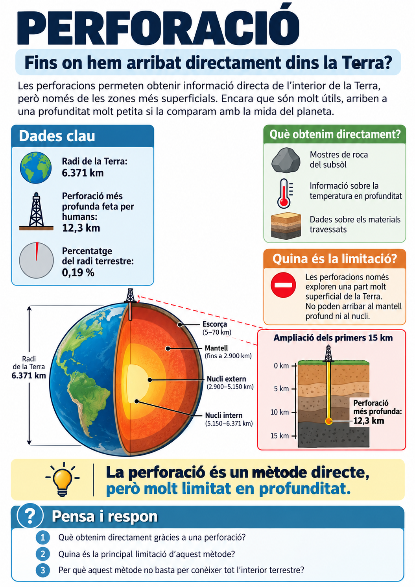
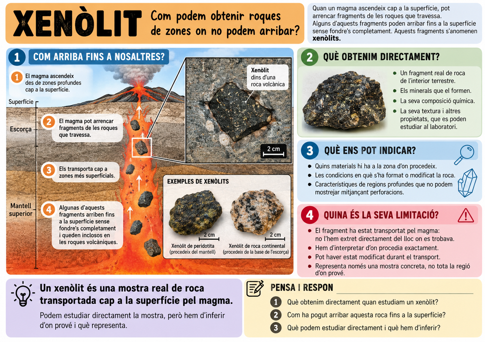
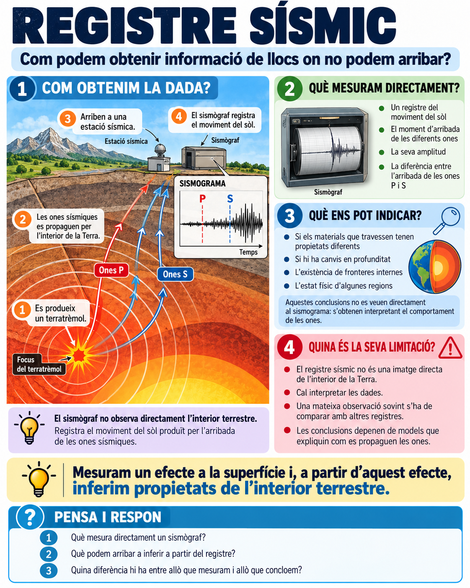
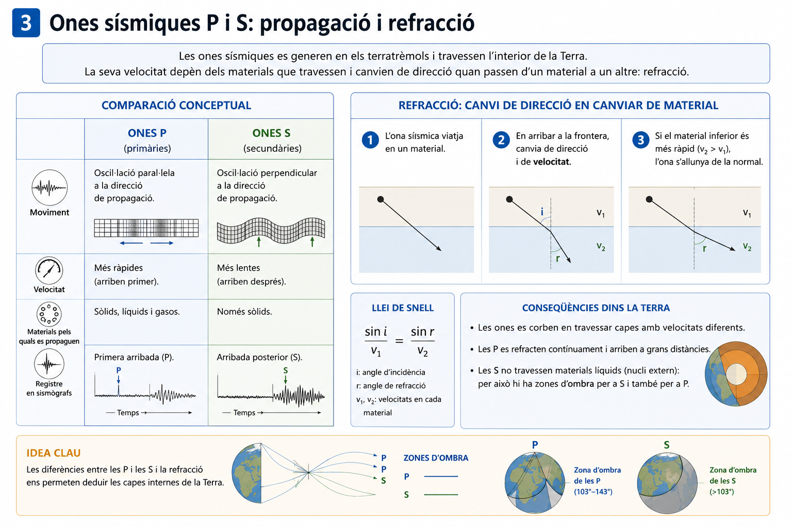
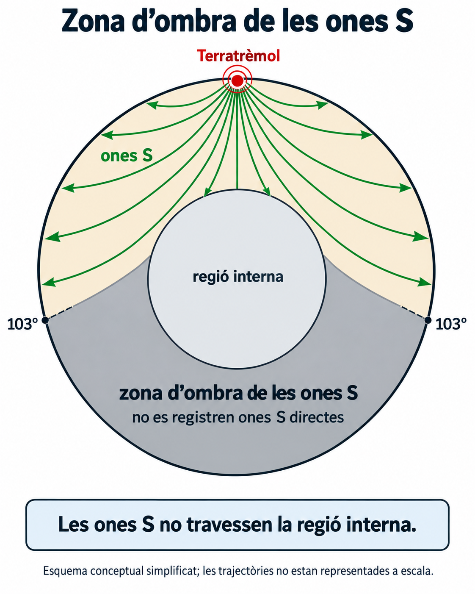
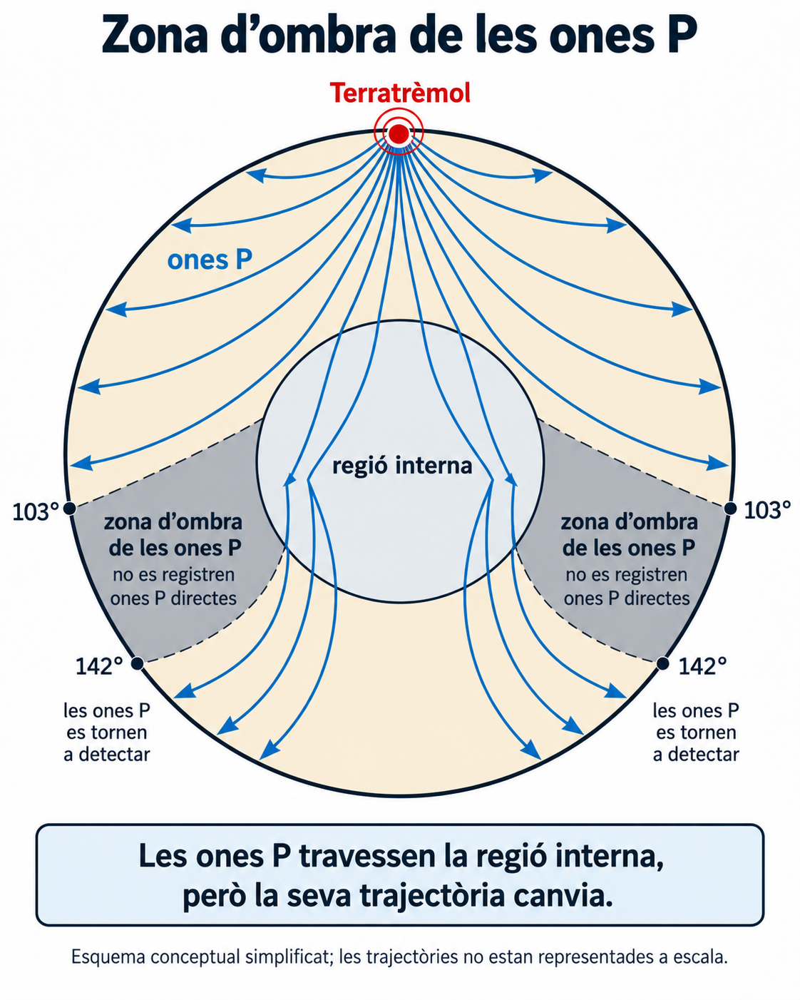
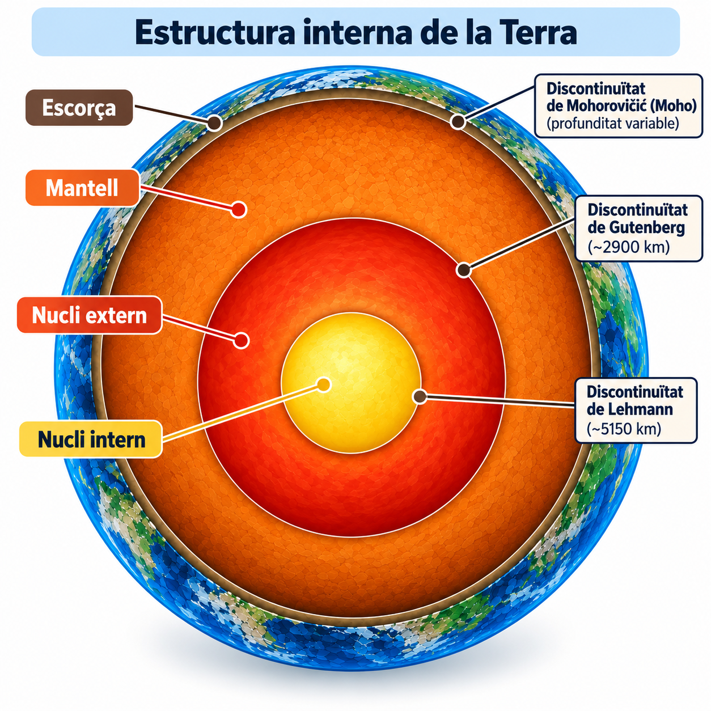
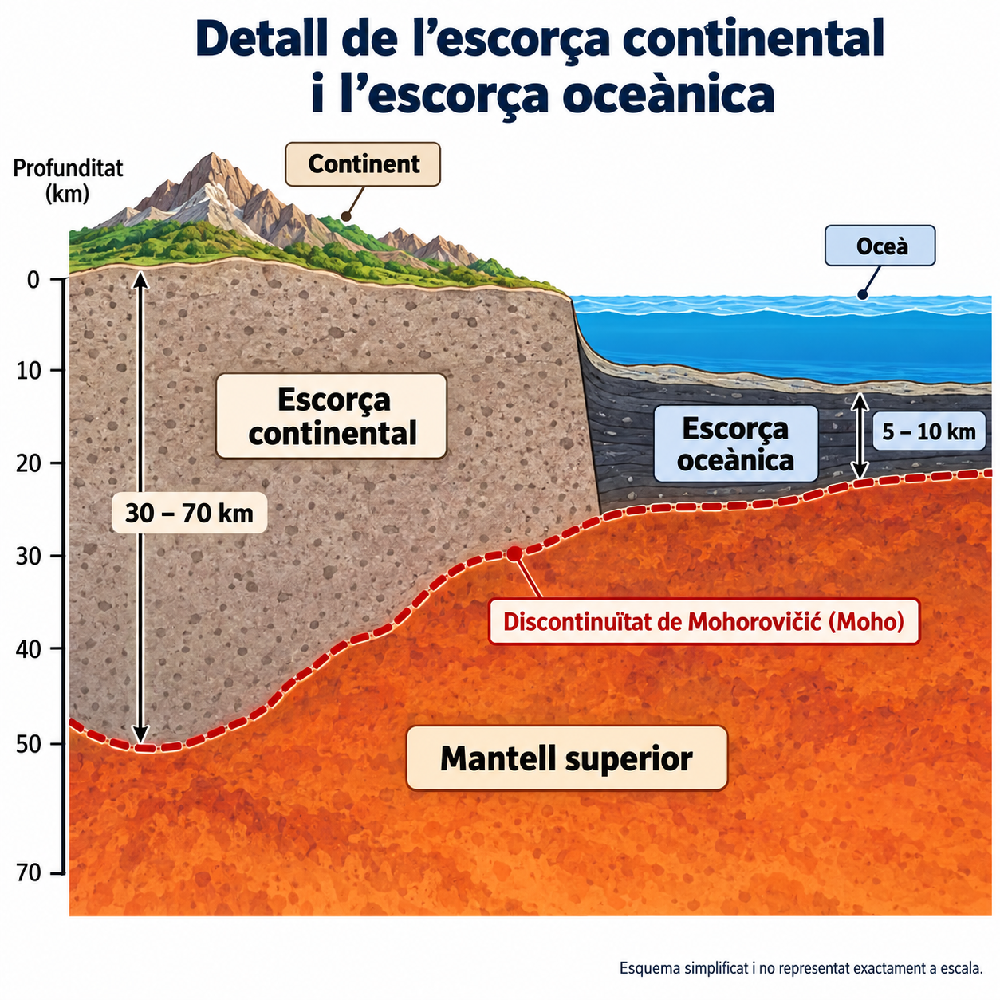
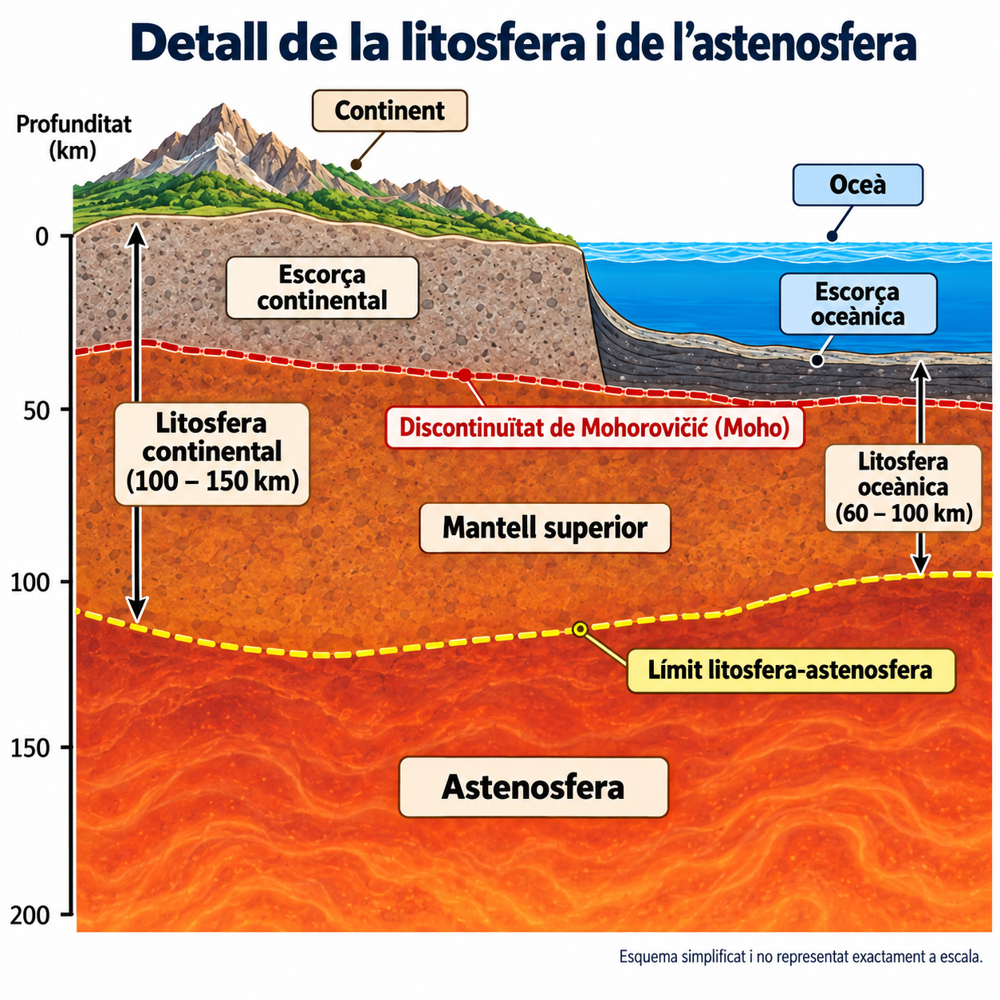
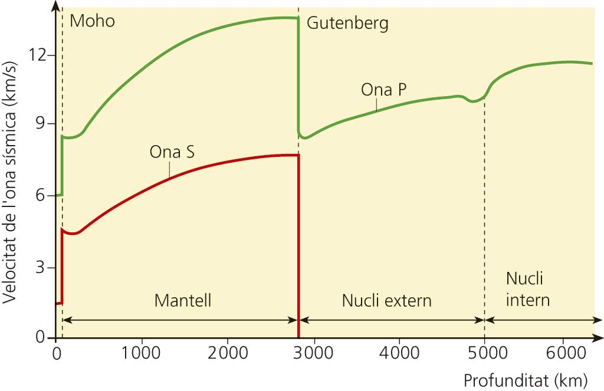

<section class="pv-seccio pv-portada" markdown>

# A01 · Com sabem què hi ha dins la Terra?

## Com podem conèixer l’interior d’un planeta al qual pràcticament no podem accedir?

**UD02 · Una Terra dinàmica**

<!-- DOCENT: La pàgina funciona com a guió d'aula i com a itinerari autònom per a alumnat absent. El material guia continua essent el manual complet de consulta. -->

</section>

<section class="pv-seccio" markdown>

# 1 · Un planeta gairebé inaccessible

La Terra té un radi d’uns **6.371 km**.

Però, fins on creus que hem estat capaços d’arribar perforant-la?

<strong>Fins a quina profunditat creus que ha arribat la perforació humana més profunda?</strong>

<label class="pv-label" for="estimacio-profunditat">La meva estimació</label>

<input id="estimacio-profunditat" type="number" min="0" max="6371" step="1" inputmode="numeric" data-pv-depth-number aria-label="Profunditat estimada en quilòmetres">
km

<input type="range" min="0" max="6371" step="1" value="0" data-pv-depth-range aria-label="Profunditat estimada entre la superfície i el centre de la Terra">

0 km · superfície6.371 km · centre

<button type="button" class="pv-opcio pv-boto-comprova" data-pv-depth-check disabled>Comprova-ho</button>

<svg viewBox="0 0 320 320" role="img" aria-label="Esquema de la Terra amb la profunditat estimada">
<circle cx="160" cy="160" r="132" class="pv-earth-outline"></circle>
<circle cx="160" cy="28" r="5" class="pv-earth-surface"></circle>
<line x1="160" y1="28" x2="160" y2="160" class="pv-earth-radius"></line>
<line x1="160" y1="28" x2="160" y2="28" class="pv-earth-guess" data-pv-depth-line></line>
<circle cx="160" cy="28" r="6" class="pv-earth-guess-dot" data-pv-depth-dot></circle>
<text x="178" y="43" class="pv-svg-label">superfície</text>
<text x="178" y="164" class="pv-svg-label">centre</text>
<text x="20" y="295" class="pv-svg-value" data-pv-depth-output></text>
</svg>

<h3>12,3 km</h3>

La <strong>perforació superprofunda de Kola</strong> va arribar aproximadament als <strong>12,3 km</strong>.

<strong>12,3 km ≈ 0,19 % del radi terrestre</strong>

Representada a escala de tota la Terra, aquesta profunditat és gairebé imperceptible.

<!-- DOCENT: 2–3 min. No és una evidència ni una nota. La funció és provocar una predicció i fer perceptible l'escala del problema. -->

## Miram-ho en context

Les perforacions ens permeten obtenir **mostres de roca**, mesurar la **temperatura en profunditat** i recollir dades dels materials que travessam. Però només exploren una part extraordinàriament superficial del planeta.

<a class="pv-infografia-link" href="figures/estacio_perforacio.png" target="_blank" rel="noopener">

Obre la infografia en gran ↗
</a>

> **Idea clau**  
> Podem obtenir mostres directes de les zones més superficials de la Terra, però la immensa majoria del planeta és inaccessible.

## I aleshores, com ho sabem?

<strong>Si no podem arribar físicament a gairebé cap part de l’interior terrestre, d’on pot venir la informació que ens permet construir-ne un model?</strong>

**Pensa-hi uns segons i comenta una possibilitat amb la persona del costat.** Després en posarem algunes en comú.

Les perforacions no són l’única font d’informació. Algunes dades provenen de **materials que arriben fins a nosaltres**; d’altres, d’**efectes que podem mesurar des de la superfície**.

> **Per ampliar o repassar:** [Material guia · 2.1 · Mètodes directes i indirectes](../../../material/ud2/ud2/#21-metodes-directes-i-indirectes)

</section>

<section class="pv-seccio" markdown>

# 2 · Com obtenim informació de l’interior?

No totes les dades sobre l’interior terrestre s’obtenen de la mateixa manera.

De vegades podem estudiar **materials que procedeixen de l’interior**. En altres casos no obtenim el material mateix, sinó que **mesuram algun efecte produït per l’interior** i interpretam què significa.

## 2.1 · Materials que podem estudiar

Les **perforacions** i els **xenòlits** són exemples de **mètodes directes**.

Un **xenòlit** és un fragment de roca que un magma ha arrencat durant el seu ascens i ha transportat cap a zones més superficials. Podem analitzar-ne directament els minerals, la composició i la textura.

<a class="pv-infografia-link" href="figures/estacio_xenolit.png" target="_blank" rel="noopener">

Obre la infografia en gran ↗
</a>

<strong>Infografia de consulta:</strong> no cal respondre les preguntes que hi apareixen. Observa sobretot què obtenim directament, què ens pot indicar la mostra i quines limitacions té.

> **Important**  
> «Directe» no significa «perfecte». Tenim una mostra real, però encara hem d’interpretar d’on prové exactament i fins a quin punt representa la regió profunda.

## 2.2 · Quan només podem mesurar efectes

Un **sismògraf** no observa el mantell ni el nucli. Registra el moviment del sòl provocat per l’arribada de les ones sísmiques.

A partir del comportament d’aquestes ones podem inferir propietats dels materials que han travessat. Això és un **mètode indirecte**.

<a class="pv-infografia-link" href="figures/estacio_registre_sismic.png" target="_blank" rel="noopener">

Obre la infografia en gran ↗
</a>

<strong>Infografia de consulta:</strong> no cal respondre les preguntes que hi apareixen. Fixa't especialment en la diferència entre allò que mesura el sismògraf i allò que inferim a partir del registre.

> **Altres evidències indirectes**  
> També podem obtenir informació de l’interior estudiant la **gravetat**, el **flux de calor**, el **camp magnètic** o el comportament de minerals sotmesos a pressions i temperatures elevades.

## 2.3 · Una idea més important que els noms

> **Els models de l’interior terrestre no depenen d’una única prova.**  
> Són fiables perquè **evidències diferents i independents encaixen en una mateixa explicació**.

### Comparam dues fonts

<strong>Quina diferència fonamental hi ha entre la informació que ens proporciona un xenòlit i la que ens proporciona un sismògraf?</strong>

**Pensa-hi uns segons. Després comenta-ho amb la persona del costat i preparau una resposta oral breu.**

<strong>material que podem estudiar</strong> → mètode directe 
<strong>efecte que podem mesurar</strong> → mètode indirecte

> **Per ampliar o repassar:** [Material guia · 2.1 · Mètodes directes i indirectes](../../../material/ud2/ud2/#21-metodes-directes-i-indirectes)

</section>

<section class="pv-seccio" markdown>

# 3 · Les ones com a font d’informació

Quan es produeix un terratrèmol, part de l’energia alliberada es propaga per l’interior de la Terra en forma d’**ones sísmiques**.

No podem veure directament per on passen, però podem registrar **quan arriben, com es propaguen i com canvien la velocitat o la trajectòria**.

## 3.1 · Miram com es propaguen

Selecciona un tipus d’ona i observa **com es mouen les partícules del material respecte de la direcció de propagació**.

<input class="pv-ona-radio" type="radio" name="tipus-ona" id="pv-ona-p" checked>
<input class="pv-ona-radio" type="radio" name="tipus-ona" id="pv-ona-s">

<label for="pv-ona-p">Ona P</label>
<label for="pv-ona-s">Ona S</label>

direcció de propagació →

<strong>Ona P · compressió</strong>

direcció de propagació →

<strong>Ona S · cisalla</strong>

<strong>Quina diferència observes entre el moviment de les partícules en una ona P i en una ona S?</strong>

Després de l’observació, podem resumir-ho així:

- **Ones P:** les partícules vibren en la mateixa direcció en què avança l’ona. Es propaguen per **sòlids i líquids**.
- **Ones S:** les partícules vibren perpendicularment a la direcció de propagació. Es propaguen pels **sòlids**, però **no pels líquids**.

> **Per ampliar o repassar:** [Material guia · 2.2 · Els terratrèmols ens permeten explorar l’interior](../../../material/ud2/ud2/#22-els-terratremols-ens-permeten-explorar-linterior)

## 3.2 · Quan una ona canvia de medi

Observa què pot passar quan una ona arriba al límit entre dos materials amb propietats diferents.

<a class="pv-infografia-link" href="../../../material/ud2/figures/00-01_sistema_i_interior/f03_ones_p_s_i_refraccio.png" target="_blank" rel="noopener">

Obre la figura en gran ↗
</a>

Una ona que passa d’un material a un altre pot canviar de **velocitat** i de **direcció**. Aquest canvi de direcció s’anomena **refracció**.

Si detectam un canvi brusc en la velocitat o la trajectòria d’una ona, tenim una evidència que **han canviat les propietats del material que travessa**.

> **Discontinuïtat**  
> Una zona de l’interior terrestre on es produeix un canvi important en les propietats dels materials.

<strong>Què canvia quan l’ona passa del medi 1 al medi 2?</strong>

<strong>OBSERVACIÓ</strong> L’ona canvia de velocitat o de direcció.

<strong>IDEA QUE ENS SERÀ ÚTIL</strong> Un canvi en la propagació pot indicar un canvi en les propietats del medi.

> **Per ampliar o repassar:** [Material guia · 2.3 · Les ones canvien quan canvia el medi](../../../material/ud2/ud2/#23-les-ones-canvien-quan-canvia-el-medi)

## 3.3 · Quines eines tenim ara?

Per interpretar els registres sísmics disposam de dues pistes:

<strong>P I S</strong> Les ones P i S no es propaguen igual per tots els materials.

<strong>REFRACCIÓ</strong> La velocitat i la trajectòria poden canviar quan canvien les propietats del medi.

Encara **no hem aplicat aquestes pistes a l’interior real de la Terra**. Ho farem al bloc següent, comparant què registren estacions situades en diferents punts del planeta.

<strong>Si registram les ones d’un mateix terratrèmol arreu del planeta, hi arribaran de la mateixa manera a tot arreu?</strong>

<!-- DOCENT: Tancament de la sessió 1. No resoldre encara la pregunta: és l'entrada al bloc 4. -->

</section>

<section class="pv-seccio" markdown>

# 4 · Què ens revelen les zones d’ombra?

Sabem que les ones sísmiques es propaguen per l’interior de la Terra i que el seu comportament depèn dels materials que travessen.

Si registram un mateix terratrèmol en moltes estacions distribuïdes pel planeta, podem comprovar **on arriben les ones i on no arriben**. Aquest patró també és una dada.

## 4.1 · Un terratrèmol, moltes estacions

Un mateix terratrèmol genera ones que es propaguen en moltes direccions. Les estacions sísmiques situades en punts diferents de la superfície registren **si les ones hi arriben i quan ho fan**.

<strong>Si l’interior de la Terra fos completament homogeni, què esperaries observar en els registres de les diferents estacions?</strong>

**30 segons individualment → 1 minut en parelles → posada en comú breu.**

> **Predicció inicial**  
> Si l’interior fos homogeni, esperaríem que les ones es propagassin de manera contínua i predictible, sense zones extenses on deixassin de registrar-se.

Però això **no és el que observam**.

## 4.2 · Una zona on no arriben les ones S

Observa aquesta figura i fixa’t en **on arriben les ones S i on deixen de registrar-se**.

<a class="pv-infografia-link" href="figures/a01_fig04a_zona_ombra_ones_s.png" target="_blank" rel="noopener">

Obre la figura 4A en gran ↗
</a>

<strong>En parelles</strong>

Descriviu el patró que mostra la figura.

<ul>
<li>On es registren ones S?</li>
<li>Què passa a partir d’uns <strong>103°</strong>?</li>
</ul>

### Ara, interpretam

Recorda una propietat que ja hem treballat:

> **Les ones S es propaguen pels sòlids però no pels líquids.**

<strong>Com podem explicar aquest patró?</strong>

<strong>no arriben ones S</strong> → <strong>hi ha una regió que no poden travessar</strong> → <strong>és compatible amb un medi líquid</strong>

No li posam encara nom a aquesta regió. De moment ens interessa què permeten justificar les dades.

## 4.3 · Les ones P ens conten una història diferent

Observa ara què passa amb les ones P.

<a class="pv-infografia-link" href="figures/a01_fig04b_zona_ombra_ones_p.png" target="_blank" rel="noopener">

Obre la figura 4B en gran ↗
</a>

<strong>Compara aquesta figura amb l’anterior.</strong>

Quina diferència important hi ha entre el comportament de les <strong>ones P</strong> i el de les <strong>ones S</strong> quan arriben a la regió interna?

<!-- DOCENT: Deixar que la comparació aparegui en la posada en comú abans de formalitzar-la. -->

> **Després de la posada en comú**  
> A diferència de les ones S, les ones P **travessen la regió interna**, però la seva trajectòria canvia notablement.

Recorda ara la refracció:

> Quan una ona entra en un material amb propietats diferents, la seva velocitat pot canviar i la trajectòria es pot **refractar**.

<strong>Què indica el canvi brusc de trajectòria de les ones P sobre les propietats dels materials que travessen?</strong>

> **Inferència provisional**  
> Hi ha una frontera entre regions amb propietats diferents i aquest canvi modifica la propagació de les ones P.

## 4.4 · Posam les dues evidències juntes

<strong>ONES S</strong> 
No travessen la regió interna. 
Generen una gran zona d’ombra. 
Aporten informació sobre l’estat físic del material.

<strong>ONES P</strong> 
Travessen la regió interna. 
Canvien fortament de trajectòria. 
Aporten informació sobre canvis en les propietats dels materials.

<strong>Evidència formativa · en parelles</strong>

Dibuixau <strong>el model més senzill de l’interior terrestre</strong> que pugui explicar simultàniament els dos patrons de les figures 4A i 4B.

Al costat del dibuix, indicau <strong>quina evidència justifica cada regió o frontera</strong> que hi representeu.

### Quan posem els models en comú

1. **Quina dada justifica cada frontera o regió del vostre model?**
2. **Podríem explicar els dos patrons amb un model més senzill?**

<!-- DOCENT: Aquesta producció és evidència formativa, no qualificable. Serveix per observar si l'alumnat vincula cada element del model amb dades concretes. -->

## 4.5 · Què acabam de fer?

<strong>dades sísmiques</strong> → <strong>inferències sobre els materials</strong> → <strong>model de l’interior</strong>

> **Idea clau**  
> Un model científic és útil si permet explicar conjuntament les observacions disponibles.

> **Per ampliar o repassar:** [Material guia · 2.3 · Les ones canvien quan canvia el medi](../../../material/ud2/ud2/#23-les-ones-canvien-quan-canvia-el-medi) · [2.4 · Les zones d’ombra](../../../material/ud2/ud2/#24-les-zones-dombra-una-evidencia-dun-nucli-diferent-del-mantell)

</section>

<section class="pv-seccio" markdown>

# 5 · Posam nom al model científic

Al bloc anterior hem construït **el model més senzill possible** a partir de les dades sísmiques.

Ara podem comparar-lo amb el model que utilitza actualment la geologia i posar nom a les regions i fronteres que hem començat a inferir.

## 5.1 · Les grans regions de l’interior

<a class="pv-infografia-link" href="figures/a01_fig05_estructura_interna_terra.png" target="_blank" rel="noopener">

Obre la figura en gran ↗
</a>

El model actual distingeix quatre grans regions:

- **escorça**;
- **mantell**;
- **nucli extern**;
- **nucli intern**.

Entre aquestes regions hi ha fronteres on les propietats dels materials canvien. Algunes produeixen canvis detectables en la propagació de les ones sísmiques i reben el nom de **discontinuïtats**.

<strong>REGIONS</strong> 
Escorça 
Mantell 
Nucli extern 
Nucli intern

<strong>DISCONTINUÏTATS PRINCIPALS</strong> 
Moho · escorça–mantell 
Gutenberg · mantell–nucli extern 
Lehmann · nucli extern–nucli intern

> **Una precisió important**  
> El **mantell és majoritàriament sòlid**. El **nucli extern és líquid** i el **nucli intern és sòlid**.

<strong>Quina de les fronteres del model científic correspon millor a la que havíeu inferit a partir de les zones d’ombra?</strong>

<!-- DOCENT: Recuperar Gutenberg a partir del model construït al bloc 4. No convertir-ho en una bateria de preguntes de memòria. -->

## 5.2 · L’escorça no té el mateix gruix a tot arreu

La capa més externa de la Terra és molt prima comparada amb el conjunt del planeta. A més, **no té el mateix gruix sota els continents i sota els oceans**.

<a class="pv-infografia-link" href="figures/a01_fig05b_escorca_continental_oceanica.png" target="_blank" rel="noopener">

Obre el detall de l’escorça en gran ↗
</a>

De manera aproximada:

- l’**escorça continental** sol tenir un gruix d’uns **30–70 km**;
- l’**escorça oceànica** és molt més prima, aproximadament **5–10 km**.

Per això, la discontinuïtat de **Mohorovičić (Moho)** no es troba a la mateixa profunditat a tot el planeta.

<strong>On esperaries trobar la Moho més profunda: sota un continent o sota un oceà? Quina dada de la figura ho justifica?</strong>

## 5.3 · Escorça no és sinònim de litosfera

Podem dividir l’interior terrestre utilitzant **criteris diferents**.

Quan ens fixam sobretot en la **composició**, parlam d’escorça, mantell i nucli.

Quan ens fixam en el **comportament mecànic**, apareixen altres regions, com la litosfera i l’astenosfera.

<a class="pv-infografia-link" href="figures/a01_fig05c_litosfera_astenosfera.png" target="_blank" rel="noopener">

Obre el detall de la litosfera i l’astenosfera en gran ↗
</a>

La **litosfera** és la capa externa rígida i inclou:

- tota l’**escorça**;
- i una part del **mantell superior**.

Per davall hi ha l’**astenosfera**, formada també per materials del mantell, però amb un comportament més deformable a escala geològica.

<strong>escorça</strong> ≠ <strong>litosfera</strong> 
la litosfera inclou <strong>escorça + part superior del mantell</strong>

> **Important**  
> Que l’astenosfera es pugui deformar i fluir lentament **no significa que sigui una capa líquida**.

<strong>Per què una mateixa roca del mantell pot formar part de la litosfera o de l’astenosfera?</strong>

## 5.4 · Dos models complementaris

La mateixa Terra es pot descriure utilitzant models diferents segons **quina propietat ens interessa**.

<strong>MODEL GEOQUÍMIC</strong> 
Es fixa sobretot en la <strong>composició</strong>.  
escorça 
mantell 
nucli

<strong>MODEL GEODINÀMIC</strong> 
Es fixa sobretot en el <strong>comportament mecànic</strong>.  
litosfera 
astenosfera 
regions més profundes

> **No són dos models rivals.**  
> Descriuen el mateix planeta fixant-se en propietats diferents.

> **Per ampliar o repassar:** [Material guia · Models de l’interior terrestre](../../../material/ud2/ud2/)

## 5.5 · Tornam a les dades

Ara que hem posat nom a les regions, podem tornar a les observacions del bloc anterior.

<strong>ONES S</strong> 
No travessen el nucli extern. 
És una evidència compatible amb el seu <strong>estat líquid</strong>.

<strong>ONES P</strong> 
El travessen, però canvien de velocitat i trajectòria. 
Revelen un <strong>canvi important de propietats</strong>.

Aquestes observacions mostren com el model permet **explicar patrons sísmics**. Al bloc següent aplicaràs aquesta relació entre dades i model de manera individual.

## 5.6 · Del model al repte individual

<strong>dades</strong> → <strong>inferències</strong> → <strong>model</strong> → <strong>prediccions</strong>

Al bloc següent hauràs d’interpretar **unes dades sísmiques noves** sense que les regions de l’interior ja hi apareguin dibuixades.

Hauràs de decidir què indiquen les dades i **justificar la conclusió amb evidències concretes**.

<!-- DOCENT: Transició al tancament individual de CA 1.1, equivalent al FULL 5 del PDF original. -->

</section>

<section class="pv-seccio" markdown>

# 6 · Repte individual · Què indiquen aquestes dades?

**Tancament individual · CA 1.1**

Ara treballaràs individualment amb una representació de la variació de la velocitat de les ones P i S amb la profunditat.

L’objectiu no és només llegir la gràfica: has de passar de les **dades** a una **inferència**, justificar-la i valorar què pot —i què no pot— representar aquest model.

<a class="pv-infografia-link" href="figures/a01_fig06_velocitat_ones_profunditat.jpg" target="_blank" rel="noopener">

Obre la gràfica en gran ↗
</a>

<strong>Evidència individual · CA 1.1</strong>

Respon individualment les cinc qüestions següents. En totes les respostes, utilitza les dades de la gràfica quan siguin pertinents.

## 6.1 · Observam dos canvis clau

<strong>1. Identifica els dos canvis més importants que es produeixen prop dels 2.900 km de profunditat i descriu-los utilitzant dades de la gràfica.</strong>

## 6.2 · De les dades a la inferència

<strong>2. Explica què permeten inferir aquests dos canvis sobre les propietats del material situat per davall dels 2.900 km.</strong>

## 6.3 · Quina evidència és especialment informativa?

<strong>3. Explica per què la desaparició de les ones S és una evidència especialment important per inferir l’estat físic del nucli extern.</strong>

## 6.4 · Feim una predicció

<strong>4. Si el nucli extern fos sòlid, quin comportament de les ones S esperaríem observar? Justifica-ho.</strong>

## 6.5 · Criticam el model

<strong>5. La gràfica no mostra ones S al nucli intern, tot i que aquest és sòlid. Què ens indica això sobre la naturalesa d’aquesta representació? Explica per què una gràfica científica pot ser útil encara que simplifiqui la realitat.</strong>

<strong>observació</strong> → <strong>inferència</strong> → <strong>justificació</strong> → <strong>predicció</strong> → <strong>crítica del model</strong>

<!-- DOCENT: Evidència qualificable de CA 1.1. La pregunta 5 permet discriminar entre una lectura literal de la representació i una comprensió del caràcter simplificat dels models científics. -->

</section>

<section class="pv-seccio" markdown>

# 7 · Quan una dada no encaixa

Els models científics no són dibuixos definitius de la realitat. Són explicacions que han de continuar funcionant quan apareixen **noves observacions**.

Després d’identificar un nucli extern líquid, encara quedava un problema: alguns registres mostraven **ones P en zones on el model més senzill no preveia detectar-les**.

## 7.1 · Una observació inesperada

<strong>MODEL INICIAL</strong> 
Un mantell sòlid i un nucli líquid permeten explicar les grans zones d’ombra.

<strong>NOVA DADA</strong> 
Algunes ones P febles apareixen en zones que aquest model no explica bé.

<strong>Què hauríem de conservar del model anterior i què hauríem de revisar perquè també pugui explicar aquesta nova dada? Per què?</strong>

**Comentau-ho breument en parelles abans de continuar.**

> **Idea clau**  
> Una dada inesperada no obliga necessàriament a començar de zero. Pot indicar que el model necessita **més detall**.

## 7.2 · Inge Lehmann: una científica que va veure una pista diferent

El **1936**, la sismòloga danesa **Inge Lehmann** va proposar una explicació per a aquestes arribades inesperades d’ones P.

La seva interpretació era que el nucli no era una única regió líquida: a l’interior del nucli extern hi havia una **regió interna amb propietats diferents**, capaç de modificar la trajectòria de les ones P.

Aquesta proposta permetia explicar dades que el model anterior deixava sense resposta.

<strong>ABANS</strong> 
Mantell sòlid 
Nucli líquid

<strong>MODEL REVISAT</strong> 
Mantell sòlid 
Nucli extern líquid 
Nucli intern sòlid

La frontera entre el nucli extern i el nucli intern rep avui el nom de **discontinuïtat de Lehmann**.

<strong>Quina part del model anterior es manté i quina part s’ha hagut de modificar per incorporar la nova evidència?</strong>

<!-- DOCENT: Pregunta de discussió, no evidència qualificable. Interessa que l'alumnat vegi que la revisió conserva les parts del model que continuen explicant les dades. -->

## 7.3 · Una científica dins la història del model

Quan estudiam l’estructura de la Terra és fàcil recordar només els noms de les capes i les discontinuïtats. Però aquests models són el resultat del treball de persones que **interpreten dades, proposen explicacions i les sotmeten a contrast**.

El cas d’Inge Lehmann permet veure una científica no com una nota al marge de la història, sinó **al centre d’un canvi important en el model de l’interior terrestre**.

<strong>Què ens ensenya aquest cas sobre la diferència entre “aprendre un model” i entendre com s’ha construït?</strong>

## 7.4 · Tancam l’activitat

Al llarg de l’activitat hem seguit el mateix recorregut que segueix moltes vegades la ciència:

<strong>observació</strong> → <strong>evidència</strong> → <strong>inferència</strong> → <strong>model</strong> → <strong>predicció</strong> → <strong>nova dada</strong> → <strong>revisió del model</strong>

> **Idea final**  
> Els models científics no són immutables. Es mantenen mentre expliquen les observacions i es **revisen quan noves evidències exigeixen una explicació millor**.

<!-- DOCENT: Tancament conceptual i històric de l'activitat. No genera una nova evidència qualificable. -->

</section>

