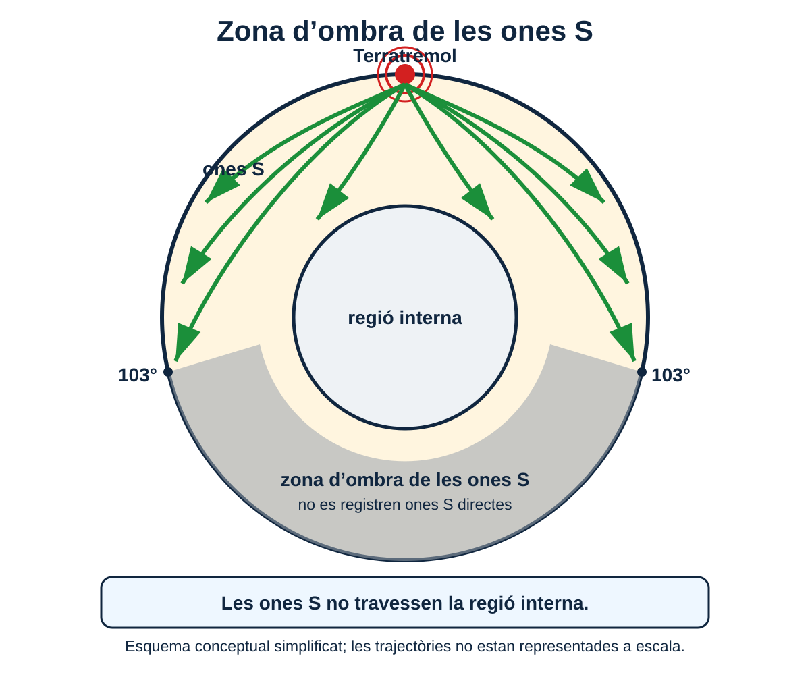
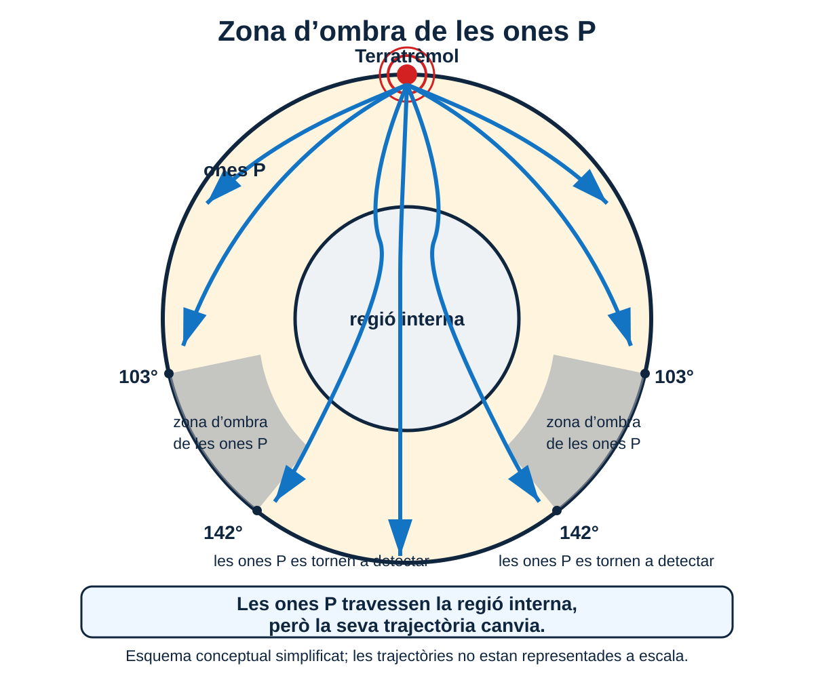

<section class="pv-seccio pv-portada" markdown>

# A01 · Com sabem què hi ha dins la Terra?

## Com podem conèixer l’interior d’un planeta al qual pràcticament no podem accedir?

**UD02 · Una Terra dinàmica**

<!-- DOCENT: La pàgina funciona com a guió d'aula i com a itinerari autònom per a alumnat absent. El material guia continua essent el manual complet de consulta. -->

</section>

<section class="pv-seccio" markdown>

# 1 · Un planeta gairebé inaccessible

La Terra té un radi d’uns **6.371 km**.

Però, fins on creus que hem estat capaços d’arribar perforant-la?

<strong>Fins a quina profunditat creus que ha arribat la perforació humana més profunda?</strong>

<label class="pv-label" for="estimacio-profunditat">La meva estimació</label>

<input id="estimacio-profunditat" type="number" min="0" max="6371" step="1" inputmode="numeric" data-pv-depth-number aria-label="Profunditat estimada en quilòmetres">
km

<input type="range" min="0" max="6371" step="1" value="0" data-pv-depth-range aria-label="Profunditat estimada entre la superfície i el centre de la Terra">

0 km · superfície6.371 km · centre

<button type="button" class="pv-opcio pv-boto-comprova" data-pv-depth-check disabled>Comprova-ho</button>

<svg viewBox="0 0 320 320" role="img" aria-label="Esquema de la Terra amb la profunditat estimada">
<circle cx="160" cy="160" r="132" class="pv-earth-outline"></circle>
<circle cx="160" cy="28" r="5" class="pv-earth-surface"></circle>
<line x1="160" y1="28" x2="160" y2="160" class="pv-earth-radius"></line>
<line x1="160" y1="28" x2="160" y2="28" class="pv-earth-guess" data-pv-depth-line></line>
<circle cx="160" cy="28" r="6" class="pv-earth-guess-dot" data-pv-depth-dot></circle>
<text x="178" y="43" class="pv-svg-label">superfície</text>
<text x="178" y="164" class="pv-svg-label">centre</text>
<text x="20" y="295" class="pv-svg-value" data-pv-depth-output></text>
</svg>

<h3>12,3 km</h3>

La <strong>perforació superprofunda de Kola</strong> va arribar aproximadament als <strong>12,3 km</strong>.

<strong>12,3 km ≈ 0,19 % del radi terrestre</strong>

Representada a escala de tota la Terra, aquesta profunditat és gairebé imperceptible.

<!-- DOCENT: 2–3 min. No és una evidència ni una nota. La funció és provocar una predicció i fer perceptible l'escala del problema. -->

## Miram-ho en context

Les perforacions ens permeten obtenir **mostres de roca**, mesurar la **temperatura en profunditat** i recollir dades dels materials que travessam. Però només exploren una part extraordinàriament superficial del planeta.

<a class="pv-infografia-link" href="figures/estacio_perforacio.png" target="_blank" rel="noopener">

Obre la infografia en gran ↗
</a>

> **Idea clau**  
> Podem obtenir mostres directes de les zones més superficials de la Terra, però la immensa majoria del planeta és inaccessible.

## I aleshores, com ho sabem?

<strong>Si no podem arribar físicament a gairebé cap part de l’interior terrestre, d’on pot venir la informació que ens permet construir-ne un model?</strong>

**Pensa-hi uns segons i comenta una possibilitat amb la persona del costat.** Després en posarem algunes en comú.

Les perforacions no són l’única font d’informació. Algunes dades provenen de **materials que arriben fins a nosaltres**; d’altres, d’**efectes que podem mesurar des de la superfície**.

> **Per ampliar o repassar:** [Material guia · 2.1 · Mètodes directes i indirectes](../../../material/ud2/ud2/#21-metodes-directes-i-indirectes)

</section>

<section class="pv-seccio" markdown>

# 2 · Com obtenim informació de l’interior?

No totes les dades sobre l’interior terrestre s’obtenen de la mateixa manera.

De vegades podem estudiar **materials que procedeixen de l’interior**. En altres casos no obtenim el material mateix, sinó que **mesuram algun efecte produït per l’interior** i interpretam què significa.

## 2.1 · Materials que podem estudiar

Les **perforacions** i els **xenòlits** són exemples de **mètodes directes**.

Un **xenòlit** és un fragment de roca que un magma ha arrencat durant el seu ascens i ha transportat cap a zones més superficials. Podem analitzar-ne directament els minerals, la composició i la textura.

<a class="pv-infografia-link" href="figures/estacio_xenolit.png" target="_blank" rel="noopener">

Obre la infografia en gran ↗
</a>

<strong>Infografia de consulta:</strong> no cal respondre les preguntes que hi apareixen. Observa sobretot què obtenim directament, què ens pot indicar la mostra i quines limitacions té.

> **Important**  
> «Directe» no significa «perfecte». Tenim una mostra real, però encara hem d’interpretar d’on prové exactament i fins a quin punt representa la regió profunda.

## 2.2 · Quan només podem mesurar efectes

Un **sismògraf** no observa el mantell ni el nucli. Registra el moviment del sòl provocat per l’arribada de les ones sísmiques.

A partir del comportament d’aquestes ones podem inferir propietats dels materials que han travessat. Això és un **mètode indirecte**.

<a class="pv-infografia-link" href="figures/estacio_registre_sismic.png" target="_blank" rel="noopener">

Obre la infografia en gran ↗
</a>

<strong>Infografia de consulta:</strong> no cal respondre les preguntes que hi apareixen. Fixa't especialment en la diferència entre allò que mesura el sismògraf i allò que inferim a partir del registre.

> **Altres evidències indirectes**  
> També podem obtenir informació de l’interior estudiant la **gravetat**, el **flux de calor**, el **camp magnètic** o el comportament de minerals sotmesos a pressions i temperatures elevades.

## 2.3 · Una idea més important que els noms

> **Els models de l’interior terrestre no depenen d’una única prova.**  
> Són fiables perquè **evidències diferents i independents encaixen en una mateixa explicació**.

### Comparam dues fonts

<strong>Quina diferència fonamental hi ha entre la informació que ens proporciona un xenòlit i la que ens proporciona un sismògraf?</strong>

**Pensa-hi uns segons. Després comenta-ho amb la persona del costat i preparau una resposta oral breu.**

<strong>material que podem estudiar</strong> → mètode directe 
<strong>efecte que podem mesurar</strong> → mètode indirecte

> **Per ampliar o repassar:** [Material guia · 2.1 · Mètodes directes i indirectes](../../../material/ud2/ud2/#21-metodes-directes-i-indirectes)

</section>

<section class="pv-seccio" markdown>

# 3 · Les ones com a font d’informació

Quan es produeix un terratrèmol, part de l’energia alliberada es propaga per l’interior de la Terra en forma d’**ones sísmiques**.

No podem veure directament per on passen, però podem registrar **quan arriben, com es propaguen i com canvien la velocitat o la trajectòria**.

## 3.1 · Miram com es propaguen

Selecciona un tipus d’ona i observa **com es mouen les partícules del material respecte de la direcció de propagació**.

<input class="pv-ona-radio" type="radio" name="tipus-ona" id="pv-ona-p" checked>
<input class="pv-ona-radio" type="radio" name="tipus-ona" id="pv-ona-s">

<label for="pv-ona-p">Ona P</label>
<label for="pv-ona-s">Ona S</label>

direcció de propagació →

<strong>Ona P · compressió</strong>

direcció de propagació →

<strong>Ona S · cisalla</strong>

<strong>Quina diferència observes entre el moviment de les partícules en una ona P i en una ona S?</strong>

Després de l’observació, podem resumir-ho així:

- **Ones P:** les partícules vibren en la mateixa direcció en què avança l’ona. Es propaguen per **sòlids i líquids**.
- **Ones S:** les partícules vibren perpendicularment a la direcció de propagació. Es propaguen pels **sòlids**, però **no pels líquids**.

> **Per ampliar o repassar:** [Material guia · 2.2 · Els terratrèmols ens permeten explorar l’interior](../../../material/ud2/ud2/#22-els-terratremols-ens-permeten-explorar-linterior)

## 3.2 · Quan una ona canvia de medi

Observa què pot passar quan una ona arriba al límit entre dos materials amb propietats diferents.

<a class="pv-infografia-link" href="../../../material/ud2/figures/00-01_sistema_i_interior/f03_ones_p_s_i_refraccio.png" target="_blank" rel="noopener">

Obre la figura en gran ↗
</a>

Una ona que passa d’un material a un altre pot canviar de **velocitat** i de **direcció**. Aquest canvi de direcció s’anomena **refracció**.

Si detectam un canvi brusc en la velocitat o la trajectòria d’una ona, tenim una evidència que **han canviat les propietats del material que travessa**.

> **Discontinuïtat**  
> Una zona de l’interior terrestre on es produeix un canvi important en les propietats dels materials.

<strong>Què canvia quan l’ona passa del medi 1 al medi 2?</strong>

<strong>OBSERVACIÓ</strong> L’ona canvia de velocitat o de direcció.

<strong>IDEA QUE ENS SERÀ ÚTIL</strong> Un canvi en la propagació pot indicar un canvi en les propietats del medi.

> **Per ampliar o repassar:** [Material guia · 2.3 · Les ones canvien quan canvia el medi](../../../material/ud2/ud2/#23-les-ones-canvien-quan-canvia-el-medi)

## 3.3 · Quines eines tenim ara?

Per interpretar els registres sísmics disposam de dues pistes:

<strong>P I S</strong> Les ones P i S no es propaguen igual per tots els materials.

<strong>REFRACCIÓ</strong> La velocitat i la trajectòria poden canviar quan canvien les propietats del medi.

Encara **no hem aplicat aquestes pistes a l’interior real de la Terra**. Ho farem al bloc següent, comparant què registren estacions situades en diferents punts del planeta.

<strong>Si registram les ones d’un mateix terratrèmol arreu del planeta, hi arribaran de la mateixa manera a tot arreu?</strong>

<!-- DOCENT: Tancament de la sessió 1. No resoldre encara la pregunta: és l'entrada al bloc 4. -->

</section>

<section class="pv-seccio" markdown>

# 4 · Què ens revelen les zones d’ombra?

Sabem que les ones sísmiques es propaguen per l’interior de la Terra i que el seu comportament depèn dels materials que travessen.

Si registram un mateix terratrèmol en moltes estacions distribuïdes pel planeta, podem comprovar **on arriben les ones i on no arriben**. Aquest patró també és una dada.

## 4.1 · Un terratrèmol, moltes estacions

Un mateix terratrèmol genera ones que es propaguen en moltes direccions. Les estacions sísmiques situades en punts diferents de la superfície registren **si les ones hi arriben i quan ho fan**.

<strong>Si l’interior de la Terra fos completament homogeni, què esperaries observar en els registres de les diferents estacions?</strong>

**30 segons individualment → 1 minut en parelles → posada en comú breu.**

> **Predicció inicial**  
> Si les propietats de l’interior fossin les mateixes a tot arreu, esperaríem un patró relativament regular de propagació.

Però això **no és el que observam**.

## 4.2 · Una zona on no arriben les ones S

Observa aquesta figura. Durant uns segons, limita’t a **descriure què hi veus**; encara no intentis explicar per què passa.

<a class="pv-infografia-link" href="figures/a01_fig04a_zona_ombra_ones_s.svg" target="_blank" rel="noopener">

Obre la figura 4A en gran ↗
</a>

<strong>En parelles</strong>

Descriviu el patró de les ones S <strong>sense explicar encara què significa</strong>.

Algunes preguntes que poden ajudar a mirar la figura:

- On es registren ones S?
- A partir de quina distància angular deixen de detectar-se directament?
- Quina extensió té la zona sense registres directes d’ones S?

<strong>OBSERVACIÓ</strong> ≠ <strong>INTERPRETACIÓ</strong>

### Ara, interpretam

Recorda una propietat que ja hem treballat:

> **Les ones S es propaguen pels sòlids però no pels líquids.**

<strong>Quina propietat hauria de tenir una regió interna perquè pogués explicar aquest patró?</strong>

<strong>no arriben ones S</strong> → <strong>hi ha una regió que no poden travessar</strong> → <strong>és compatible amb un medi líquid</strong>

No li posam encara nom a aquesta regió. De moment ens interessa què permeten justificar les dades.

## 4.3 · Les ones P ens conten una història diferent

Observa ara què passa amb les ones P.

<a class="pv-infografia-link" href="figures/a01_fig04b_zona_ombra_ones_p.svg" target="_blank" rel="noopener">

Obre la figura 4B en gran ↗
</a>

<strong>Compara aquesta figura amb l’anterior.</strong>

Quina diferència important hi ha entre el comportament de les <strong>ones P</strong> i el de les <strong>ones S</strong> quan arriben a la regió interna?

Volem distingir dues observacions:

- les ones S **no travessen** la regió interna;
- les ones P **sí que la travessen**, però la seva trajectòria canvia notablement.

Recorda ara la refracció:

> Quan una ona entra en un material amb propietats diferents, la seva velocitat pot canviar i la trajectòria es pot **refractar**.

<strong>Què ens permet inferir el canvi de trajectòria de les ones P?</strong>

> **Inferència provisional**  
> Hi ha una frontera entre regions amb propietats diferents i aquest canvi modifica la propagació de les ones P.

## 4.4 · Posam les dues evidències juntes

<strong>ONES S</strong> 
No travessen la regió interna. 
Generen una gran zona d’ombra. 
Aporten informació sobre l’estat físic del material.

<strong>ONES P</strong> 
Travessen la regió interna. 
Canvien fortament de trajectòria. 
Aporten informació sobre canvis en les propietats dels materials.

<strong>Repte en parelles</strong>

Construïu <strong>el model més senzill possible de l’interior terrestre</strong> que pugui explicar simultàniament:

<ol>
<li>que les ones S desapareguin a partir d’una determinada distància;</li>
<li>que les ones P travessin la regió profunda però canviïn fortament de trajectòria;</li>
<li>que apareguin zones de la superfície on no es registren determinades ones.</li>
</ol>

<strong>Dibuixau el model al quadern.</strong> Representau només allò que pugueu justificar amb aquestes evidències.

### Quan posem els models en comú

1. **Quina dada justifica cada frontera que heu dibuixat?**
2. **Per què la regió interna no pot tenir les mateixes propietats que la que l’envolta?**
3. **Per què les ones P i S ens aporten informació diferent?**
4. **Podríem explicar les observacions amb una Terra homogènia?**

## 4.5 · Dades → inferències → model

<strong>DADES</strong> 
Zones on les S no arriben. 
Canvis de trajectòria de les P. 
Zones d’ombra diferents.

<strong>INFERÈNCIES</strong> 
L’interior no és homogeni. 
Hi ha fronteres entre materials diferents. 
Una regió profunda és compatible amb estat líquid.

<strong>DADES</strong> → <strong>INFERÈNCIES</strong> → <strong>MODEL DE L’INTERIOR</strong>

> **Idea clau**  
> No coneixem l’interior terrestre perquè l’hàgim observat directament. Construïm el model que **explica conjuntament els patrons observats en les ones sísmiques**.

> **Per ampliar o repassar:** [Material guia · 2.3 · Les ones canvien quan canvia el medi](../../../material/ud2/ud2/#23-les-ones-canvien-quan-canvia-el-medi) · [2.4 · Les zones d’ombra](../../../material/ud2/ud2/#24-les-zones-dombra-una-evidencia-dun-nucli-diferent-del-mantell)

<strong>Si les dades indiquen que l’interior està format per regions diferents, quines són aquestes regions i com les descriu actualment la geologia?</strong>

</section>

<section class="pv-seccio" markdown>

# 5 · Comparam el nostre model amb el model científic

Al bloc anterior hem intentat explicar les zones d’ombra i les trajectòries de les ones construint **el model més senzill possible**.

Ara podem comparar aquella proposta amb el model que utilitza actualment la geologia.

## 5.1 · Què havíem aconseguit inferir?

Recupera el model que heu construït en parelles.

<strong>Quines idees principals intentava explicar?</strong>

Recuperarem oralment les idees que havíem justificat amb les dades: que l’interior **no és homogeni**, que hi ha **regions amb propietats diferents** i que una regió profunda és compatible amb un **estat líquid**.

### Contrast visual

Observa ara una representació de com es propaguen les ones P i S a través d’un interior estructurat en regions.

<a class="pv-infografia-link" href="figures/geo04_04_ones_p_s_interior.png" target="_blank" rel="noopener">

Obre la figura en gran ↗
</a>

<strong>En què s’assembla aquesta representació al model que havíeu proposat?</strong>

## 5.2 · Què aporta aquesta representació?

Les trajectòries de les ones no són rectes perquè la velocitat de propagació **canvia amb la profunditat**.

Quan les ones arriben a fronteres entre materials amb propietats diferents, poden **refractar-se**. El comportament diferent de les ones P i S permet identificar regions internes i inferir-ne algunes propietats.

<strong>observacions sísmiques</strong> → <strong>inferències</strong> → <strong>model de l’interior</strong>

## 5.3 · Posam nom a les regions

<a class="pv-infografia-link" href="figures/geo04_08_model_interior_terra.png" target="_blank" rel="noopener">

Obre la figura en gran ↗
</a>

A partir de moltes dades sísmiques i d’altres evidències, podem distingir grans regions segons la seva **composició**:

- **escorça**;
- **mantell**;
- **nucli extern**;
- **nucli intern**.

Les principals fronteres sísmiques són:

- **discontinuïtat de Mohorovičić (Moho)** → separa l’escorça del mantell;
- **discontinuïtat de Gutenberg** → separa el mantell del nucli extern;
- **discontinuïtat de Lehmann** → separa el nucli extern del nucli intern.

> **Dues precisions importants**  
> El **mantell és majoritàriament sòlid**, encara que es pugui deformar molt lentament a escala geològica. El **nucli extern és líquid** i el **nucli intern és sòlid**.

## 5.4 · Dos models per descriure la mateixa Terra

La Terra es pot dividir de maneres diferents segons **quina propietat ens interessa descriure**.

### Model geoquímic

Es basa sobretot en la **composició** dels materials:

<strong>escorça</strong> → <strong>mantell</strong> → <strong>nucli</strong>

### Model geodinàmic

Es basa sobretot en el **comportament mecànic** dels materials:

<strong>litosfera</strong> → <strong>astenosfera</strong> → <strong>mantell inferior</strong> → <strong>nucli extern</strong> → <strong>nucli intern</strong>

> **No són dos models rivals.**  
> Descriuen la mateixa Terra fixant-se en propietats diferents.

<strong>Per què l’escorça i la litosfera no són sinònims?</strong>

> **Per ampliar o repassar:** [Material guia · Models de l’interior terrestre](../../../material/ud2/ud2/)

## 5.5 · Tornam a les dades

<strong>Quina evidència sísmica és compatible amb un nucli extern líquid?</strong>

Recorda que:

- les **ones S no travessen líquids**;
- les **ones P sí que poden travessar-los**, però poden canviar de velocitat i de trajectòria.

<strong>Què esperaríem observar si el nucli extern fos sòlid?</strong>

No cercam només recordar una dada. Volem comprovar si el model ens permet **fer una predicció**.

## 5.6 · Síntesi

> **Idea clau**  
> Les capes internes de la Terra no són una classificació arbitrària. Les distingim perquè **diverses dades indiquen canvis en les propietats dels materials amb la profunditat**.

<strong>dades</strong> → <strong>inferència</strong> → <strong>model</strong> → <strong>prediccions</strong>

Al bloc següent hauràs d’interpretar **unes dades noves sense que el model ja estigui dibuixat**.

</section>

