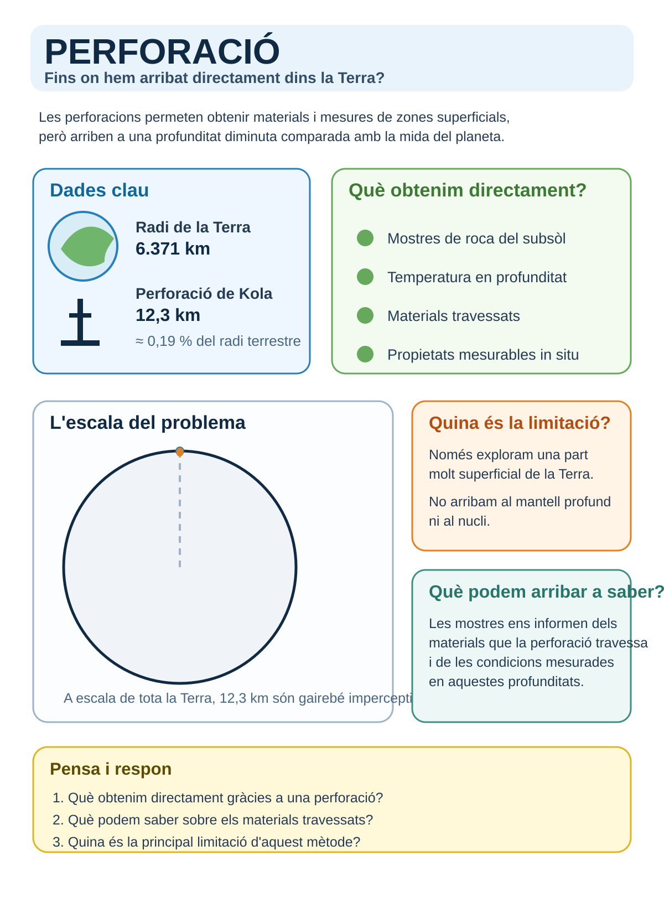
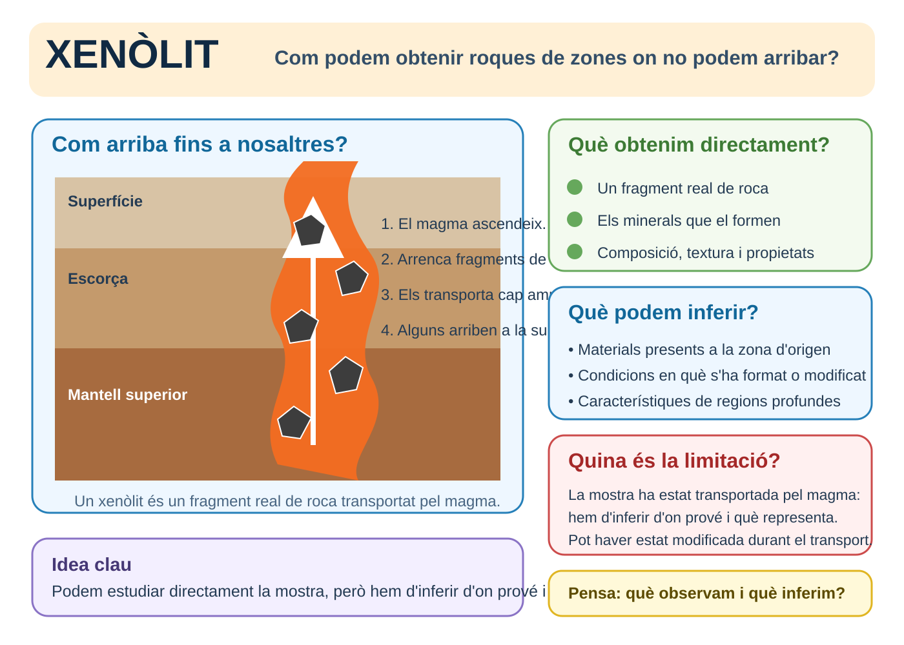
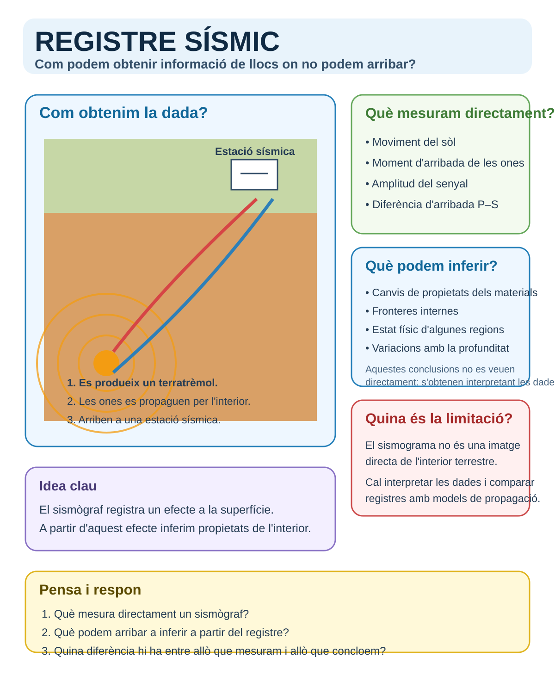

<section class="pv-seccio pv-portada" markdown>

# A01 · Com sabem què hi ha dins la Terra?

## Com podem conèixer l’interior d’un planeta al qual pràcticament no podem accedir?

**UD02 · Una Terra dinàmica**

<!-- DOCENT: Activitat d'aula i també itinerari autònom per a alumnat absent o que s'incorpora més tard. El material guia continua essent autosuficient per a autoestudi; aquesta activitat fa predir, observar, inferir i contrastar. -->

</section>

<section class="pv-seccio" markdown>

# 1 · Un planeta gairebé inaccessible

La Terra té un radi d’uns **6.371 km**.

<strong>Fins a quina profunditat creus que ha arribat la perforació humana més profunda?</strong>

<label class="pv-label" for="estimacio-profunditat">La meva estimació</label>

<input id="estimacio-profunditat" type="number" min="0" max="6371" step="1" inputmode="numeric" data-pv-depth-number aria-label="Profunditat estimada en quilòmetres">
km

<input type="range" min="0" max="6371" step="1" value="0" data-pv-depth-range aria-label="Profunditat estimada entre la superfície i el centre de la Terra">

0 km · superfície6.371 km · centre

<button type="button" class="pv-opcio pv-boto-comprova" data-pv-depth-check disabled>Comprova-ho</button>

<svg viewBox="0 0 320 320" role="img" aria-label="Esquema de la Terra amb la profunditat estimada">
<circle cx="160" cy="160" r="132" class="pv-earth-outline"></circle>
<circle cx="160" cy="28" r="5" class="pv-earth-surface"></circle>
<line x1="160" y1="28" x2="160" y2="160" class="pv-earth-radius"></line>
<line x1="160" y1="28" x2="160" y2="28" class="pv-earth-guess" data-pv-depth-line></line>
<circle cx="160" cy="28" r="6" class="pv-earth-guess-dot" data-pv-depth-dot></circle>
<text x="178" y="43" class="pv-svg-label">superfície</text>
<text x="178" y="164" class="pv-svg-label">centre</text>
<text x="20" y="295" class="pv-svg-value" data-pv-depth-output>Fes una estimació</text>
</svg>

<h3>La dada real</h3>

La <strong>perforació superprofunda de Kola</strong> va arribar aproximadament als <strong>12,3 km</strong>.

<strong>12,3 km ≈ 0,19 % del radi terrestre</strong>

Representada a escala de tota la Terra, aquesta profunditat és gairebé imperceptible.

<!-- DOCENT: No convertir aquesta estimació en una nota. La funció és provocar una predicció i fer perceptible l'escala del problema. -->

</section>

<section class="pv-seccio" markdown>

# 2 · Formula la teva hipòtesi inicial

Si només hem accedit directament a una fracció diminuta del planeta...

<strong>com podem saber què hi ha a l’interior profund de la Terra?</strong>

Abans de consultar cap font, proposa **dues maneres diferents d’obtenir informació** sobre l’interior terrestre.

<label class="pv-label" for="hipotesi-1">Possibilitat 1</label>
<textarea id="hipotesi-1" rows="3" data-pv-hyp="1" placeholder="Escriu una primera possibilitat..."></textarea>
<label class="pv-label" for="hipotesi-2">Possibilitat 2</label>
<textarea id="hipotesi-2" rows="3" data-pv-hyp="2" placeholder="Escriu una segona possibilitat..."></textarea>

<button type="button" class="pv-boto-principal" data-pv-hyp-save>Desa les meves hipòtesis</button>

Les respostes es desen només en aquest navegador i dispositiu. No s’envien al professor ni a cap servidor.

> **No cercam encara “la resposta correcta”.** Guardam la teva idea inicial perquè més endavant la puguis revisar a la llum de noves evidències.

<!-- DOCENT: Posada en comú breu si es fa presencialment. No introduir encara les categories directe/indirecte. -->

</section>

<section class="pv-seccio" markdown>

# 3 · Tres estacions d’investigació

Investigaràs **tres maneres d’obtenir informació sobre l’interior terrestre**.

A l’aula podeu treballar amb les infografies impreses en A3. Si fas l’activitat a distància, **les mateixes fonts d’informació són aquí** i pots completar tot l’itinerari de manera autònoma.

<strong>Progrés:</strong> 0 de 3 estacions completades

Per a cada estació has de distingir dues coses:

<strong>què obtenim o mesuram directament</strong> → <strong>què podem arribar a inferir</strong>

Comença per la perforació i avança per les tres estacions.

</section>

<section class="pv-seccio pv-estacio" id="estacio-perforacio" data-pv-station="perforacio" markdown>

# 3.1 · Estació 1 — Perforació

<strong>Què podem saber quan perforam l’escorça terrestre?</strong>

<a class="pv-infografia-link" href="figures/estacio_perforacio.svg" target="_blank" rel="noopener">

Obre la infografia en gran ↗
</a>

<label class="pv-label" for="perforacio-directe">1. Què obtenim o mesuram directament gràcies a una perforació?</label>
<textarea id="perforacio-directe" rows="3" data-pv-station-answer="directe" placeholder="Descriu la dada o mostra que obtenim..."></textarea>
<label class="pv-label" for="perforacio-inferencia">2. Què podem arribar a saber sobre els materials travessats?</label>
<textarea id="perforacio-inferencia" rows="3" data-pv-station-answer="inferencia" placeholder="Explica què podem concloure a partir de les dades..."></textarea>
<label class="pv-label" for="perforacio-clau">3. Quina és la principal limitació d’aquest mètode?</label>
<textarea id="perforacio-clau" rows="3" data-pv-station-answer="clau" placeholder="Identifica la limitació principal..."></textarea>

<button type="button" class="pv-boto-principal" data-pv-station-save>Desa i continua</button>

<a class="pv-seguent" href="#estacio-xenolit" data-pv-station-next hidden>Ves a l’estació 2 · Xenòlit ↓</a>

</section>

<section class="pv-seccio pv-estacio" id="estacio-xenolit" data-pv-station="xenolit" markdown>

# 3.2 · Estació 2 — Xenòlit

<strong>Com pot arribar fins a nosaltres una roca procedent d’una zona profunda?</strong>

<a class="pv-infografia-link" href="figures/estacio_xenolit.svg" target="_blank" rel="noopener">

Obre la infografia en gran ↗
</a>

<label class="pv-label" for="xenolit-directe">1. Què obtenim directament quan estudiam un xenòlit?</label>
<textarea id="xenolit-directe" rows="3" data-pv-station-answer="directe" placeholder="Descriu què tenim físicament davant nosaltres..."></textarea>
<label class="pv-label" for="xenolit-inferencia">2. Què podem arribar a inferir sobre la zona d’on procedeix?</label>
<textarea id="xenolit-inferencia" rows="3" data-pv-station-answer="inferencia" placeholder="Explica què ens pot indicar aquesta mostra..."></textarea>
<label class="pv-label" for="xenolit-clau">3. Com ha pogut arribar aquesta roca fins a la superfície?</label>
<textarea id="xenolit-clau" rows="3" data-pv-station-answer="clau" placeholder="Reconstrueix el procés de transport..."></textarea>

<button type="button" class="pv-boto-principal" data-pv-station-save>Desa i continua</button>

<a class="pv-seguent" href="#estacio-registre" data-pv-station-next hidden>Ves a l’estació 3 · Registre sísmic ↓</a>

</section>

<section class="pv-seccio pv-estacio" id="estacio-registre" data-pv-station="registre" markdown>

# 3.3 · Estació 3 — Registre sísmic

<strong>Què registra realment un sismògraf?</strong>

<a class="pv-infografia-link" href="figures/estacio_registre_sismic.svg" target="_blank" rel="noopener">

Obre la infografia en gran ↗
</a>

<label class="pv-label" for="registre-directe">1. Què mesura directament un sismògraf?</label>
<textarea id="registre-directe" rows="3" data-pv-station-answer="directe" placeholder="Descriu què queda enregistrat..."></textarea>
<label class="pv-label" for="registre-inferencia">2. Què podem arribar a inferir a partir del registre?</label>
<textarea id="registre-inferencia" rows="3" data-pv-station-answer="inferencia" placeholder="Explica què podem deduir sobre l'interior..."></textarea>
<label class="pv-label" for="registre-clau">3. Quina diferència hi ha entre allò que mesuram i allò que concloem?</label>
<textarea id="registre-clau" rows="3" data-pv-station-answer="clau" placeholder="Diferencia la dada de la interpretació..."></textarea>

<button type="button" class="pv-boto-principal" data-pv-station-save>Desa l’estació</button>

<a class="pv-seguent" href="#sintesi-estacions" data-pv-station-next hidden>Veu la teva síntesi ↓</a>

</section>

<section class="pv-seccio" id="sintesi-estacions" markdown>

# 3.4 · La teva síntesi de les tres estacions

Quan hagis desat les tres estacions, aquesta taula recuperarà les teves respostes.

<table>
<thead>
<tr><th>Font</th><th>Què obtenim o mesuram directament?</th><th>Què podem arribar a inferir?</th></tr>
</thead>
<tbody>
<tr><th>Perforació</th><td data-pv-summary="perforacio.directe">—</td><td data-pv-summary="perforacio.inferencia">—</td></tr>
<tr><th>Xenòlit</th><td data-pv-summary="xenolit.directe">—</td><td data-pv-summary="xenolit.inferencia">—</td></tr>
<tr><th>Registre sísmic</th><td data-pv-summary="registre.directe">—</td><td data-pv-summary="registre.inferencia">—</td></tr>
</tbody>
</table>

Completa i desa les tres estacions per tenir la síntesi sencera.

> **Atura’t abans de classificar-les.** Al punt següent compararem les tres fonts i intentarem descobrir quines comparteixen una mateixa manera d’obtenir informació.

</section>

<section class="pv-seccio" markdown>

# 4 · Què tenen en comú?

**Pendent de construir en el següent prototip.**

La interacció permetrà agrupar **perforació · xenòlit · registre sísmic** sense mostrar inicialment les categories. Després de justificar l’agrupació, emergiran els conceptes **mètode directe** i **mètode indirecte**.

</section>

