# UD04 · Microorganismes i formes acel·lulars

Els microorganismes són presents pràcticament pertot: al sòl, a l’aigua, damunt i dins altres organismes i en ambients on moltes altres formes de vida no poden sobreviure. Però trobar microorganismes en un lloc no ens diu encara què hi fan, quines substàncies transformen ni quina relació estableixen amb altres éssers vius.

En aquesta unitat estudiarem sis grans preguntes:

1. **Què poden fer els microorganismes i per què són importants?**
2. **Què comparteixen bacteris i arqueus i què els diferencia?**
3. **Com podem cultivar i observar microorganismes?**
4. **Quan la relació entre un microorganisme i un hoste es converteix en infecció o malaltia?**
5. **Com pot un bacteri adquirir una resistència i com pot arribar a ser freqüent dins una població?**
6. **Com es pot propagar un agent infecciós que no és una cèl·lula?**

L’objectiu no és memoritzar llistes d’espècies, malalties o mecanismes aïllats. El més important és poder **interpretar processos, relacionar evidències amb models biològics i distingir conclusions que les dades permeten sostenir de conclusions que requeririen altres evidències**.

<!--
NOTA D'ARQUITECTURA

Els continguts generals de Projecte científic —tipus d'estudis, valoració de fonts, biaixos,
interpretació estadística, integritat científica, revisió per parells, retractacions, etc.—
s'han separat d'aquesta guia i formaran part del material transversal "Projecte científic".

La UD04 conserva només el raonament sobre causalitat que és necessari per entendre
la relació específica entre microorganismes, hostes i malalties infeccioses.

A06-UD04 continua essent una activitat de la unitat perquè és on es generen evidències de CA 2.2
i CA 1.3, però els sabers metodològics que mobilitza pertanyen al bloc transversal.
-->

---

## 1. Microorganismes: diversitat i importància

### 1.1 Microorganisme no significa patogen

La paraula **microorganisme** agrupa organismes que, individualment, són massa petits per observar-los a simple vista. Aquesta característica ens informa sobre l’escala a què els hem d’estudiar, però **no ens diu quin paper tenen**.

Alguns microorganismes poden intervenir en processos que causen malalties. Molts altres duen a terme funcions essencials en els ecosistemes o estableixen relacions amb altres organismes sense produir cap malaltia.

Els microorganismes poden, entre moltes altres coses:

- transformar composts químics del sòl i de l’aigua;
- participar en la formació o degradació de matèria orgànica;
- intervenir en fermentacions;
- formar part de la microbiota d’animals i plantes;
- establir relacions de simbiosi;
- participar en els cicles del carboni, del nitrogen i d’altres elements;
- actuar, en alguns casos, com a agents infecciosos.

Per això, afirmar que «els microorganismes són importants perquè alguns produeixen malalties» és correcte però incomplet.

> **Idea clau**  
> **Microorganisme** no és sinònim de **patogen**. Per entendre la funció d’un microorganisme hem d’estudiar què utilitza, què transforma, què produeix i com es relaciona amb l’ambient i amb altres organismes.

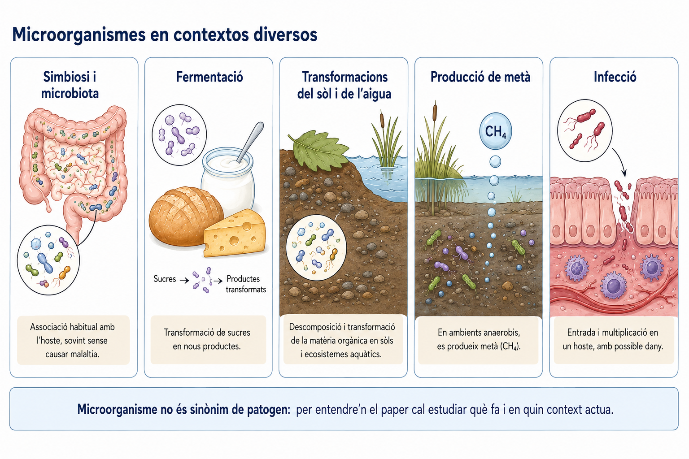

*Figura 1. Microorganismes en contextos diversos.*

### 1.2 Diversitat metabòlica i condicions ambientals

El **metabolisme** és el conjunt de transformacions químiques que tenen lloc en una cèl·lula.

Els microorganismes presenten una gran diversitat metabòlica. Això significa que diferents grups poden utilitzar substàncies diferents, obtenir matèria i energia de maneres diferents i viure en condicions ambientals molt diverses.

Per interpretar un procés microbià ens pot resultar útil observar:

1. **quines substàncies hi ha disponibles**;
2. **quines substàncies desapareixen o es transformen**;
3. **quins productes apareixen**;
4. **quines condicions ambientals hi ha**.

Considerem tres exemples.

#### Incorporació de carboni a matèria orgànica

En determinats microorganismes, en presència de llum:

**CO₂ + aigua → matèria orgànica + O₂**

En aquest procés, carboni que formava part del CO₂ passa a formar part de molècules orgàniques.

#### Transformacions de composts nitrogenats

En determinades condicions amb oxigen, alguns bacteris poden intervenir en transformacions com:

**amoni → nitrits → nitrats**

Aquests processos modifiquen la forma química en què es troba el nitrogen i, per tant, poden modificar-ne la disponibilitat per a altres organismes.

#### Producció de metà

En ambients sense oxigen, determinats **arqueus** poden realitzar processos en què es produeix metà:

**CO₂ + H₂ → CH₄**

La producció biològica de metà —**metanogènesi**— és una característica de determinats arqueus, no dels bacteris.

Aquests exemples mostren que la distribució dels microorganismes dins un ambient **no és aleatòria**. Està relacionada amb les condicions del medi i amb els processos metabòlics que cada grup pot realitzar.

En una zona humida, per exemple, la llum i la disponibilitat d’oxigen poden disminuir amb la profunditat. Això pot afavorir processos diferents a la superfície, a les zones intermèdies i als sediments profunds.

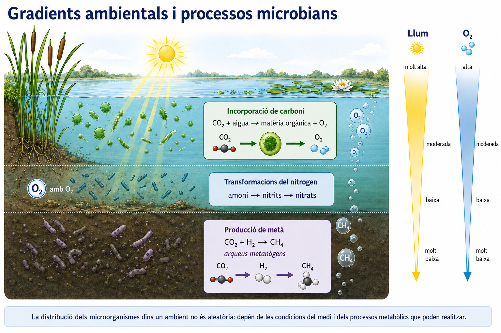

*Figura 2. Gradients ambientals i processos microbians.*

### 1.3 Importància ecològica

La importància ecològica dels microorganismes no depèn de la mida d’una cèl·lula individual, sinó de les transformacions que duen a terme enormes poblacions de microorganismes.

Quan moltes cèl·lules realitzen repetidament un mateix procés poden modificar la composició del sòl, de l’aigua o de l’atmosfera.

Aquests processos són especialment importants en els **cicles biogeoquímics**, és a dir, en la circulació dels elements químics entre els organismes i els components no vius del planeta.

#### Microorganismes i cicle del nitrogen

El nitrogen és imprescindible per formar molècules biològiques, però no totes les formes químiques del nitrogen són igualment utilitzables pels organismes.

Diferents microorganismes participen en transformacions que converteixen unes formes nitrogenades en unes altres. Això modifica la disponibilitat del nitrogen en els ecosistemes.

Alguns bacteris estableixen, a més, associacions estretes amb les arrels de determinades plantes. En aquestes **simbiosis**, l’activitat bacteriana pot contribuir a incorporar nitrogen atmosfèric a composts nitrogenats que entren al sistema biològic, mentre que la planta proporciona als bacteris recursos i un ambient adequat.

No és necessari memoritzar aquí totes les etapes del cicle del nitrogen. La idea important és:

> **processos realitzats per microorganismes poden modificar quines formes químiques d’un element hi ha disponibles dins un ecosistema.**

#### Microorganismes i cicle del carboni

Altres microorganismes:

- incorporen CO₂ a matèria orgànica;
- degraden matèria orgànica;
- produeixen CO₂;
- produeixen metà en determinades condicions.

Per tant, els microorganismes poden influir en el moviment del carboni entre organismes, sediments, aigua i atmosfera.

> **Una qüestió d’escala**  
> Una cèl·lula microbiana és minúscula. L’activitat acumulada de poblacions immenses pot tenir conseqüències a escala d’un ecosistema o del planeta.

---

## 2. Bacteris i arqueus

### 2.1 Què comparteixen?

Els **bacteris** i els **arqueus** són organismes unicel·lulars procariotes.

Això significa que comparteixen una organització cel·lular bàsica:

- tenen **membrana plasmàtica**;
- contenen **ADN**;
- presenten **ribosomes**, necessaris per fabricar proteïnes;
- no presenten un **nucli delimitat per membrana**;
- duen a terme dins la mateixa cèl·lula els processos necessaris per mantenir el seu metabolisme i reproduir-se.

En un model simplificat d’una cèl·lula bacteriana podem distingir:

- membrana plasmàtica;
- paret cel·lular;
- citoplasma;
- ribosomes;
- cromosoma bacterià.

Alguns bacteris també presenten **plasmidis**, petites molècules d’ADN que poden replicar-se separadament del cromosoma principal.

Els plasmidis seran especialment útils quan estudiem la transferència d’informació genètica entre bacteris. Però cal evitar una generalització:

> **un plasmidi és una possibilitat, no una estructura que hagi de contenir necessàriament qualsevol gen important.**

### 2.2 Bacteris i arqueus no són equivalents

Compartir organització procariota no significa pertànyer al mateix grup.

Algunes característiques permeten diferenciar bacteris i arqueus:

| Característica | Bacteris | Arqueus |
|---|---|---|
| Organització procariota | sí | sí |
| ADN | sí | sí |
| Ribosomes | sí | sí |
| Nucli delimitat per membrana | no | no |
| Peptidoglicà a la paret | habitualment sí | no |
| Composició de la membrana | característica dels bacteris | diferent de la bacteriana |
| Hàbitats | molt diversos | molt diversos |
| Producció biològica de metà | no | alguns grups sí |

Això evita una conclusió massa ràpida.

Si només sabem que un microorganisme:

- és unicel·lular;
- no presenta nucli;

no podem concloure que sigui un bacteri, perquè aquestes dades també són compatibles amb un arqueu.

Si, a més, sabem que:

- no presenta peptidoglicà;
- produeix metà;

el conjunt d’evidències apunta molt més clarament cap als arqueus.

> **Precisió terminològica**  
> En alguns documents curriculars apareixen les denominacions **eubacteris** i **arqueobacteris**. En aquesta guia utilitzarem preferentment els termes actuals **bacteris** i **arqueus**.

També convé evitar una altra simplificació:

> **Els arqueus no són simplement «microorganismes d’ambients extrems».**

Alguns grups poden viure en condicions extremes, però els arqueus també apareixen en molts altres ambients.

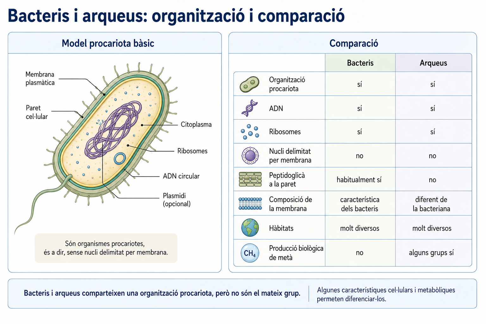

*Figura 3. Bacteris i arqueus: organització i comparació.*

---

## 3. Cultivar i observar microorganismes

### 3.1 Què significa cultivar un microorganisme?

**Cultivar microorganismes** significa proporcionar unes condicions que permetin el seu creixement de manera controlada.

Un cultiu microbiològic pot requerir:

- un **medi de cultiu** que proporcioni substàncies adequades;
- una mostra inicial que s’hi introdueix o **inocula**;
- unes condicions d’**incubació** compatibles amb els microorganismes que volem estudiar;
- procediments destinats a evitar o reduir la **contaminació**.

Un medi de cultiu no és simplement «aliment per a bacteris». La seva composició i les condicions ambientals —temperatura, disponibilitat d’oxigen, nutrients, etc.— condicionen quins organismes hi poden créixer.

Això té una conseqüència important:

> **allò que creix en un cultiu no representa necessàriament tots els microorganismes que hi havia a la mostra inicial.**

Un microorganisme pot ser present a la mostra i no créixer si les condicions proporcionades no són adequades per a ell.

### 3.2 De la cèl·lula a la colònia

Una cèl·lula bacteriana individual és massa petita per observar-la a simple vista.

En canvi, si una cèl·lula o una petita agrupació de cèl·lules es divideix repetidament en un medi adequat, pot arribar a formar una massa visible que anomenam **colònia**.

El procés general és:

**unitat inicial → moltes divisions → acumulació de moltes cèl·lules → colònia visible**

Una colònia, per tant:

- **no és una sola cèl·lula**;
- **no és una cèl·lula gegant**;
- és el resultat del creixement d’un gran nombre de cèl·lules.

Sovint s’utilitza el terme **unitat formadora de colònia (UFC)** per referir-se a la unitat viable que origina una colònia. Aquesta unitat pot haver estat una sola cèl·lula o una petita agrupació que ja estava junta.

Per això, no és correcte afirmar automàticament:

> «una colònia = una cèl·lula inicial».

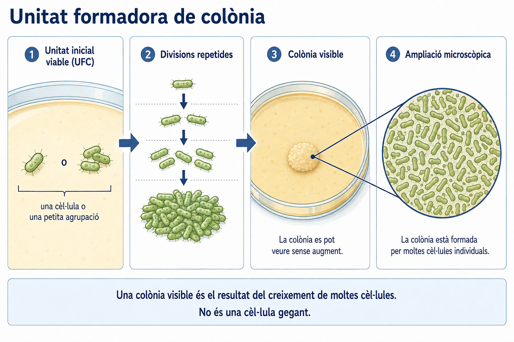

*Figura 4. Unitat formadora de colònia.*

### 3.3 Què podem observar —i què podem inferir?

Una colònia es pot estudiar a escala **macroscòpica**, mentre que les seves cèl·lules requereixen observació **microscòpica**.

#### Observació macroscòpica

Podem descriure característiques com:

- mida;
- forma general;
- marge;
- pigmentació;
- superfície;
- relleu.

Aquestes propietats són útils per descriure i comparar colònies.

Però una observació té límits.

Dues colònies diferents no corresponen necessàriament a dues espècies diferents, i dues colònies semblants no han de correspondre necessàriament al mateix microorganisme.

#### Observació microscòpica

Amb una preparació adequada podem observar:

- forma dominant de les cèl·lules;
- agrupacions;
- distribució dins el camp;
- diferències visibles entre zones de la preparació.

La qualitat de la preparació és important. Una extensió massa gruixada pot fer que les cèl·lules se superposin i que l’observació perdi informació. Una tinció pot augmentar el contrast, però no converteix automàticament en visibles totes les estructures cel·lulars.

#### Observació i inferència

Suposem que observam al microscopi moltes cèl·lules allargades.

Podem descriure:

> «Observam moltes cèl·lules de forma allargada.»

Amb el context adequat podem inferir:

> «La colònia estava formada per moltes cèl·lules microscòpiques.»

Però no podem concloure només a partir de l’aspecte:

> «Aquest bacteri és inofensiu.»

Aquesta afirmació requeriria altres tipus d’evidència.

| Nivell | Exemple |
|---|---|
| **Observació directa** | La colònia és visible i presenta un marge determinat. |
| **Inferència sustentada** | La colònia està formada per moltes cèl·lules microscòpiques. |
| **No ho podem concloure només amb aquestes dades** | El microorganisme és patogen o inofensiu. |

<!--
No es proposa figura independent per "observació / inferència".
La taula textual és més clara, flexible i accessible.
-->

### 3.4 Esterilització i tècnica asèptica

Quan manipulam microorganismes hi ha dos problemes simultanis:

1. microorganismes no desitjats poden entrar a la mostra i alterar els resultats;
2. els microorganismes de la mostra poden dispersar-se fora del lloc on els volem mantenir.

Per això utilitzam procediments de control microbiològic.

#### Esterilització

**Esterilitzar** significa aplicar un procediment capaç d’eliminar o inactivar totes les formes viables de microorganismes d’un material.

Una tècnica habitual és l’**autoclau**, que utilitza vapor d’aigua a pressió i temperatura elevada per esterilitzar materials que ho poden suportar.

En altres situacions es poden utilitzar altres procediments físics o material que ja ha estat esterilitzat prèviament. La tècnica adequada depèn del tipus de material.

En aquesta unitat no necessitam memoritzar temperatures, pressions o temps de tractament. El que hem d’entendre és **què pretén aconseguir l’esterilització i per què és necessària**.

#### Desinfecció

La **desinfecció** redueix o elimina molts microorganismes d’una superfície, però no implica necessàriament que el material quedi estèril.

Per això **desinfectar** i **esterilitzar** no són sinònims.

#### Tècnica asèptica

La **tècnica asèptica** és el conjunt de pràctiques destinades a reduir la contaminació durant la manipulació de mostres i cultius.

La seva funció és doble:

- augmentar la fiabilitat de les observacions;
- treballar amb més seguretat.

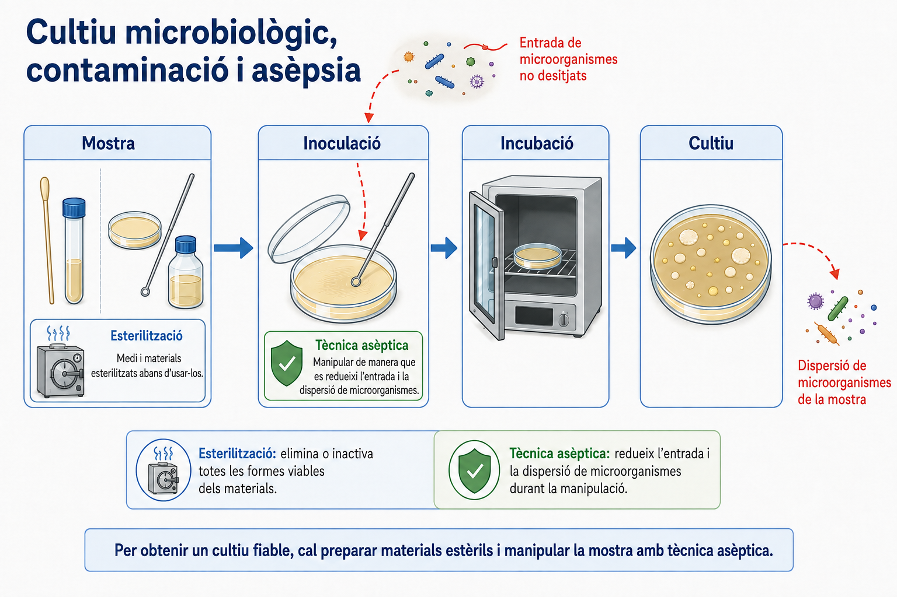

*Figura 5. Cultiu microbiològic, contaminació i asèpsia.*

---

## 4. Microorganismes, hoste i malaltia

### 4.1 La microbiota

Molts organismes viuen habitualment associats a comunitats de microorganismes.

El conjunt de microorganismes que habiten de manera característica un organisme o una zona concreta del seu cos forma part de la seva **microbiota**.

La microbiota pot ocupar:

- pell;
- boca;
- intestí;
- altres superfícies o cavitats en contacte amb l’exterior.

La seva presència habitual és suficient per descartar un model massa simple:

**microorganisme present → malaltia**

Trobar un microorganisme en un hoste no ens permet afirmar, només per aquesta observació, que l’hoste estigui malalt ni que aquell microorganisme sigui la causa d’una malaltia.

### 4.2 Colonització, infecció i malaltia infecciosa

Per interpretar la relació entre un microorganisme i un hoste és útil distingir diversos processos.

#### Colonització

Hi ha **colonització** quan microorganismes són presents i es multipliquen en una superfície o teixit de l’hoste sense que això impliqui necessàriament dany.

La colonització ens indica que el microorganisme pot mantenir-se o multiplicar-se en aquell lloc.

No implica necessàriament:

- dany;
- símptomes;
- malaltia.

#### Infecció

Parlam d’**infecció** quan un agent infecciós entra i es multiplica en un hoste i estableix una interacció biològica amb els seus teixits o defenses.

Aquesta interacció pot desencadenar:

- resposta defensiva;
- inflamació;
- alteracions locals;
- altres canvis fisiològics.

Però una infecció pot existir **sense malaltia aparent**.

#### Malaltia infecciosa

Parlam de **malaltia infecciosa** quan la infecció contribueix a produir alteracions del funcionament normal que es manifesten amb signes o símptomes.

Podem representar aquestes idees així:

**presència → colonització → infecció → malaltia**

Però aquesta representació és només un model de possibles transicions.

> **No és una escala obligatòria.**

Una colonització pot mantenir-se sense dany. Una infecció pot ser asimptomàtica. Un microorganisme de la microbiota no ha d’avançar necessàriament cap a una infecció.

### 4.3 Microorganisme, hoste i context

El mateix microorganisme no ha de produir el mateix resultat en totes les persones o organismes exposats.

El resultat depèn de la interacció entre:

**microorganisme + hoste + context**

Poden influir, entre altres factors:

- característiques de l’agent;
- quantitat d’agent;
- via d’entrada;
- teixit afectat;
- estat de les defenses de l’hoste;
- edat i estat general;
- presència d’altres microorganismes;
- condicions ambientals.

Imaginem tres hostes exposats al mateix microorganisme:

- en un, el microorganisme desapareix o queda controlat sense dany;
- en un altre, hi ha resposta de l’hoste però no apareixen símptomes importants;
- en un tercer, apareixen resposta intensa, dany tissular i símptomes.

Aquest patró ens obliga a descartar una explicació en què **el microorganisme determina tot sol el resultat**.

La malaltia és el resultat d’una interacció.

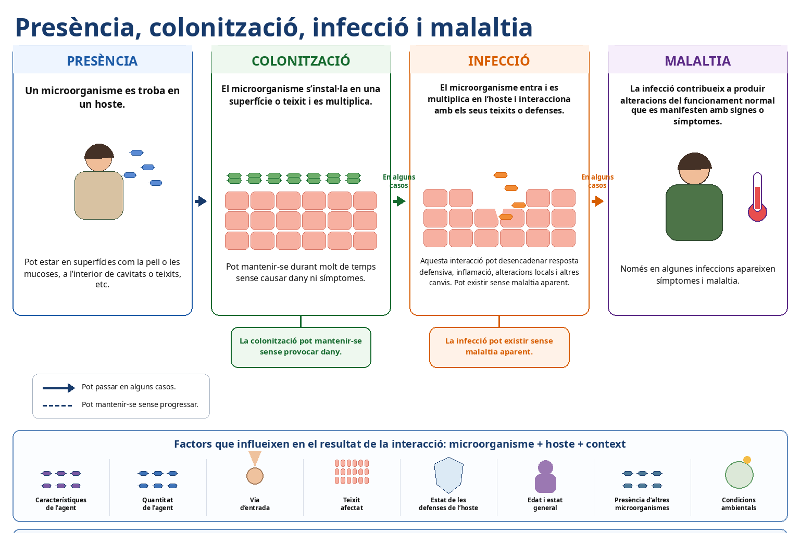

*Figura 6. Presència, colonització, infecció i malaltia.*

### 4.4 Quan podem atribuir una malaltia a un microorganisme?

Suposem que detectam un microorganisme X amb molta freqüència en persones amb una determinada malaltia.

Aquesta dada pot ser important, però per si sola no demostra que X sigui la causa.

La relació observada pot tenir explicacions diferents:

- X podria participar causalment en la malaltia;
- X podria aparèixer amb més freqüència perquè el teixit malalt proporciona unes condicions favorables;
- un tercer factor podria afavorir tant la presència de X com la malaltia;
- X podria contribuir només en alguns hostes o en determinades condicions.

Per això convé distingir:

> **Associació:** dues variables apareixen relacionades en les dades.

> **Causalitat:** una variable participa en el procés que contribueix a produir l’altra.

Una associació pot donar suport a una hipòtesi causal, però **no hi equival**.

Les hipòtesis causals es fan més fortes quan diferents evidències independents són compatibles amb la mateixa explicació i fan menys plausibles altres interpretacions.

En el cas d’un microorganisme, ens podem demanar:

- apareix associat de manera consistent amb la malaltia?
- es localitza en un lloc compatible amb el dany?
- podem distingir el seu efecte del d’altres possibles causes?
- la seva presència pot reproduir un patró de dany en condicions adequades?
- podem tornar a relacionar el mateix agent amb el procés observat?

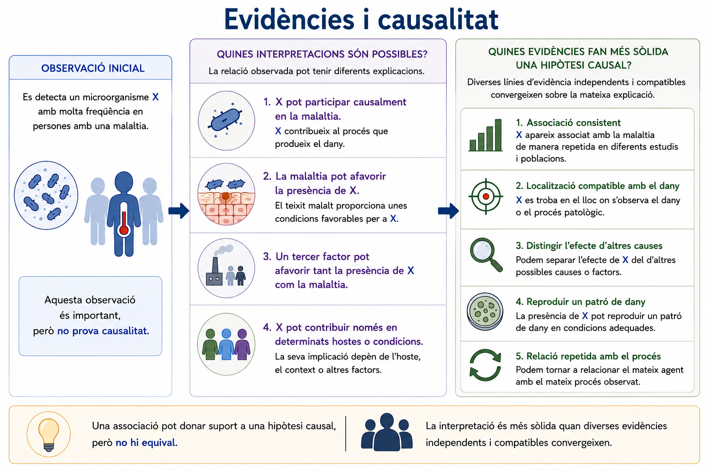

*Figura 7. Evidències i causalitat.*

<!--
ENLLAÇ FUTUR A PROJECTE CIENTÍFIC:
Associació, causalitat, comparació i límits de les inferències es desenvolupen de manera general
al material transversal. Aquí només es manté l'aplicació microbiològica.
-->

### 4.5 Koch com a eina històrica i conceptual

Històricament, Robert Koch i altres investigadors varen formular criteris per relacionar microorganismes concrets amb malalties concretes.

En aquesta unitat **no hem de memoritzar una llista de postulats**.

El que ens interessa és el problema que aquests criteris intentaven resoldre:

> **Com podem passar de «aquest microorganisme apareix en persones malaltes» a una interpretació causal més sòlida?**

El raonament general consistia a cercar una combinació d’evidències:

- associació consistent;
- possibilitat d’estudiar l’agent separant-lo d’altres causes;
- reproducció del procés patològic en condicions adequades;
- nova relació entre el mateix agent i el procés observat.

Aquesta manera de pensar continua essent útil, però els criteris clàssics no es poden aplicar sempre de manera literal.

Algunes limitacions són:

- infeccions asimptomàtiques;
- agents que no es poden cultivar fàcilment;
- malalties en què intervenen molts factors;
- dependència de les característiques de l’hoste;
- limitacions ètiques de determinades proves experimentals.

> **Idea clau**  
> Koch és útil aquí com a **eina de raonament sobre evidències**, no com una recepta universal ni com un contingut memorístic.

### 4.6 Zoonosis i epidèmies

Alguns agents infecciosos poden circular entre espècies.

Una **zoonosi** és una infecció que es transmet de manera natural entre animals vertebrats i humans.

Aquesta definició no significa que:

- tots els animals infectats desenvolupin malaltia;
- tota exposició produeixi infecció;
- tota infecció zoonòtica es transmeti després fàcilment entre humans.

Com en altres processos infecciosos, el resultat depèn de l’agent, l’hoste i el context.

Parlam d’**epidèmia** quan, en una població, lloc i període determinats, apareix un nombre de casos d’una malaltia superior al que s’hi espera habitualment.

L’estudi d’una epidèmia pot plantejar preguntes com:

- quins casos comparteixen característiques;
- quan i on han aparegut;
- quin agent hi podria estar associat;
- quines vies de transmissió són compatibles amb les dades;
- quins altres factors poden contribuir al patró observat.

En aquesta unitat no estudiarem models matemàtics d’epidèmies ni indicadors epidemiològics detallats. El que necessitam és entendre que **detectar casos i detectar un microorganisme són només parts del problema d’explicar una malaltia infecciosa**.

---

## 5. Transferència genètica i resistència als antibiòtics

### 5.1 Variació dins les poblacions bacterianes

Una població bacteriana no és necessàriament genèticament uniforme.

Poden existir variants amb característiques diferents. Una d’aquestes característiques pot afectar la resposta a un antibiòtic.

Una variant genètica pot aparèixer:

- per canvis en el material genètic;
- perquè un bacteri adquireix informació genètica procedent d’una altra font.

Aquest punt és essencial per entendre la resistència:

> **l’antibiòtic no ha de crear la resistència en el moment en què s’aplica.**

Si una variant resistent ja existeix abans del tractament, l’antibiòtic pot modificar quins bacteris sobreviuen i deixen més descendència.

### 5.2 Transferència vertical i horitzontal

La informació genètica pot passar entre cèl·lules de maneres diferents.

#### Transferència vertical

**progenitor → descendència**

La informació genètica passa durant la reproducció.

#### Transferència horitzontal

**organisme → organisme sense una relació immediata progenitor-descendent**

En bacteris, la transferència horitzontal permet que una cèl·lula adquireixi informació que abans no tenia.

Aquesta informació pot modificar les seves característiques.

### 5.3 Tres mecanismes de transferència horitzontal

En aquesta unitat estudiam tres mecanismes.

#### Conjugació

En la **conjugació** hi ha contacte directe entre bacteris i es transfereix ADN d’un bacteri donador a un receptor.

Un exemple habitual és la transferència d’un **plasmidi**.

Si el plasmidi conté un gen de resistència, el receptor pot adquirir aquella informació sense ser descendent del donador.

Però no podem concloure que:

> tots els gens de resistència hagin d’estar en plasmidis.

El plasmidi és una possible localització i un bon model per entendre la transferència.

#### Transformació

En la **transformació**, un bacteri incorpora **ADN lliure present al medi**.

Aquest ADN pot procedir de cèl·lules que han alliberat el seu material genètic.

No és necessari que hi hagi contacte directe amb el bacteri del qual procedia originàriament l’ADN.

#### Transducció

En la **transducció**, un **bacteriòfag** —un virus que infecta bacteris— transporta material genètic entre bacteris.

En aquest cas:

- el material genètic pot procedir originàriament d’un bacteri;
- no hi ha contacte directe entre bacteri donador i receptor;
- el bacteriòfag actua com a vehicle de transferència.

Podem resumir-ho així:

| Mecanisme | Com arriba l’ADN al receptor? | Contacte directe bacteri-bacteri? |
|---|---|---|
| **Conjugació** | transferència directa, sovint representada amb un plasmidi | sí |
| **Transformació** | ADN lliure del medi | no |
| **Transducció** | transport mitjançant un bacteriòfag | no |

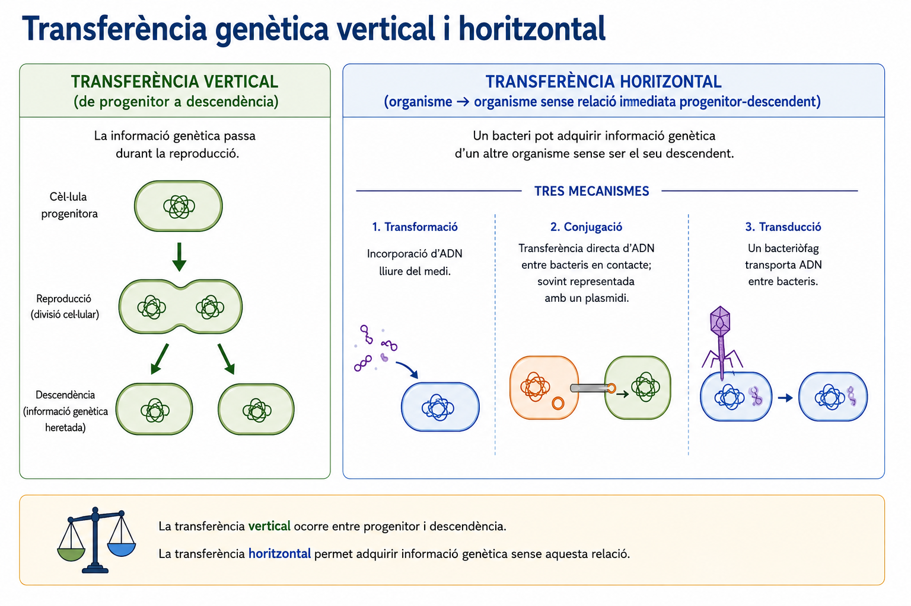

*Figura 8. Transferència genètica vertical i horitzontal.*

### 5.4 Adquirir una resistència no és fer-la freqüent

Aquí hem de separar dues preguntes diferents.

> **Com adquireix un bacteri una característica de resistència?**

i

> **Com pot arribar aquesta característica a ser freqüent dins una població?**

La transferència genètica pot explicar com arriba un gen nou a un bacteri o com es dissemina entre bacteris.

Però que un bacteri adquireixi un gen de resistència no implica que la major part de la població el tengui.

Per explicar un canvi en la freqüència d’aquesta característica hem de considerar també:

- variació dins la població;
- reproducció;
- transmissió de la informació;
- condicions ambientals;
- diferències en supervivència i descendència.

Aquesta distinció és fonamental:

> **origen/adquisició de la variació ≠ selecció de la variació**

### 5.5 L’antibiòtic com a pressió selectiva

Imaginem una població bacteriana en què:

- la majoria dels bacteris són sensibles;
- alguns bacteris ja presenten una característica de resistència.

Quan s’aplica un antibiòtic:

1. els bacteris sensibles són més afectats;
2. els bacteris resistents sobreviuen o es reprodueixen relativament més;
3. després de diverses generacions, la proporció de bacteris resistents augmenta.

Aquest procés és un exemple de **selecció**.

La interpretació correcta és:

**variació prèvia → antibiòtic → supervivència/reproducció diferencial → canvi de freqüències**

No:

**antibiòtic → necessitat de sobreviure → aparició dirigida de la resistència**

L’antibiòtic actua com una **pressió selectiva**: modifica quines variants deixen una contribució més gran a les generacions següents.

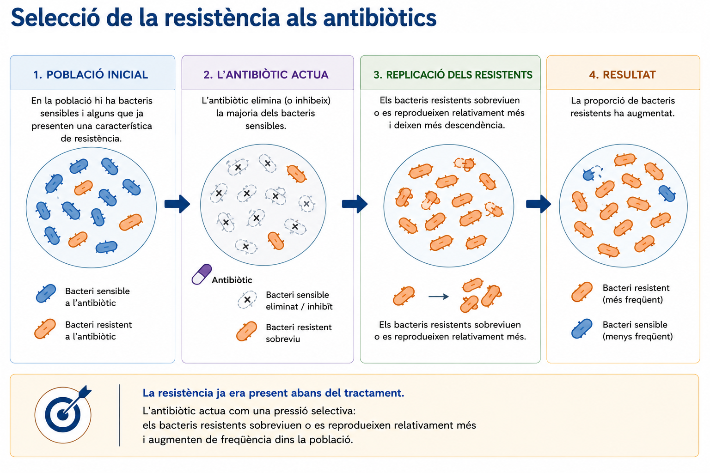

*Figura 9. Selecció de la resistència als antibiòtics.*

### 5.6 Interpretar qualitativament la resposta a un antibiòtic

Una manera d’estudiar la resposta d’un cultiu bacterià a un antibiòtic és observar el creixement al voltant d’un disc que conté la substància antimicrobiana.

Si l’antibiòtic inhibeix el creixement, apareix una zona amb poc o cap creixement al voltant del disc.

En aquesta unitat ens interessa fer una interpretació **qualitativa**.

Podem comparar, per exemple, dues poblacions del mateix bacteri exposades al mateix antibiòtic:

- en una població, el creixement queda fortament inhibit prop del disc;
- en l’altra, el creixement s’apropa més al disc.

Això ens permet comparar la resposta de les dues poblacions.

Però sense:

- una escala de mesura;
- un protocol de referència;
- criteris clínics;

no podem assignar automàticament una categoria clínica precisa.

Per tant, hem de distingir:

> **què observam directament**

de

> **què necessitaríem mesurar o consultar per arribar a una classificació més específica**.

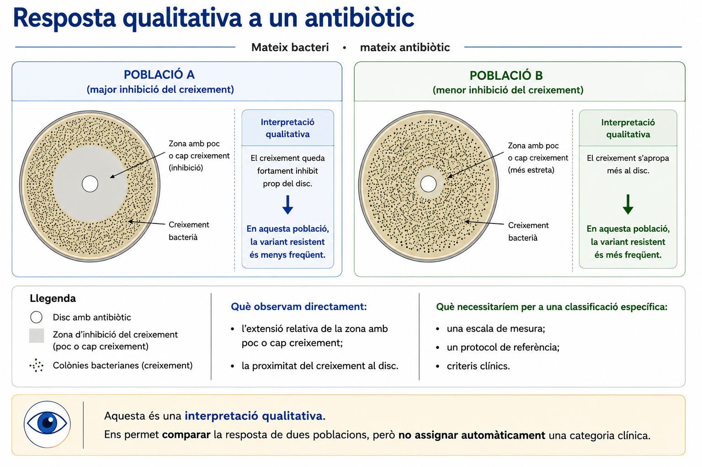

*Figura 10. Resposta qualitativa a un antibiòtic.*

---

## 6. Virus, viroides i prions

### 6.1 Un virus no és una cèl·lula

Un virus no és simplement un bacteri molt petit.

Una cèl·lula bacteriana és una unitat cel·lular capaç de mantenir processos metabòlics propis i de fabricar proteïnes mitjançant els seus ribosomes.

Un virus, en canvi, és una forma **acel·lular**.

| Característica | Cèl·lula bacteriana | Virus |
|---|---|---|
| Organització cel·lular | sí | no |
| Material genètic | sí | sí |
| Ribosomes propis | sí | no |
| Metabolisme propi | sí | no |
| Síntesi proteica autònoma | sí | no |
| Producció autònoma de noves partícules víriques | no és aplicable | no |

La diferència decisiva és:

> **un virus depèn d’una cèl·lula hoste per produir els components necessaris per formar noves partícules víriques.**

### 6.2 Estructura bàsica dels virus

En un model víric simplificat podem distingir:

#### Material genètic

Conté la informació que participarà en la producció de nous genomes i components vírics dins una cèl·lula compatible.

#### Càpsida

És una coberta formada per proteïnes que protegeix el material genètic i participa en les interaccions de la partícula vírica amb l’hoste.

Alguns virus presenten altres estructures, com embolcalls.

No necessitam estudiar aquí una classificació completa dels virus. El model general que ens interessa és:

> **material genètic + estructures que permeten protegir-lo i transferir-lo a una cèl·lula hoste compatible.**

### 6.3 Com es produeixen noves partícules víriques?

Un virus **no creix i després es divideix** en virus més petits.

El procés general és diferent:

1. **reconeixement i unió** a una cèl·lula compatible;
2. **entrada** del virus o del seu material genètic;
3. **producció** de noves còpies del material genètic i de components vírics utilitzant recursos de la cèl·lula;
4. **muntatge** de les noves partícules;
5. **alliberament**.

La cèl·lula hoste proporciona processos i recursos que el virus no pot mantenir de manera autònoma.

Aquesta dependència explica per què una partícula vírica fora d’una cèl·lula **no produeix per si sola noves partícules víriques**.

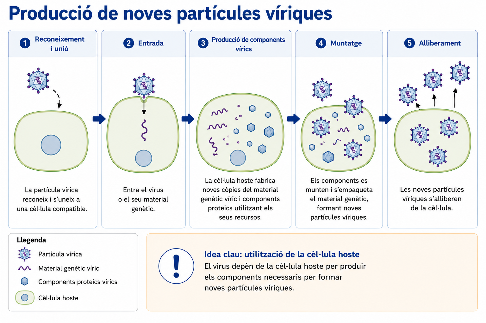

*Figura 11. Producció de noves partícules víriques.*

### 6.4 Viroides

Els **viroides** són agents acel·lulars formats per petites molècules d’**ARN**.

A diferència dels virus:

- no presenten càpsida;
- no formen una partícula vírica amb material genètic envoltat per una coberta proteica.

Els viroides coneguts es repliquen dins cèl·lules vegetals utilitzant processos de l’hoste.

Per tant, en aquest cas, allò que s’amplifica és essencialment:

> **una molècula d’ARN infecciosa**

Això mostra que tenir material genètic no implica necessàriament tenir una estructura vírica amb càpsida.

### 6.5 Prions

Els **prions** representen un mecanisme encara més diferent.

Un prió és una **proteïna amb una conformació alterada** que pot afavorir que altres proteïnes de l’hoste adoptin una conformació semblant.

Un prió:

- no és una cèl·lula;
- no conté ADN;
- no conté ARN.

Per tant, no es propaga copiant informació genètica.

Allò que s’estén és:

> **una conformació proteica**

Aquesta idea posa en qüestió una generalització que semblaria intuïtiva:

> «tot agent infecciós ha de contenir material genètic».

Els prions mostren que no és així.

### 6.6 Importància biològica de les formes acel·lulars

Les formes acel·lulars són biològicament importants per motius diferents.

#### Virus

Els virus poden:

- provocar infeccions en animals, plantes, bacteris i altres organismes;
- modificar la dinàmica de poblacions d’hostes;
- intervenir en processos de transferència de material genètic;
- actuar, en el cas dels bacteriòfags, com a vehicles de **transducció** entre bacteris.

Això connecta directament el món víric amb l’evolució i la variació genètica bacteriana.

#### Viroides

Els viroides poden produir alteracions en plantes i mostren que una molècula d’ARN sense càpsida pot comportar-se com un agent infecciós.

#### Prions

Els prions poden causar processos patològics associats a l’acumulació o propagació de proteïnes amb conformacions alterades.

Més enllà de les malalties concretes, viroides i prions tenen una importància conceptual important:

> mostren que **un agent infecciós no ha de ser necessàriament una cèl·lula ni funcionar com un virus**.

### 6.7 Què és exactament allò que es propaga?

Virus, viroides i prions poden provocar processos infecciosos o patològics, però **no es propaguen de la mateixa manera**.

| Característica | Virus | Viroide | Prió |
|---|---|---|---|
| Material genètic | sí | sí, ARN | no |
| Càpsida | sí | no | no |
| Component essencial | genoma + components proteics | ARN | proteïna |
| Què augmenta durant el procés? | genomes i components que formen noves partícules | noves molècules d’ARN | proteïnes amb la conformació alterada |
| Depèn d’un hoste o dels seus components | sí | sí | sí |
| Mecanisme distintiu | ús de la maquinària cel·lular per produir components | còpia de l’ARN amb processos de l’hoste | propagació d’una conformació proteica |

Dir simplement:

> «virus, viroides i prions es reprodueixen dins un hoste»

amaga diferències biològiques essencials.

En virus i viroides hi ha propagació basada en informació genètica.

En els prions, en canvi, **no es copia ADN ni ARN: es propaga una conformació proteica**.

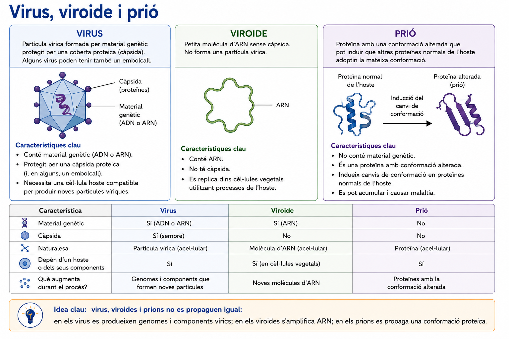

*Figura 12. Virus, viroide i prió.*

---

## 7. Síntesi de la unitat

Al llarg de la unitat hem construït un conjunt de distincions que permeten interpretar situacions molt diferents.

### 1. Microorganisme no significa patogen

Els microorganismes poden tenir papers ecològics, simbiótics, tecnològics o patològics.

La mida microscòpica no determina la seva funció.

### 2. Bacteri no significa qualsevol procariota

Bacteris i arqueus són organismes unicel·lulars procariotes, però no són el mateix grup.

Algunes característiques cel·lulars i metabòliques permeten distingir-los.

### 3. Colònia no significa cèl·lula

Una colònia és una estructura macroscòpica formada pel creixement de moltes cèl·lules.

El cultiu i el microscopi ens permeten estudiar els microorganismes a escales diferents.

### 4. Presència no significa malaltia

La microbiota, la colonització, la infecció i la malaltia infecciosa no són sinònims.

El resultat depèn de la interacció entre:

**microorganisme + hoste + context**

### 5. Associació no significa causalitat

Detectar un microorganisme amb més freqüència en persones malaltes pot donar suport a una hipòtesi, però no demostra per si sol que aquell microorganisme sigui la causa.

Una interpretació causal es fa més sòlida quan diverses evidències independents convergeixen.

### 6. Adquirir una resistència no significa seleccionar-la

La transferència genètica pot explicar com arriba informació nova a un bacteri o com es dissemina.

La selecció per un antibiòtic explica com canvia la freqüència de les variants dins una població.

Són processos diferents.

### 7. Un virus no és una cèl·lula

Els virus són formes acel·lulars que depenen de cèl·lules hoste per produir noves partícules.

No creixen i es divideixen com una cèl·lula.

### 8. Virus, viroides i prions no es propaguen igual

- en els **virus**, es produeixen genomes i components que formen noves partícules;
- en els **viroides**, s’amplifiquen molècules d’ARN;
- en els **prions**, es propaga una conformació proteica.

### 9. Els microorganismes transformen els ecosistemes

La diversitat metabòlica de bacteris, arqueus i altres microorganismes els permet intervenir en simbiosis, cicles biogeoquímics i transformacions de la matèria.

La seva importància ecològica no depèn de la seva mida individual.

### 10. Observar bé també significa conèixer els límits de l’observació

Una dada macroscòpica, microscòpica o experimental permet sostenir unes conclusions i no unes altres.

Interpretar científicament una observació implica també saber **què encara no podem afirmar amb les dades disponibles**.

<!--
ENLLAÇ FUTUR:
La idea general sobre evidència, inferència, tipus d'estudis, fonts i argumentació
es desenvolupa al material transversal PROJECTE CIENTÍFIC.
-->
