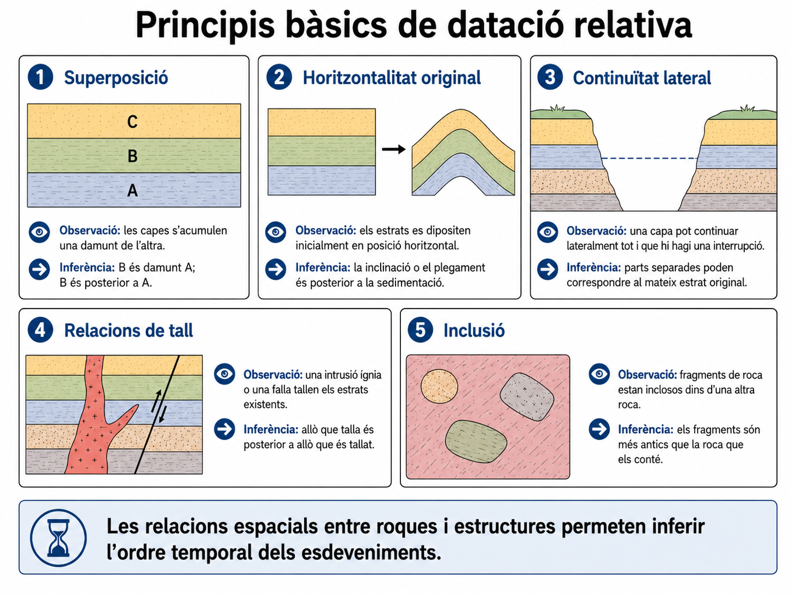
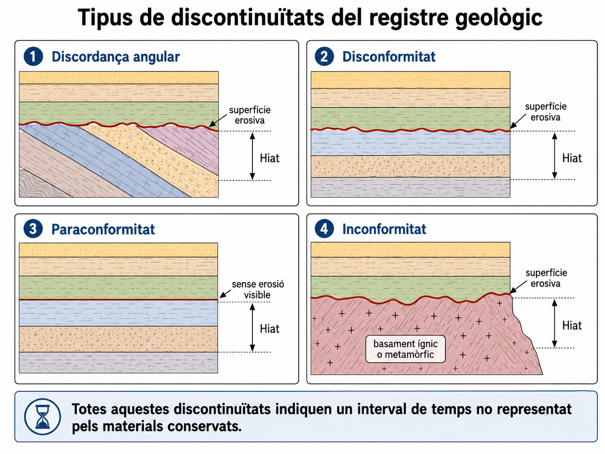
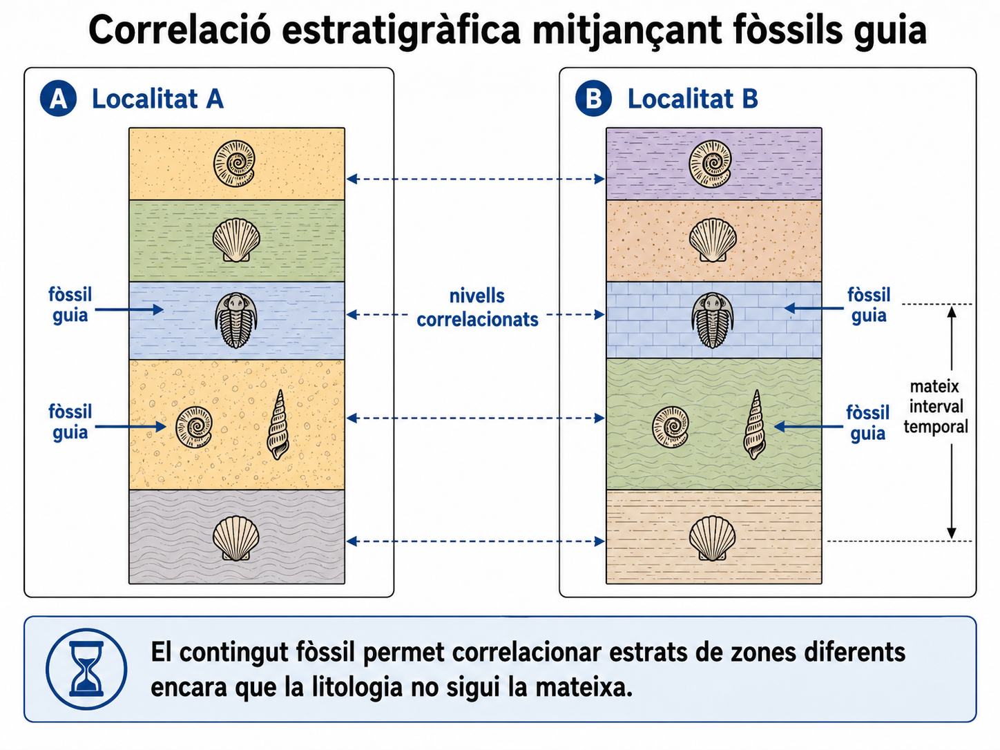
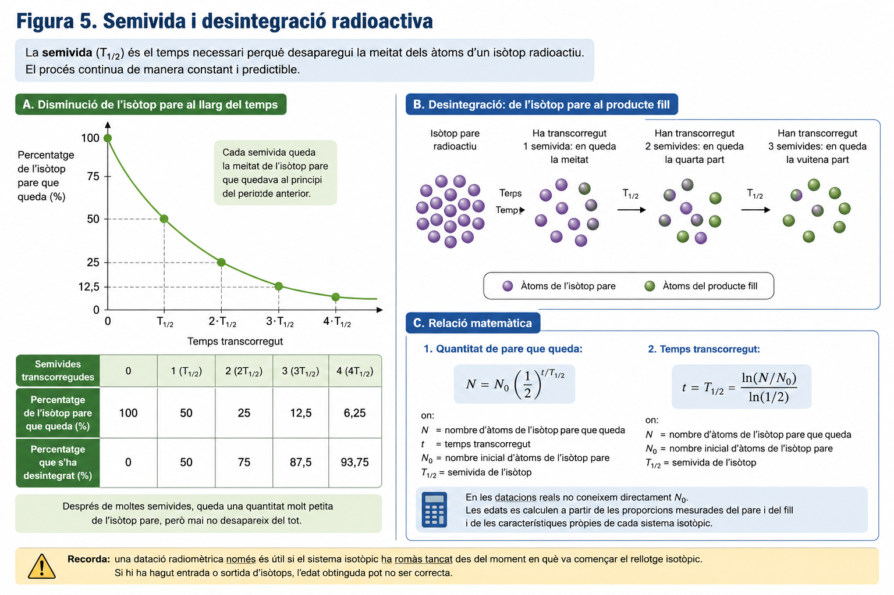
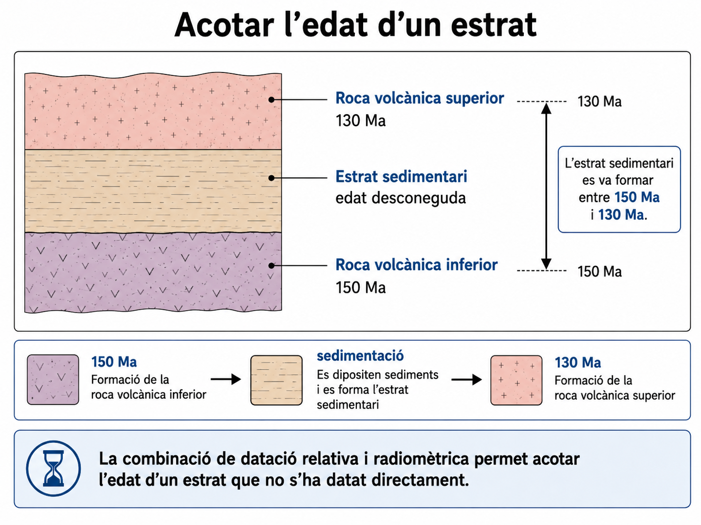
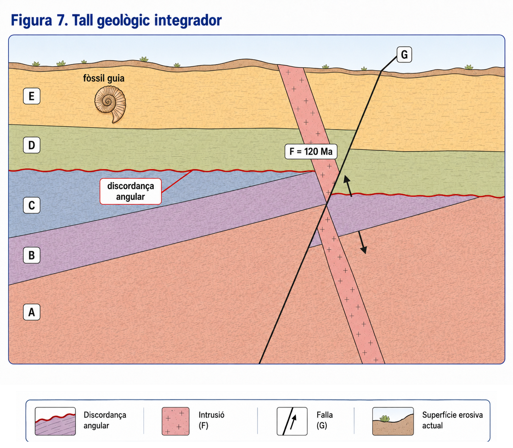
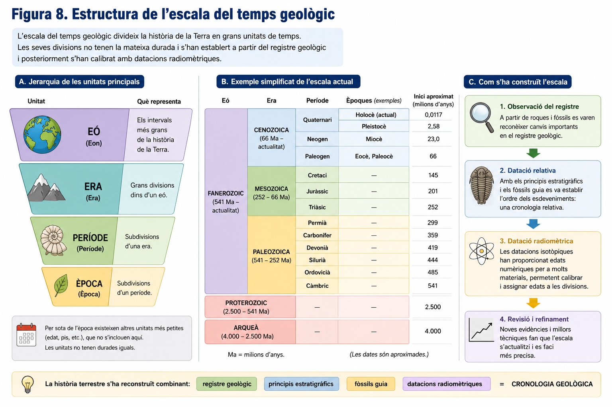

# U.D. 1. Com reconstruïm la història de la Terra?

La Terra té una història molt més llarga que qualsevol escala temporal de l’experiència humana. No podem observar directament la major part dels esdeveniments que han tengut lloc al llarg d’aquesta història, però en podem conservar evidències. La geologia històrica estudia aquestes evidències per reconstruir què va passar i en quin ordre.

## 1. El temps geològic i el registre geològic

### 1.1. El temps profund

Molts processos geològics actuen durant intervals de temps immensos. La formació i erosió de relleus, l’acumulació de grans gruixos de sediments o els desplaçaments de les plaques tectòniques poden prolongar-se durant milions d’anys.

Per expressar aquestes magnituds temporals s’utilitzen habitualment el **milió d’anys (Ma)** i els **mil milions d’anys (Ga)**. Aquestes unitats permeten treballar amb el **temps geològic**, és a dir, l’escala temporal en què s’ha desenvolupat la història de la Terra.

Comprendre el temps geològic exigeix assumir que processos molt lents poden produir grans transformacions si actuen durant prou temps. Al mateix temps, la història terrestre també inclou esdeveniments molt més ràpids, com erupcions volcàniques, terratrèmols o impactes de grans meteorits.

### 1.2. El registre geològic

No disposam d’una observació directa de la major part de la història terrestre. El coneixement del passat procedeix de les evidències que han quedat conservades.

El conjunt d’aquestes evidències constitueix el **registre geològic**. En formen part les roques i els sediments, els fòssils que contenen, les estructures que els afecten —com plecs, falles o intrusions magmàtiques— i les relacions que mantenen entre si.

Cada element del registre pot aportar informació sobre processos que varen tenir lloc en el passat. Per exemple, les característiques d’una roca poden informar sobre les condicions en què es va formar, mentre que les relacions entre diferents roques o estructures poden permetre establir quins esdeveniments varen succeir abans i quins després.

Per tant, reconstruir la història geològica implica distingir entre **observacions** i **inferències**. Les roques i les seves relacions es poden observar; la successió d’esdeveniments que les va originar s’ha de deduir a partir d’aquestes observacions aplicant principis geològics.

### 1.3. El registre geològic és incomplet

El registre geològic no conserva tots els esdeveniments que han tengut lloc al llarg de la història de la Terra.

Perquè una part de la història quedi registrada, primer s’han de formar materials o estructures que en conservin alguna evidència i, després, aquests materials han de sobreviure fins al present. Les roques i les evidències que contenen poden ser erosionades, deformades, metamorfosades o foses. Aquests processos poden modificar, esborrar o destruir una part de la informació que conservaven.

A més, no sempre es formen nous materials. En una zona determinada poden transcórrer llargs intervals sense sedimentació, de manera que aquest temps no queda representat per cap nova capa de sediments.

Per això, una successió de roques no és una crònica contínua de tot el temps transcorregut. **L’absència de registre no significa que durant aquell interval no passàs res.** Pot indicar que no es varen formar materials que es conservassin o que les evidències varen ser destruïdes posteriorment.

La reconstrucció de la història de la Terra consisteix, per tant, a combinar nombrosos registres parcials i interpretar també els seus buits.

### 1.4. El present ajuda a interpretar el passat

Per interpretar moltes evidències geològiques s’utilitza el **principi d’actualisme**: les lleis naturals que actuen avui també actuaven en el passat. Per això, l’estudi dels processos actuals ajuda a comprendre com es varen originar moltes roques i estructures antigues.

Si avui podem observar com es dipositen sediments, com els rius erosionen el terreny o com una erupció volcànica genera determinades roques, aquests processos proporcionen models per interpretar evidències semblants conservades en el registre geològic.

L’actualisme no significa, però, que els processos geològics hagin actuat sempre amb la mateixa velocitat, freqüència o intensitat. Significa que podem utilitzar el coneixement de les lleis i els processos naturals actuals per formular explicacions sobre el passat.

Així, el coneixement de la història terrestre no consisteix a observar directament el passat, sinó a **reconstruir-lo a partir d’evidències presents**.

## 2. Datació relativa: ordenar els esdeveniments

L’**estratigrafia** és la branca de la geologia que estudia els estrats, la seva disposició i les relacions que permeten ordenar-los i correlacionar-los en el temps.

Per reconstruir una història geològica, sovint no és necessari conèixer l’edat numèrica de les roques. Moltes vegades basta establir **quins materials o esdeveniments són anteriors i quins són posteriors**.

La **datació relativa** permet ordenar roques, estructures i processos en el temps sense determinar quants anys tenen. Així, podem saber que un estrat es va formar abans que una falla o que una intrusió és posterior a les roques que travessa, encara que no coneguem l’edat numèrica de cap d’aquests elements.

Aquestes relacions temporals es dedueixen aplicant diversos principis geològics a les evidències observables.

### 2.1. Principi de superposició

En una successió de roques sedimentàries que no ha estat invertida, els estrats inferiors són més antics que els que es troben damunt.

Això és conseqüència del procés de sedimentació: una capa nova es diposita sobre materials que ja existien. Per tant, si una successió està formada, de baix a dalt, pels estrats A, B i C, l’ordre de formació és:

**A → B → C**

El principi de superposició permet ordenar els estrats, però no indica quant de temps va transcórrer entre la formació d’un estrat i el següent.

### 2.2. Principi d’horitzontalitat original

Moltes capes de sediments es dipositen inicialment de manera aproximadament horitzontal.

Si actualment trobam una successió sedimentària inclinada o plegada, podem inferir que la deformació es va produir **després de la sedimentació**.

Per exemple, si diversos estrats apareixen plegats conjuntament, primer s’hagueren de dipositar els sediments que els varen originar i posteriorment es va produir el plegament.

Aquest principi no implica que tots els sediments es dipositin sempre en capes perfectament horitzontals, sinó que permet distingir la disposició originada durant la sedimentació de les deformacions produïdes posteriorment.

### 2.3. Principi de continuïtat lateral

Quan es forma un estrat sedimentari, aquest tendeix a estendre’s lateralment fins que s’aprima, canvien les condicions de sedimentació o arriba al límit de la zona on s’estan dipositant els sediments.

Per això, dues parts d’un mateix estrat poden aparèixer avui separades perquè l’erosió n’ha eliminat la zona intermèdia o perquè altres processos geològics n’han modificat la continuïtat.

Aquest principi permet relacionar materials que actualment no estan físicament units i és una de les bases de la correlació entre successions geològiques.

### 2.4. Relacions de tall

Quan una estructura geològica talla una roca o una altra estructura, l’element que talla és **posterior** a l’element tallat.

Aquesta relació és especialment útil per ordenar esdeveniments com les falles i les intrusions magmàtiques.

Si, per exemple, una intrusió travessa tres estrats sedimentaris, els estrats s’hagueren de formar abans que la intrusió. De la mateixa manera, si una falla talla tant els estrats com la intrusió, la falla és posterior a tots aquests elements.

Les superfícies d’erosió també poden truncar materials preexistents. En aquest cas, l’erosió és posterior a les roques erosionades i anterior als materials que eventualment es dipositin damunt la superfície erosiva.

### 2.5. Principi d’inclusió

Quan una roca conté fragments d’una altra roca, aquests fragments són més antics que la roca que els conté.

Perquè un fragment pugui quedar incorporat dins un material nou, la roca de la qual procedeix havia d’existir prèviament.

Aquest principi és especialment evident en roques sedimentàries formades per fragments de roques preexistents, però també pot aplicar-se en altres situacions geològiques.

*Figura 2. Els principis de datació relativa permeten transformar les relacions observables entre materials i estructures en inferències sobre el seu ordre temporal.*

### 2.6. De les observacions a la seqüència temporal

Els principis de datació relativa permeten transformar observacions espacials en una seqüència temporal.

Suposem que observam tres estrats sedimentaris, A, B i C, una intrusió D que els travessa i una falla F que talla tant els estrats com la intrusió.

A partir d’aquestes relacions podem inferir:

**sedimentació d’A → sedimentació de B → sedimentació de C → intrusió de D → formació de la falla F**

La successió d’esdeveniments no s’ha observat directament. S’ha **reconstruït a partir de les relacions conservades en el registre geològic**.

Aquesta distinció és fonamental:

- **Observació:** la intrusió D talla els estrats A, B i C.
- **Inferència:** la intrusió D és posterior a la formació dels tres estrats.

Una reconstrucció geològica ha de poder justificar cada inferència temporal mitjançant alguna evidència observable.

La datació relativa permet establir l’ordre dels esdeveniments, però no proporciona per si sola la seva edat numèrica. Saber que A és anterior a B tampoc no indica quant de temps va transcórrer entre tots dos.

Per obtenir edats numèriques s’han d’utilitzar altres mètodes, que més endavant combinarem amb les relacions establertes mitjançant la datació relativa.

## 3. Les discontinuïtats del registre geològic

El registre geològic no és una successió contínua de materials que representi tot el temps transcorregut. En molts casos hi ha intervals de temps dels quals no s’ha conservat cap sediment o roca nova.

Aquestes interrupcions poden produir-se perquè durant un temps **no hi ha sedimentació** o perquè materials que ja s’havien format són posteriorment **erosionats**. El temps transcorregut que no queda representat en una successió geològica constitueix un **hiat**.

Per tant, dues capes que apareixen en contacte poden estar separades per un interval de temps molt més llarg del que podria suggerir la simple observació de la seva proximitat.

### 3.1. Erosió i absència de sedimentació

La sedimentació no es produeix de manera contínua en un mateix lloc. Les condicions ambientals poden canviar i interrompre temporalment l’acumulació de sediments.

En altres casos, unes roques que ja s’havien format poden quedar exposades a l’erosió. Una part dels materials desapareix i, posteriorment, es poden dipositar nous sediments damunt la superfície erosionada.

En tots dos casos, una part del temps transcorregut no queda representada per materials conservats.

Això significa que **el gruix d’una successió de roques no és una mesura directa del temps total transcorregut**. Una successió relativament prima pot contenir intervals de temps molt llargs si existeixen hiats importants.

### 3.2. Les discordances i altres discontinuïtats

Quan, després d’un període sense sedimentació o d’erosió, es reprèn la deposició de sediments, queda un contacte que representa un interval de temps no registrat. Aquest tipus de discontinuïtats es poden presentar de formes diferents segons els materials implicats i les relacions que hi ha entre ells.

En una **discordança angular**, els estrats més antics varen ser deformats i erosionats abans que es dipositassin els estrats més recents. Per això, els estrats situats a cada costat de la discontinuïtat presenten orientacions diferents. La seva interpretació implica, com a mínim, una seqüència de sedimentació, deformació, erosió i nova sedimentació.

En una **disconformitat**, els estrats sedimentaris situats per davall i per damunt de la discontinuïtat mantenen una orientació semblant, però entre ells hi ha una superfície d’erosió. Per tant, encara que les dues successions siguin paral·leles, el contacte indica que hi va haver un interval d’erosió o de manca de sedimentació abans que es reprengués la deposició.

En una **paraconformitat**, les successions sedimentàries situades a cada costat del contacte també són paral·leles, però no hi ha una superfície erosiva clarament visible. En aquest cas, el hiat s’ha de deduir a partir d’altres evidències que mostren que entre les dues successions falta un interval de temps.

En una **inconformitat**, els sediments més recents es dipositen damunt una superfície erosionada formada per roques ígnies o metamòrfiques més antigues. Aquest contacte indica que les roques del basament ja s’havien format i havien estat exposades a l’erosió abans de la sedimentació posterior.

Els diferents tipus de discontinuïtats tenen en comú una idea fonamental: **el contacte entre dues unitats geològiques pot representar un interval de temps que no ha quedat conservat en forma de materials**. Per això, les discontinuïtats no són només absències del registre: també aporten evidències sobre els processos que varen tenir lloc durant aquell interval.

*Figura 3. Les discontinuïtats del registre geològic poden presentar aspectes diferents, però totes indiquen l’existència d’un interval de temps no representat pels materials conservats.*

## 4. Els fòssils com a evidències temporals

Els estrats sedimentaris poden contenir restes o traces d’organismes que varen viure en el passat. Aquestes evidències constitueixen els **fòssils** i formen part del registre geològic.

Els fòssils proporcionen informació sobre els organismes que varen existir i sobre els ambients del passat, però també poden utilitzar-se per **ordenar i relacionar temporalment les roques que els contenen**. Aquesta darrera funció és la que ens interessa especialment per reconstruir la història geològica.

### 4.1. La successió dels fòssils

Les espècies no han existit durant tota la història de la Terra. Al llarg del temps n’han aparegut de noves i d’altres s’han extingit. Per això, els fòssils no es distribueixen aleatòriament dins el registre geològic, sinó que apareixen seguint una successió temporal.

El **principi de successió faunística** estableix que les diferents associacions de fòssils se succeeixen en un ordre determinat al llarg del registre geològic. Per tant, el contingut fòssil d’un estrat pot aportar informació sobre la seva edat relativa.

Aquesta idea permet anar més enllà del principi de superposició. La superposició ens permet ordenar els estrats d’una mateixa successió; els fòssils poden ajudar-nos també a comparar estrats que es troben en llocs diferents.

### 4.2. Els fòssils guia

No tots els fòssils són igualment útils per establir l’edat relativa de les roques.

Un **fòssil guia** és el fòssil d’un organisme que va tenir una distribució geogràfica àmplia però que va existir durant un interval de temps geològic relativament curt. Aquesta combinació fa que sigui especialment útil per identificar estrats formats durant un mateix interval temporal.

Si una determinada espècie només va existir durant un interval concret, un estrat que contengui fòssils d’aquesta espècie s’ha d’haver format durant aquell interval.

Per això, com més breu sigui la distribució temporal d’un organisme i més àmplia sigui la seva distribució geogràfica, més útil pot resultar com a fòssil guia.

Un fòssil guia proporciona una **edat relativa o un interval temporal**, no necessàriament una edat numèrica exacta.

### 4.3. Correlacionar estrats mitjançant fòssils

La **correlació estratigràfica** consisteix a establir correspondències entre materials geològics que es troben en llocs diferents.

Suposem que dues successions sedimentàries separades contenen un estrat amb el mateix fòssil guia. Aquesta coincidència pot indicar que tots dos estrats es varen formar durant un mateix interval temporal, encara que es trobin molt allunyats o que les seves roques no siguin exactament iguals.

Això és important perquè les condicions de sedimentació poden variar d’un lloc a un altre. En un mateix moment, en una zona es poden estar dipositant sorres mentre que en una altra s’acumulen fangs o altres sediments. Per tant, **dues roques formades al mateix temps no han de tenir necessàriament la mateixa composició o aspecte**.

Els fòssils permeten així connectar registres locals i reconstruir una història geològica més extensa a partir de fragments separats.

*Figura 4. El contingut fòssil permet correlacionar estrats de zones diferents encara que els sediments dipositats en cada lloc no siguin idèntics.*

### 4.4. El registre fòssil també és incomplet

El registre fòssil no conserva tots els organismes que varen viure en el passat.

Perquè un organisme deixi un fòssil, les seves restes o traces han de conservar-se en unes condicions adequades i han de sobreviure als processos geològics posteriors. Molts organismes desapareixen sense deixar cap evidència fossilitzada i molts fòssils que es varen formar han estat posteriorment destruïts.

Per això, l’absència d’un fòssil en un estrat **no demostra necessàriament que aquell organisme no existís en aquell moment o en aquella regió**. Pot ser que no es fossilitzàs, que el fòssil no s’hagi conservat o que encara no s’hagi trobat.

Malgrat aquestes limitacions, el registre fòssil permet establir relacions temporals que sovint no es poden obtenir només a partir de la litologia. Combinat amb altres evidències, permet connectar registres geològics separats i reconstruir una història més extensa.

## 5. Datació radiomètrica: assignar edats numèriques

La datació relativa permet establir l’ordre en què varen tenir lloc els esdeveniments geològics, però no indica quants anys fa que es varen produir. Per obtenir edats numèriques es poden utilitzar les propietats dels **isòtops radioactius** presents en alguns minerals.

Aquest conjunt de tècniques constitueix la **datació radiomètrica**. Tradicionalment també es parla de **datació absoluta**, encara que les edats obtingudes són mesures que tenen un cert marge d’incertesa.

### 5.1. Isòtops estables i radioactius

Els àtoms d’un mateix element tenen el mateix nombre de protons, però poden tenir diferent nombre de neutrons. Aquestes variants d’un element s’anomenen **isòtops**.

Alguns isòtops són estables, mentre que d’altres tenen nuclis inestables i es transformen espontàniament amb el temps. Són els **isòtops radioactius**.

En una desintegració radioactiva, un isòtop radioactiu inicial, anomenat **isòtop pare**, es transforma espontàniament i origina un **producte fill**.

La desintegració d’un nucli individual és imprevisible, però quan consideram una quantitat molt gran d’àtoms el procés segueix una regularitat estadística molt precisa. Aquesta regularitat permet utilitzar determinats isòtops com a rellotges geològics.

### 5.2. El període de semidesintegració

Cada isòtop radioactiu es desintegra a un ritme característic. El **període de semidesintegració** o **semivida** és el temps necessari perquè es desintegri la meitat dels àtoms radioactius presents en una mostra.

Després d’una semivida queda la meitat de l’isòtop pare inicial. Després de dues semivides en queda una quarta part; després de tres, una vuitena part:

$$
1 \rightarrow \frac{1}{2} \rightarrow \frac{1}{4} \rightarrow \frac{1}{8} \rightarrow \frac{1}{16}\ldots
$$

La semivida no significa que cada àtom es desintegri després d’aquest temps. Alguns nuclis es poden desintegrar molt abans i d’altres molt després. És el comportament del conjunt d’un gran nombre d’àtoms el que segueix aquesta regularitat.

*Figura 5. La desintegració radioactiva segueix una regularitat quantitativa: després de cada semivida queda la meitat de l’isòtop pare que hi havia a l’inici de l’interval.*

### 5.3. Expressió matemàtica de la desintegració radioactiva

La quantitat d’isòtop pare que queda després d’un determinat temps es pot expressar matemàticament com:

$$
N=N_0\left(\frac{1}{2}\right)^{t/T_{1/2}}
$$

on $N_0$ és la quantitat inicial d’isòtop pare, $N$ és la quantitat que queda després d’un temps $t$ i $T_{1/2}$ és el període de semidesintegració.

Si expressam la quantitat restant com una fracció de la quantitat inicial:

$$
\frac{N}{N_0}=\left(\frac{1}{2}\right)^{t/T_{1/2}}
$$

Quan la fracció restant correspon exactament a una successió de semivides, el temps es pot obtenir directament. Si no és així, es pot aïllar el temps utilitzant logaritmes:

$$
t=T_{1/2}\frac{\ln(N/N_0)}{\ln(1/2)}
$$

En els exemples següents utilitzarem un model simplificat en què coneixem la fracció de l’isòtop pare inicial que encara queda a la mostra.

#### Exemple resolt 1. Un nombre exacte de semivides

Un isòtop radioactiu té un període de semidesintegració de **500 Ma**. En un mineral queda el **12,5 %** de la quantitat inicial de l’isòtop pare. Quant de temps ha transcorregut?

Expressam primer el percentatge com una fracció:

$$
\frac{N}{N_0}=0,125=\frac{1}{8}
$$

Aplicam la relació de desintegració:

$$
\frac{1}{8}=\left(\frac{1}{2}\right)^{t/500}
$$

Com que:

$$
\frac{1}{8}=\left(\frac{1}{2}\right)^3
$$

podem establir:

$$
\frac{t}{500}=3
$$

i, per tant:

$$
t=3\cdot500=1500\text{ Ma}
$$

Han transcorregut **1.500 Ma**.

En aquest cas també es pot arribar al resultat directament: arribar a $1/8$ de la quantitat inicial implica que han transcorregut tres semivides.

#### Exemple resolt 2. Una fracció que no correspon a un nombre exacte de semivides

Un isòtop té un període de semidesintegració de **1,25 Ga**. En un mineral queda el **30 %** de la quantitat inicial d’isòtop pare. Quina edat indica el rellotge isotòpic?

Tenim:

$$
\frac{N}{N_0}=0,30
$$

Com que $0,30$ no correspon a un nombre exacte de semivides, utilitzam:

$$
t=T_{1/2}\frac{\ln(N/N_0)}{\ln(1/2)}
$$

Substituïm les dades:

$$
t=1,25\frac{\ln(0,30)}{\ln(0,5)}
$$

$$
t\approx1,25\cdot1,737
$$

$$
t\approx2,17\text{ Ga}
$$

El rellotge isotòpic indica una edat aproximada de **2,17 Ga**.

### 5.4. Els isòtops com a rellotges geològics

Quan es forma un mineral i el seu sistema isotòpic queda tancat, els isòtops radioactius que conté es van transformant en productes fill a un ritme conegut. Si mesuram les proporcions isotòpiques del mineral i coneixem aquest ritme de desintegració, podem estimar el temps transcorregut des que el sistema va començar a funcionar com a rellotge geològic.

Els diferents isòtops radioactius tenen semivides molt diferents. Per això, no tots són adequats per estudiar els mateixos intervals de temps: els isòtops amb semivides curtes són útils per a materials relativament recents, mentre que els que tenen semivides molt llargues permeten datar materials molt antics.

Una datació radiomètrica no data automàticament «la roca», sinó el **procés que queda registrat pel sistema isotòpic analitzat**. Perquè la datació sigui fiable, aquest sistema ha d’haver romàs prou **tancat**, és a dir, no ha d’haver guanyat o perdut quantitats significatives dels isòtops utilitzats. Alguns processos geològics posteriors poden modificar-lo i alterar el significat de l’edat obtinguda.

Per això, una edat radiomètrica només és geològicament útil si sabem **què s’ha datat i quin esdeveniment representa**.

### 5.5. No totes les roques es poden datar directament de la mateixa manera

Les roques ígnies solen ser especialment útils per a la datació radiomètrica perquè la cristal·lització dels seus minerals pot establir l’inici d’un rellotge isotòpic.

En canvi, una roca sedimentària està formada habitualment per fragments procedents de roques més antigues. Datar un d’aquests fragments pot proporcionar l’edat de la roca original de la qual procedeix, però no necessàriament l’edat de sedimentació de l’estrat que el conté.

Per això, l’edat d’una successió sedimentària sovint s’ha de determinar combinant diferents evidències. Per exemple, es poden datar roques volcàniques situades per davall i per damunt d’un estrat sedimentari i utilitzar aquestes edats per acotar l’interval de temps en què es va formar.

## 6. Integrar la datació relativa i la datació radiomètrica

La reconstrucció d’una història geològica és més completa quan es combinen les relacions temporals establertes mitjançant la **datació relativa** amb les edats numèriques proporcionades per la **datació radiomètrica**.

La datació relativa permet determinar quin esdeveniment és anterior o posterior. La datació radiomètrica, en canvi, pot assignar una edat numèrica a determinats materials. Les dues informacions són complementàries.

### 6.1. Situar una edat dins una seqüència d’esdeveniments

Suposem que una intrusió magmàtica talla diversos estrats sedimentaris i que la datació d’un dels seus minerals indica una edat de 120 Ma.

Les relacions de tall indiquen que els estrats són anteriors a la intrusió. Per tant, també sabem que els estrats es varen formar **abans de 120 Ma**, encara que no els hàgim datat directament.

De manera semblant, si una falla talla aquesta intrusió, podem concloure que la falla es va formar **després de 120 Ma**.

La data obtinguda per a un sol material pot servir així per situar temporalment altres esdeveniments que no s’han datat directament.

### 6.2. Acotar l’edat d’un esdeveniment

En molts casos no es pot determinar una edat numèrica exacta per a l’esdeveniment que ens interessa, però sí que se’n pot **acotar l’edat**.

Per exemple, si un estrat sedimentari es troba damunt una roca volcànica datada en 150 Ma i davall una altra roca volcànica datada en 130 Ma, podem deduir que l’estrat sedimentari es va formar en algun moment **entre 150 i 130 Ma**.

Aquest interval és coherent amb els principis de datació relativa:

**roca volcànica inferior → sedimentació → roca volcànica superior**

Per tant, una reconstrucció geològica no sempre proporciona una data exacta per a cada esdeveniment. Sovint permet establir límits temporals entre els quals aquell esdeveniment va haver de tenir lloc.

*Figura 6. La combinació de datació relativa i radiomètrica permet acotar l’edat d’un estrat que no s’ha datat directament.*

### 6.3. Construir una cronologia geològica

Les edats numèriques només adquireixen significat geològic quan s’interpreten dins les relacions del registre. Combinant-les amb la datació relativa podem construir cronologies en què alguns esdeveniments tenen una edat coneguda i d’altres només poden situar-se abans, després o dins un interval determinat.

Per tant, una reconstrucció geològica no necessita assignar una edat numèrica a tots els esdeveniments. L’objectiu és construir una **cronologia coherent amb totes les evidències disponibles**.

## 7. Reconstruir una història geològica

Els principis de datació relativa, les discontinuïtats, els fòssils i les datacions radiomètriques permeten interpretar conjuntament les evidències conservades en una zona i reconstruir-ne la història geològica.

Una de les representacions més utilitzades per fer-ho és el **tall geològic**, una representació vertical del terreny que mostra la disposició de les roques i de les estructures geològiques en profunditat.

Interpretar un tall geològic no consisteix simplement a identificar els elements que hi apareixen. L’objectiu és determinar **quins esdeveniments varen tenir lloc, en quin ordre i quines evidències permeten justificar aquesta reconstrucció**.

### 7.1. Reconèixer els elements del registre

Un tall geològic senzill pot mostrar estrats sedimentaris, roques ígnies, plecs, falles, superfícies d’erosió, discontinuïtats o fòssils. També pot incorporar informació addicional, com la datació numèrica d’algun material.

Cadascun d’aquests elements aporta informació diferent. Els estrats registren episodis de sedimentació; una deformació indica que unes roques ja formades varen ser modificades posteriorment; una falla talla i pot desplaçar materials preexistents; una intrusió magmàtica travessa roques que ja existien; i una superfície d’erosió pot indicar la desaparició d’una part del registre.

Els fòssils poden aportar informació sobre l’edat relativa dels estrats i permetre correlacionar-los amb altres registres. Les datacions radiomètriques, en canvi, poden proporcionar una referència temporal numèrica per a determinats materials.

Per reconstruir la història no és necessari explicar encara amb detall els mecanismes que originen totes aquestes estructures. El que importa és **reconèixer-les i interpretar les relacions temporals que mantenen entre si**.

### 7.2. Ordenar els esdeveniments

La reconstrucció d’un tall geològic comença aplicant els principis de datació relativa. La superposició permet ordenar els estrats sedimentaris; les relacions de tall permeten situar temporalment falles i intrusions; l’horitzontalitat original ajuda a reconèixer deformacions posteriors a la sedimentació; i les superfícies d’erosió i les discordances indiquen interrupcions del registre.

Quan un tall integra diversos tipus d’evidència, la seqüència d’esdeveniments es pot reconstruir combinant totes aquestes relacions. La figura 7 n’ofereix un exemple.

*Figura 7. Les relacions entre estrats, estructures, fòssils, discontinuïtats i datacions numèriques permeten reconstruir la successió d’esdeveniments que ha afectat una zona.*

#### Exemple de reconstrucció

A partir de les relacions observables a la figura 7, podem reconstruir la seqüència següent, de més antiga a més recent:

**sedimentació d’A → sedimentació de B → sedimentació de C → deformació dels estrats A, B i C → erosió i formació de la discordança angular → sedimentació de D → sedimentació d’E → intrusió magmàtica F (120 Ma) → falla G → modelatge erosiu més recent**

Els estrats **A, B i C** es varen dipositar successivament. D’acord amb el principi de superposició, A és anterior a B i B és anterior a C. Posteriorment, els tres estrats varen ser **deformats conjuntament**, tal com indica la seva inclinació comuna.

Una superfície d’erosió talla els estrats A, B i C. Per tant, l’erosió és posterior a la seva sedimentació i deformació. Damunt aquesta superfície es va dipositar l’estrat **D** i, posteriorment, l’estrat **E**. El contacte entre els estrats antics inclinats i els materials posteriors constitueix una **discordança angular** i representa un interval de temps que no ha quedat completament registrat.

L’estrat E conté un **fòssil guia**. Si coneixem l’interval temporal durant el qual va existir l’organisme representat per aquest fòssil, podem utilitzar-lo per correlacionar E amb altres registres i situar-ne la formació dins aquell interval. El fòssil guia no proporciona, per si mateix, una edat numèrica exacta.

Posteriorment es va produir la **intrusió magmàtica F**, que talla els estrats preexistents. Per les relacions de tall sabem que F és posterior a A, B, C, D i E. La datació radiomètrica de la intrusió indica una edat de **120 Ma**, de manera que tots els materials tallats per F s’havien format **abans de 120 Ma**.

La **falla G** talla i desplaça els estrats i també la intrusió F. Per tant, la falla és posterior a la intrusió i, en conseqüència, es va formar **després de 120 Ma**.

Finalment, el **modelatge erosiu més recent** ha modificat la part superior dels materials i ha originat la superfície actual representada en el tall.

No hem observat directament cap d’aquests esdeveniments. La seqüència s’ha deduït a partir de les relacions que han quedat conservades en el registre geològic.

### 7.3. Relacionar estructures i esdeveniments

Una mateixa estructura pot aportar informació temporal sobre diversos materials alhora.

Si una falla talla diversos estrats, tots aquests estrats havien d’existir abans que es produís el fallament. De manera semblant, si una intrusió travessa diverses unitats geològiques, totes les unitats tallades són anteriors a la intrusió.

També podem establir un límit posterior. Si una estructura queda coberta per un estrat que no està afectat per ella, aquest estrat es va formar després de l’esdeveniment que va originar l’estructura.

Així, les relacions entre els diferents elements del registre permeten situar un esdeveniment **abans o després d’altres esdeveniments**, encara que no en coneguem l’edat numèrica.

### 7.4. Les superfícies actuals també tenen una història

La forma actual del terreny és el resultat de processos geològics que han continuat actuant després de la formació de les roques i estructures representades en un tall.

Quan el modelatge erosiu modifica estrats, intrusions, falles o altres estructures, és posterior als elements que afecta. Per això, en un tall geològic senzill, la **superfície erosiva actual** sol representar la darrera etapa recognoscible de la història mostrada.

Cal distingir aquesta superfície actual de les superfícies erosives antigues que posteriorment varen quedar enterrades per nous sediments. Aquestes darreres formen part del registre geològic i poden constituir discontinuïtats, com la discordança angular representada a la figura 7.

### 7.5. Justificar la reconstrucció

Una reconstrucció geològica ha de ser compatible amb totes les evidències observades. Per això, no basta enumerar els esdeveniments en un ordre determinat: s’ha de poder explicar **quina observació permet establir cada relació temporal**.

Per exemple:

**Observació:** els estrats A, B i C estan inclinats, mentre que D i E presenten una disposició diferent.

**Inferència:** la deformació d’A, B i C és anterior a la sedimentació de D.

**Evidència aplicada:** horitzontalitat original i relacions associades a la discordança angular.

Un altre exemple:

**Observació:** la falla G talla la intrusió F, que està datada en 120 Ma.

**Inferència:** la falla G és posterior a la intrusió i, per tant, posterior a 120 Ma.

**Principi aplicat:** relacions de tall.

Aquesta manera de raonar permet diferenciar allò que **observam directament** en el registre d’allò que **inferim** a partir de les observacions.

### 7.6. No sempre podem reconstruir-ho tot

El registre geològic és incomplet i no sempre permet establir l’ordre exacte de tots els esdeveniments.

Si dues estructures no es tallen, no es deformen mútuament ni mantenen cap altra relació que permeti comparar-les, pot ser impossible determinar quina és anterior. De manera semblant, disposar d’un fòssil o d’una datació numèrica només aporta la informació que realment permet aquella evidència.

En aquests casos, una reconstrucció rigorosa ha de reconèixer aquesta limitació. **No disposar d’evidències suficients per ordenar dos esdeveniments és diferent de decidir arbitràriament quin va passar primer.**

Per tant, reconstruir una història geològica implica establir tot allò que les evidències permeten afirmar, però també reconèixer allò que el registre disponible no permet determinar.

## 8. L’escala del temps geològic

La història de la Terra abasta milers de milions d’anys. Per ordenar aquesta enorme extensió temporal, els geòlegs han construït una **escala del temps geològic** que divideix la història terrestre en grans intervals.

Aquesta escala no és una simple divisió matemàtica del temps en parts iguals, sinó una organització construïda a partir del registre geològic.

### 8.1. Una escala jeràrquica

L’escala del temps geològic està organitzada de manera jeràrquica. Les unitats més grans es divideixen en unitats progressivament més petites.

De major a menor, les principals unitats són:

**eó → era → període → època**

Per exemple, un eó comprèn diverses eres; una era conté diversos períodes, i cada període es pot dividir en èpoques.

Aquestes unitats no tenen totes la mateixa durada i, per tant, no corresponen a intervals de temps regulars.

*Figura 8. L’escala del temps geològic organitza la història terrestre en unitats jeràrquiques de durada desigual.*

### 8.2. Com es varen establir les divisions del temps geològic?

Els primers geòlegs varen poder ordenar moltes roques i esdeveniments abans de conèixer-ne l’edat numèrica.

Els principis de datació relativa varen permetre establir l’ordre de les successions estratigràfiques, i els fòssils varen permetre correlacionar estrats de zones diferents. D’aquesta manera es va construir una cronologia relativa de gran part de la història terrestre.

Alguns canvis del registre són especialment útils per reconèixer límits entre intervals geològics. Entre aquests canvis hi pot haver l’aparició o desaparició de determinats organismes, modificacions importants de les associacions fòssils o altres transformacions clarament identificables en les successions geològiques.

Per tant, l’escala del temps geològic es va començar a construir **ordenant les evidències del registre**, no assignant dates numèriques.

### 8.3. De l’escala relativa a les edats numèriques

El desenvolupament de la datació radiomètrica va permetre assignar edats numèriques a moltes roques i, d’aquesta manera, calibrar l’escala que prèviament s’havia establert mitjançant la datació relativa.

Així, els dos tipus de datació compleixen funcions complementàries: la **datació relativa** permet establir l’ordre dels esdeveniments i reconèixer les divisions del registre, mentre que la **datació radiomètrica** permet expressar numèricament l’edat de determinats materials i situar amb més precisió els límits de l’escala.

L’escala del temps geològic és, per tant, el resultat de la integració de nombroses evidències procedents de registres geològics de diferents llocs.

### 8.4. Una escala que es pot revisar

L’escala del temps geològic és una construcció científica basada en les millors evidències disponibles.

Quan s’obtenen noves dades, especialment datacions més precises o registres geològics millor estudiats, l’edat assignada a alguns límits es pot modificar. Això no significa que l’escala sigui arbitrària, sinó que les estimacions es perfeccionen a mesura que augmenta la informació disponible.

Aquesta característica reflecteix una idea general del coneixement científic: les reconstruccions del passat es basen en evidències i poden ser refinades quan apareixen dades noves.

L’escala del temps geològic sintetitza així bona part dels mètodes estudiats en aquesta unitat: les relacions estratigràfiques i els fòssils permeten ordenar i correlacionar el registre, mentre que les datacions radiomètriques permeten calibrar-lo amb edats numèriques. La història terrestre que estudiarem a continuació s’ha reconstruït a partir d’aquest conjunt d’evidències.
