# UD02 · Una Terra dinàmica

La Terra pot semblar estable a escala humana, però és un planeta en canvi continu. Els continents es desplacen, es formen i s’erosionen serralades, els oceans s’obren i es tanquen, les roques es transformen i l’aigua i l’atmosfera modelen constantment la superfície.

Molts d’aquests processos són extremadament lents, però els seus efectes acumulats durant milions d’anys poden modificar completament l’aspecte del planeta. Altres processos, com els terratrèmols, les erupcions o alguns moviments de vessant, poden produir-se de manera sobtada.

En aquesta unitat estudiarem **quines fonts d’energia mantenen activa la Terra, com podem investigar-ne l’interior, com es va construir la teoria de la tectònica de plaques, com es formen i transformen les roques i com els processos interns i externs construeixen el paisatge i generen recursos i riscos**.

---

# 0. Una Terra en canvi

## 0.1. La Terra és un sistema

La Terra no és simplement una esfera de roca envoltada d’aire i aigua. Podem considerar-la un **sistema format per diferents components que interaccionen contínuament**:

- **geosfera:** conjunt dels materials rocosos que formen la Terra;
- **hidrosfera:** conjunt de l’aigua terrestre, en estat líquid, sòlid o gasós;
- **atmosfera:** embolcall gasós que envolta el planeta;
- **biosfera:** conjunt dels éssers vius i dels espais on es desenvolupa la vida.

Aquests components no funcionen de manera independent.

Per exemple, l’aigua de pluja pot penetrar per les fractures d’una roca i alterar-ne els minerals. Els fragments resultants poden ser transportats per un torrent, dipositar-se en un altre indret i acabar formant una roca sedimentària. Els éssers vius poden contribuir a la meteorització de les roques i a la formació del sòl. Al mateix temps, el relleu condiciona la circulació de l’aigua i de l’aire.

Per entendre la dinàmica terrestre, per tant, no basta estudiar cada component per separat: cal estudiar també **els fluxos de matèria i energia que els connecten**.

## 0.2. D’on prové l’energia dels processos terrestres?

Els canvis que observam a la Terra requereixen energia. Podem distingir dues grans fonts.

### Energia procedent de l’interior terrestre

Una part de l’energia interna de la Terra és **calor residual de les primeres etapes de formació del planeta**. Durant l’acreció i la diferenciació de la Terra primitiva es varen alliberar grans quantitats d’energia, una part de les quals encara es conserva a l’interior.

Una altra part important de la calor interna es produeix contínuament per la **desintegració d’isòtops radioactius** presents als materials terrestres.

Aquesta energia interna està relacionada, directament o indirectament, amb processos com:

- la tectònica de plaques;
- el magmatisme i el vulcanisme;
- el metamorfisme;
- la deformació de les roques;
- la sismicitat.

### Energia procedent de l’exterior

La principal font externa d’energia és **la radiació solar**.

La superfície terrestre no rep la mateixa quantitat d’energia a tot arreu. Aquest escalfament desigual contribueix a posar en moviment l’atmosfera i els oceans i és essencial per mantenir el cicle de l’aigua.

A través d’aquests processos, l’energia solar intervé indirectament en:

- la meteorització;
- l’erosió;
- el transport;
- la sedimentació;
- el modelatge del relleu.

La **gravetat** també és fonamental en molts d’aquests processos: fa que l’aigua circuli cap a zones més baixes, provoca moviments de vessant i contribueix al transport dels materials.

### Dinàmica interna i dinàmica externa

Per facilitar-ne l’estudi solem distingir:

**processos geològics interns**, relacionats principalment amb l’energia interna de la Terra;

i

**processos geològics externs**, impulsats sobretot per l’energia solar i la gravetat.

Aquesta separació és útil, però no significa que siguin dos sistemes independents. Els processos interns construeixen i deformen relleus que després són modificats pels processos externs. El paisatge que observam en cada moment és el resultat de la **interacció entre tots aquests processos al llarg del temps**.

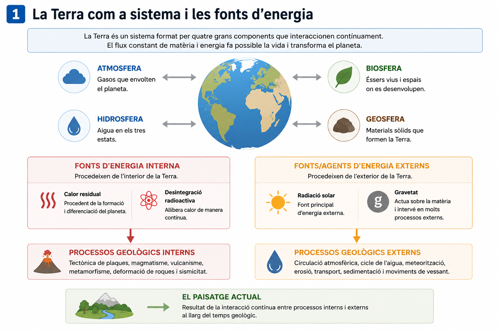

---

# 1. Com sabem què hi ha dins la Terra?

El radi mitjà de la Terra és d’uns **6.371 km**. En canvi, les perforacions humanes només han penetrat una fracció diminuta d’aquesta distància.

No hem observat directament el mantell profund ni el nucli terrestre.

Com podem saber, aleshores, que existeixen?

La resposta és una idea fonamental de les ciències de la Terra:

> **Podem conèixer estructures que no observam directament si les seves propietats produeixen efectes mesurables a la superfície.**

La major part del nostre coneixement sobre l’interior terrestre prové, per tant, de **proves indirectes**.

## 1.1. Mètodes directes i indirectes

Els mètodes d’estudi de l’interior terrestre es poden agrupar en dos grans tipus.

### Mètodes directes

Permeten estudiar directament materials procedents de la Terra.

Entre aquests mètodes trobam:

- l’estudi dels materials que afloren a la superfície;
- les mines i perforacions;
- les roques procedents de zones profundes que han estat elevades fins a la superfície;
- els materials transportats cap amunt pels magmes.

Algunes erupcions, per exemple, poden arrossegar fragments de roques de zones més profundes. Aquests fragments, anomenats **xenòlits**, aporten informació sobre materials que no aflorarien normalment.

Els mètodes directes tenen, però, una limitació evident: només permeten estudiar una part molt petita de la Terra.

### Mètodes indirectes

Permeten inferir les propietats de l’interior a partir dels seus efectes observables.

Entre les fonts d’informació indirecta hi ha:

- el comportament de les **ones sísmiques**;
- les variacions del camp gravitatori;
- el flux de calor procedent de l’interior;
- el camp magnètic terrestre;
- els experiments sobre minerals sotmesos a pressions i temperatures elevades.

També podem comparar la composició de la Terra amb la de determinats **meteorits**, que conserven informació sobre els materials a partir dels quals es varen formar els planetes del Sistema Solar.

Cap d’aquests mètodes proporciona tota la informació per si sol. La força dels models actuals de l’interior terrestre prové del fet que **diferents tipus d’evidències independents són compatibles entre si**.

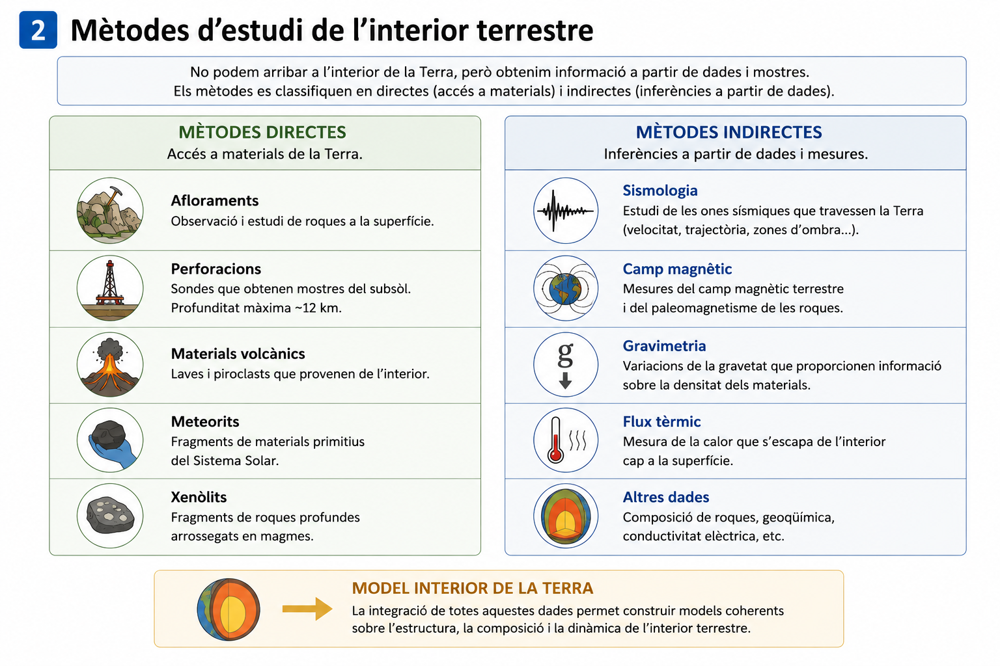

## 1.2. Els terratrèmols ens permeten explorar l’interior

Quan es produeix un terratrèmol, l’energia alliberada es propaga en forma d’**ones sísmiques**.

Aquestes ones travessen grans regions del planeta abans d’arribar a les estacions sísmiques que les enregistren.

El seu comportament depèn de les propietats dels materials que travessen. Per això, estudiar-ne:

- la velocitat;
- la trajectòria;
- l’arribada o absència a diferents estacions;

ens proporciona informació sobre l’interior terrestre.

És semblant al principi utilitzat en moltes tècniques mèdiques: **no observam directament l’estructura, però podem inferir-la estudiant com una ona la travessa**.

### Ones P

Les **ones P** o primàries són les ones sísmiques internes més ràpides.

Produeixen successives compressions i dilatacions del material en la mateixa direcció en què es propaga l’ona.

Es poden transmetre tant per:

- **sòlids**;
- com per **líquids**.

### Ones S

Les **ones S** o secundàries són més lentes.

Produeixen deformacions perpendiculars a la direcció de propagació.

A diferència de les ones P:

> **les ones S no es propaguen a través dels líquids.**

Aquesta propietat és especialment important per investigar l’interior de la Terra.

## 1.3. Les ones canvien quan canvia el medi

Les ones sísmiques no viatgen sempre a la mateixa velocitat ni segueixen necessàriament una trajectòria recta.

La seva velocitat depèn de les propietats físiques del material que travessen.

Quan una ona arriba a un límit entre dos materials amb propietats diferents, una part de l’energia pot:

- **reflectir-se**;
- **refractar-se**, és a dir, canviar de direcció i velocitat.

Per això, un canvi brusc en la velocitat o la trajectòria de les ones constitueix una evidència que **les propietats de l’interior també han canviat**.

Anomenam **discontinuïtats** les zones on es produeixen canvis importants en les propietats dels materials terrestres.

L’estudi d’aquestes discontinuïtats ha permès deduir que l’interior de la Terra **no és homogeni**, sinó que presenta regions diferenciades.

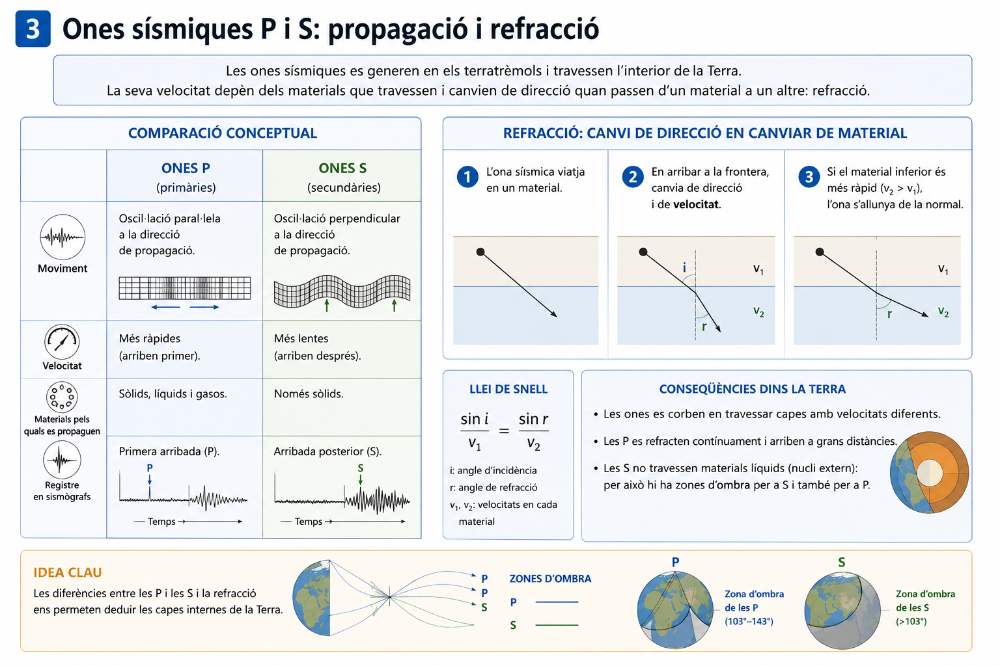

## 1.4. Les zones d’ombra: una evidència d’un nucli diferent del mantell

Si l’interior terrestre fos homogeni, podríem predir aproximadament com es propagarien les ones produïdes per un terratrèmol.

Però els registres reals mostren un patró diferent.

En determinades regions de la superfície terrestre:

- no es detecten ones S procedents directament del terratrèmol;
- les ones P presenten desviacions importants i existeix una regió en què no arriben directament.

Aquestes regions s’anomenen **zones d’ombra sísmica**.

L’absència d’ones S després d’haver travessat el límit entre mantell i nucli és una evidència especialment important. Com que les ones S no poden propagar-se pels líquids, podem inferir que:

> **el nucli extern de la Terra es troba en estat líquid.**

Les fortes refraccions experimentades per les ones P indiquen igualment un canvi important de propietats entre el mantell i el nucli.

Això mostra una diferència fonamental entre una observació i una inferència:

**Observació:** determinades ones arriben, canvien de trajectòria o no són detectades.

**Inferència:** a l’interior existeixen materials amb propietats i estats físics diferents.

## 1.5. Quan les dades no encaixen amb el model

Un model científic no és una còpia exacta de la realitat. És una representació que intenta explicar les observacions disponibles i fer prediccions.

Per això els models científics poden canviar.

Durant les primeres dècades del segle XX, les dades sísmiques havien permès proposar una Terra amb un **nucli líquid**. Aquest model explicava moltes de les observacions.

Però no totes.

Alguns registres mostraven ones P febles en zones on, segons un model amb un nucli completament uniforme, no s’esperava detectar-les.

La sismòloga danesa **Inge Lehmann** va analitzar aquestes dades i va proposar el 1936 que el nucli no era una única regió homogènia. A l’interior del nucli extern havia d’existir una altra regió amb propietats diferents capaç de modificar la trajectòria de les ones.

Observacions posteriors varen donar suport al model actual, que distingeix:

- un **nucli extern líquid**;
- un **nucli intern sòlid**.

Aquest cas il·lustra una característica fonamental de la ciència:

> **quan apareixen observacions que un model no explica satisfactòriament, el model s’ha de revisar.**

Això no significa necessàriament que el model anterior fos inútil. Sovint explicava correctament moltes observacions, però les noves dades mostraven que era **incomplet**.

## 1.6. Dos models per descriure l’interior terrestre

No existeix una única manera de dividir l’interior del planeta.

Podem construir diferents models segons la propietat que utilitzem per establir-ne les capes.

### Model geoquímic

Classifica l’interior principalment segons la **composició química** dels materials.

Distingeix:

- **escorça**;
- **mantell**;
- **nucli**.

L’escorça pot ser continental o oceànica, amb composicions i característiques diferents.

El mantell està format principalment per roques riques en silicats de magnesi i ferro.

El nucli és molt més ric en elements metàl·lics, especialment ferro.

### Model geodinàmic

Classifica l’interior segons el **comportament mecànic** dels materials.

Distingeix regions amb comportaments diferents, entre les quals destaquen:

- la **litosfera**, rígida;
- l’**astenosfera**, capaç de deformar-se lentament;
- les regions més profundes del mantell;
- el **nucli extern**, líquid;
- el **nucli intern**, sòlid.

> **Recorda:** l’escorça i la litosfera no són sinònims.

La litosfera inclou **tota l’escorça i una part del mantell superior**.

Tampoc hem d’imaginar l’astenosfera com un oceà de magma.

> **L’astenosfera és essencialment sòlida, però els seus materials poden deformar-se i fluir molt lentament a escala geològica.**

Un sòlid pot comportar-se de manera rígida a escala de segons i, al mateix temps, deformar-se durant milions d’anys.

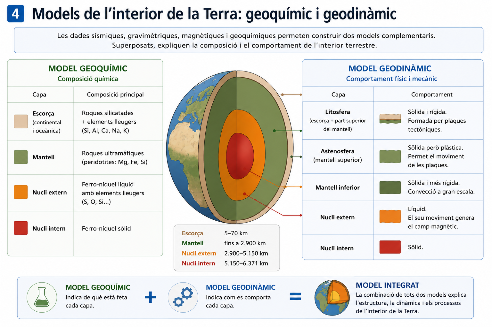

## 1.7. Un model sostingut per evidències

Quan representem l’interior terrestre amb capes ben delimitades és fàcil oblidar que ningú no les ha observades directament.

El model actual és el resultat de combinar moltes evidències:

**mostres de materials + sismologia + gravetat + flux tèrmic + magnetisme + experiments → model de l’interior terrestre**

Per això, en geologia és tan important diferenciar tres nivells:

**Observació**  
Allò que podem mesurar o registrar.

**Inferència**  
La interpretació que feim a partir de les observacions.

**Model**  
Una representació coherent que integra moltes observacions i inferències i permet explicar i predir fenòmens.

Els models científics no són simples opinions. Estan limitats per les evidències disponibles i han de ser compatibles amb les observacions. Al mateix temps, poden ser modificats si apareixen dades noves que no poden explicar.

---

# 2. Com construírem la teoria de la tectònica de plaques?

Avui sabem que la superfície rígida de la Terra està fragmentada en **plaques litosfèriques que es mouen unes respecte de les altres**. Aquest model permet explicar conjuntament la distribució dels terratrèmols i volcans, la formació de serralades, l’obertura i el tancament d’oceans i molts altres processos geològics.

Però aquesta explicació no va aparèixer de cop.

Durant dècades es varen acumular observacions procedents dels continents i, més endavant, dels oceans. Algunes encaixaven amb models anteriors; d’altres plantejaven problemes nous. El desenvolupament de tècniques per estudiar el fons oceànic i el magnetisme de les roques va proporcionar evidències que abans no estaven disponibles.

La tectònica de plaques és, per tant, un bon exemple de com es construeix el coneixement científic:

**observacions → hipòtesis → problemes → noves dades → revisió dels models → teoria més explicativa**

## 2.1. Els continents conserven indicis d’un passat diferent

Molt abans que existís la tectònica de plaques ja s’havien observat semblances entre continents avui separats per oceans.

Una de les més evidents és la correspondència aproximada entre alguns **marges continentals**, especialment a banda i banda de l’Atlàntic. Però l’encaix geomètric, per si sol, no demostra que els continents hagin estat units.

La hipòtesi guanya força quan observacions independents indiquen el mateix.

### Fòssils

S’han trobat fòssils dels mateixos organismes terrestres o d’aigua dolça en continents que actualment estan separats per grans oceans.

Si aquests organismes difícilment podien haver travessat un oceà, una possible explicació és que les terres on vivien haguessin estat connectades en el passat.

### Continuïtats geològiques

Algunes serralades, tipus de roques i estructures geològiques situades en continents diferents mostren edats i característiques compatibles.

Quan reconstruïm la posició antiga dels continents, algunes d’aquestes estructures formen conjunts més continus.

### Evidències paleoclimàtiques

Les roques també conserven indicadors dels climes del passat.

Per exemple, podem trobar evidències d’antigues glaciacions en regions que actualment tenen climes càlids, o sediments formats en ambients tropicals en zones avui situades a latituds molt diferents.

Aquestes observacions poden explicar-se si **els continents han canviat de posició al llarg del temps geològic**.

> **Una sola coincidència pot tenir diverses explicacions. La força d’una hipòtesi augmenta quan diferents tipus d’evidències independents convergeixen en una mateixa interpretació.**

## 2.2. Wegener i la deriva continental

A començaments del segle XX, **Alfred Wegener** va reunir diferents evidències i va defensar que els continents no havien ocupat sempre la seva posició actual.

Segons la seva proposta, els continents actuals havien format en el passat masses continentals més grans que posteriorment s’havien fragmentat i separat. Aquesta idea es coneix com a **deriva continental**.

La hipòtesi permetia explicar conjuntament:

- la correspondència entre marges continentals;
- la distribució de determinats fòssils;
- la continuïtat d’algunes estructures geològiques;
- diverses evidències paleoclimàtiques.

Però hi havia un problema important:

> **Quin mecanisme podia moure continents sencers?**

Les forces proposades per Wegener no proporcionaven una explicació física satisfactòria del moviment.

Això és important per entendre com funciona la ciència. Les evidències de Wegener **no varen deixar de ser rellevants** perquè el mecanisme proposat fos insuficient. El que passava és que la hipòtesi encara no constituïa una explicació completa de la dinàmica terrestre.

Per avançar feien falta dades que en aquella època encara no teníem.

## 2.3. El fons oceànic deixa de ser una regió desconeguda

Durant molt de temps es coneixia molt millor la geologia dels continents que la dels oceans.

El desenvolupament de tècniques de **mesura de la profunditat oceànica** va permetre obtenir grans quantitats de dades i construir mapes cada vegada més detallats del relleu submarí.

Aquests mapes varen revelar que el fons oceànic no era una plana uniforme.

Hi apareixien grans estructures com:

- **dorsals oceàniques**, llargues serralades submarines;
- profundes **fosses oceàniques**;
- grans fractures;
- extenses planes abissals.

Una de les contribucions destacades a aquesta cartografia va ser la de la geòloga i cartògrafa **Marie Tharp**.

Treballant amb nombroses mesures de profunditat de l’Atlàntic, Tharp va reconstruir el perfil del fons oceànic i va identificar una depressió central associada a la dorsal mesoatlàntica.

La comparació posterior amb la distribució dels terratrèmols mostrava que moltes localitzacions sísmiques coincidien amb aquesta gran estructura.

La importància d’aquest resultat no consistia simplement a haver descobert una nova forma de relleu:

> **el fons oceànic mostrava senyals d’activitat tectònica.**

Les noves tècniques havien fet visible una part del planeta que fins aleshores coneixíem molt poc.

## 2.4. El fons oceànic es forma i es renova

Les investigacions posteriors varen aportar una altra dada sorprenent: **les roques del fons oceànic no tenen totes la mateixa edat**.

A les dorsals trobam les roques oceàniques més joves.

A mesura que ens allunyam de la dorsal:

- l’edat de l’escorça oceànica augmenta;
- els sediments que la cobreixen tendeixen a ser més antics i més gruixuts.

Aquest patró és coherent amb un procés d’**expansió del fons oceànic**.

A les dorsals ascendeixen materials des de zones més profundes. Es produeix magma que es refreda i origina **nova litosfera oceànica**.

Aquesta nova litosfera es va allunyant progressivament de la dorsal mentre se’n forma més.

Podem resumir-ho així:

**dorsal → formació de nova litosfera → separació progressiva → augment de l’edat amb la distància**

Aquesta explicació proporcionava el mecanisme que faltava a la idea inicial de mobilitat continental.

Els continents no necessitaven obrir-se pas de manera independent a través d’un fons oceànic immòbil:

> **continents i fons oceànic formen part d’unitats litosfèriques que es desplacen.**

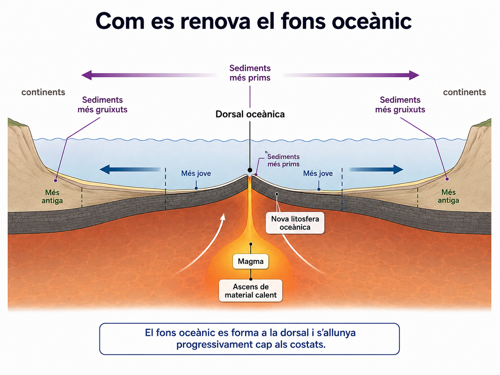

## 2.5. Les roques oceàniques enregistren el camp magnètic

Una de les evidències més potents de l’expansió oceànica prové del **paleomagnetisme**.

Alguns minerals de les roques ígnies contenen partícules magnètiques. Quan una roca volcànica es refreda, aquests minerals poden conservar informació sobre l’orientació del camp magnètic terrestre existent en aquell moment.

El camp magnètic terrestre no ha mantingut sempre la mateixa polaritat.

Al llarg de la història de la Terra s’han produït nombroses **inversions magnètiques**.

Quan es varen mesurar les propietats magnètiques de les roques del fons oceànic, es va observar una successió de bandes amb polaritat diferent.

El patró tenia una característica especialment significativa:

> **les bandes magnètiques presentaven una disposició aproximadament simètrica als dos costats de les dorsals.**

Això és exactament el que esperaríem si:

1. es forma nova roca a la dorsal;
2. aquesta roca registra la polaritat magnètica del moment;
3. la litosfera es desplaça cap als costats;
4. una nova inversió queda registrada en les roques que es formen posteriorment.

Per tant:

**inversions del camp magnètic + bandes simètriques → evidència d’expansió del fons oceànic**

L’edat de les roques proporciona una segona comprovació independent: també és aproximadament simètrica i augmenta en allunyar-nos de l’eix de la dorsal.

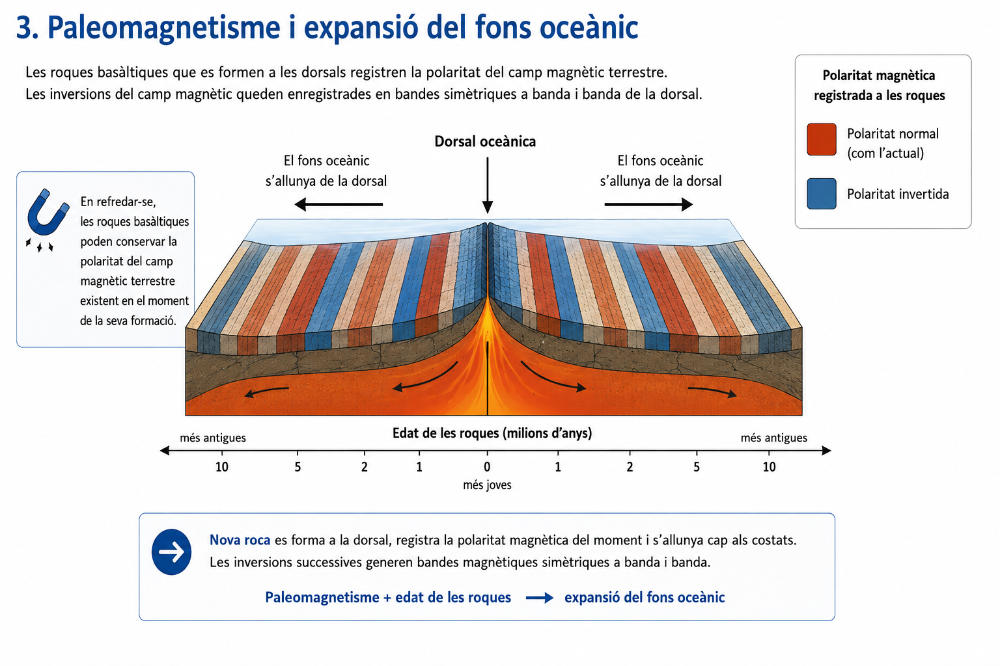

## 2.6. Terratrèmols i volcans dibuixen els límits de les plaques

Una altra evidència important prové de la distribució mundial de la **sismicitat i el vulcanisme**.

Si situam en un mapa molts terratrèmols i volcans, observam que no es distribueixen uniformement per tota la superfície terrestre.

Es concentren principalment en llargues franges.

Moltes d’aquestes franges coincideixen amb:

- dorsals oceàniques;
- fosses;
- grans sistemes de falles;
- zones de formació de serralades.

Aquest patró permet delimitar grans fragments de litosfera:

> **les plaques tectòniques.**

La tectònica de plaques integra així observacions que inicialment s’havien estudiat per separat:

**mobilitat continental + relleu oceànic + expansió del fons + paleomagnetisme + sismicitat + vulcanisme**

Un bon model científic és valuós precisament perquè **explica moltes observacions diferents amb un mateix conjunt de principis**.

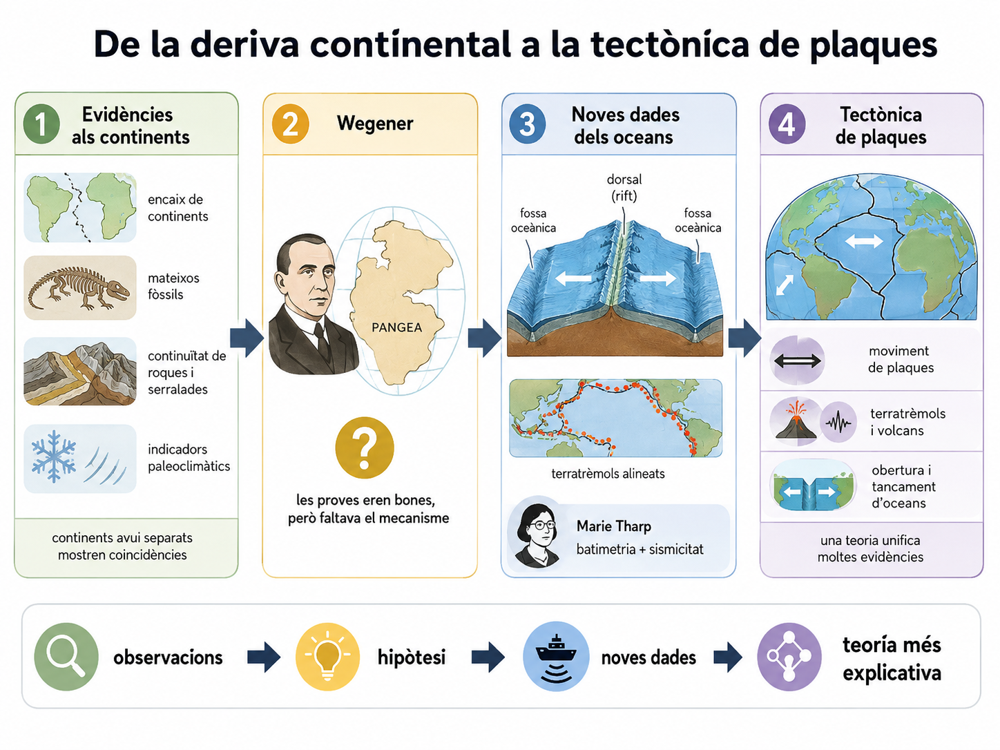

## 2.7. La tectònica de plaques: un model unificador

Segons la teoria de la tectònica de plaques, la **litosfera** està fragmentada en plaques que es desplacen unes respecte de les altres sobre zones del mantell que poden deformar-se lentament.

El moviment relatiu de les plaques concentra gran part de l’activitat geològica als seus límits.

### Recorda de 4t d’ESO

| Tipus de límit | Moviment relatiu | Conseqüències generals |
|---|---|---|
| **Divergent** | Les plaques se separen | Dorsals o rifts, formació de litosfera, vulcanisme i sismicitat superficial |
| **Convergent** | Les plaques s’aproximen | Subducció o col·lisió, serralades, sismicitat i vulcanisme segons el context |
| **Transformant** | Les plaques llisquen lateralment | Falles i sismicitat |

En aquesta unitat **no ens interessa simplement memoritzar aquesta classificació**.

El que ens interessarà a partir d’ara és utilitzar-la per respondre preguntes com:

- Per què es forma magma en unes zones i no en unes altres?
- Per què alguns terratrèmols són superficials i altres molt profunds?
- Per què determinats límits originen serralades?
- Quines roques podem esperar trobar en cada context?

És a dir, passarem de **conèixer el model** a **utilitzar-lo per explicar i predir processos geològics**.

## 2.8. La ciència no avança com una successió de descobriments individuals

La història de la tectònica de plaques podria explicar-se com una llista de noms:

**Wegener → Tharp → altres investigadors → tectònica de plaques.**

Però aquesta representació seria enganyosa.

La teoria actual va ser possible perquè es varen combinar contribucions procedents de camps diferents:

- geologia continental;
- paleontologia;
- climatologia del passat;
- oceanografia;
- cartografia;
- sismologia;
- geofísica;
- paleomagnetisme.

També varen ser indispensables noves **tecnologies i recursos**:

- vaixells oceanogràfics;
- sistemes de mesura de profunditat;
- xarxes de sismògrafs;
- instruments per mesurar el magnetisme de les roques;
- capacitat per gestionar i representar grans quantitats de dades.

Marie Tharp n’és un exemple especialment clar. Gran part de la seva aportació consistí a **convertir moltes dades de profunditat disperses en una representació coherent del fons oceànic**. Aquesta interpretació va permetre reconèixer estructures que les mesures individuals no mostraven per si soles.

La construcció de la tectònica de plaques ens mostra així diverses característiques del treball científic:

- el coneixement es construeix **col·lectivament**;
- diferents disciplines aporten evidències complementàries;
- els avenços depenen també dels instruments i recursos disponibles;
- les dades noves poden obligar a revisar explicacions anteriors;
- una teoria científica es manté mentre continua essent compatible amb les evidències i té una elevada capacitat explicativa.

Per això, passar de la deriva continental a la tectònica de plaques no significa simplement que una teoria «incorrecta» fos substituïda per una de «correcta».

La idea de mobilitat continental va aportar una part important del problema. Les noves dades varen permetre entendre **un sistema molt més ampli**, en el qual també es mou i es renova la litosfera oceànica.

> **La ciència avança quan les evidències permeten conservar allò que un model explica bé, corregir-ne les limitacions i construir explicacions amb més capacitat de predicció.**

---

# 3. Com transforma els materials una Terra activa?

La tectònica de plaques no només modifica la posició dels continents i genera relleus. També crea condicions de **pressió, temperatura, deformació i circulació de fluids** que poden transformar profundament els materials terrestres.

Una roca pot fondre parcialment i originar magma, cristal·litzar de nou, transformar-se en estat sòlid o acabar exposada a la superfície i ser alterada pels processos externs.

Per tant, les roques no són materials permanents:

> **les seves característiques conserven informació sobre els processos i les condicions en què s’han format o transformat.**

Això ens permet fer el raonament en els dos sentits:

**context geològic → processos esperables → materials resultants**

però també:

**característiques d’una roca → procés de formació → possible context geològic**

## 3.1. Utilitzar la tectònica per fer prediccions

Ja coneixem els principals tipus de límits de plaques. Ara ens interessa utilitzar aquest model per predir què pot passar amb els materials.

En una **dorsal oceànica**, per exemple:

- les plaques se separen;
- ascendeixen materials del mantell;
- disminueix la pressió;
- es pot produir fusió parcial;
- el magma ascendeix i cristal·litza;
- es forma nova litosfera oceànica.

En una **zona de subducció**:

- una placa oceànica s’enfonsa;
- augmenten la pressió i la temperatura;
- s’alliberen aigua i altres volàtils;
- es pot generar magma al mantell situat sobre la placa subduïda;
- es produeixen metamorfisme, deformació, sismicitat i sovint vulcanisme.

En una **col·lisió continental**, en canvi, predominen:

- l’engruiximent de l’escorça;
- la deformació;
- l’augment de pressió i temperatura;
- el metamorfisme;
- la formació de grans relleus.

Per tant, conèixer el context tectònic ens permet formular **prediccions contrastables** sobre els processos i les roques que hi podem trobar.

> **Recorda:** no totes les vores convergents produeixen exactament els mateixos fenòmens. Una subducció oceànica i una col·lisió entre dos continents són totes dues convergents, però les condicions i els processos resultants són diferents.

## 3.2. Per què es formen els magmes?

Una idea molt habitual és pensar:

> «Una roca fon perquè la temperatura augmenta molt.»

Això pot passar, però **no és l’única manera de generar magma**.

La fusió d’una roca depèn de diverses variables, especialment:

- la temperatura;
- la pressió;
- la composició;
- la presència d’aigua i altres volàtils.

En la majoria de contextos geològics no es fon tota la roca. Es produeix una **fusió parcial**: només una part dels minerals arriba a fondre’s.

Podem distingir tres mecanismes principals.

### Fusió per descompressió

Els materials del mantell poden ascendir fins a zones amb **menor pressió**.

Encara que la seva temperatura no augmenti, la disminució de pressió pot permetre que una part del material comenci a fondre’s.

Aquest mecanisme és especialment important a les **dorsals oceàniques**.

Simplificadament:

**ascens del mantell → disminució de pressió → fusió parcial**

### Fusió per incorporació de volàtils

L’aigua i altres substàncies volàtils poden facilitar la fusió de les roques.

A les zones de subducció, la placa oceànica que s’enfonsa experimenta transformacions que alliberen **aigua i altres volàtils**. Aquests fluids ascendeixen cap al mantell situat per damunt i redueixen la temperatura necessària perquè alguns minerals comencin a fondre’s.

Per tant, és important evitar una simplificació freqüent:

> **la placa que subdueix no simplement «es fon» i produeix els volcans.**

Una part important del magma es genera per **fusió parcial del mantell situat sobre la placa subduïda**, afavorida pels volàtils que aquesta allibera.

### Fusió per aportació de calor

Un material calent, com un magma, pot transferir energia a les roques que l’envolten.

Si la temperatura augmenta prou, pot provocar-ne la fusió parcial.

Aquest mecanisme pot tenir una importància especial dins l’escorça continental.

### Tres mecanismes, una mateixa conseqüència

Per tant:

**descompressió**  
**+ incorporació de volàtils**  
**+ aportació de calor**

poden, en contextos diferents, afavorir:

**roca sòlida → fusió parcial → magma**

Aquests mecanismes no són necessàriament excloents. En una situació geològica real en poden actuar diversos alhora.

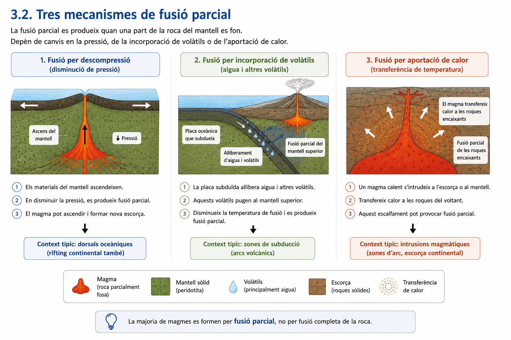

## 3.3. Del magma a les roques ígnies

El **magma** és una mescla de material fos, cristalls i substàncies volàtils situada a l’interior terrestre.

Quan arriba a la superfície, el material fos rep el nom de **lava**.

Quan el magma o la lava es refreden, els minerals cristal·litzen i es formen **roques ígnies o magmàtiques**.

Però el resultat no és igual si el refredament té lloc a gran profunditat o a la superfície.

### Refredament lent

Un magma que queda a l’interior de la Terra pot tardar molt de temps a refredar-se.

Els cristalls disposen de més temps per créixer i, habitualment, es formen roques amb **cristalls visibles de mida relativament gran**.

Són roques **plutòniques o intrusives**.

### Refredament ràpid

Una lava que arriba a la superfície perd calor molt més ràpidament.

Els cristalls tenen poc temps per créixer i la roca presenta habitualment **cristalls molt petits**, que poden no ser visibles a simple vista.

Són roques **volcàniques o extrusives**.

Per tant, la textura d’una roca pot conservar informació sobre la seva història:

**cristalls grossos → refredament relativament lent**

**cristalls petits → refredament relativament ràpid**

Aquesta relació és una tendència general. La textura final també depèn de la composició del magma, de la nucleació dels cristalls i d’altres condicions de cristal·lització.

### Un exemple: basalt i gabre

El **basalt** i el **gabre** poden tenir composicions minerals semblants, però textures molt diferents.

El basalt és una roca volcànica que es refreda ràpidament.

El gabre és una roca plutònica que cristal·litza lentament en profunditat.

Per això:

> **tenir minerals semblants no implica tenir la mateixa textura ni la mateixa història de formació.**

Una roca no s’interpreta només identificant de què està composta. També hem d’observar **com estan disposats i quina mida tenen els seus minerals**.

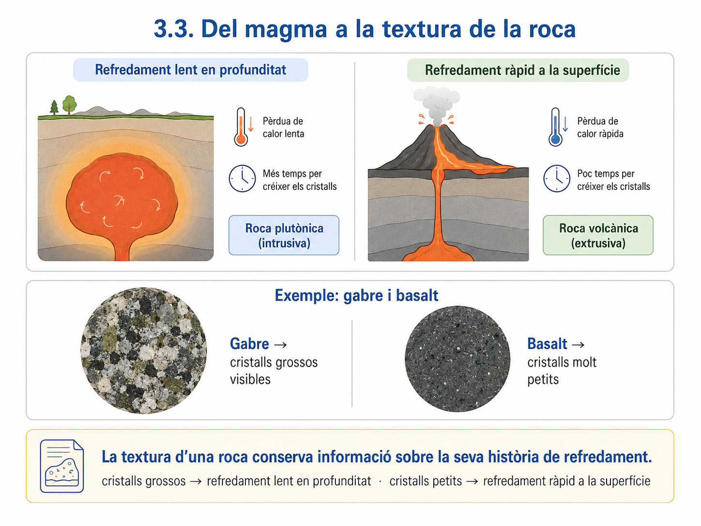

## 3.4. Metamorfisme: transformar una roca sense fondre-la

Una roca no necessita fondre’s per experimentar transformacions profundes.

El **metamorfisme** és el conjunt de canvis mineralògics i estructurals que experimenta una roca **en estat sòlid** quan queda sotmesa a unes condicions diferents de les de la seva formació.

Els principals factors metamòrfics són:

- augment de **temperatura**;
- augment o modificació de la **pressió**;
- **deformació**;
- circulació de **fluids**.

Els minerals que eren estables en unes condicions poden deixar de ser-ho i formar-ne de nous. Els cristalls també poden recristal·litzar, créixer o orientar-se.

La idea essencial és:

> **metamorfisme ≠ fusió**

Si la roca arriba a fondre’s, ja passam a processos magmàtics.

### Metamorfisme regional

Afecta grans extensions de roca.

És especialment habitual en zones de convergència, on els materials poden quedar:

- enterrats a gran profunditat;
- sotmesos a pressions i temperatures elevades;
- intensament deformats.

En alguns casos, la pressió i la deformació orienten els minerals i originen una estructura planar anomenada **foliació**.

Aquest tipus de metamorfisme està molt relacionat amb la formació de serralades.

### Metamorfisme de contacte

Quan un magma calent s’introdueix dins roques més fredes, transfereix calor als materials que l’envolten.

Les roques pròximes a la intrusió poden experimentar metamorfisme sense arribar a fondre’s.

En aquest cas, el factor dominant és sobretot l’augment de **temperatura**.

La intensitat de la transformació tendeix a disminuir en allunyar-nos de la intrusió.

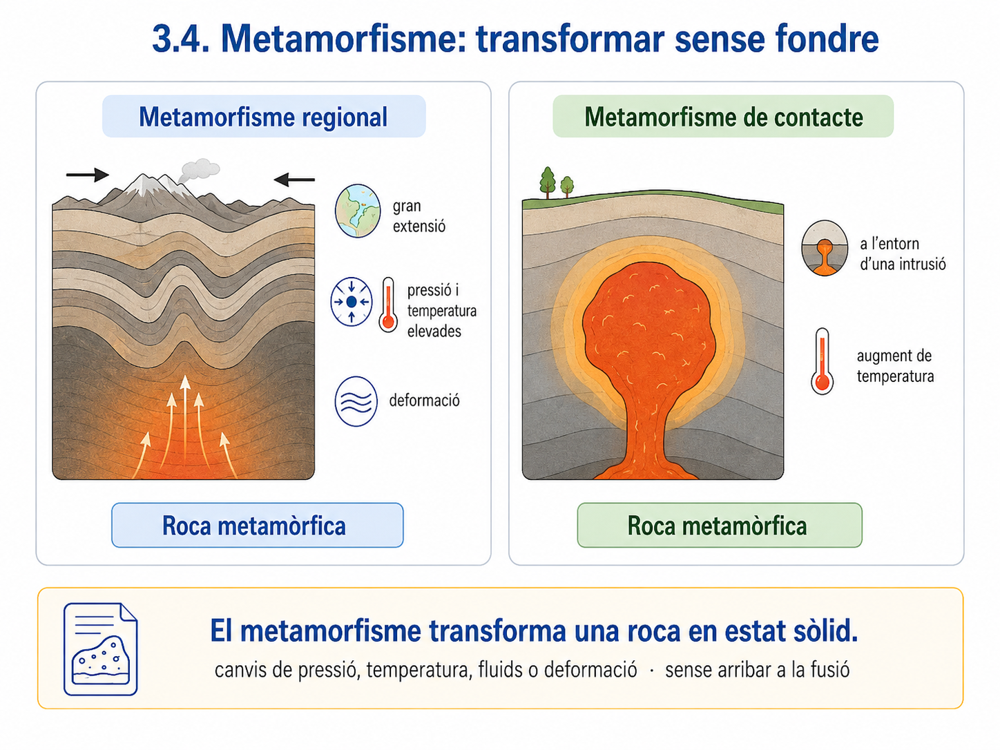

## 3.5. Minerals: els components de moltes roques

Una roca està formada habitualment per un o més **minerals**.

Un mineral és un sòlid natural amb:

- una estructura interna ordenada o **cristal·lina**;
- una determinada composició química, que pot variar dins certs marges;
- propietats físiques característiques.

Per exemple, dues mostres de minerals poden tenir un color semblant i, tanmateix, ser substàncies completament diferents.

Per això:

> **el color, per si sol, sol ser una propietat poc fiable per identificar un mineral.**

La identificació es basa en la combinació de diverses propietats.

### Duresa

És la resistència que presenta un mineral a ser ratllat.

La duresa relativa es pot comparar mitjançant l’**escala de Mohs**, que va de:

**1 · talc**

fins a

**10 · diamant**

En una identificació pràctica no sempre necessitam conèixer el valor exacte. Sovint basta comprovar, per exemple, si:

- es ratlla amb l’ungla;
- pot ratllar el vidre.

### Ratlla

És el color de la pols fina que deixa el mineral quan es frega sobre una superfície adequada.

Pot ser molt més característica que el color extern de la mostra.

### Lluïssor

Descriu la manera com la superfície reflecteix la llum.

Podem distingir, de manera senzilla:

- lluïssor metàl·lica;
- lluïssor no metàl·lica.

### Exfoliació i fractura

Alguns minerals es trenquen seguint superfícies planes relacionades amb la seva estructura cristal·lina.

Això és l’**exfoliació**.

Altres es trenquen de manera més irregular: parlam de **fractura**.

### Altres propietats

En determinats minerals poden resultar especialment útils:

- la densitat;
- el magnetisme;
- la reacció amb determinades substàncies;
- la forma dels cristalls.

No totes les proves serveixen per a tots els minerals.

La identificació correcta consisteix a cercar **la combinació d’evidències que discrimina millor entre diferents possibilitats**.

## 3.6. La composició química també permet classificar els minerals

A més de les propietats físiques, els minerals es poden agrupar segons la seva **composició química i estructura**.

Alguns grups importants són:

| Grup | Característica general |
|---|---|
| **Silicats** | Contenen estructures basades en silici i oxigen |
| **Carbonats** | Contenen el grup carbonat |
| **Sulfats** | Contenen el grup sulfat |
| **Òxids** | Contenen oxigen combinat amb altres elements |
| **Sulfurs** | Contenen sofre combinat amb elements, sovint metàl·lics |
| **Halurs** | Contenen halògens combinats amb altres elements |
| **Elements natius** | Formats principalment per un únic element químic |

Els **silicats** són especialment abundants a l’escorça i al mantell.

No és necessari identificar un mineral només a partir de la seva fórmula química. En geologia de camp o de laboratori sovint combinam:

**propietats físiques + composició + context geològic**

per arribar a una identificació fiable.

## 3.7. Les roques es classifiquen segons el seu origen

Una **roca** és un material geològic natural constituït generalment per un agregat d’un o més minerals.

Una roca no té necessàriament una composició química fixa.

Segons el procés que les origina, distingim tres grans grups.

| Tipus de roca | Procés principal |
|---|---|
| **Ígnia o magmàtica** | Cristal·lització d’un magma o una lava |
| **Sedimentària** | Acumulació i transformació de sediments o precipitació/acumulació de materials |
| **Metamòrfica** | Transformació en estat sòlid d’una roca preexistent |

En aquest bloc ja hem estudiat dues d’aquestes famílies:

**magmàtiques** → relacionades amb la cristal·lització de magmes;

**metamòrfiques** → relacionades amb transformacions en estat sòlid.

Les **roques sedimentàries** les comprendrem millor quan estudiem els processos geològics externs: meteorització, erosió, transport i sedimentació.

Aquesta distribució és deliberada: en lloc de memoritzar tres llistes de roques, relacionam cada grup amb **els processos que realment les formen**.

## 3.8. Les roques formen part d’un sistema de transformacions

Les roques poden experimentar moltes transformacions durant la història geològica.

Una roca exposada a la superfície pot:

**meteoritzar-se → erosionar-se → produir sediments.**

Els sediments poden:

**dipositar-se → compactar-se i cimentar-se → formar roca sedimentària.**

Una roca enterrada pot:

**experimentar metamorfisme → formar una roca metamòrfica.**

Si les condicions permeten la fusió:

**roca → magma.**

I quan aquest magma cristal·litza:

**magma → roca ígnia.**

Aquest conjunt de transformacions constitueix el **cicle litològic**.

Però el terme *cicle* pot provocar una idea equivocada.

> **No existeix una ruta única que totes les roques hagin de seguir.**

Una roca ígnia pot meteoritzar-se directament, transformar-se metamòrficament, tornar-se a fondre o quedar sense canvis durant milions d’anys.

Per això és millor imaginar el cicle litològic com una **xarxa de transformacions possibles** que no com una roda amb una seqüència obligatòria.

La matèria rocosa es reutilitza contínuament, però els camins depenen de la història geològica que experimenta cada material.

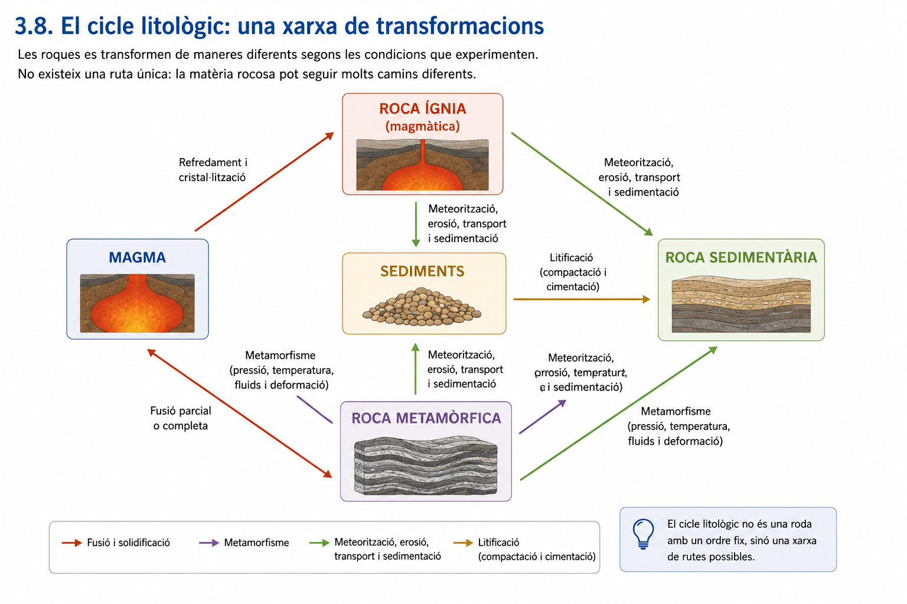

### Idea que connecta tot el bloc

**context tectònic**  
↓  
**condicions de pressió, temperatura, fluids i deformació**  
↓  
**fusió, cristal·lització o metamorfisme**  
↓  
**minerals, textures i roques**  
↓  
**evidències que ens permeten reconstruir el procés**

---

# 4. Com es transforma el paisatge?

Quan observam un paisatge, veim el resultat d’una història.

Una vall, un penya-segat, una cova o una platja no depenen d’un únic procés. La seva forma és el resultat de la interacció entre la **geologia del terreny**, el clima, l’aigua, l’atmosfera, la gravetat, els éssers vius i el temps.

En el bloc anterior hem vist que els processos interns poden formar i deformar roques, elevar serralades o generar nova litosfera. Però aquests relleus comencen a ser transformats des del mateix moment que queden exposats a la superfície.

Per això és massa simple afirmar que:

> els processos interns construeixen el relleu i els externs el destrueixen.

Els processos externs **transformen i redistribueixen els materials**. Poden rebaixar unes zones, però els sediments transportats s’acumulen en unes altres i poden arribar a originar noves roques.

El paisatge és, per tant, el resultat d’una interacció contínua.

## 4.1. L’atmosfera: molt més que l’aire que respiram

L’**atmosfera** és l’embolcall gasós que envolta la Terra.

La seva composició està dominada pel nitrogen i l’oxigen, però també conté altres gasos en proporcions molt menors, vapor d’aigua i partícules en suspensió.

L’atmosfera desenvolupa funcions essencials. Proporciona gasos necessaris per als éssers vius, contribueix a regular la temperatura terrestre, participa en el cicle de l’aigua i protegeix parcialment la superfície de radiacions solars perjudicials i de l’arribada de petits materials extraterrestres.

Per estudiar-ne l’estructura es distingeixen diverses capes segons com varia la temperatura amb l’altitud.

### La troposfera

És la capa més baixa i està en contacte amb la superfície.

Conté la major part de la massa de l’atmosfera i **la major part del vapor d’aigua atmosfèric**. Per això és la capa on tenen lloc la major part dels fenòmens meteorològics: formació de niguls, precipitacions, vents i tempestes.

En general, dins la troposfera la temperatura disminueix amb l’altitud.

### L’estratosfera

Es troba per damunt de la troposfera.

Conté la major part de l’**ozó atmosfèric**, que absorbeix una part important de la radiació ultraviolada procedent del Sol.

A diferència de la troposfera, dins bona part de l’estratosfera la temperatura augmenta amb l’altitud a causa de l’absorció d’aquesta radiació.

Per damunt hi ha altres capes —mesosfera i termosfera, entre d’altres—, però no necessitam estudiar-les amb el mateix detall per comprendre la dinàmica geològica superficial.

## 4.2. Per què es mou l’atmosfera?

La superfície terrestre **no rep la mateixa quantitat d’energia solar a tot arreu**.

Aquesta distribució desigual de l’energia provoca diferències de temperatura i pressió. L’aire més calent tendeix a ascendir i l’aire més fred i dens pot ocupar el seu lloc.

A escala local i global, aquests contrastos contribueixen a generar la **circulació atmosfèrica**.

Aquesta circulació redistribueix:

**energia + vapor d’aigua**

i condiciona les precipitacions, l’evaporació i, en conseqüència, molts dels processos que transformen la superfície terrestre.

L’atmosfera no erosiona necessàriament una roca directament. Però la seva dinàmica condiciona la temperatura, les precipitacions, el vent i la disponibilitat d’aigua, i aquests factors controlen molts processos de meteorització i erosió.

## 4.3. La hidrosfera: aigua en moviment

La **hidrosfera** inclou tota l’aigua de la Terra, independentment de l’estat o del lloc on es trobi.

La major part és aigua salada dels oceans. L’aigua dolça constitueix una fracció molt menor i es troba principalment en:

- gel i neu;
- aigües subterrànies;
- llacs i rius;
- atmosfera;
- éssers vius.

Però aquesta distribució no és estàtica.

L’aigua circula contínuament entre oceans, atmosfera, continents, subsòl i éssers vius mitjançant el **cicle de l’aigua**.

L’energia solar afavoreix l’evaporació. El vapor es pot condensar i originar precipitació. Una vegada arriba a la superfície continental, l’aigua pot seguir camins diferents.

Una part circula per damunt del terreny: és l’**escorrentia superficial**.

Una altra penetra dins el sòl o les roques: és la **infiltració**. Si continua descendint a través dels materials, pot alimentar les aigües subterrànies.

La **gravetat** és fonamental en aquesta circulació: fa que l’aigua i molts dels materials que transporta tendeixin a desplaçar-se cap a zones de menor altitud.

Per això, el cicle de l’aigua és també un dels grans motors del modelatge del relleu.

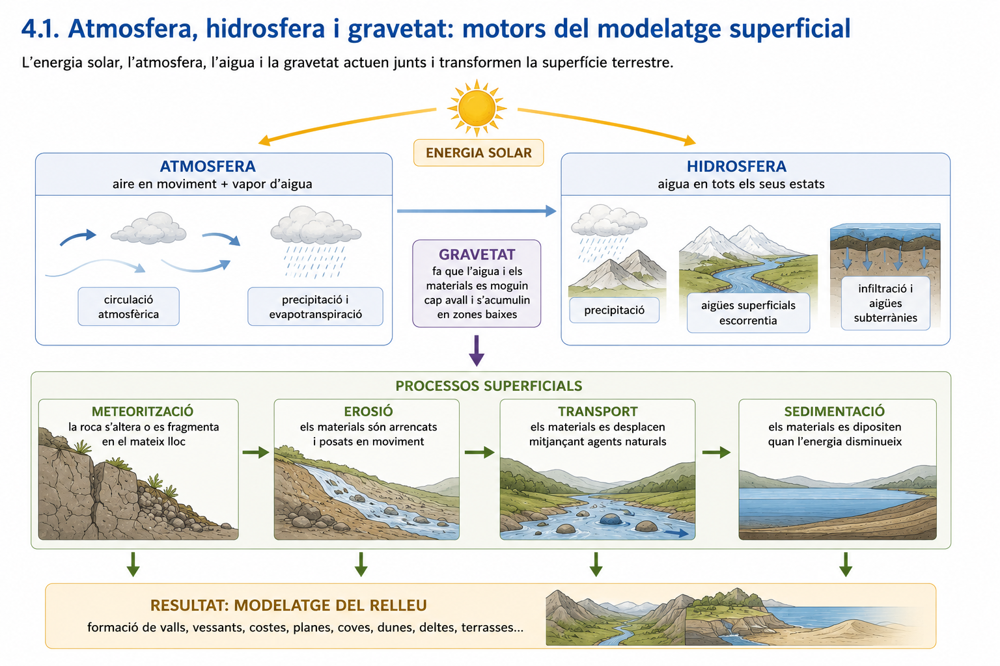

## 4.4. Meteorització: transformar la roca sense transportar-la

Una roca exposada a la superfície entra en contacte amb aigua, aire, canvis de temperatura i organismes.

Aquests factors poden provocar-ne la desintegració o l’alteració.

Anomenam **meteorització** el conjunt de processos que transformen les roques **en el lloc on es troben**.

Aquesta darrera idea és essencial:

> **meteorització no implica necessàriament transport.**

Podem distingir dos grans tipus.

### Meteorització física

La roca es fragmenta sense que canviï substancialment la composició química dels minerals.

Pot produir-se, per exemple, per canvis de temperatura, creixement de cristalls en fractures, descompressió o acció mecànica de les arrels.

Una roca molt fracturada presenta més superfície exposada i pot ser alterada posteriorment amb més facilitat.

### Meteorització química

Els minerals de la roca experimenten transformacions químiques.

L’aigua hi té un paper fonamental perquè pot actuar com a dissolvent i participar en reaccions químiques.

Entre els processos de meteorització química hi ha la dissolució, l’oxidació i altres reaccions que poden transformar uns minerals en altres.

La meteorització física i la química **no actuen necessàriament per separat**. La fragmentació pot facilitar les reaccions químiques i aquestes poden debilitar la roca i afavorir-ne la fragmentació.

Els organismes també poden intervenir en tots dos tipus de processos.

## 4.5. Meteorització, erosió, transport i sedimentació no són sinònims

Aquests quatre conceptes descriuen processos diferents i convé distingir-los amb precisió.

**Meteorització**  
La roca s’altera o es fragmenta *in situ*.

**Erosió**  
Els materials són arrencats o remobilitzats de la seva posició.

**Transport**  
Els materials erosionats es desplacen.

**Sedimentació**  
Els materials transportats s’acumulen o es dipositen.

Podem imaginar, per exemple, un aflorament fracturat al vessant d’una muntanya.

Primer, l’aigua i els canvis ambientals poden meteoritzar-lo. Alguns fragments poden ser arrencats i incorporats a un torrent: erosió. El torrent els desplaça: transport. Quan disminueix la seva capacitat per transportar-los, els fragments poden quedar dipositats: sedimentació.

Però aquesta seqüència **no és una cadena rígida que s’hagi de complir sempre de principi a fi**.

Un material pot meteoritzar-se i continuar al mateix lloc durant molt de temps. Un sediment ja dipositat pot tornar a ser erosionat. Els materials poden experimentar diversos episodis de transport i sedimentació.

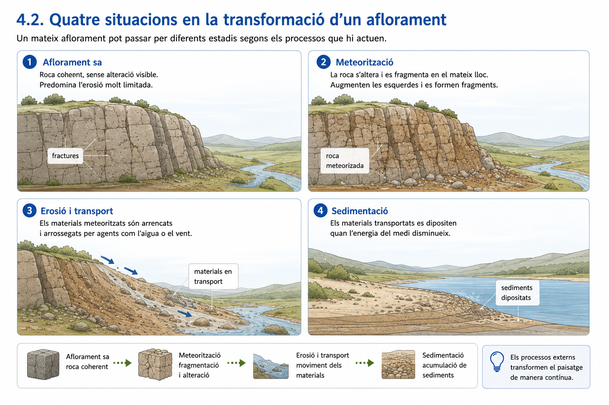

## 4.6. Els agents geològics externs

Diversos agents poden erosionar, transportar i dipositar materials.

La relació important no és memoritzar una llista de formes, sinó comprendre:

> **agent → procés → forma de relleu resultant**

| Agent dominant | Alguns processos | Exemples de formes resultants |
|---|---|---|
| **Aigua superficial** | erosió, transport i sedimentació fluvial | valls, barrancs, planes al·luvials |
| **Aigua subterrània** | dissolució i precipitació | formes càrstiques |
| **Mar** | onatge, corrents, erosió i sedimentació | penya-segats, platges |
| **Gel** | erosió i transport glacial | valls glacials, dipòsits morènics |
| **Vent** | deflació, abrasió i transport | dunes i altres formes eòliques |
| **Gravetat** | caigudes, lliscaments i fluxos | modelatge de vessants |

Aquestes associacions són orientatives. En un mateix paisatge poden actuar diversos agents simultàniament.

Per exemple, en un penya-segat litoral poden intervenir l’onatge, la meteorització de la roca, l’aigua de pluja i la gravetat.

Per tant, interpretar un paisatge consisteix sovint a identificar **quin conjunt de processos explica millor les observacions**, no a cercar una única causa.

## 4.7. La roca també condiciona el paisatge

Dues zones sotmeses a un clima semblant poden desenvolupar paisatges molt diferents.

Això passa perquè les roques no responen igual davant els agents externs.

Algunes propietats especialment importants són:

**resistència mecànica**, que condiciona la facilitat amb què el material es fragmenta o erosiona;

**fracturació**, perquè les fractures faciliten l’entrada d’aigua i poden debilitar la roca;

**porositat i permeabilitat**, que condicionen com circula l’aigua;

**composició mineralògica**, que determina quines reaccions químiques poden tenir lloc;

i **susceptibilitat a la dissolució**, especialment important en determinades roques.

Aquesta relació entre **litologia i processos** explica que el paisatge no depengui només del clima.

> **mateix agent + roques diferents → respostes diferents**

Però també:

> **mateixa roca + climes diferents → intensitats i processos diferents.**

És la interacció entre factors, no una propietat aïllada, la que acaba produint el relleu.

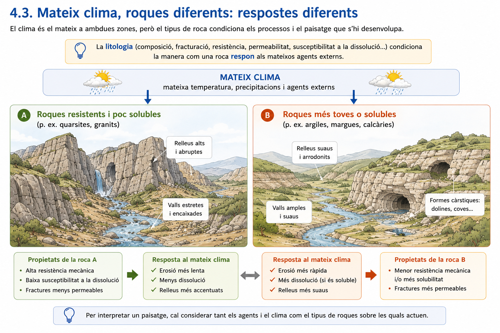

## 4.8. Un cas especialment important: el modelatge càrstic

Les **calcàries** estan constituïdes principalment per calcita, un mineral format per carbonat de calci.

L’aigua de pluja pot incorporar diòxid de carboni de l’atmosfera i, especialment, del sòl. Aquesta aigua lleugerament àcida pot dissoldre progressivament la calcita.

Si la roca calcària està fracturada, l’aigua pot penetrar per les esquerdes.

Amb el temps:

**circulació d’aigua → dissolució → ampliació de fractures → conductes i cavitats**

Es pot desenvolupar així un **sistema càrstic**.

A la superfície poden aparèixer depressions, solcs i altres formes de dissolució. En profunditat es poden desenvolupar cavitats i conductes per on circula aigua subterrània.

El carst és un bon exemple de per què no basta dir:

> «l’aigua erosiona la roca».

En aquest cas, la **composició de la roca**, la seva fracturació, la circulació de l’aigua i les reaccions químiques són essencials per explicar el paisatge.

A les Illes Balears, on les roques carbonatades són molt abundants en diverses zones, el modelatge càrstic té una importància paisatgística especial.

## 4.9. El relleu és el resultat d’una interacció

Quan interpretam un paisatge convé evitar explicacions d’una sola causa.

La forma actual pot dependre de:

**estructura geològica + litologia + clima + aigua + gravetat + organismes + temps**

i també de la història tectònica prèvia.

Una serralada elevada tectònicament pot ser disseccionada posteriorment pels rius. Una fractura creada durant una deformació pot controlar la circulació posterior de l’aigua. Una roca més resistent pot quedar en relleu mentre els materials del voltant són erosionats més ràpidament.

Per això, els processos interns i externs no constitueixen dos capítols independents de la història d’un paisatge.

El relleu actual integra tots dos.

## 4.10. De sediment a roca sedimentària

Quan els materials transportats es dipositen, formen **sediments**.

Si aquests sediments queden enterrats progressivament sota nous materials, poden experimentar diferents transformacions.

En sediments detrítics, dues de les més importants són:

**compactació**, perquè el pes dels materials superiors redueix l’espai entre els grans;

i

**cimentació**, perquè substàncies dissoltes en l’aigua precipiten entre els grans i els uneixen.

El conjunt de processos que transformen un sediment solt en una roca coherent es pot anomenar **litificació** i forma part de la **diagènesi**.

Simplificadament:

**sediment → enterrament → compactació + cimentació → roca sedimentària**

Això explica la formació de moltes roques sedimentàries detrítiques.

Però convé no convertir aquesta seqüència en una definició universal de roca sedimentària. També existeixen roques sedimentàries formades principalment per **precipitació química** o per acumulació de materials d’origen biològic.

Aquesta precisió manté la coherència amb el cicle litològic del bloc anterior: la litificació no és necessàriament una única ruta idèntica per a tots els sediments.

## 4.11. De la roca alterada al sòl

La superfície continental no està coberta simplement per roca nua.

La meteorització pot generar una capa de material solt procedent de la roca. Però un **sòl** no és simplement roca fragmentada.

El sòl és un sistema en què interaccionen:

**partícules minerals + matèria orgànica + aigua + aire + organismes**

i que es desenvolupa progressivament al llarg del temps.

La seva formació, o **edafogènesi**, depèn principalment de cinc factors.

### Material parental

És el material geològic a partir del qual es desenvolupa una part important de la fracció mineral del sòl.

La seva composició pot influir en propietats com la textura, el pH o la disponibilitat de determinats elements.

### Clima

La temperatura i la disponibilitat d’aigua condicionen la velocitat de meteorització, l’activitat biològica i el moviment de substàncies dins el sòl.

### Organismes

Les arrels, microorganismes i animals transformen els materials, incorporen matèria orgànica i contribueixen a mesclar i estructurar el sòl.

### Relleu

La posició topogràfica condiciona:

- drenatge;
- erosió;
- acumulació de materials;
- gruix del sòl.

Per això, dos sòls desenvolupats sobre la **mateixa roca mare i sota un clima semblant** poden ser molt diferents si un es troba en un pendent fort i l’altre en una superfície més estable.

### Temps

El desenvolupament del sòl necessita temps.

A mesura que evolucionen, es poden diferenciar zones o **horitzons** amb propietats diferents a causa de l’entrada, pèrdua i redistribució de materials.

No tots els sòls, però, han de presentar un perfil igual de desenvolupat.

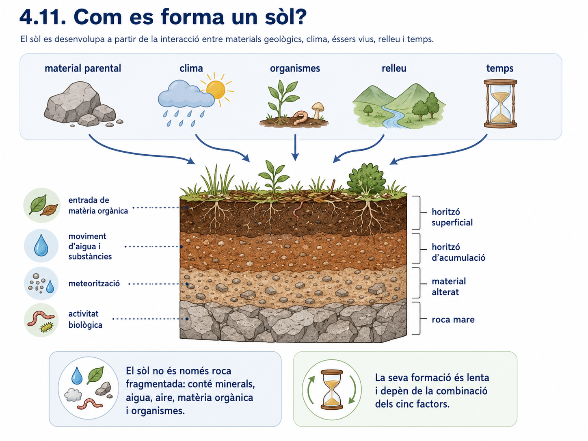

## 4.12. El sòl és un recurs que es forma lentament

Des del punt de vista humà, molts sòls es poden considerar un recurs de **regeneració molt lenta**.

La seva degradació pot ser molt més ràpida que la seva formació.

Entre els processos que poden deteriorar-los hi ha:

- erosió accelerada;
- pèrdua de matèria orgànica;
- compactació;
- salinització;
- contaminació;
- segellament per urbanització.

Conservar el sòl no significa conservar un únic «sòl ideal».

Les diferents combinacions de roca, clima, relleu, organismes i temps originen una gran varietat de sòls: **edafodiversitat**.

Aquesta diversitat té valor ecològic i condiciona també els usos possibles del territori.

## 4.13. Llegir un paisatge és reconstruir processos

Una fotografia només mostra **l’estat actual** d’un paisatge.

La interpretació geològica consisteix a utilitzar allò que observam per proposar quins processos poden haver contribuït a produir-lo.

Una estratègia útil és separar quatre preguntes:

**1. Què observam?**  
Litologia, fractures, pendent, sediments, formes d’erosió, vegetació, cursos d’aigua...

**2. Quins agents hi poden actuar?**  
Aigua, mar, gel, vent, gravetat...

**3. Quins processos expliquen les formes observades?**  
Meteorització, dissolució, erosió, transport, sedimentació, moviments de vessant...

**4. Com condicionen la roca i la història geològica aquests processos?**

La resposta més rigorosa no és necessàriament la més llarga. És la que estableix relacions causals compatibles amb les evidències.

### Idea que connecta tot el bloc

**energia solar + gravetat**  
↓  
**atmosfera i hidrosfera en moviment**  
↓  
**meteorització, erosió, transport i sedimentació**  
↓  
**resposta condicionada per la litologia i el relleu**  
↓  
**paisatges, sediments i sòls**

però sempre sobre un substrat que ja té una **història geològica prèvia**.

> **Un paisatge no és només una forma: és una evidència dels processos que han actuat sobre uns materials determinats al llarg del temps.**

---

# 5. Com convivim amb una Terra dinàmica?

Els processos geològics formen part del funcionament normal de la Terra.

Els terratrèmols, les erupcions, les inundacions, els moviments de vessant o l’erosió litoral no succeeixen perquè la Terra «funcioni malament». Són conseqüències dels mateixos processos que formen serralades, renoven la litosfera, modelen el paisatge o transporten sediments.

Aquests processos, però, poden afectar les persones, les infraestructures i les activitats humanes.

Al mateix temps, molts dels materials que utilitzam procedeixen directament de la geosfera, i alguns afloraments i paisatges conserven informació científica que pot tenir un gran valor.

Conviure amb una Terra dinàmica implica, per tant, prendre decisions sobre tres qüestions relacionades:

**riscos → recursos → patrimoni**

I en totes tres necessitam combinar:

**coneixement geològic + dades + decisions humanes.**

## 5.1. Un fenomen natural no és necessàriament un desastre

Un terratrèmol pot tenir lloc en una regió deshabitada sense causar danys humans importants.

Un terratrèmol de característiques semblants pot provocar una catàstrofe si afecta una ciutat molt poblada amb edificis vulnerables.

Per tant, no hem de confondre:

**fenomen geològic**  
amb  
**risc geològic**.

Un fenomen natural és un procés que ocorre a la Terra.

Parlam de **risc** quan aquest procés pot causar danys a persones, béns, infraestructures o activitats.

Això significa que:

> **el risc no depèn només de la intensitat del fenomen natural.**

Per analitzar-lo hem de considerar almenys tres components:

- **perillositat**;
- **exposició**;
- **vulnerabilitat**.

## 5.2. Perillositat: què pot passar?

La **perillositat** descriu la possibilitat que en una zona es produeixi un fenomen potencialment perjudicial amb una determinada intensitat o magnitud durant un interval de temps.

Depèn principalment del funcionament del sistema natural.

Per exemple, en el cas d’un terratrèmol ens interessa conèixer:

- quines zones poden experimentar sismicitat;
- amb quina freqüència aproximada;
- quina intensitat de moviment del terreny es pot esperar.

En un moviment de vessant podem considerar:

- pendent;
- tipus de materials;
- fracturació;
- presència d’aigua;
- episodis de precipitació;
- antecedents d’inestabilitat.

Per tant, la perillositat és una propietat del **fenomen i del territori**, no del nombre de persones que hi viuen.

Dues poblacions situades en una mateixa zona poden estar sotmeses a una perillositat semblant i, tanmateix, presentar riscos molt diferents.

## 5.3. Exposició: què hi ha a la zona afectable?

L’**exposició** fa referència als elements que poden quedar afectats.

Entre aquests elements podem considerar:

- població;
- habitatges;
- hospitals;
- escoles;
- carreteres;
- xarxes de comunicació;
- activitats econòmiques;
- infraestructures bàsiques.

Una zona sense població ni infraestructures pot tenir una perillositat elevada i, al mateix temps, una exposició humana reduïda.

En canvi, la mateixa perillositat pot tenir conseqüències molt més importants en una àrea densament poblada.

> **La perillositat descriu el fenomen; l’exposició descriu què hi hem situat davant.**

## 5.4. Vulnerabilitat: com de fàcil és que resulti danyat?

Dos edificis sotmesos a una mateixa sacsejada sísmica no necessàriament experimentaran els mateixos danys.

La **vulnerabilitat** expressa la predisposició dels elements exposats a resultar afectats.

Pot dependre de factors com:

- tipus i qualitat de construcció;
- antiguitat dels edificis;
- manteniment;
- aplicació de normes sismoresistents;
- estabilitat del terreny;
- preparació de la població;
- capacitat de resposta dels serveis d’emergència.

La vulnerabilitat no és, per tant, una característica del terratrèmol o de la inundació.

És una característica de **com està preparada la societat o la infraestructura davant aquell fenomen**.

Això és important perquè, a diferència de molts processos naturals, **la vulnerabilitat es pot modificar considerablement mitjançant decisions humanes**.

## 5.5. El risc resulta de la combinació dels tres components

Podem representar conceptualment:

**perillositat + exposició + vulnerabilitat → risc**

De vegades aquesta relació s’expressa de manera esquemàtica com:

**risc ∝ perillositat × exposició × vulnerabilitat**

No l’hem d’interpretar com una fórmula matemàtica universal.

La seva funció és recordar una idea:

> **un risc elevat pot resultar de combinacions diferents dels seus components.**

Per exemple:

- perillositat alta + exposició molt baixa → risc relativament limitat;
- perillositat moderada + exposició i vulnerabilitat molt altes → risc important.

Això explica per què conèixer només la probabilitat d’un fenomen **no basta per valorar-ne el risc**.

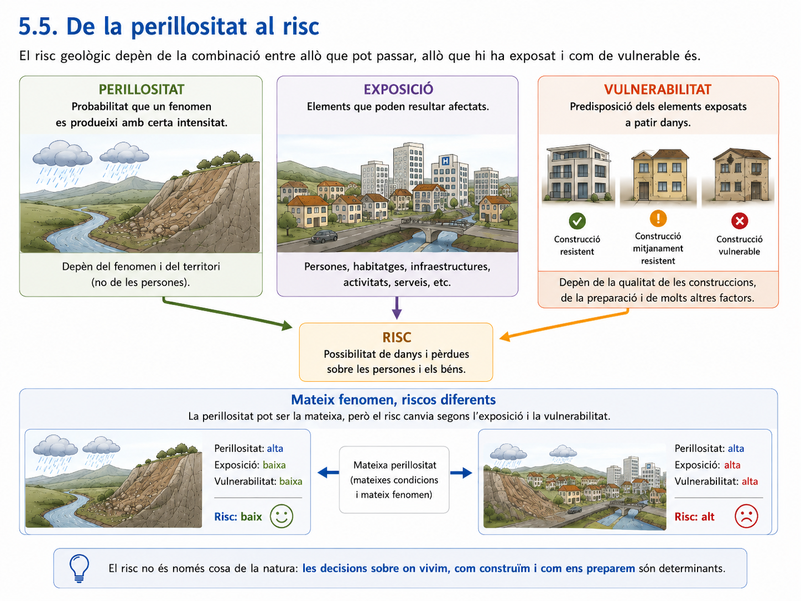

## 5.6. El risc no és una propietat immutable del territori

Suposem que la perillositat sísmica d’una regió no canvia significativament durant unes dècades.

Durant aquest temps es pot:

- construir una ciutat;
- augmentar la població;
- instal·lar un hospital;
- urbanitzar una zona inundable;
- reforçar edificis;
- modificar una carretera;
- implantar normes de construcció.

La **perillositat pot mantenir-se semblant**, mentre que l’exposició i la vulnerabilitat canvien.

Per tant:

> **el risc natural depèn també de les decisions humanes sobre el territori.**

No podem impedir que una falla acumuli tensió ni que una precipitació intensa arribi a produir-se. Però sovint sí que podem actuar sobre **on construïm, com construïm i com ens preparam**.

## 5.7. Podem predir els riscos naturals?

Aquí convé distingir entre dues qüestions.

### Conèixer la perillositat

Podem estudiar:

- registres històrics;
- falles actives;
- distribució de terratrèmols;
- precipitacions;
- pendents;
- tipus de materials;
- deformacions del terreny;
- activitat volcànica;
- episodis anteriors.

Aquestes dades permeten identificar zones més perilloses i estimar probabilitats.

### Predir exactament un esdeveniment

No tots els fenòmens naturals tenen el mateix grau de predictibilitat.

En particular, **actualment no podem predir amb exactitud fiable el moment, el lloc i la magnitud d’un terratrèmol futur concret**.

Això no significa que no puguem gestionar el risc sísmic.

Podem:

- elaborar mapes de perillositat;
- estudiar la recurrència;
- monitorar l’activitat;
- establir normes de construcció;
- preparar plans d’emergència.

Per tant:

> **no poder predir exactament un fenomen no significa que no puguem reduir-ne el risc.**

## 5.8. Predicció, prevenció i correcció

Podem actuar davant els riscos naturals de maneres diferents.

### Predicció i vigilància

Intenten obtenir informació sobre:

- on pot produir-se el fenomen;
- amb quina probabilitat;
- amb quina intensitat;
- si existeixen indicadors previs mesurables.

Inclouen mapes, xarxes de sensors, observació i sistemes d’alerta quan són possibles.

### Prevenció

Actua **abans** que el fenomen produeixi danys.

Per exemple:

- evitar construir en zones molt exposades;
- aplicar normes sismoresistents;
- estabilitzar determinats vessants;
- planificar vies d’evacuació;
- informar i preparar la població.

Moltes mesures preventives actuen principalment sobre **exposició i vulnerabilitat**.

### Mesures correctores o de mitigació

Intenten reduir els possibles efectes mitjançant actuacions sobre el territori o les infraestructures.

Poden incloure:

- reforç d’edificis;
- obres de protecció;
- drenatge de vessants;
- restauració de zones degradades;
- adaptació d’infraestructures existents.

La millor estratègia no és necessàriament la més espectacular ni la més cara.

La decisió ha de considerar:

**eficàcia + viabilitat + impactes + cost + informació disponible.**

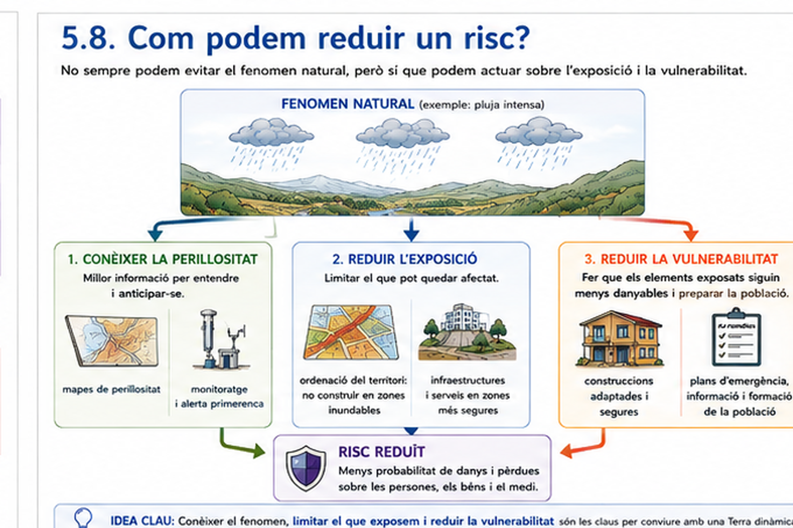

## 5.9. Prendre decisions amb informació incompleta

En gestionar un risc gairebé mai disposam d’informació perfecta.

Podem haver de decidir a partir d’un conjunt inicial de dades i, posteriorment, obtenir informació nova:

- noves esquerdes;
- mesures de moviment;
- dades d’aigua subterrània;
- nous episodis sísmics;
- una cartografia geològica més detallada.

En aquest cas, la resposta científica no consisteix a defensar indefinidament la decisió inicial.

Hem de preguntar:

**Les dades noves són compatibles amb la nostra interpretació?**

Si no ho són:

**què hem de modificar?**

Això pot afectar:

- la conclusió;
- el grau de risc estimat;
- les mesures proposades;
- o fins i tot les dades que necessitam obtenir després.

> **Canviar una conclusió davant evidències noves no és un fracàs del raonament científic: és part del raonament científic.**

## 5.10. La geologia també ens proporciona recursos

La nostra relació amb la geosfera no es limita als riscos.

Construïm edificis, carreteres, aparells electrònics i molts altres objectes utilitzant materials procedents de roques i minerals.

Un **recurs geològic** és un material o propietat de la geosfera que pot tenir utilitat per a la societat.

Però una roca o un mineral no és útil simplement pel seu nom.

L’ús depèn de les seves **propietats**.

Per exemple, per seleccionar un material podem tenir en compte:

- resistència mecànica;
- duresa;
- facilitat de tall;
- porositat;
- durabilitat;
- composició;
- comportament davant l’aigua;
- color o aspecte quan és rellevant.

Per això, el raonament útil és:

**material → propietats → ús possible**

i no:

**nom del material → memorització d’un ús.**

## 5.11. Utilitzar un recurs també té conseqüències

Per disposar d’un material geològic hem de:

- localitzar-lo;
- extreure’l;
- processar-lo;
- transportar-lo;
- utilitzar-lo;
- gestionar els residus que genera.

L’explotació pot aportar:

- matèries primeres;
- activitat econòmica;
- ocupació;
- materials imprescindibles per a infraestructures i productes.

Però també pot produir:

- modificació del relleu;
- pèrdua de sòl;
- generació de pols i renou;
- alteració de la circulació de l’aigua;
- residus;
- consum d’energia;
- afectació d’ecosistemes o paisatges.

Per això, plantejar simplement:

> «hem d’explotar o conservar?»

és sovint una falsa dicotomia.

La gestió responsable ha de considerar preguntes més útils:

- Quant material necessitam?
- Hi ha alternatives?
- Es pot reutilitzar?
- Quin és l’impacte de l’extracció?
- Podem reduir-lo?
- Hi ha zones que convé excloure de l’explotació?
- Què passa quan acaba l’activitat extractiva?

> **Ús responsable no significa no utilitzar recursos, sinó prendre decisions considerant-ne els beneficis, els costos i les alternatives.**

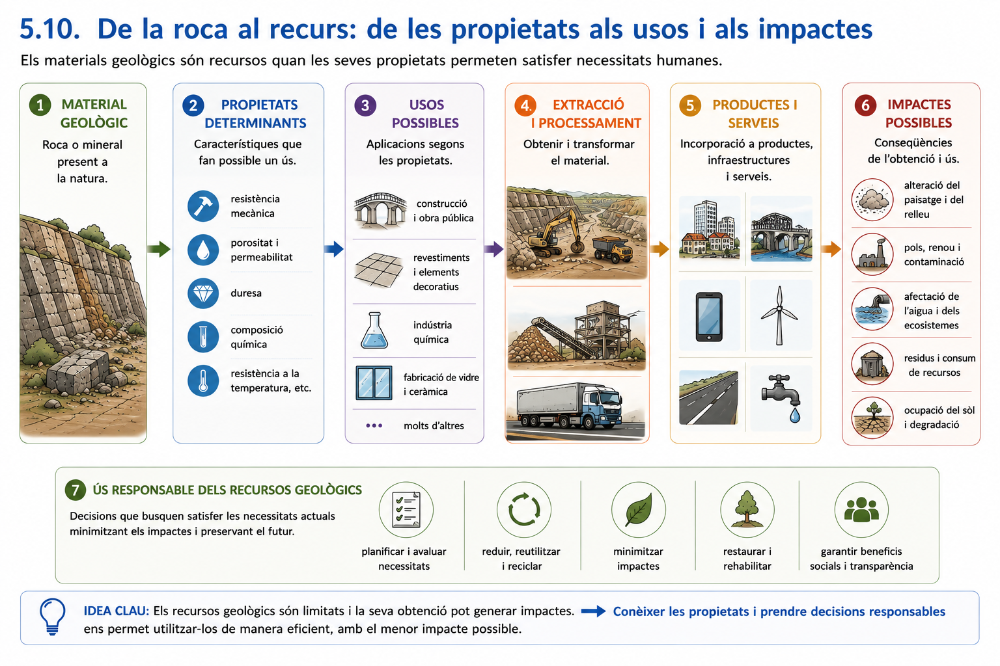

## 5.12. Els materials geològics també expliquen un territori

Les roques disponibles en un territori han influït històricament en:

- materials de construcció;
- arquitectura;
- activitats extractives;
- paisatge;
- usos tradicionals.

Per això, estudiar materials geològics propers permet connectar:

**geologia → propietats → usos → paisatge i societat.**

En el cas de les Illes Balears, aquest enfocament ens permet treballar els materials geològics característics **no com un catàleg de noms**, sinó a partir de preguntes:

> Quin material és?

> Quines propietats presenta?

> Per què pot ser útil?

> D’on s’obté?

> Quines conseqüències pot tenir la seva explotació?

## 5.13. Un aflorament pot tenir valor encara que no l’explotem

Les roques no només tenen valor com a recursos materials.

Un lloc pot conservar informació sobre:

- processos geològics;
- ambients del passat;
- deformacions;
- canvis climàtics;
- història de la vida;
- evolució del paisatge.

Parlam de **patrimoni geològic** quan elements o llocs geològics presenten un valor especial que justifica que siguin coneguts i, quan sigui necessari, conservats.

Aquest valor pot ser:

### Científic

Permet investigar o comprendre processos i episodis de la història geològica.

### Didàctic

Permet observar i explicar conceptes geològics especialment bé.

### Paisatgístic

Contribueix de manera significativa al caràcter d’un paisatge.

### Cultural

Pot estar relacionat amb la història, l’arquitectura, els usos tradicionals o la identitat d’un territori.

Aquests valors **poden coincidir en un mateix lloc**.

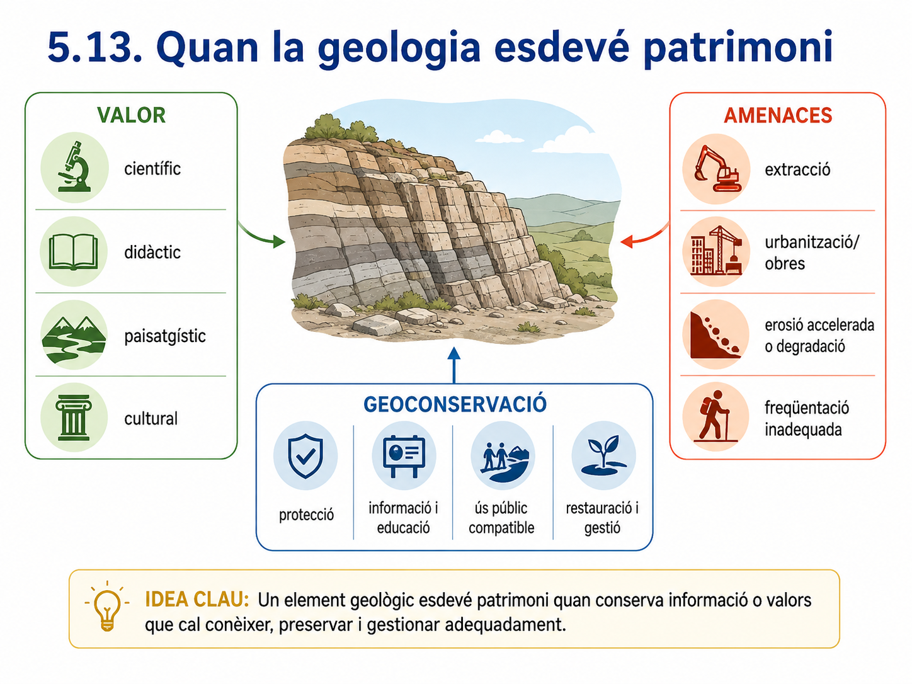

## 5.14. Patrimoni geològic no significa immobilitzar el territori

Considerar un lloc patrimoni geològic no implica necessàriament impedir qualsevol activitat.

La **geoconservació** intenta garantir que els elements que contenen la informació o el valor principal no siguin destruïts o degradats.

Això exigeix identificar:

**què té valor → què el pot afectar → què necessitam conservar.**

Les possibles amenaces poden incloure:

- explotació de materials;
- construcció;
- urbanització;
- erosió accelerada;
- recol·lecció indiscriminada;
- freqüentació inadequada;
- abandonament o falta de gestió.

La resposta tampoc no ha de ser automàtica.

Segons el cas, la gestió pot consistir en:

- protecció;
- limitació de determinades activitats;
- restauració;
- senyalització;
- divulgació;
- compatibilització d’usos.

## 5.15. Comunicar per conservar

Per protegir un element geològic, primer l’hem de poder **explicar**.

Una bona comunicació científica hauria de permetre a una persona que no coneix el lloc entendre:

1. **què hi observam**;
2. **com es va formar**;
3. **per què és important**;
4. **quines amenaces presenta**, si n’hi ha;
5. **què proposam fer i per què**.

Això exigeix seleccionar informació.

Una fitxa amb molt de text no és necessàriament millor que una fitxa breu.

El criteri important és:

> **la informació necessària ha de ser clara, rigorosa, rellevant i estar organitzada en un format adequat al destinatari.**

## 5.16. Risc, recurs i patrimoni poden coincidir en un mateix territori

La divisió en aquests tres apartats és útil per estudiar-los, però en la realitat sovint estan connectats.

Una mateixa zona pot contenir:

- un vessant amb risc de despreniments;
- una roca utilitzable com a recurs;
- un aflorament de valor científic;
- una carretera, habitatges o infraestructures exposades;
- un paisatge d’interès cultural.

Una decisió pot reduir un problema i crear-ne un altre.

Per exemple, una actuació destinada a estabilitzar un vessant pot afectar un aflorament; una explotació pot generar recursos però eliminar informació geològica; una mesura de conservació pot requerir limitar determinats usos.

Per tant, la pregunta final no és:

> **«Quina és la resposta correcta?»**

sinó:

> **«Quina decisió està millor justificada per les dades disponibles i quines conseqüències té?»**

### Idea que connecta tot el bloc

**processos geològics**  
↓  
**poden generar perillositat**  
↓  
**persones i infraestructures aporten exposició i vulnerabilitat**  
↓  
**risc**

però també:

**materials geològics**  
↓  
**propietats**  
↓  
**recursos i usos**

i:

**elements geològics singulars**  
↓  
**informació i valor**  
↓  
**patrimoni i geoconservació**

> **Comprendre la dinàmica terrestre ens permet no només explicar què passa, sinó prendre decisions més fonamentades sobre com habitam, utilitzam i conservam el territori.**

---

# Síntesi de la unitat

Al llarg de la unitat hem passat d’una pregunta sobre allò que no podem observar directament a una pregunta sobre com prenem decisions en un planeta actiu.

La seqüència es pot resumir així:

**evidències → models de l’interior → tectònica de plaques → transformació de materials → modelatge del paisatge → riscos, recursos i patrimoni**

El fil comú és sempre el mateix: **observar, interpretar, construir explicacions i revisar-les quan apareixen noves dades**.
