# UD03 · Història de la vida i biodiversitat

**Biologia, Geologia i Ciències Ambientals · 1r de Batxillerat**

# Material guia

## 0. La vida dins la història de la Terra

La Terra té una història de més de **4.500 milions d’anys**. Durant aquest temps han canviat els continents i els oceans, la composició de l’atmosfera, el clima i també els éssers vius que habiten el planeta.

A la UD01 vàrem aprendre que aquesta història no es pot observar directament: la reconstruïm a partir de les **evidències conservades en el registre geològic**. Ara utilitzarem aquesta mateixa manera de raonar per centrar-nos en una part concreta de la història terrestre: **la història de la vida**.

La pregunta ja no serà només *quan es va formar una roca?* o *quin esdeveniment va passar abans?*. Ens interessarà també saber:

- quines evidències indiquen que hi havia vida;
- com han canviat els organismes al llarg del temps;
- com la vida ha modificat les condicions del planeta;
- per què alguns llinatges s’han extingit mentre que d’altres han persistit i s’han diversificat;
- i com aquesta història explica la biodiversitat actual.

### 0.1. Del registre geològic al registre de la vida

Els organismes del passat no han deixat una crònica escrita de la seva existència. El que podem estudiar són **traces conservades** i altres canvis del registre que poden ser interpretats com a evidències de processos biològics.

Els **fòssils** són una de les fonts principals d’informació. Poden ser restes d’organismes, impressions, motlles, petjades, galeries o altres traces d’activitat biològica. A la UD01 els vàrem utilitzar sobretot per ordenar i correlacionar materials. En aquesta unitat ens interessaran especialment perquè també permeten reconstruir **quins organismes varen existir, com varen canviar les comunitats i quan apareixen o desapareixen determinats llinatges**.

Però els fòssils no són l’única evidència. La història de la vida també es pot investigar combinant informació procedent de:

- **roques i sediments**, que conserven estructures i minerals formats en determinades condicions ambientals;
- **senyals geoquímiques**, que poden registrar canvis en la composició dels oceans o de l’atmosfera relacionats amb l’activitat biològica;
- **característiques dels organismes actuals**, incloses semblances anatòmiques, cel·lulars i moleculars que permeten formular hipòtesis sobre el parentiu evolutiu.

Cap d’aquestes fonts, considerada tota sola, proporciona una narració completa. La reconstrucció es fa **integrant evidències diferents** i cercant una explicació compatible amb totes elles.

### 0.2. Un registre incomplet

El registre de la vida és necessàriament incomplet.

La major part dels organismes que han viscut mai no s’han fossilitzat. Perquè una resta o una traça es conservi durant milions d’anys s’han de donar unes condicions poc habituals: enterrament, preservació dels materials, transformació en fòssil i, finalment, que la roca que el conté no sigui destruïda abans que la puguem estudiar.

A més, el mateix registre geològic pot perdre informació per **erosió, metamorfisme, fusió, deformació o manca de sedimentació**. Per això, l’absència d’un fòssil en una capa determinada no demostra automàticament que aquell organisme no existís en aquell moment o en aquella regió.

Aquesta limitació té una conseqüència important: en història de la vida hem de distingir sempre entre:

**allò que les evidències mostren → allò que podem inferir → allò que encara no podem determinar.**

Una reconstrucció científica rigorosa no és la que omple tots els buits, sinó la que reconeix quines conclusions estan ben sostingudes i quines continuen sent incertes.

### 0.3. Canvis que només s’entenen a escala geològica

La major part dels processos que estudiarem no tenen sentit a l’escala temporal d’una vida humana.

Alguns canvis varen necessitar **centenars de milions d’anys**. D’altres varen ser relativament ràpids des del punt de vista geològic però, tot i així, varen durar molt més que qualsevol observació directa possible.

Per orientar-nos utilitzarem algunes grans fites temporals com a punts de referència:

| Moment aproximat | Esdeveniment de referència |
|---|---|
| **4,6 Ga** | Formació del Sistema Solar |
| **4,4–4,3 Ga** | Presència d’oceans molt primerencs a la Terra |
| **2,7–2,5 Ga** | Fotosíntesi oxigènica ja present |
| **2,4–2,1 Ga** | Gran Esdeveniment Oxidatiu |
| **541 Ma** | Inici del Cambrià i gran diversificació d’organismes animals al registre fòssil |
| **Actualitat** | Biodiversitat resultant de milers de milions d’anys d’evolució, extinció i diversificació |

> **Recorda les unitats**
>
> - **Ga** = gigaanys = milers de milions d’anys.
> - **Ma** = milions d’anys.

Aquesta taula no és una llista per memoritzar. Serveix per situar esdeveniments que anirem estudiant i, sobretot, per no perdre de vista la **magnitud del temps** que separa uns processos dels altres.

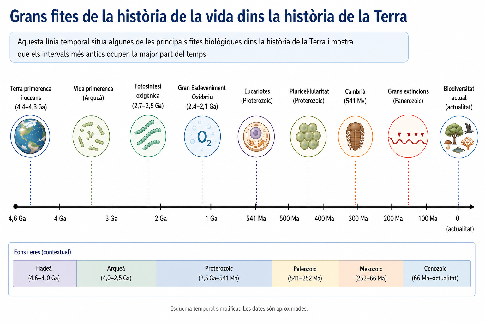

<!--
FIGURA UD03-GUIA-F01
Funció: figura de referència per a tota la unitat.

Disseny:
- línia temporal molt neta, pensada primer per a web però llegible impresa;
- de la formació de la Terra fins a l'actualitat;
- no convertir-la en una infografia enciclopèdica;
- mostrar només grans fites que es desenvolupen després a la guia:
  Terra primerenca / oceans;
  vida primerenca (sense fixar una data excessivament precisa);
  fotosíntesi oxigènica;
  Gran Esdeveniment Oxidatiu;
  eucariotes;
  pluricel·lularitat;
  Cambrià;
  grans extincions;
  biodiversitat actual.
- destacar visualment que les distàncies temporals són molt desiguals;
- poc text i cap explicació causal dins la figura.
-->

### 0.4. La història de la vida no és una escala de progrés

Quan representem la història biològica com una seqüència temporal és fàcil interpretar-la erròniament com un camí lineal:

**formes simples → formes complexes → organismes actuals**

Aquesta representació és enganyosa.

L’evolució no té un objectiu final ni produeix una successió ordenada d’organismes cada vegada «més evolucionats». Els llinatges es **ramifiquen**, canvien, s’extingeixen o persisteixen. Durant gran part de la història terrestre varen coexistir molts tipus d’organismes diferents, i els organismes actuals no constitueixen el final d’una escala, sinó les branques que han arribat fins al present.

Aquesta idea serà especialment important quan estudiem:

- les grans transicions de la biosfera;
- les extincions i les diversificacions posteriors;
- els cladogrames i l’arbre de la vida;
- la biodiversitat actual.

Per tant, la pregunta central de la unitat no serà «quin organisme va ser primer i quin va venir després?» com si cada grup substituís l’anterior. Intentarem reconstruir una història molt més ramificada:

> **com va aparèixer la vida, com va transformar el planeta, com els llinatges han canviat i s’han diversificat i com aquesta història ha produït la biodiversitat actual.**

---

## 1. De la matèria a la vida

Els éssers vius estan formats pels mateixos elements químics que trobam a la resta de la Terra. No existeix cap «matèria viva» feta d’elements exclusius de la vida. El que és característic dels organismes és **com aquesta matèria s’organitza i interactua**.

Això planteja una de les preguntes més profundes de la biologia:

> **Com pot un conjunt de molècules arribar a constituir un sistema viu?**

Respondre-la obliga a distingir dues qüestions relacionades però diferents. La primera és **què caracteritza els éssers vius actuals**. La segona és **com varen poder aparèixer els primers sistemes capaços de mantenir-se, reproduir-se i evolucionar**.

### 1.1. La vida està feta de matèria ordinària

La matèria dels éssers vius està constituïda principalment per un nombre reduït d’elements químics. Els més abundants són **carboni (C), hidrogen (H), oxigen (O), nitrogen (N), fòsfor (P) i sofre (S)**, encara que els organismes necessiten també altres elements en quantitats menors.

Aquests elements formen substàncies inorgàniques, com l’**aigua** i les **sals minerals**, i una gran diversitat de molècules orgàniques.

| Component | Paper general en els éssers vius |
|---|---|
| **Aigua** | Medi on tenen lloc moltes reaccions químiques; transport de substàncies; regulació tèrmica |
| **Sals minerals i ions** | Equilibri osmòtic, regulació química i participació en nombrosos processos cel·lulars |
| **Glúcids** | Font d’energia i components estructurals |
| **Lípids** | Reserva energètica, membranes i altres funcions cel·lulars |
| **Proteïnes** | Estructura, transport, moviment, regulació i catàlisi mitjançant enzims |
| **Àcids nucleics** | Emmagatzematge, transmissió i expressió de la informació hereditària |

El **carboni** té un paper especialment important perquè pot formar quatre enllaços covalents i construir cadenes, anells i estructures tridimensionals molt diverses. Aquesta versatilitat permet l’existència d’una enorme varietat de molècules orgàniques.

Però convé evitar una confusió: **orgànic no significa necessàriament produït per un organisme**. Moltes molècules orgàniques senzilles poden formar-se mitjançant processos abiòtics, és a dir, sense intervenció d’éssers vius. Aquesta idea serà important quan estudiem les hipòtesis sobre l’origen de la vida.


### 1.2. Organització: la cèl·lula com a unitat bàsica de la vida

Podem descriure la matèria biològica en diferents **nivells d’organització**:

**àtoms → molècules → estructures cel·lulars → cèl·lules → organismes**

En els organismes pluricel·lulars apareixen, a més, nivells com **teixits, òrgans i sistemes**. Però aquests nivells no existeixen en tots els éssers vius: un bacteri o un protist unicel·lular completa totes les seves funcions vitals dins una sola cèl·lula.

La **cèl·lula** és la unitat estructural i funcional bàsica dels éssers vius. En les formes de vida actuals, les cèl·lules comparteixen alguns trets fonamentals:

- una **membrana** que delimita un medi intern;
- un conjunt organitzat de **reaccions químiques**;
- informació hereditària;
- mecanismes que permeten utilitzar aquesta informació;
- capacitat de mantenir una certa organització interna mentre intercanvien matèria i energia amb el medi.

Dir que la vida és una **propietat emergent** significa que apareixen propietats noves quan els components interaccionen formant un sistema organitzat. Una proteïna, una molècula d’ADN o una membrana, per separat, **no són éssers vius**. La vida depèn de la interacció coordinada de molts components.

Això també ens adverteix que no podem cercar «la molècula de la vida». Cap biomolècula, per important que sigui, explica tota sola el funcionament d’un organisme.

### 1.3. Què comparteixen els éssers vius?

No hi ha una única propietat que, considerada tota sola, defineixi sense excepcions què és la vida. El que reconeixem és un **conjunt de característiques que apareixen integrades en els sistemes vius**.

#### Organització cel·lular

Els organismes estan formats per una o més cèl·lules. La cèl·lula manté un medi intern diferenciat de l’entorn i coordina els processos necessaris per continuar funcionant.

#### Metabolisme

El **metabolisme** és el conjunt de reaccions químiques que tenen lloc en un organisme i que permeten transformar matèria i energia.

Inclou dos grans tipus de processos:

- **catabolisme**: degradació de molècules, sovint associada a l’alliberament d’energia;
- **anabolisme**: síntesi de molècules i estructures, que requereix matèria i energia.

Els organismes no creen energia. La **transformen** i una part acaba dissipant-se en forma de calor. Per això tots els éssers vius són sistemes oberts que necessiten intercanviar matèria i energia amb l’entorn.

#### Homeòstasi i regulació

Les cèl·lules i els organismes han de mantenir determinades condicions internes dins uns marges compatibles amb el funcionament biològic. Aquesta capacitat de regulació s’anomena **homeòstasi**.

Homeòstasi no significa mantenir totes les variables exactament constants, sinó **regular-les dins determinats intervals malgrat els canvis externs o interns**.

#### Resposta al medi

Els organismes detecten canvis del seu entorn o del seu propi estat intern i hi poden respondre. La resposta pot ser ràpida, com un moviment, o consistir en canvis de creixement, activitat metabòlica o expressió gènica.

#### Creixement i desenvolupament

Els éssers vius poden augmentar de mida i experimentar canvis organitzats al llarg del seu cicle vital. En els organismes pluricel·lulars, el desenvolupament implica també diferenciació i coordinació entre cèl·lules.

#### Reproducció i herència

Els sistemes vius poden originar nous individus i transmetre informació hereditària. Però **la capacitat de reproduir-se no s’ha d’exigir a cada individu concret**: un individu estèril continua essent viu.

El que és essencial a llarg termini és que existeixi una continuïtat entre generacions i que la informació hereditària pugui transmetre’s.

#### Capacitat d’evolucionar

Les poblacions canvien al llarg de les generacions. La variació heretable i les diferències en supervivència i reproducció fan possible l’**evolució biològica**.

Els individus poden créixer, desenvolupar-se o aclimatar-se, però **no evolucionen individualment** en el sentit biològic: l’evolució és un canvi de les poblacions al llarg de les generacions.

> **Idea clau**
>
> La vida no es defineix bé amb una única prova. És la combinació d’**organització cel·lular, metabolisme, regulació, informació hereditària, reproducció i capacitat d’evolucionar** la que caracteritza els sistemes vius.

Aquesta dificultat per establir una frontera única serà especialment interessant quan estudiem les **formes acel·lulars**, com els virus, a la UD04.

### 1.4. L’origen de la vida és un problema històric

Sabem estudiar experimentalment organismes actuals, però l’origen de la vida va ocórrer a la Terra primitiva i **no es pot reproduir ni observar directament com un esdeveniment històric**.

Per això, investigar-lo s’assembla en alguns aspectes a reconstruir la història geològica: combinam evidències actuals, experiments, models químics i dades del registre antic per determinar **quins processos són possibles i quines hipòtesis són més compatibles amb les evidències**.

Una hipòtesi científica sobre l’origen de la vida ha d’explicar, com a mínim, com es pogueren produir diverses transicions:

1. formació abiòtica de **molècules orgàniques**;
2. aparició de sistemes químics amb reaccions coordinades;
3. **compartimentació**, és a dir, separació d’un medi intern respecte de l’exterior;
4. aparició d’algun sistema capaç d’**emmagatzemar i transmetre informació**;
5. aparició de reproducció amb variació suficient perquè pogués començar l’**evolució darwiniana**.

No sabem si aquestes transicions varen ocórrer en aquest ordre simple ni si varen tenir lloc en un únic ambient. La seqüència és sobretot una manera d’identificar **problemes que qualsevol model complet ha d’intentar resoldre**.

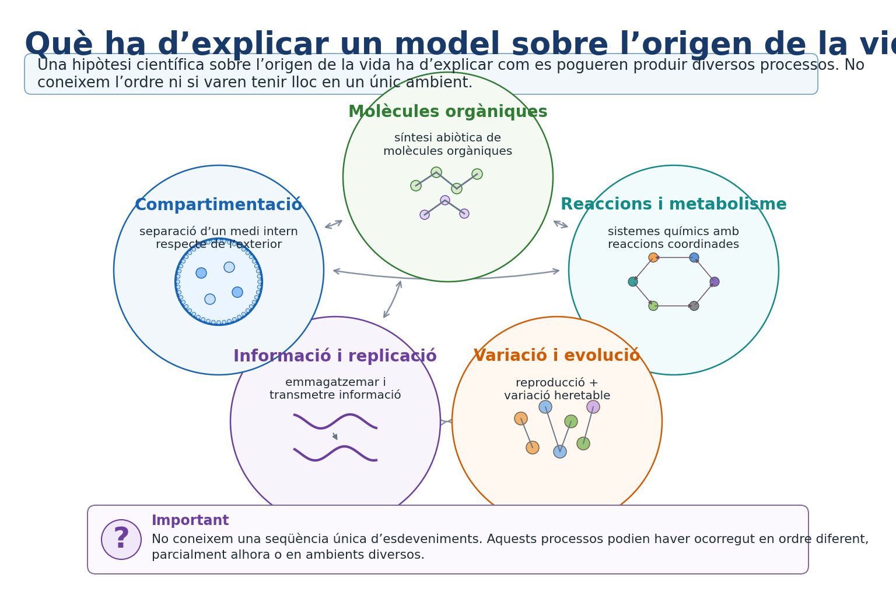

<!--
FIGURA UD03-GUIA-F02
Funció: organitzar els problemes científics de l'origen de la vida sense presentar una recepta històrica.

Disseny:
- cinc elements connectats, no una fletxa lineal rígida:
  molècules orgàniques;
  reaccions/metabolisme;
  compartimentació;
  informació i replicació;
  variació + evolució;
- remarcar visualment les interaccions entre elements;
- evitar dibuixar "primera cèl·lula" com a resultat inevitable;
- poc text.
-->

### 1.5. Poden formar-se molècules orgàniques sense vida?

Sí. Aquesta és una de les qüestions de l’origen de la vida per a les quals tenim evidències experimentals clares.

A la dècada de 1950, **Stanley Miller**, treballant amb **Harold Urey**, va construir un sistema experimental que contenia aigua i diversos gasos. Una descàrrega elèctrica aportava energia al sistema. Després d’uns dies s’hi havien format diverses molècules orgàniques, entre les quals alguns **aminoàcids**.

L’experiment de Miller-Urey va ser important perquè mostrava que:

> **molècules orgàniques rellevants per a la vida poden formar-se abiòticament a partir de substàncies més senzilles en determinades condicions.**

Però seria incorrecte afirmar que l’experiment:

- va crear vida;
- va demostrar exactament com es va originar la vida a la Terra;
- va reproduir amb certesa la composició real de tota l’atmosfera terrestre primitiva.

Els models actuals de l’atmosfera primerenca són més complexos que la mescla utilitzada en aquell experiment. A més, la síntesi prebiòtica podria haver tingut lloc en **ambients diversos**, no necessàriament en una única «sopa primordial».

Els experiments posteriors han mostrat que moltes molècules orgàniques poden formar-se sota diferents condicions. També s’han detectat compostos orgànics en **meteorits**, una evidència addicional que la química orgànica no és exclusiva dels éssers vius.

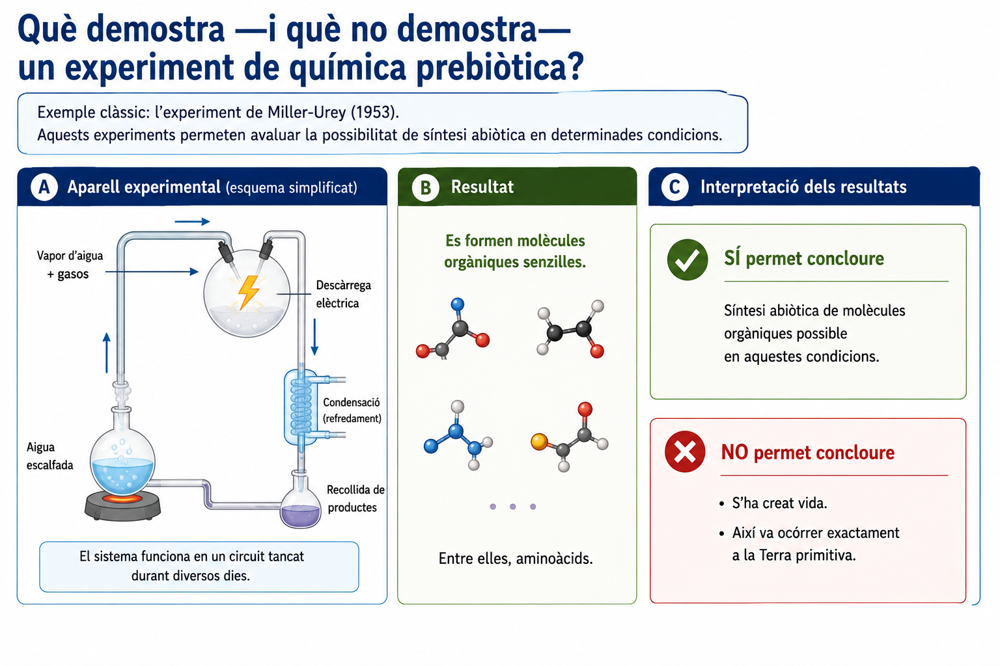

<!--
FIGURA UD03-GUIA-F03
Funció: servir de material de consulta per interpretar experiments sobre origen de la vida.

Disseny en tres zones:
A) esquema molt simplificat de l'aparell:
   recipient amb aigua → vapor + gasos → descàrrega elèctrica → condensació → recollida;
B) resultat:
   molècules orgàniques senzilles / aminoàcids;
C) dues frases molt breus:
   "Sí permet concloure: síntesi abiòtica possible en aquestes condicions"
   "No permet concloure: s'ha creat vida / així va ocórrer exactament a la Terra"
- evitar text llarg i evitar presentar l'atmosfera de l'experiment com la composició demostrada de l'atmosfera primitiva.
-->

### 1.6. De molècules disperses a compartiments

Una cèl·lula no és simplement una dissolució de molècules. Manté els seus components dins un espai delimitat i regula l’intercanvi amb l’exterior.

Per això la **compartimentació** és un problema central en els models sobre l’origen de la vida.

Alguns lípids tenen una propietat especialment interessant: en contacte amb aigua poden **autoorganitzar-se espontàniament** i formar membranes, gotes o vesícules. Aquest procés no requereix que les molècules «sàpiguen» construir una cèl·lula; és conseqüència de les seves propietats físiques i químiques.

En experiments de laboratori es poden obtenir vesícules que:

- separen un medi intern de l’exterior;
- incorporen determinades molècules;
- poden créixer en algunes condicions;
- es poden dividir físicament.

Aquests sistemes s’utilitzen com a **models de protocèl·lules**.

Una protocèl·lula experimental, però, **no és necessàriament un ésser viu**. Delimitar un compartiment resol només una part del problema. Un sistema viu necessita també mantenir reaccions, gestionar energia, conservar informació i transmetre-la.

### 1.7. El problema de la informació: la hipòtesi del món d’ARN

En les cèl·lules actuals hi ha una divisió funcional aproximada:

- l’**ADN** conserva gran part de la informació hereditària;
- les **proteïnes** duen a terme moltes funcions, inclosa la catàlisi de reaccions;
- l’**ARN** participa en la transferència i l’ús de la informació, entre altres funcions.

Això planteja un problema per pensar en els primers sistemes vius: si les proteïnes depenen de la informació genètica per ser produïdes i la replicació de la informació actual depèn de proteïnes, **quin sistema podia funcionar abans que aquesta maquinària complexa existís?**

La **hipòtesi del món d’ARN** proposa que, en una etapa primerenca de l’evolució química, molècules semblants a l’ARN haurien pogut combinar dues propietats:

- **emmagatzemar informació**;
- **catalitzar algunes reaccions químiques**.

Sabem que existeixen molècules d’ARN amb activitat catalítica, anomenades **ribozims**, fet que dona plausibilitat a aquesta idea.

Tanmateix, la hipòtesi del món d’ARN **no és una reconstrucció demostrada de l’origen de la vida**. Continua havent-hi problemes oberts, com explicar la síntesi prebiòtica eficient dels seus components, la formació de cadenes suficientment llargues i la seva replicació en condicions naturals primerenques.

Per això és més correcte parlar d’una **hipòtesi de treball amb suport experimental parcial** que no d’una etapa confirmada de la història terrestre.

### 1.8. Quan pot començar l’evolució?

La química pot produir molècules complexes i estructures autoorganitzades sense que hi hagi vida. El canvi qualitatiu més important apareix quan existeix un sistema que pot:

**produir còpies → transmetre informació → generar variació heretable.**

Si algunes variants es repliquen millor que d’altres en unes condicions determinades, pot començar un procés de **selecció**. A partir d’aquí ja no parlam només de química que canvia, sinó de sistemes que poden experimentar **evolució darwiniana**.

Aquesta idea és fonamental perquè l’origen de la vida no consisteix únicament a fabricar molècules orgàniques. Cal explicar l’aparició d’un sistema en què la informació i la reproducció facin possible una història evolutiva acumulativa.

No coneixem el moment exacte ni la seqüència completa que va conduir fins aquí. És probable que entre la química prebiótica i les primeres cèl·lules hi hagués moltes formes intermèdies que no han deixat un registre identificable.

### 1.9. LUCA no va ser necessàriament la primera forma de vida

Tots els éssers vius actuals comparteixen característiques molt profundes:

- utilitzen material genètic basat en àcids nucleics;
- comparteixen gran part del codi genètic;
- utilitzen ribosomes per fabricar proteïnes;
- utilitzen ATP i mecanismes cel·lulars fonamentals molt semblants.

Aquestes coincidències constitueixen una evidència potent que els organismes actuals comparteixen **avantpassats comuns**.

Anomenam **LUCA** (*Last Universal Common Ancestor*, darrer avantpassat comú universal) la població ancestral de la qual deriven tots els llinatges cel·lulars que han arribat fins avui.

Però LUCA **no s’ha de confondre amb el primer ésser viu**.

Abans de LUCA ja havia d’haver existit una història evolutiva prou llarga perquè apareguessin mecanismes cel·lulars complexos que avui són universals. També podrien haver existit altres llinatges antics que s’extingiren sense deixar descendents actuals.

Aquesta distinció ens permet enllaçar l’origen de la vida amb el que estudiarem a continuació: una vegada existeixen sistemes cel·lulars capaços d’evolucionar, **la biosfera mateixa comença a transformar el planeta**.

---

> **Idees clau del bloc 1**
>
> - Els éssers vius no estan formats per una matèria química exclusiva: la vida depèn de l’**organització** i la interacció dels components.
> - La **cèl·lula** és la unitat bàsica dels sistemes vius actuals i la vida pot entendre’s com una propietat emergent d’aquesta organització.
> - Els éssers vius comparteixen metabolisme, regulació, informació hereditària, reproducció i capacitat d’evolucionar, entre altres característiques.
> - Els experiments de química prebiótica mostren que és possible obtenir **molècules orgàniques abiòticament**, però això no equival a crear vida ni a reconstruir exactament el seu origen.
> - Els models sobre l’origen de la vida han d’explicar, entre altres problemes, la **compartimentació, el metabolisme, la informació, la replicació i l’inici de l’evolució**.
> - Protocèl·lules i món d’ARN són models i hipòtesis útils, no etapes històriques demostrades.
> - **LUCA no és la primera vida**, sinó el darrer avantpassat comú dels llinatges cel·lulars actuals.

---

## 2. Una biosfera que transforma el planeta

Quan varen aparèixer els primers sistemes vius, la Terra ja tenia oceans, atmosfera i una geologia activa. Però la relació entre la vida i el planeta no ha estat unidireccional. Els organismes no només han hagut d’adaptar-se a unes condicions ambientals determinades: **la seva activitat també ha modificat aquestes condicions**.

Un dels exemples més importants és l’oxigen. Avui representa prop del 21 % de l’atmosfera i resulta imprescindible per a la respiració aeròbia de molts organismes. A la Terra primerenca, però, l’**oxigen molecular lliure (O₂)** era molt escàs.

La seva acumulació va ser el resultat d’una llarga interacció entre **innovacions biològiques, processos geoquímics i temps geològic**.

### 2.1. Com sabem que hi havia vida a la Terra antiga?

Com més enrere anam en el temps, més difícil és trobar restes directes dels organismes. Les roques més antigues han estat sovint deformades, metamorfosades, erosionades o destruïdes. A més, els primers organismes eren microscòpics i no tenien esquelets ni altres parts dures que fossilitzassin fàcilment.

Per això, per estudiar la vida més antiga s’han de combinar diferents tipus d’evidències.

#### Microfòssils

Algunes roques molt antigues contenen estructures microscòpiques que poden correspondre a restes de cèl·lules. Per interpretar-les com a **microfòssils**, però, no basta que tenguin una forma semblant a una cèl·lula: s’ha de comprovar també la composició, el context geològic i si processos abiòtics podrien haver originat estructures semblants.

#### Estromatòlits

Els **estromatòlits** són estructures laminades que es poden formar quan comunitats microbianes modifiquen i retenen sediments o afavoreixen la precipitació de minerals.

Actualment encara se’n formen en alguns ambients, cosa que ajuda a interpretar estructures semblants conservades en roques antigues.

Tot i així, una forma laminada per si sola no és una prova absoluta d’activitat biològica. La interpretació és més sòlida quan la morfologia, l’estructura interna, la composició i el context geològic són coherents entre si.

#### Senyals geoquímiques

La vida també pot deixar rastres sense conservar cap organisme.

Alguns processos biològics utilitzen preferentment uns isòtops respecte d’altres. Per exemple, molts processos metabòlics discriminen lleugerament entre els isòtops del carboni. Una proporció isotòpica determinada conservada en materials antics pot ser, per tant, **compatible amb activitat biològica**.

Però una senyal geoquímica tampoc parla tota sola: s’ha de demostrar que no existeix una explicació abiòtica igualment plausible.

> **Idea important**
>
> No disposam d’un únic «fòssil més antic» que resolgui per si sol quan va aparèixer la vida. Les afirmacions sobre la vida més antiga depenen de **conjunts d’evidències amb graus diferents d’incertesa**.

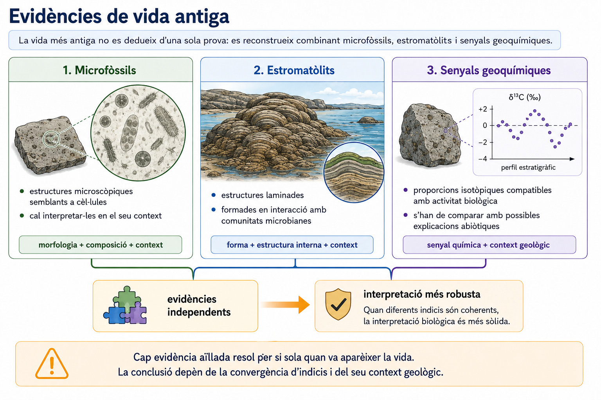

<!--
FIGURA UD03-GUIA-F04
Funció: mostrar que la vida antiga es reconstrueix combinant evidències diferents.

Disseny:
- tres panells simples:
  A) microfòssil en secció;
  B) estromatòlit laminat;
  C) senyal geoquímica/isotòpica;
- cada panell ha d'indicar només "què observam", no la conclusió completa;
- una fletxa o esquema final: evidències independents → interpretació més robusta;
- evitar assignar una única data a "l'origen de la vida";
- aspecte de làmina científica, no d'infografia carregada.
-->

### 2.2. Una biosfera sense oxigen lliure abundant

Els primers ecosistemes varen existir en una Terra molt diferent de l’actual.

L’atmosfera i els oceans superficials contenien molt poc **O₂ lliure**. Això significa que els primers organismes no podien dependre de la respiració aeròbia tal com la coneixem avui.

Havien d’obtenir energia mitjançant **metabolismes anaerobis**, és a dir, processos que no necessiten oxigen molecular.

No aprofundirem encara en la diversitat metabòlica dels microorganismes, que estudiarem més endavant. Aquí ens interessa una idea general:

> **la vida va existir durant molt de temps abans que l’atmosfera contingués quantitats importants d’oxigen.**

Alguns microorganismes varen desenvolupar formes de **fotosíntesi anoxigènica**, que utilitzen la llum com a font d’energia però no produeixen O₂.

Més endavant va aparèixer una innovació que acabaria tenint conseqüències planetàries: la **fotosíntesi oxigènica**.

### 2.3. La fotosíntesi oxigènica: una innovació que canvia l’entorn

La fotosíntesi oxigènica utilitza energia lluminosa per fabricar matèria orgànica a partir de substàncies inorgàniques i allibera **oxigen molecular**.

De manera simplificada, el balanç global es pot representar així:

\[
6\,CO_2 + 6\,H_2O \xrightarrow{\text{llum}} C_6H_{12}O_6 + 6\,O_2
\]

Aquesta expressió resumeix el balanç global, però no representa totes les reaccions intermèdies de la fotosíntesi.

Un detall important és que **l’O₂ alliberat procedeix de l’aigua**, no del CO₂.

Els **cianobacteris** són organismes procariotes actuals capaços de fer fotosíntesi oxigènica. Les evidències indiquen que aquest tipus de metabolisme ja existia molt abans que l’oxigen començàs a acumular-se de manera important a l’atmosfera.

Això genera una aparent contradicció:

> **si ja es produïa oxigen, per què l’atmosfera va continuar tenint-ne tan poc durant molt de temps?**

La resposta obliga a diferenciar entre **producció** i **acumulació**.

### 2.4. Produir oxigen no significa acumular-lo

Imaginem un recipient al qual entra aigua però que té diversos desguassos oberts. Encara que hi entri aigua contínuament, el nivell no augmentarà mentre la sortida sigui igual o superior a l’entrada.

Amb l’oxigen de la Terra primerenca passava una cosa semblant.

La fotosíntesi oxigènica podia produir O₂, però aquest reaccionava ràpidament amb materials que es trobaven en estat reduït. Aquests processos actuaven com a **embornals d’oxigen**.

Entre els principals consumidors d’O₂ hi havia:

- **ferro dissolt als oceans** en estat reduït;
- minerals i roques de l’escorça susceptibles d’oxidar-se;
- gasos volcànics i altres compostos reduïts;
- matèria orgànica que podia ser oxidada.

Per tant, durant molt de temps:

**producció biològica d’O₂ → consum geoquímic → poca acumulació a l’atmosfera**

Un exemple especialment important és el ferro.

Als oceans antics hi havia abundant **ferro ferrós (Fe²⁺)** dissolt. Quan l’oxigen reaccionava amb aquest ferro, es formaven compostos de ferro oxidat molt menys solubles, que podien precipitar i acumular-se als sediments.

Això va contribuir a formar moltes **formacions de ferro bandejat**, roques sedimentàries caracteritzades per capes riques en minerals de ferro.

Només quan la producció d’oxigen va arribar a superar de manera sostinguda la capacitat dels principals embornals, l’O₂ va poder començar a **acumular-se de forma persistent** als oceans superficials i a l’atmosfera.

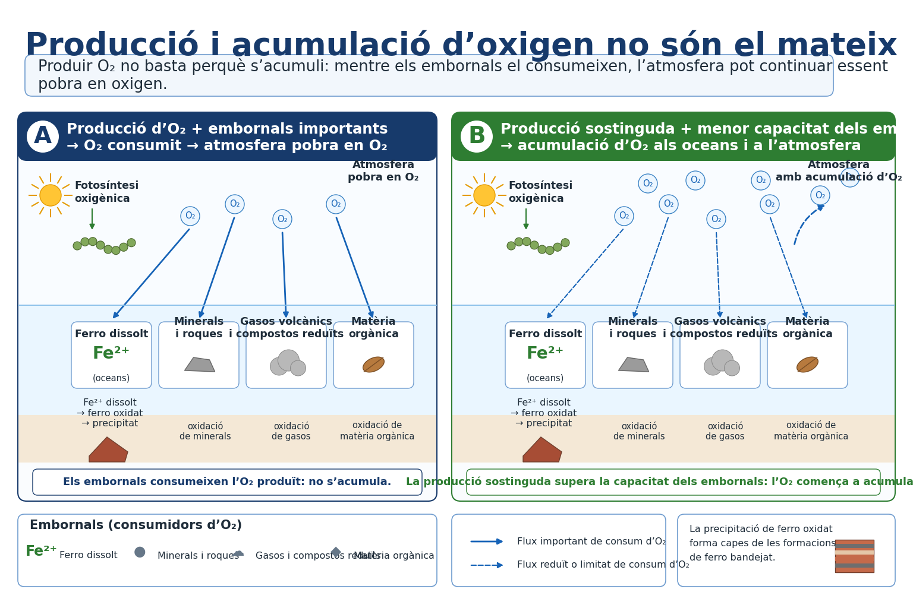

<!--
FIGURA UD03-GUIA-F05
Funció: explicar el mecanisme necessari per resoldre activitats que diferencien producció d'O2 i acumulació atmosfèrica.

Disseny:
- dos moments o situacions:
  A) producció d'O2 + embornals grans → O2 consumit → atmosfera pobra en O2;
  B) producció sostinguda + capacitat dels embornals reduïda → acumulació d'O2;
- mostrar de manera clara el ferro oceànic Fe2+ → ferro oxidat que precipita;
- no representar els embornals com si desapareguessin completament;
- poc text i fletxes clares.
-->

### 2.5. Com detectam l’oxigenació d’un planeta antic?

No podem prendre una mostra directa de l’atmosfera de fa 2.400 milions d’anys. L’oxigenació s’ha reconstruït a partir de **canvis conservats en les roques**.

Cap indicador és perfecte per si sol. El patró general s’obté combinant diversos registres.

#### Formacions de ferro bandejat

Les **formacions de ferro bandejat** mostren que grans quantitats de ferro dissolt varen ser oxidades i precipitades als oceans antics.

Aquest registre és coherent amb la producció d’oxidants, entre els quals l’oxigen produït biològicament va tenir un paper fonamental.

Però una formació de ferro bandejat no és un «mesurador directe» de la concentració atmosfèrica d’O₂. Reflecteix processos oceànics i geoquímics que s’han d’interpretar dins el seu context.

#### Isòtops del sofre

El sofre té diversos **isòtops estables**, sobretot ³²S, ³³S, ³⁴S i ³⁶S. En aquest procés els isòtops **no es desintegren ni es transformen els uns en els altres**. El que pot canviar és la proporció amb què els diferents isòtops queden incorporats als productes d’una reacció química.

En molts processos naturals aquesta distribució depèn lleugerament de la massa: les molècules que contenen isòtops més lleugers o més pesants no reaccionen exactament igual. Com que l’efecte depèn de la diferència de massa, si coneixem el comportament de ³⁴S respecte de ³²S podem predir aproximadament quin comportament hauria de tenir ³³S. Això s’anomena **fraccionament dependent de la massa**.

En moltes roques de l’Arqueà, però, les proporcions de ³³S, ³⁴S i ³⁶S **no segueixen aquestes relacions esperades**. Aquest patró s’anomena **fraccionament independent de la massa del sofre** (S-MIF).

Com es podia generar? Els volcans alliberaven compostos de sofre, com el **SO₂**, a l’atmosfera. Quan l’atmosfera contenia molt poc O₂ també hi havia molt poc **ozó (O₃)**, de manera que una radiació ultraviolada que avui queda fortament filtrada podia participar en reaccions fotoquímiques del SO₂.

La idea clau és que **les molècules de SO₂ que contenen els diferents isòtops del sofre no participen exactament igual en determinades reaccions fotoquímiques**. Les petites diferències entre ³²S, ³³S, ³⁴S i ³⁶S fan que les molècules que els contenen puguin absorbir determinades longituds d’ona o reaccionar amb probabilitats lleugerament diferents.

Com a conseqüència, alguns productes de les reaccions poden quedar relativament enriquits en uns isòtops i altres productes, en uns altres. El que és excepcional és que aquesta distribució **no segueix la relació que esperaríem només a partir de les diferències de massa**. Això és precisament el que caracteritza el S-MIF.

Per tant, el procés es pot resumir així:

**SO₂ amb diferents isòtops del sofre → interacció lleugerament diferent amb la radiació UV → participació desigual en les reaccions fotoquímiques → productes amb proporcions isotòpiques diferents**

Els diferents productes del sofre podien arribar a la superfície i quedar incorporats als sediments. Així, aquella signatura atmosfèrica quedava preservada a les roques.

Quan l’O₂ va començar a acumular-se de manera persistent, també va canviar la química de l’atmosfera: es va poder formar més ozó, que filtra radiació ultraviolada, i les espècies de sofre varen circular en condicions més oxidants. En aquestes noves condicions, el senyal S-MIF va deixar de generar-se o de conservar-se de la mateixa manera.

Per això, la presència de S-MIF en moltes roques antigues és compatible amb una atmosfera **extremadament pobra en oxigen**, mentre que la seva desaparició generalitzada del registre al voltant del Gran Esdeveniment Oxidatiu indica un canvi profund del sistema atmosfèric.

> **Important**
>
> El S-MIF no ens dona directament un percentatge d’O₂ atmosfèric. És un **indicador indirecte de les condicions químiques de l’atmosfera** en què es varen formar i preservar aquells compostos de sofre.

#### Sediments continentals oxidats

Quan l’oxigen atmosfèric va augmentar, també es va intensificar l’oxidació de minerals exposats als continents.

A partir de determinats moments del registre es fan més habituals sediments continentals de tonalitats vermelloses produïdes per **òxids de ferro**, compatibles amb una atmosfera més oxidant.

Per tant, la inferència no depèn d’una sola roca:

**canvis mineralògics + senyals isotòpiques + sediments oxidats → evidència d’una oxigenació global**

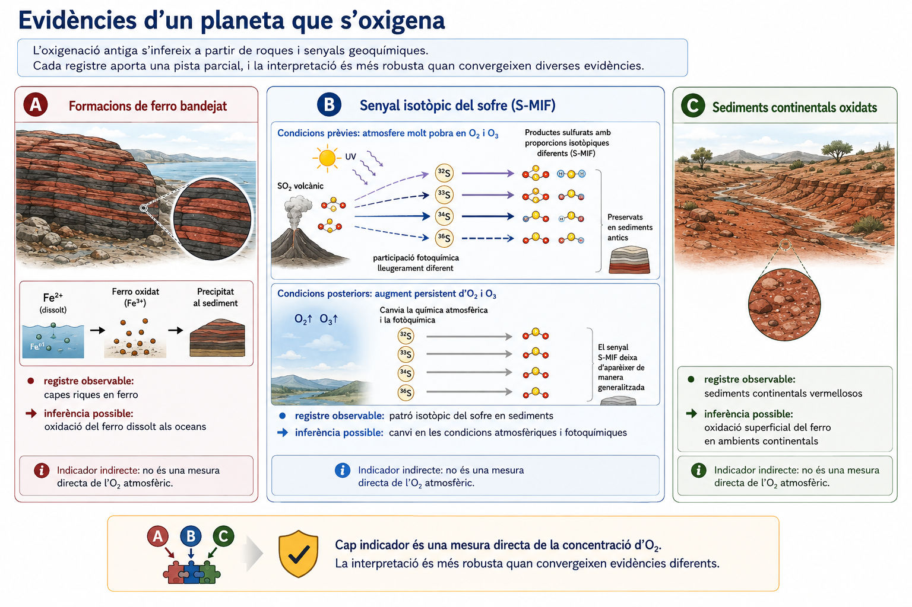

<!--
FIGURA UD03-GUIA-F06
Funció: material de consulta per relacionar evidències geològiques amb la inferència d'oxigenació.

Disseny:
- tres evidències en paral·lel:
  formacions de ferro bandejat;
  canvi en el senyal isotòpic del sofre;
  sediments continentals oxidats;
- per al panell del sofre, representar de manera molt simple:
  atmosfera amb molt poc O2/O3 → UV + SO2 volcànic;
  les molècules que contenen 32S, 33S, 34S i 36S participen de manera lleugerament diferent en determinades reaccions fotoquímiques;
  → productes amb proporcions isotòpiques diferents (S-MIF) → preservació als sediments;
  després, augment persistent d'O2 → canvi de la química atmosfèrica → desaparició generalitzada del senyal;
- NO representar cap isòtop com si es transformàs o decaigués en un altre;
- estructura general: registre observable → inferència possible;
- deixar clar visualment que cap indicador és una mesura directa de la concentració d'O2;
- evitar gràfiques amb valors inventats.
-->

### 2.6. El Gran Esdeveniment Oxidatiu

Anomenam **Gran Esdeveniment Oxidatiu** —o GOE, de l’anglès *Great Oxidation Event*— el gran canvi del sistema Terra durant el qual l’oxigen molecular va començar a mantenir-se de manera persistent a l’atmosfera, aproximadament entre **2,4 i 2,1 Ga**.

El nom pot induir a imaginar un canvi instantani. No va ser així.

No hi va haver un dia en què una atmosfera sense oxigen es convertís sobtadament en una atmosfera semblant a l’actual. Va ser una **transició prolongada i complexa**, amb oscil·lacions i amb concentracions d’O₂ molt inferiors a les modernes durant bona part del Proterozoic.

El GOE és especialment important perquè mostra una interacció en dues direccions:

**biosfera → modifica la química del planeta**

però també:

**canvi químic del planeta → modifica les condicions de vida de la biosfera**

L’oxigen era un producte metabòlic per als organismes que el generaven, però per a molts organismes anaerobis constituïa una substància reactiva i potencialment tòxica. L’augment de l’O₂ va transformar, per tant, els ambients disponibles i les pressions de selecció.

### 2.7. Oxigen i noves possibilitats metabòliques

L’oxigen també va obrir una possibilitat energètica molt important: la **respiració aeròbia**.

En termes generals, oxidar completament molècules orgàniques utilitzant O₂ com a acceptor final d’electrons permet obtenir molta més energia utilitzable per unitat de matèria orgànica que moltes vies anaeròbies.

Això no significa que els organismes aerobis siguin «superiors» als anaerobis. Els metabolismes anaerobis continuen essent eficients i essencials en nombrosos ambients actuals.

El que va canviar és que, allà on hi havia oxigen disponible, es va obrir un **nou conjunt de possibilitats metabòliques i ecològiques**.

A mesura que l’O₂ atmosfèric augmentava, una part es transformava en **ozó (O₃)** a les capes altes de l’atmosfera. L’ozó absorbeix una part important de la radiació ultraviolada, de manera que el canvi en la composició atmosfèrica també va modificar les condicions de radiació a la superfície.

### 2.8. La cèl·lula eucariota: una nova forma d’organització

Durant una gran part de la història de la vida només varen existir organismes procariotes. Més endavant aparegueren les **cèl·lules eucariotes**, caracteritzades per una organització interna més compartimentada, amb nucli i diversos orgànuls delimitats per membranes.

Una de les transicions fonamentals en l’origen dels eucariotes s’explica mitjançant la **teoria endosimbiòtica**.

Segons aquesta teoria, alguns orgànuls eucariotes varen originar-se a partir de bacteris que varen passar a viure dins una altra cèl·lula i establiren una associació permanent.

#### Origen dels mitocondris

Els avantpassats dels **mitocondris** varen ser bacteris capaços de respiració aeròbia. La seva incorporació estable a una cèl·lula hoste va donar lloc a una associació en què l’antic bacteri acabà convertint-se en orgànul.

Tots els grans llinatges eucariotes coneguts deriven d’avantpassats que ja havien adquirit mitocondris, encara que alguns organismes actuals els tenguin molt modificats.

#### Origen dels cloroplasts

Més tard, en un llinatge eucariota, una cèl·lula va incorporar un **cianobacteri fotosintètic**. D’aquesta endosimbiosi s’originaren els cloroplasts dels llinatges fotosintètics primaris.

Diverses evidències donen suport a l’origen bacterià de mitocondris i cloroplasts:

- contenen **ADN propi**;
- es divideixen a partir d’orgànuls preexistents;
- tenen ribosomes de tipus bacterià;
- presenten membranes coherents amb un origen endosimbiòtic;
- les comparacions moleculars els relacionen amb grups bacterians concrets.

La teoria endosimbiòtica és, per tant, molt més que una semblança visual entre orgànuls i bacteris: és una explicació sustentada per **evidències estructurals, bioquímiques i moleculars independents**.

### 2.9. Pluricel·lularitat: cooperar i especialitzar-se

Una altra gran transició de la història de la vida va ser l’aparició de la **pluricel·lularitat**.

Ser pluricel·lular no consisteix simplement a tenir moltes cèl·lules juntes. En els organismes pluricel·lulars complexos les cèl·lules:

- romanen associades;
- es comuniquen;
- coordinen l’activitat;
- poden especialitzar-se en funcions diferents;
- depenen, en major o menor grau, del conjunt de l’organisme.

La pluricel·lularitat **no va aparèixer una sola vegada**. Ha evolucionat independentment en diferents llinatges, entre els quals animals, plantes, fongs i diversos grups d’algues.

Això és una idea evolutiva important: una característica semblant pot aparèixer en llinatges diferents a partir de processos independents.

La disponibilitat d’oxigen probablement va ampliar les possibilitats energètiques per a alguns organismes grans i complexos, però seria massa simple afirmar:

**més O₂ → pluricel·lularitat**

Entre el Gran Esdeveniment Oxidatiu i la diversificació dels grans organismes pluricel·lulars transcorregueren enormes intervals de temps. L’origen i expansió de la pluricel·lularitat depenen de **molts factors biològics i ambientals**, no d’una sola causa.

### 2.10. Les grans transicions no formen una escala lineal

Podem resumir alguns dels grans canvis treballats fins ara:

**vida cel·lular → fotosíntesi oxigènica → oxigenació planetària → eucariotes → pluricel·lularitat**

Aquesta seqüència és útil per ordenar esdeveniments, però pot resultar enganyosa si la interpretam com una escala en què cada novetat substitueix l’anterior.

Els procariotes no varen desaparèixer quan aparegueren els eucariotes. Els organismes unicel·lulars no varen ser substituïts pels pluricel·lulars. Els metabolismes anaerobis no varen deixar d’existir quan augmentà l’oxigen.

Totes aquestes formes de vida **continuen coexistint avui**.

A més, les transicions no són independents del planeta que les envolta. Cada innovació apareix dins una biosfera que ja existeix i pot modificar les condicions per als llinatges posteriors.


---

> **Idees clau del bloc 2**
>
> - La vida més antiga es reconstrueix combinant **fòssils, estructures sedimentàries i senyals geoquímiques**; cap evidència aïllada proporciona tota la història.
> - Durant una gran part de la història terrestre hi va haver vida amb molt poc **O₂ lliure** a l’atmosfera.
> - La **fotosíntesi oxigènica** va començar a produir O₂ molt abans que aquest s’acumulàs de manera important.
> - **Producció i acumulació no són el mateix**: inicialment l’oxigen reaccionava amb ferro i altres materials reduïts que actuaven com a embornals.
> - El **Gran Esdeveniment Oxidatiu** va ser una transició prolongada del sistema Terra, no un canvi instantani ni l’arribada immediata als nivells actuals d’oxigen.
> - L’augment de l’O₂ va modificar els ecosistemes i va obrir noves possibilitats metabòliques, però no explica tot sol les transicions biològiques posteriors.
> - Els **mitocondris i cloroplasts** tenen origen endosimbiòtic i aquesta explicació està sustentada per diverses línies d’evidència.
> - La **pluricel·lularitat va evolucionar diverses vegades** i no va substituir la vida unicel·lular.
> - La història de la biosfera és una història de **coexistència, ramificació i interacció amb el planeta**, no una escala lineal de progrés.

---

## 3. Evolució, extincions i noves oportunitats

La història de la vida no és només una successió d’aparicions. Els llinatges **canvien, es ramifiquen, persisteixen durant intervals molt llargs o s’extingeixen**. De vegades aquests canvis són graduals; altres vegades, una crisi ambiental elimina una fracció important de la biodiversitat i altera profundament els ecosistemes.

Per interpretar aquests patrons necessitam connectar dues escales diferents:

- els **mecanismes evolutius** que actuen sobre les poblacions;
- els **patrons del registre fòssil** que observam al llarg de milions d’anys.

Aquesta connexió és essencial per entendre per què una extinció no afecta tots els grups igual, per què sobreviure no significa ser «més evolucionat» i per què, després d’una crisi, alguns llinatges es diversifiquen mentre que d’altres no.

### 3.1. Evolucionen les poblacions, no els individus

Els individus poden créixer, desenvolupar-se, aprendre o aclimatar-se, però en biologia evolutiva deim que **evolucionen les poblacions**.

Una població conté variació entre els individus. Una part d’aquesta variació és **heretable**, és a dir, pot transmetre’s a la descendència.

Les mutacions introdueixen noves variants genètiques i, en els organismes amb reproducció sexual, la recombinació contribueix a generar noves combinacions d’al·lels.

Si, generació rere generació, canvia la freqüència d’aquestes variants, la població ha evolucionat.

Per tant:

> **evolució biològica = canvi heretable en les poblacions al llarg de les generacions**

Aquesta definició és deliberadament àmplia: no tot canvi evolutiu és conseqüència directa de la selecció natural.

### 3.2. Selecció natural: l’ambient no produeix la característica que «fa falta»

La **selecció natural** pot actuar quan es compleixen tres condicions:

1. els individus d’una població presenten **variació**;
2. una part d’aquesta variació és **heretable**;
3. les variants influeixen en la probabilitat de sobreviure i, sobretot, de deixar descendència en unes condicions determinades.

Si una característica heretable afavoreix la reproducció en aquell ambient, les variants associades poden fer-se més freqüents al llarg de les generacions.

Això pot originar una **adaptació**: una característica heretable que augmenta l’èxit reproductiu en un context determinat.

Però la selecció natural no funciona així:

**canvia l’ambient → l’organisme necessita una característica → la característica apareix**

La variació no apareix perquè sigui necessària. La selecció actua sobre variacions que ja existeixen o que apareixen sense anticipar les necessitats futures.

A més, una característica avantatjosa en un ambient pot ser neutra o fins i tot perjudicial en un altre.

> **No existeix una característica universalment «millor». La seva conseqüència depèn del context ambiental.**

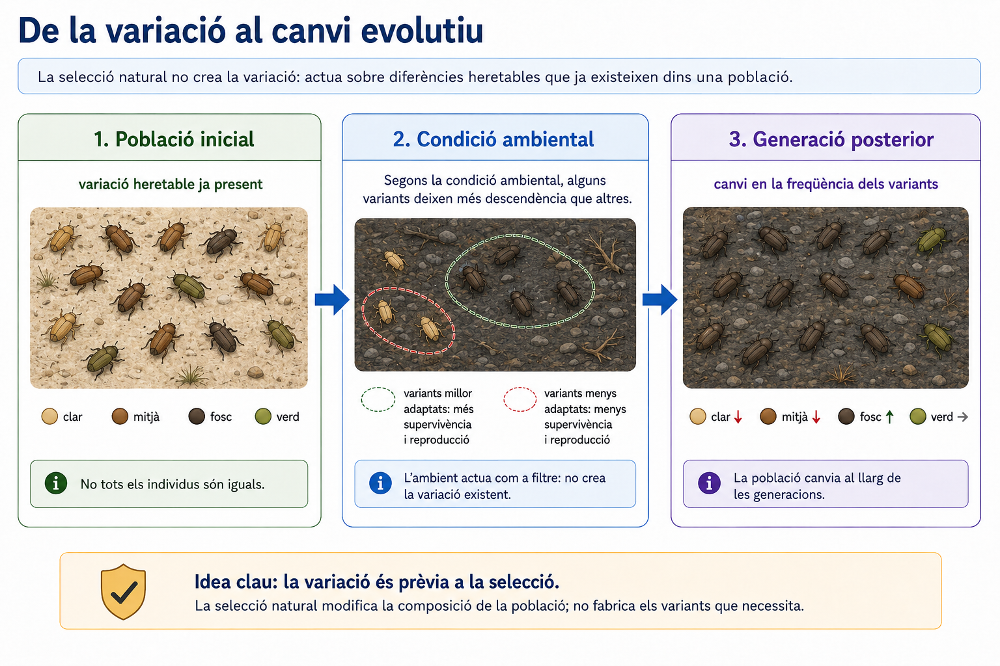

<!--
FIGURA UD03-GUIA-F07
Funció: material de consulta per explicar selecció sense suggerir que l'ambient crea la variació necessària.

Disseny:
- població inicial amb variació heretable;
- canvi o condició ambiental;
- diferències en supervivència/reproducció;
- generació posterior amb freqüències diferents;
- deixar visibles diverses variants: no representar una substitució necessàriament completa;
- incorporar una nota visual mínima: "la variació és prèvia a la selecció";
- evitar personificar la selecció natural.
-->

### 3.3. No tot és selecció: atzar i història també importen

La selecció natural és un mecanisme central de l’evolució, però **no és l’únic**.

En poblacions finites, les freqüències de les variants genètiques també poden canviar per **atzar**. Aquest procés s’anomena **deriva genètica** i pot ser especialment important en poblacions petites.

També importa la història concreta de cada llinatge. Una població només pot evolucionar a partir de:

- la variació que té disponible;
- les característiques heretades dels seus avantpassats;
- els canvis ambientals que experimenta;
- els esdeveniments fortuïts que l’afecten.

Aquesta dependència de la història i dels esdeveniments particulars s’anomena sovint **contingència històrica**.

Això és especialment important quan estudiam extincions massives. Que un llinatge sobrevisqui a una crisi no implica necessàriament que fos «superior» als que desaparegueren. Algunes característiques poden haver estat avantatjoses sota aquella crisi concreta i l’atzar també pot haver influït en quines poblacions varen persistir.

### 3.4. De la divergència a la diversificació

Quan poblacions d’un mateix llinatge deixen d’intercanviar gens de manera efectiva, poden acumular diferències al llarg del temps.

L’**aïllament geogràfic** és una manera freqüent de reduir aquest intercanvi: una serralada, una illa, un canvi del curs d’un riu o la fragmentació d’un hàbitat poden separar poblacions. Però també poden aparèixer barreres reproductives sense una separació geogràfica completa.

Si la divergència arriba al punt que les poblacions ja no intercanvien gens de manera efectiva, podem parlar de **formació de llinatges independents** i, segons el concepte d’espècie que utilitzem, d’**especiació**.

Amb el temps, la repetició de processos d’aquest tipus produeix un patró ramificat:

**un llinatge ancestral → dos llinatges → noves ramificacions → diversificació**

Aquest patró és la base de l’**arbre de la vida** que estudiarem al bloc següent.

La diversificació no té una velocitat constant. Alguns llinatges acumulen espècies ràpidament durant determinats intervals, mentre que altres romanen amb poca diversitat o s’extingeixen.

### 3.5. Oportunitats ecològiques i radiacions adaptatives

De vegades un llinatge accedeix a recursos, hàbitats o formes de vida que abans estaven poc explotats. Parlam aleshores d’una **oportunitat ecològica**.

Pot aparèixer, per exemple, quan:

- es colonitza un territori nou;
- apareix una innovació que permet utilitzar un recurs d’una manera diferent;
- desapareixen competidors o depredadors;
- una extinció deixa disponibles espais ecològics que abans ocupaven altres organismes.

En aquestes situacions, un llinatge pot experimentar una diversificació relativament ràpida associada a l’explotació de diferents recursos o ambients. Aquest patró s’anomena **radiació adaptativa**.

Però convé evitar una regla massa simple:

**extinció → nínxols buits → radiació adaptativa inevitable**

Una oportunitat ecològica **pot afavorir** la diversificació, però no obliga cap llinatge a diversificar-se. El resultat depèn de la variació disponible, les característiques del grup, la competència, la geografia, l’atzar i molts altres factors.

Aquesta distinció serà important quan interpretis grups que mostren recuperacions diferents després d’una mateixa crisi.

### 3.6. Què ens mostra el registre fòssil sobre la biodiversitat?

El registre fòssil permet estudiar patrons a escales temporals que no podem observar directament.

Si seguim un grup al llarg d’una successió de roques podem detectar:

- la seva **primera aparició coneguda**;
- intervals en què és abundant o divers;
- canvis en la seva distribució;
- la seva **darrera aparició coneguda**.

Si repetim aquesta anàlisi amb molts grups, podem reconstruir canvis generals de biodiversitat.

Però hem de recordar el que ja hem treballat al bloc 0: el registre fòssil és **incomplet i esbiaixat**.

La probabilitat que un organisme deixi fòssils depèn, entre altres factors, de:

- si té parts dures;
- l’ambient on viu;
- la rapidesa amb què queda enterrat;
- la conservació posterior de la roca;
- la quantitat de materials que hem pogut mostrejar.

Per això:

> **primera aparició al registre ≠ moment exacte d’origen del grup**

i

> **darrera aparició al registre ≠ necessàriament instant exacte de la seva extinció**

Malgrat aquestes limitacions, els patrons repetits en moltes regions i molts grups permeten detectar grans episodis de **diversificació i extinció**.

### 3.7. La biodiversitat no ha augmentat de manera contínua

La diversitat de la vida ha canviat profundament al llarg del temps.

Hi ha intervals de diversificació important. Un exemple és la gran diversificació d’animals que observam al registre del **Cambrià**, a partir de fa uns 541 Ma. Molts grans plans corporals animals apareixen al registre durant un interval geològicament relativament breu, encara que els seus llinatges tenen arrels evolutives anteriors.

Posteriorment, diferents grups varen diversificar-se als oceans i la vida va colonitzar progressivament els ambients continentals.

Però aquesta història no és una línia ascendent regular. La biodiversitat també ha experimentat:

- extincions constants de molts llinatges;
- crisis regionals;
- i alguns episodis excepcionals d’extinció global.


### 3.8. Extinció de fons i extinció massiva

L’**extinció** forma part de la història normal de la vida. Les espècies apareixen i desapareixen contínuament al llarg del temps geològic.

Anomenam **extinció de fons** la desaparició de llinatges al ritme habitual entre les grans crisis.

Una **extinció massiva**, en canvi, és un episodi en què desapareix una fracció excepcionalment gran de la biodiversitat global en un interval geològicament curt.

S’utilitza sovint com a referència la pèrdua d’aproximadament **tres quartes parts de les espècies** en un interval relativament breu, però no és una frontera matemàtica única que defineixi tots els casos.

Les extincions massives es reconeixen perquè el registre mostra **darreres aparicions concentrades de molts grups diferents** en regions molt separades.

Això no significa que tots els organismes morin al mateix instant ni que tots els ecosistemes responguin exactament igual.

### 3.9. Les cinc grans extincions del Fanerozoic

Durant els darrers aproximadament 540 milions d’anys s’identifiquen cinc crisis especialment importants, conegudes habitualment com **les cinc grans extincions massives**.

| Crisi | Edat aproximada | Alguns canvis associats |
|---|---:|---|
| **Final de l’Ordovicià** | ~444 Ma | Glaciació intensa, descens del nivell de la mar i canvis oceànics |
| **Devonià tardà** | ~372–359 Ma | Diversos polsos d’extinció; anòxia oceànica i canvis climàtics entre els factors implicats |
| **Final del Permià** | ~252 Ma | Vulcanisme massiu de les Trapps Siberianes, escalfament, acidificació i anòxia oceànica |
| **Final del Triàsic** | ~201 Ma | Vulcanisme massiu associat a la fragmentació de Pangea, augment de CO₂ i alteracions climàtiques i oceàniques |
| **Final del Cretaci (K–Pg)** | **66 Ma** | Impacte de Chicxulub, alteracions atmosfèriques i col·lapse de moltes xarxes tròfiques |

Aquesta taula és una síntesi. Les causes d’una extinció massiva no sempre es poden reduir a un únic factor.

Per exemple, el **Devonià tardà** inclou diversos episodis separats i les seves causes continuen sent més difícils de resumir que les del límit K–Pg.

En el cas de l’extinció del final del Permià, el vulcanisme massiu va alterar profundament el cicle del carboni i els oceans. Al final del Cretaci, en canvi, disposam de diverses línies d’evidència que relacionen la crisi amb l’impacte d’un gran asteroide a Chicxulub.

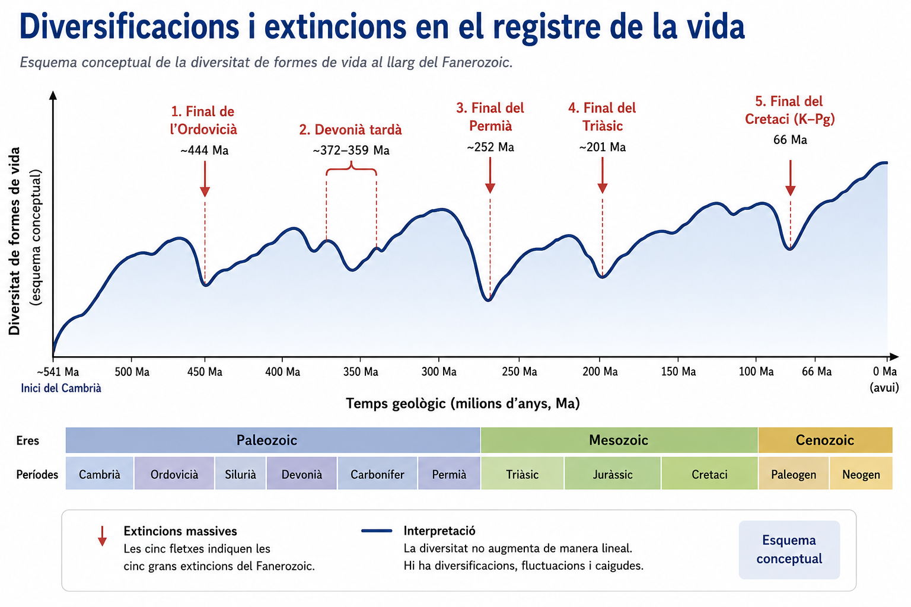

<!--
FIGURA UD03-GUIA-F08
Funció: integrar en una sola figura la variació de la biodiversitat al llarg del Fanerozoic i la posició de les cinc grans extincions.

Disseny:
- gràfic conceptual de diversitat al llarg del Fanerozoic, sense pretendre una reconstrucció quantitativa exacta;
- mostrar que la biodiversitat no augmenta de manera lineal: hi ha diversificacions, fluctuacions i caigudes;
- marcar clarament les cinc grans extincions:
  final de l'Ordovicià (~444 Ma);
  Devonià tardà (~372–359 Ma);
  final del Permià (~252 Ma);
  final del Triàsic (~201 Ma);
  final del Cretaci / K–Pg (66 Ma);
- les cinc crisis han d'aparèixer com a caigudes dins el mateix patró general, no com una llista desconnectada;
- es pot assenyalar l'inici del Cambrià (~541 Ma) com a referència temporal;
- no afegir percentatges d'extinció ni valors de diversitat no documentats;
- no incloure causes detallades: aquestes ja es desenvolupen a la taula i al text;
- indicar discretament que és un "esquema conceptual";
- aspecte de gràfic científic net, no de pòster.
-->

### 3.10. Sobreviure a una crisi no significa ser «millor»

Una extinció massiva modifica les condicions ambientals a una velocitat i una intensitat extraordinàries.

Això fa que característiques que abans eren neutres o poc importants puguin convertir-se en avantatges, i que adaptacions que havien funcionat durant milions d’anys deixin de ser útils.

La probabilitat de supervivència pot estar relacionada amb factors com:

- amplitud geogràfica;
- tipus d’alimentació;
- capacitat de viure en ambients diferents;
- mida corporal;
- ritme reproductiu;
- dependència d’hàbitats o recursos molt específics.

Però **cap d’aquestes característiques garanteix la supervivència en totes les crisis**.

La causa concreta de la crisi importa. Una característica útil davant un refredament global no necessàriament ajuda davant una anòxia oceànica o un col·lapse de la producció primària.

A més, les poblacions poden desaparèixer o sobreviure per factors contingents.

Per tant, és incorrecte interpretar una extinció així:

**els organismes pitjor adaptats desapareixen i els millors sobreviuen**

És més rigorós dir:

> **una crisi canvia bruscament les condicions de selecció; els efectes depenen de les característiques dels llinatges, de la naturalesa de la crisi i de la contingència històrica.**

### 3.11. Després de la crisi: ecosistemes reorganitzats

Una extinció massiva no només elimina espècies. També pot provocar:

- desaparició de depredadors o competidors;
- ruptura de xarxes tròfiques;
- pèrdua d’organismes constructors d’hàbitat;
- disponibilitat de recursos abans intensament explotats;
- aparició de noves combinacions ecològiques.

Els ecosistemes posteriors **no són simplement els ecosistemes antics amb menys espècies**. Es reorganitzen.

Durant aquesta reorganització, alguns llinatges supervivents poden ocupar espais ecològics que abans estaven ocupats per altres grups i, eventualment, diversificar-se.

Però hi ha dues idees que hem de separar:

**recuperació ecològica**  
= reconstrucció de xarxes tròfiques, biomassa i funcionament dels ecosistemes;

**diversificació evolutiva**  
= aparició i ramificació de nous llinatges.

No són necessàriament processos simultanis ni tenen la mateixa velocitat.


### 3.12. Un exemple: la crisi K–Pg i les diversificacions posteriors

Fa **66 Ma**, al límit entre el Cretaci i el Paleogen, es va produir una de les extincions massives més conegudes.

Entre els grups que varen desaparèixer hi havia:

- els **dinosaures no aviaris**;
- els ammonits;
- nombrosos organismes planctònics i molts altres llinatges.

Altres grups varen sobreviure, entre ells les **aus**, que són un llinatge de dinosaures, i diversos llinatges de mamífers.

Després de la crisi, els mamífers varen experimentar importants diversificacions ecològiques i taxonòmiques.

Però seria massa simple afirmar:

> «varen desaparèixer els dinosaures i llavors varen aparèixer els mamífers».

Els mamífers **ja existien des de feia més de 100 milions d’anys** abans de l’extinció K–Pg i ja presentaven certa diversitat.

La crisi va eliminar molts llinatges i va reorganitzar els ecosistemes. Això va generar oportunitats que alguns grups supervivents varen poder aprofitar durant els milions d’anys següents.

Aquesta és una diferència important entre **originar un grup** i **afavorir-ne una diversificació posterior**.

### 3.13. I l’actual pèrdua de biodiversitat?

Avui observam una disminució ràpida de nombroses poblacions i l’extinció d’espècies associada principalment a activitats humanes.

Per això és freqüent trobar l’expressió **«sisena extinció massiva»**.

La comparació amb les crisis del passat és útil, però l’hem de formular amb precisió.

Les taxes actuals d’extinció són molt superiors a les taxes de fons estimades per a molts grups, i la velocitat dels canvis ambientals és preocupant. Tanmateix, si utilitzam estrictament el criteri paleontològic d’haver perdut aproximadament tres quartes parts de les espècies, **encara no s’ha assolit aquesta magnitud global**.

Per tant, és més rigorós afirmar que:

> **estam en una crisi de biodiversitat d’origen principalment humà que, si continua, podria arribar a tenir una magnitud comparable a una extinció massiva.**

En aquesta unitat ens interessa sobretot la comparació amb el registre geològic. Les causes actuals de pèrdua de biodiversitat i les estratègies de conservació s’estudiaran amb més profunditat en la unitat d’ecologia i sostenibilitat.

---

> **Idees clau del bloc 3**
>
> - L’**evolució** és el canvi heretable de les poblacions al llarg de les generacions; els individus no evolucionen biològicament durant la seva vida.
> - La **selecció natural** actua sobre variació heretable existent i el valor d’una característica depèn del context ambiental.
> - La **deriva genètica** i la **contingència històrica** també contribueixen a explicar l’evolució dels llinatges.
> - L’aïllament i la divergència poden originar nous llinatges; en determinades circumstàncies poden produir-se **radiacions adaptatives**.
> - El registre fòssil mostra aparicions, diversificacions i extincions, però és **incomplet i esbiaixat**.
> - Una **extinció massiva** és una pèrdua excepcionalment gran de biodiversitat global en un interval geològicament curt.
> - Les cinc grans extincions varen tenir causes i dinàmiques diferents; no totes es poden explicar amb un únic mecanisme.
> - Sobreviure a una crisi **no significa ser més evolucionat ni universalment millor adaptat**.
> - Després d’una extinció, els ecosistemes es reorganitzen i alguns llinatges poden diversificar-se aprofitant **oportunitats ecològiques**, però aquesta resposta no és automàtica.
> - La crisi actual de biodiversitat presenta taxes d’extinció elevades, però no s’ha de confondre sense matisos amb haver completat ja una sisena extinció massiva.

---

## 4. L’arbre de la vida: parentiu, evolució i classificació

La biodiversitat actual conté milions d’espècies amb formes, mides i maneres de viure molt diferents. Aquesta diversitat, però, no és un conjunt de peces independents: tots els organismes formen part d’una **història evolutiva comuna**.

Reconstruir aquesta història significa intentar respondre preguntes com:

- quins organismes comparteixen un avantpassat comú més recent;
- quines característiques varen aparèixer en cada llinatge;
- quines semblances reflecteixen parentiu i quines han aparegut independentment;
- i com podem construir una classificació que representi aquestes relacions.

La representació d’aquesta història ramificada és el que anomenam, en sentit ampli, **arbre de la vida**.

### 4.1. Tots els éssers vius actuals comparteixen una història

En el bloc 1 vàrem veure que tots els organismes cel·lulars comparteixen característiques molt profundes: material genètic basat en àcids nucleics, ribosomes, un codi genètic gairebé universal i molts mecanismes bioquímics fonamentals.

Aquestes semblances s’expliquen millor si els organismes actuals comparteixen **avantpassats comuns**.

Això no significa que existís una única cadena:

**primer grup → segon grup → tercer grup → organismes actuals**

La història evolutiva té forma de **ramificació**. Quan un llinatge ancestral es divideix i les poblacions descendents continuen evolucionant de manera independent, es generen dues branques. La repetició d’aquest procés durant milers de milions d’anys produeix un arbre immens.

Per això, una manera més adequada de representar la història de la vida és:

**avantpassat comú → ramificacions → nous llinatges → noves ramificacions**

Moltes branques s’han extingit. Les espècies actuals són només els extrems de les branques que han arribat fins al present.

### 4.2. Què representa un cladograma?

Un **cladograma** és un diagrama que representa una **hipòtesi de parentiu evolutiu** entre organismes o grups d’organismes.

Els elements principals són:

- **branques**: representen llinatges;
- **nodes**: punts on un llinatge ancestral es divideix en dos o més llinatges descendents;
- **extrems o terminals**: representen els grups que comparam;
- **arrel**, si n’hi ha: indica la zona més antiga de l’arbre i permet interpretar la direcció general de la història representada.

Un node representa l’**avantpassat comú més recent** dels llinatges que en descendeixen.

Dos grups que comparteixen entre ells un avantpassat comú més recent que amb qualsevol altre grup de l’arbre són **grups germans**.

Per exemple:

```text
        ┌── A
    ┌───┤
    │   └── B
────┤
    │   ┌── C
    └───┤
        └── D
```

A i B són grups germans. C i D també ho són. El node que uneix A i B és més recent que el node que uneix A amb C o D.

La pregunta correcta per comparar parentius no és:

> «Quins dos noms estan més a prop al dibuix?»

sinó:

> **«Quins dos grups comparteixen l’avantpassat comú més recent?»**

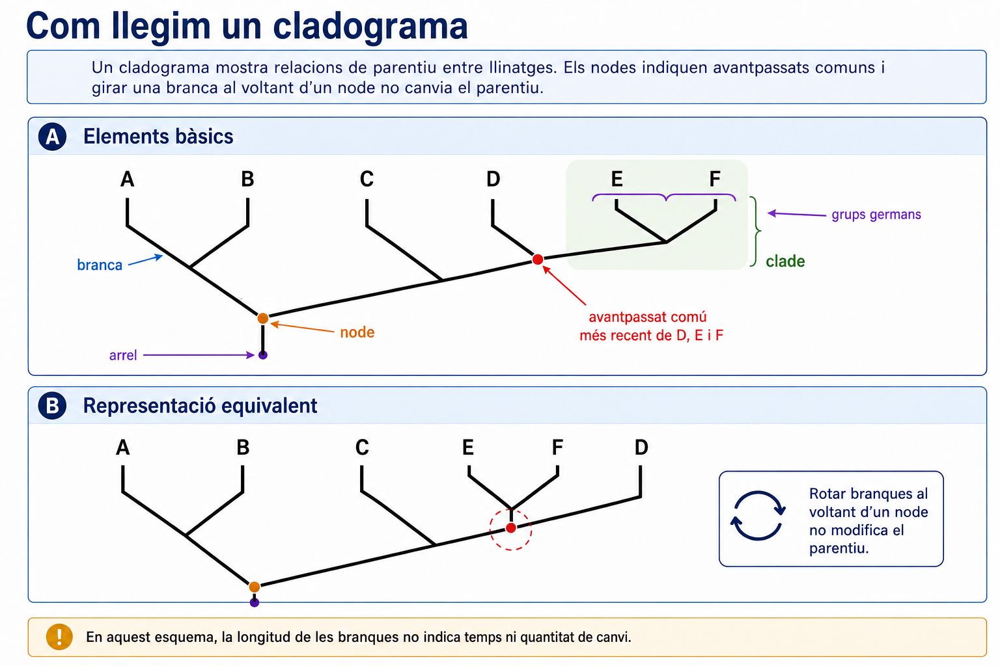

<!--
FIGURA UD03-GUIA-F09
Funció: figura de referència per interpretar qualsevol cladograma de la unitat.

Disseny:
- cladograma senzill de 5–6 terminals;
- identificar discretament:
  arrel;
  branca;
  node;
  avantpassat comú més recent;
  grups germans;
  un clade;
- mostrar al costat una segona representació equivalent obtinguda girant una branca al voltant d'un node;
- deixar clar que la rotació no modifica el parentiu;
- evitar escales temporals o longituds de branca interpretables si no representen temps;
- no utilitzar "més evolucionat", "superior" ni "inferior".
-->

### 4.3. La forma del dibuix pot enganyar

Els cladogrames es poden dibuixar de moltes maneres sense modificar la hipòtesi evolutiva que representen.

Podem **girar les branques al voltant d’un node** i el parentiu continuarà essent exactament el mateix.

Per exemple:

```text
        ┌── A
    ┌───┤
    │   └── B
────┤
    │   ┌── C
    └───┤
        └── D
```

i

```text
        ┌── D
    ┌───┤
    │   └── C
────┤
    │   ┌── B
    └───┤
        └── A
```

poden representar les mateixes relacions.

Això té diverses conseqüències importants.

#### La proximitat visual no indica parentiu

Dos noms poden quedar molt junts al paper i, tanmateix, no ser els grups més estretament emparentats.

El que importa és **quins nodes comparteixen**.

#### Estar «a dalt» o «a la dreta» no significa estar més evolucionat

La posició gràfica dels terminals depèn de com hem decidit dibuixar l’arbre.

Tots els organismes actuals han tengut exactament el mateix temps d’evolució des del seu avantpassat comú.

#### Un grup actual no és necessàriament l’avantpassat d’un altre grup actual

Si dues espècies actuals comparteixen un node, això significa que comparteixen un **avantpassat ancestral**, no que una de les dues sigui l’avantpassat de l’altra.

Els humans, per exemple, no descendim dels ximpanzés actuals, ni els ximpanzés actuals descendeixen dels humans. Compartim avantpassats comuns.

#### La longitud de les branques no sempre significa temps

En alguns arbres filogenètics, la longitud de les branques pot representar temps o quantitat de canvi evolutiu. En un cladograma senzill, però, sovint **només importa l’ordre de les ramificacions**.

Per tant, no hem d’interpretar una branca com a «més antiga», «més llarga» o «més evolucionada» si el diagrama no proporciona explícitament una escala.

### 4.4. Què és un clade?

Un **clade** és un grup format per:

> **un avantpassat comú i tots els seus descendents**

També s’anomena **grup monofilètic**.

En un cladograma, si podem «tallar» una sola branca i obtenir tot el grup, probablement estam identificant un clade.

Aquesta idea és central en les classificacions evolutives modernes, perquè intenten que els grups taxonòmics representin **branques completes de l’arbre de la vida**.

No totes les agrupacions tradicionals compleixen aquesta condició.

Podem distingir:

- **grup monofilètic**: inclou un avantpassat i tots els seus descendents;
- **grup parafilètic**: inclou un avantpassat però exclou una part dels seus descendents;
- **grup polifilètic**: agrupa organismes de branques diferents sense incloure adequadament el seu avantpassat comú més recent.

Un exemple clàssic és parlar dels «rèptils» excloent les aus. Les aus descendeixen d’un llinatge de dinosaures teròpodes i, per tant, si volem un grup que contingui tots els descendents d’aquell avantpassat, **les aus queden dins el llinatge dels rèptils en sentit filogenètic ampli**.

Això pot resultar estrany si pensam només en l’aspecte extern dels organismes, però és una conseqüència directa d’intentar que la classificació representi la història evolutiva.

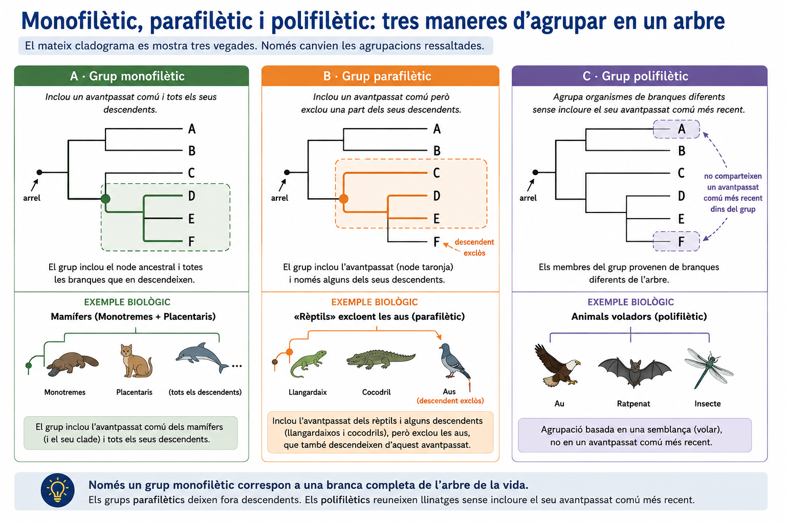

<!--
FIGURA UD03-GUIA-F10
Funció: distingir visualment agrupacions que reflecteixen o no una branca completa de l'arbre.

Disseny:
- un únic cladograma senzill repetit tres vegades;
- ressaltar en cada panell:
  A) grup monofilètic;
  B) grup parafilètic;
  C) grup polifilètic;
- definició visual, amb molt poc text;
- evitar exemples taxonòmics que exigeixin coneixements previs;
- el text del material ja pot aportar l'exemple dels rèptils/aus.
-->

### 4.5. Quines característiques ens informen sobre el parentiu?

Per reconstruir un arbre filogenètic comparam **caràcters**.

Un caràcter és una característica que pot presentar diferents estats: per exemple, presència o absència d’una estructura, tipus d’esquelet, una determinada seqüència d’ADN o una variant d’una proteïna.

Però **no totes les semblances tenen el mateix valor evolutiu**.

#### Homologia: semblança per origen comú

Dues estructures són **homòlogues** quan deriven d’una estructura present en un avantpassat comú, encara que actualment puguin tenir funcions diferents.

El braç humà, l’ala d’un ratpenat, l’aleta anterior d’una balena i la pota anterior d’un cavall comparteixen el mateix patró bàsic d’ossos perquè deriven de l’extremitat anterior dels tetràpodes ancestrals.

Les homologues constitueixen evidències de **parentiu evolutiu**.

#### Convergència evolutiva: semblança apareguda independentment

L’evolució pot produir característiques semblants en llinatges poc emparentats quan estan sotmesos a pressions selectives semblants.

Això s’anomena **convergència evolutiva**.

Per exemple, els taurons i els dofins tenen un cos hidrodinàmic semblant, però aquesta forma no indica que siguin parents pròxims: un és un peix cartilaginós i l’altre és un mamífer.

Per tant:

> **compartir una característica no basta, per si sol, per demostrar un parentiu proper.**

Hem de determinar si la semblança és probablement homòloga i analitzar-la juntament amb moltes altres evidències.

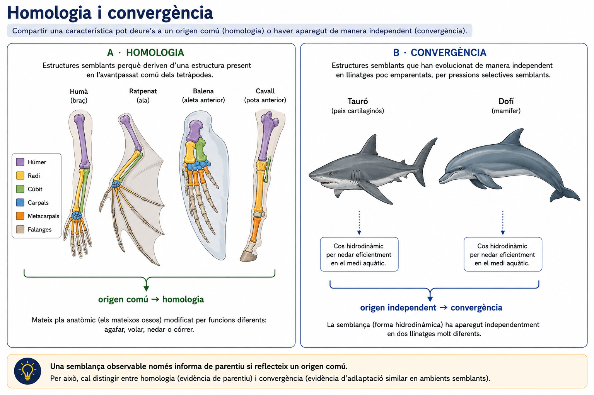

<!--
FIGURA UD03-GUIA-F11
Funció: explicar per què una semblança observable pot ser informativa o enganyosa per reconstruir parentius.

Disseny:
- panell A: extremitats anteriors de diversos tetràpodes amb el mateix patró ossi bàsic;
- panell B: silueta hidrodinàmica de tauró i dofí;
- etiquetes mínimes:
  "origen comú → homologia"
  "origen independent → convergència"
- rigor anatòmic suficient per veure correspondències;
- evitar dir simplement "òrgans anàlegs" sense mostrar el procés evolutiu.
-->

### 4.6. Caràcters ancestrals i caràcters derivats

No basta saber que diversos organismes comparteixen una característica. També interessa saber **quan va aparèixer dins l’arbre**.

Un **caràcter ancestral** és una característica que ja era present en un avantpassat més antic del grup que estudiam.

Un **caràcter derivat** és una modificació que aparegué posteriorment en una determinada branca.

Quan diversos organismes comparteixen un **caràcter derivat heretat d’un avantpassat comú**, aquesta característica pot ajudar a identificar un clade. Aquesta semblança compartida derivada s’anomena **sinapomorfia**.

Per exemple, els pèls són una característica derivada compartida pels mamífers actuals i heretada del seu avantpassat comú.

En canvi, la presència de columna vertebral no ens serveix per demostrar que dos mamífers siguin especialment pròxims entre ells, perquè és una característica molt més antiga compartida amb molts altres vertebrats.

Per això, en una anàlisi filogenètica:

> **no comptam simplement quantes semblances hi ha; intentam determinar quines semblances informen realment sobre ramificacions concretes.**

### 4.7. Com sabem quin estat és ancestral?

Per interpretar els caràcters sovint comparam el grup que volem estudiar amb un **grup extern** (*outgroup*).

El grup extern està relacionat amb els organismes estudiats, però va divergir abans que els llinatges que volem comparar entre ells.

Si tots els membres del grup extern presenten un estat del caràcter i només una part del grup estudiat en presenta un altre, això pot ajudar-nos a inferir quin estat és probablement ancestral i quin és derivat.

Aquesta inferència no és infal·lible. Els caràcters poden perdre’s, aparèixer repetidament o canviar més d’una vegada. Per això els arbres moderns no es construeixen a partir d’una sola característica.

### 4.8. Les molècules també conserven història evolutiva

Durant molt de temps, les classificacions es varen basar principalment en característiques observables:

- forma del cos;
- anatomia;
- desenvolupament;
- estructures cel·lulars;
- comportament.

Aquestes dades continuen essent molt importants.

Però avui podem comparar també **seqüències d’ADN, ARN i proteïnes**.

Si dues espècies comparteixen un avantpassat comú, les seves seqüències deriven de seqüències ancestrals comunes. Amb el temps, les mutacions introdueixen diferències.

En general, dues seqüències molt semblants poden indicar un parentiu relativament proper, però aquesta idea s’ha d’utilitzar amb precaució:

- les diferents regions del genoma evolucionen a velocitats diferents;
- una mateixa posició pot canviar més d’una vegada;
- els gens individuals poden tenir històries que no coincideixen exactament amb la història de les espècies;
- en microorganismes, la transferència horitzontal de gens pot complicar el patró.

Per això, les filogènies modernes solen combinar **moltes dades moleculars** i, quan és possible, també evidències morfològiques, paleontològiques i biogeogràfiques.

### 4.9. Un arbre filogenètic és una hipòtesi científica

Un cladograma no és una fotografia directa del passat.

És una **hipòtesi** construïda a partir de dades.

Podem tenir dues hipòtesis diferents que expliquin una part de les observacions. Quan apareixen noves dades, podem:

- mantenir l’arbre anterior;
- modificar la posició d’un llinatge;
- descobrir que un grup tradicional no era monofilètic;
- o obtenir una resolució millor d’una part de l’arbre que abans era incerta.

Això no significa que la classificació sigui arbitrària. Significa que, com qualsevol explicació científica, **s’ha de revisar quan les evidències milloren**.

Una classificació pot canviar encara que els organismes no hagin canviat: el que ha canviat és **la nostra reconstrucció de la seva història**.

### 4.10. Classificar i reconstruir el parentiu no són exactament el mateix

**Classificar** és ordenar la diversitat en grups i assignar-hi noms.

**Reconstruir una filogènia** és formular una hipòtesi sobre les relacions de parentiu evolutiu.

La taxonomia moderna intenta que totes dues tasques siguin coherents: si un grup rep un nom formal, idealment hauria de correspondre a un **clade**.

Les classificacions utilitzen tradicionalment una jerarquia de categories:

**domini → regne → fílum o divisió → classe → ordre → família → gènere → espècie**

Aquestes categories ens permeten ordenar i comunicar la informació, però no hem d’imaginar-les com graons naturals equivalents. Una «família» d’un grup no representa necessàriament la mateixa quantitat de diversitat o antiguitat que una família d’un altre.

El que té significat evolutiu directe és sobretot **la posició dels grups dins l’arbre i els avantpassats comuns que comparteixen**.

### 4.11. Espècies i noms científics

L’**espècie** és la unitat bàsica que utilitzam habitualment per descriure la biodiversitat, però definir què és una espècie no sempre és senzill.

Per a molts organismes amb reproducció sexual, és útil el **concepte biològic d’espècie**: poblacions que poden reproduir-se entre elles i que es troben reproductivament aïllades d’altres poblacions.

Aquest criteri, però, no funciona bé en tots els casos:

- organismes amb reproducció asexual;
- fòssils;
- poblacions geogràficament separades;
- grups on hi ha hibridació.

Per això existeixen diversos conceptes d’espècie i els taxònoms utilitzen diferents tipus d’evidència segons el grup estudiat.

Per comunicar-nos sense ambigüitats utilitzam la **nomenclatura binomial**. Cada espècie rep un nom format per:

**Gènere + epítet específic**

per exemple:

*Homo sapiens*

El nom del gènere comença amb majúscula; l’epítet específic, amb minúscula; i tots dos s’escriuen habitualment en cursiva.

El nom científic no explica per si mateix tota la filogènia, però proporciona una manera internacional i relativament estable d’identificar una espècie.

### 4.12. Els grans llinatges de la vida

La classificació actual reconeix tres grans denominacions de **domini**:

- **Bacteria**
- **Archaea**
- **Eukarya**

Bacteris i arqueus tenen cèl·lules procariotes, però constitueixen llinatges profundament diferents.

| Gran grup | Característiques generals |
|---|---|
| **Bacteria** | Procariotes; gran diversitat metabòlica; paret amb peptidoglicà en molts grups |
| **Archaea** | Procariotes; membranes i maquinària molecular característiques; gran diversitat metabòlica |
| **Eukarya** | Cèl·lules amb nucli i sistema intern de membranes; inclou organismes unicel·lulars i pluricel·lulars |

No hem d’identificar els arqueus simplement amb «organismes extremòfils». Alguns viuen en ambients extrems, però també són abundants en oceans, sòls i microbiotes.

Dins els eucariotes trobam diversos grans llinatges. Entre els més coneguts hi ha:

#### Animals

Organismes pluricel·lulars heteròtrofs, generalment amb nutrició per ingestió, sense paret cel·lular i amb diferenciació de teixits.

#### Fongs

Eucariotes heteròtrofs que obtenen nutrients principalment per absorció. Presenten paret cel·lular amb quitina en els grups característics. Molts són pluricel·lulars, però també hi ha formes unicel·lulars com els llevats.

#### Plantes

En sentit habitual escolar, organismes eucariotes pluricel·lulars fotosintètics, amb parets cel·lulars de cel·lulosa i cloroplasts. Les plantes terrestres formen part d’un llinatge més ampli que inclou algues verdes.

#### Altres llinatges eucariotes

Existeix una enorme diversitat d’eucariotes principalment unicel·lulars o de pluricel·lularitat simple: amebes, ciliats, diatomees i molts grups d’algues, entre d’altres.

Històricament molts d’aquests organismes s’agruparen dins el regne **Protista**. Aquesta categoria és útil de vegades com a etiqueta descriptiva, però **no representa un únic clade**: agrupa llinatges eucariotes que no formen entre ells una única branca exclusiva de l’arbre.

Per això, una classificació moderna no s’ha d’entendre com una llista fixa de «cinc regnes» que s’hagi de memoritzar, sinó com un intent de representar una filogènia que continua refinant-se.

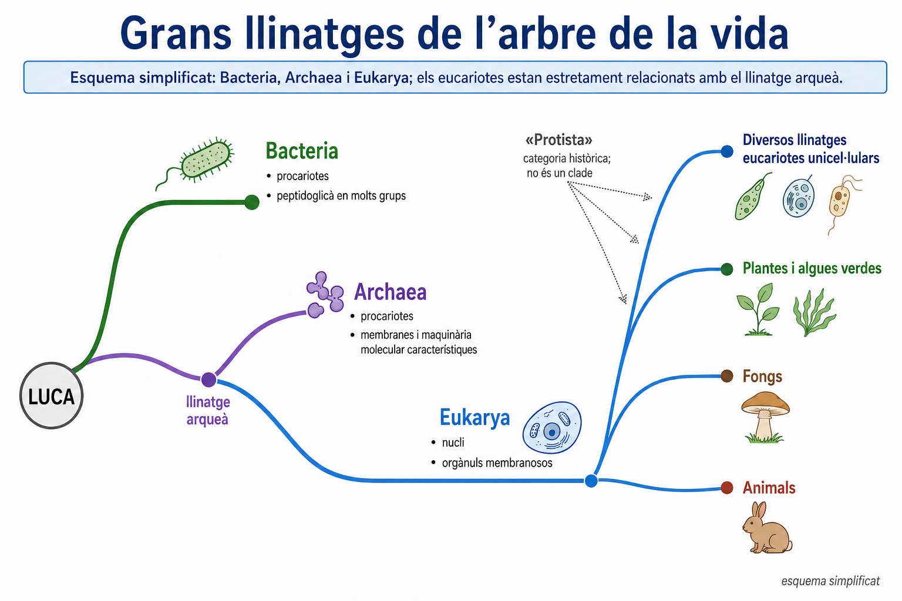

<!--
FIGURA UD03-GUIA-F12
Funció: situar els principals grups taxonòmics dins una història evolutiva, no construir una enciclopèdia de regnes.

Disseny:
- arbre molt simplificat des de LUCA;
- mostrar Bacteria i Archaea com grans llinatges procariotes;
- situar Eukarya relacionat estretament amb Archaea, evitant dibuixar tres branques profundes com si la seva relació fos necessàriament una trifurcació simètrica;
- dins Eukarya, mostrar només:
  diversos llinatges eucariotes unicel·lulars;
  plantes/algues verdes;
  fongs;
  animals;
- remarcar visualment que "Protista" no és una única branca;
- incloure només 1–2 característiques fonamentals per gran grup;
- indicar discretament "esquema simplificat";
- no presentar la figura com una filogènia resolta amb detall.
-->

### 4.13. Tres dominis com a classificació i un arbre més complex com a història

Aquí convé distingir **categoria taxonòmica** i **hipòtesi filogenètica**.

La denominació de tres dominis —Bacteria, Archaea i Eukarya— continua essent molt utilitzada per classificar els organismes.

Tanmateix, les dades moleculars actuals indiquen que la història profunda de la vida no queda ben representada com tres branques equivalents que parteixen simultàniament de LUCA.

Moltes anàlisis situen l’origen dels eucariotes **dins o molt estretament associat a la diversificació dels arqueus**. Això és coherent amb el que ja sabem sobre l’origen endosimbiòtic dels mitocondris: la cèl·lula eucariota conté una història en què participaren llinatges diferents.

Per al nivell d’aquesta unitat no necessitam resoldre la topologia detallada de les branques més profundes. La idea important és una altra:

> **les categories que utilitzam per classificar són eines; l’arbre evolutiu és una hipòtesi sobre la història, i aquesta hipòtesi es pot refinar quan apareixen dades noves.**

### 4.14. L’arbre de la vida no és una escala

Arribats a aquest punt podem corregir definitivament una imatge molt arrelada: la idea d’una escala de progrés que va des de microorganismes «primitius» fins a organismes «superiors».

Un arbre filogenètic no té una branca final privilegiada.

Els bacteris actuals no són «fòssils vius» que hagin deixat d’evolucionar. Els arqueus no són etapes intermèdies cap als eucariotes. Els humans no ocupam el cim de l’arbre.

Cada llinatge actual és el resultat d’una història evolutiva pròpia i ha continuat evolucionant fins al present.

Podem parlar de característiques **ancestrals** o **derivades**, de llinatges que es varen separar abans o després dins un arbre concret, o de major o menor complexitat per a una característica determinada.

Però expressions com:

- «més evolucionat»;
- «menys evolucionat»;
- «organisme superior»;
- «grup que s’ha quedat enrere»

no descriuen adequadament el parentiu evolutiu.

### 4.15. De l’arbre a la biodiversitat actual

Reconstruir parentius no serveix només per ordenar noms.

L’arbre de la vida ens permet entendre que la biodiversitat actual és el resultat combinat de:

- **ramificació de llinatges**;
- aparició de noves característiques;
- persistència de llinatges antics;
- convergència evolutiva;
- extincions;
- diversificacions;
- i milions d’anys d’història independent.

Això també modifica la manera d’interpretar la biodiversitat.

Dues regions poden tenir el mateix nombre d’espècies però conservar **històries evolutives molt diferents**. Una espècie que és l’única representant actual d’un llinatge antic aporta una part de la història de la vida que no queda reflectida simplement comptant espècies.

Per tant, passar de la classificació a la biodiversitat significa deixar de veure les espècies només com una llista i començar a veure-les com **branques d’una història comuna**.

Aquesta serà la connexió amb el bloc següent.

---

> **Idees clau del bloc 4**
>
> - La història de la vida és **ramificada**: els organismes actuals comparteixen avantpassats comuns.
> - Un **cladograma** representa una hipòtesi de parentiu; els nodes indiquen avantpassats comuns i el parentiu es determina comparant nodes, no la proximitat visual.
> - Girar branques al voltant d’un node no modifica les relacions representades i la posició gràfica no indica que un grup sigui «més evolucionat».
> - Un **clade o grup monofilètic** conté un avantpassat comú i tots els seus descendents.
> - Les **homologies** poden informar sobre origen comú; la **convergència evolutiva** pot produir semblances que no indiquen parentiu proper.
> - Els caràcters derivats compartits poden ajudar a identificar branques de l’arbre, però les filogènies es construeixen integrant moltes evidències.
> - Les dades d’**ADN, ARN i proteïnes** han transformat la reconstrucció de les relacions evolutives i poden obligar a revisar classificacions antigues.
> - Classificar i reconstruir una filogènia no són exactament el mateix; la taxonomia moderna intenta que els grups representin **llinatges evolutius reals**.
> - Bacteria, Archaea i Eukarya són grans categories de classificació, però la història profunda dels eucariotes està estretament relacionada amb els arqueus i és més complexa que una simple trifurcació.
> - Animals, fongs i plantes són grans llinatges eucariotes, mentre que «protists» no constitueixen un únic clade.
> - L’arbre de la vida no té un cim: tots els llinatges actuals han continuat evolucionant fins al present.
> - La biodiversitat actual és també **diversitat d’històries evolutives**, no només una quantitat d’espècies.

---

## 5. De l’arbre de la vida a la biodiversitat actual

La biodiversitat que observam avui és el resultat provisional d’una història de **ramificacions, extincions, dispersions, aïllaments i canvis ambientals** que s’estén durant milers de milions d’anys.

Per això, biodiversitat no significa simplement «moltes espècies».

Dues regions poden tenir exactament el mateix nombre d’espècies i, tanmateix, diferir molt en:

- la variació genètica que contenen;
- la proporció d’espècies endèmiques;
- la diversitat d’ecosistemes;
- les relacions de parentiu entre les espècies;
- l’estat de conservació de les seves poblacions.

Entendre la biodiversitat implica, per tant, combinar **quantitat, diferència i història evolutiva**.

### 5.1. La biodiversitat existeix a diferents nivells

Habitualment distingim tres grans nivells de biodiversitat:

#### Diversitat genètica

És la variació hereditària existent **dins una espècie**.

Dues poblacions de la mateixa espècie poden presentar diferències genètiques perquè han estat separades, perquè viuen en ambients diferents o perquè la seva història demogràfica no ha estat la mateixa.

Aquesta variació és important perquè constitueix part de la matèria primera sobre la qual pot actuar l’evolució.

Una espècie pot continuar existint però haver perdut una part important de la seva diversitat genètica si les seves poblacions s’han reduït molt o han quedat fragmentades.

Per això:

> **conservar una espècie no consisteix només a evitar que desaparegui el darrer individu.**

També importa mantenir poblacions viables i suficientment diverses.

#### Diversitat d’espècies

Fa referència a la varietat d’espècies presents en una zona.

El component més senzill és la **riquesa específica**:

> **nombre d’espècies diferents presents**

Però dues comunitats amb la mateixa riquesa poden ser molt diferents.

Imagina dues comunitats amb quatre espècies:

- comunitat A: totes quatre tenen abundàncies semblants;
- comunitat B: una espècie representa gairebé tots els individus i les altres tres són molt escasses.

Tenen la mateixa riquesa específica, però la distribució dels individus entre les espècies és diferent.

Aquesta distribució s’anomena sovint **equitativitat** o uniformitat.

Per això, alguns índexs de diversitat combinen **riquesa i abundància relativa**, encara que en aquesta unitat no necessitam calcular-los.

#### Diversitat d’ecosistemes

També forma part de la biodiversitat la varietat d’**ambients, comunitats i processos ecològics** presents en un territori.

Un arxipèlag que conté sistemes dunars, penya-segats litorals, alzinars, torrents, zones humides i ambients marins conserva més varietat ecològica que un territori de la mateixa superfície ocupat per un únic tipus d’hàbitat.

Per tant, protegir una llista d’espècies sense conservar els ambients dels quals depenen no basta per mantenir la biodiversitat a llarg termini.

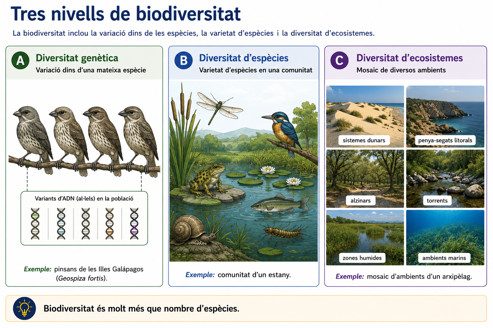

<!--
FIGURA UD03-GUIA-F13
Funció: deixar clar que biodiversitat no és sinònim de nombre d'espècies.

Disseny:
- tres panells coordinats:
  A) diversitat genètica: individus de la mateixa espècie amb variació;
  B) diversitat d'espècies: comunitat amb diverses espècies;
  C) diversitat d'ecosistemes: mosaic de diversos ambients;
- molt poc text;
- evitar representar diversitat genètica com simples diferències cosmètiques arbitràries;
- pensada com a figura de referència per comparar territoris.
-->

### 5.2. Comptar espècies és útil, però no basta

La **riquesa específica** és una mesura important perquè és fàcil d’entendre i permet comparar territoris.

Però pot ocultar diferències rellevants.

Considerem dues illes amb **40 espècies** cadascuna.

A primera vista podríem afirmar que tenen la mateixa biodiversitat. Però aquesta conclusió seria massa ràpida si:

- una illa té moltes espècies endèmiques i l’altra, cap;
- una conserva diversos ecosistemes i l’altra està molt homogeneïtzada;
- una manté poblacions grans i genèticament diverses i l’altra només petites poblacions aïllades;
- les espècies d’una representen branques evolutives molt diferents i les de l’altra pertanyen majoritàriament a llinatges molt pròxims.

La pregunta «quina illa té més biodiversitat?» no sempre té, per tant, una resposta única si abans no especificam **quin component de la biodiversitat estam comparant**.

Aquesta és una idea científica general:

> **una variable complexa no es pot descriure completament amb un únic nombre.**

### 5.3. La història evolutiva també forma part de la biodiversitat

El bloc anterior ens permet afegir una quarta perspectiva: la **diversitat filogenètica**.

No totes les espècies representen la mateixa quantitat d’història evolutiva independent.

Imagina dos territoris amb quatre espècies cadascun.

En el primer, les quatre espècies són molt pròximes entre elles i comparteixen un avantpassat comú recent.

En el segon, les quatre espècies pertanyen a branques molt separades de l’arbre de la vida.

Tots dos territoris tenen la mateixa riquesa específica, però el segon conserva una **major varietat de llinatges evolutius**.

Aquesta idea pot ser especialment important quan una espècie és l’única representant actual d’un llinatge antic: la seva desaparició elimina una branca evolutiva que no pot ser substituïda simplement per una altra espècie.

La diversitat filogenètica no substitueix la diversitat genètica, d’espècies o d’ecosistemes. És una manera complementària de preguntar:

> **quanta història evolutiva està representada en una comunitat?**


### 5.4. Què és un endemisme?

Una espècie és **endèmica** d’un territori quan la seva distribució natural queda restringida a aquell territori.

L’escala és important.

Podem parlar d’una espècie endèmica:

- d’una illa;
- d’un arxipèlag;
- d’una regió;
- d’una serralada;
- d’un continent.

Per tant, «endèmic» no significa necessàriament «molt rar». Significa **geogràficament restringit**.

Tampoc significa automàticament «amenaçat». Una espècie endèmica pot tenir poblacions abundants dins la seva àrea de distribució.

Tanmateix, una distribució molt petita pot augmentar la vulnerabilitat davant determinades amenaces, perquè un canvi local pot afectar una gran part o fins i tot tota la població mundial de l’espècie.

### 5.5. Per què les illes acumulen endemismes?

Les illes són laboratoris naturals especialment útils per entendre l’evolució.

Quan uns pocs individus colonitzen una illa, poden quedar **aïllats** de les poblacions d’origen.

A partir d’aquí poden actuar diversos processos:

- disminueix o desapareix el flux genètic amb la població continental;
- la **deriva genètica** pot ser important, especialment si la població inicial és petita;
- les condicions ambientals poden ser diferents;
- la selecció natural pot afavorir variants diferents;
- amb el temps poden aparèixer barreres reproductives.

Si la divergència és suficient, es pot originar una nova espècie.

Per tant, de manera simplificada:

**colonització → aïllament → divergència → possible especiació**

Però aquesta seqüència no és automàtica. No totes les poblacions insulars acaben convertint-se en espècies diferents.

A més, les illes no són sistemes completament tancats: poden rebre noves colonitzacions i les poblacions poden extingir-se.

La biodiversitat d’una illa és, per tant, el resultat d’un equilibri històric entre:

- **colonització**;
- **especiació**;
- **extinció**.

### 5.6. Distància, superfície i diversitat insular

No totes les illes ofereixen les mateixes oportunitats.

En termes generals:

- una illa **més pròxima** a una font continental sol ser més fàcil de colonitzar;
- una illa **més gran** sol contenir més hàbitats i pot mantenir poblacions més grans;
- una illa molt **aïllada** pot rebre menys colonitzadors, però també pot afavorir una evolució independent durant intervals llargs.

Això genera una aparent paradoxa interessant.

L’aïllament pot:

- reduir l’arribada de noves espècies;
- però al mateix temps afavorir la **diferenciació i l’endemisme** dels llinatges que ja hi són.

Per això no podem resumir la biodiversitat insular amb una regla com:

> «com més aïllada és una illa, més biodiversitat té».

La superfície, l’edat geològica, l’origen de l’illa, la diversitat d’hàbitats, la distància a altres terres i la història ambiental també importen.

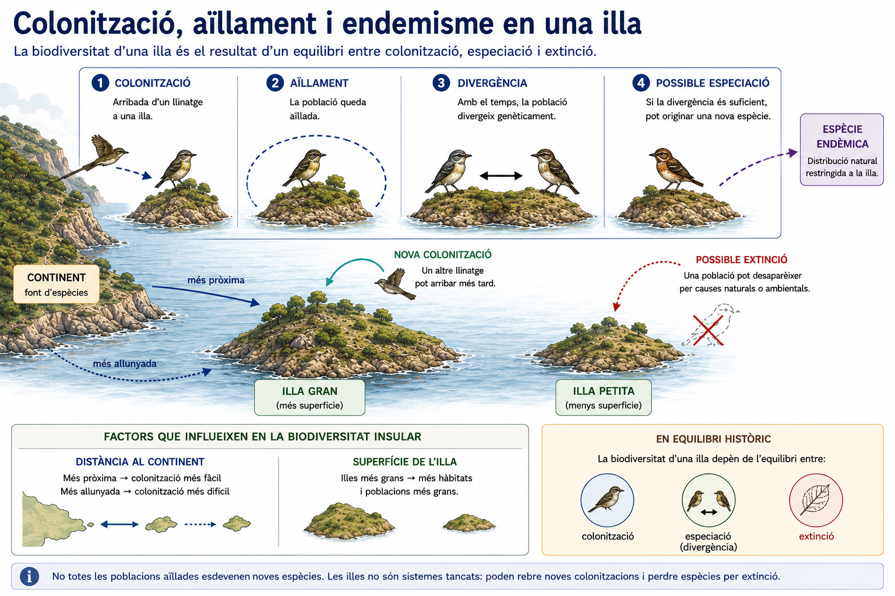

<!--
FIGURA UD03-GUIA-F14
Funció: relacionar insularitat, evolució i endemisme sense convertir-ho en una explicació completa de biogeografia insular.

Disseny:
- continent + dues illes;
- seqüència visual:
  colonització d'un llinatge;
  aïllament;
  divergència;
  possible espècie endèmica;
- mostrar també que poden produir-se noves colonitzacions i extincions;
- una indicació visual de distància i superfície, sense fórmules;
- evitar una fletxa determinista "aïllament = nova espècie".
-->

### 5.7. La biodiversitat de les Illes Balears: una història insular

Les Illes Balears constitueixen un bon exemple per aplicar aquestes idees.

La biodiversitat de l’arxipèlag és resultat de:

- la seva **història geològica**;
- els episodis de connexió i aïllament respecte d’altres terres;
- la colonització per organismes capaços d’arribar a les illes;
- la divergència posterior de poblacions aïllades;
- les extincions;
- i, més recentment, una intensa transformació humana del territori.

L’arxipèlag no és biològicament uniforme.

Cada illa i cada tipus d’hàbitat han tengut una història particular. Això ajuda a explicar que algunes espècies o subespècies presentin distribucions molt restringides.

Els endemismes són especialment interessants perquè constitueixen evidències vives de processos de **colonització, aïllament i evolució independent**.

Però no hem d’imaginar tota la biodiversitat balear com a endèmica. Una gran part de les espècies també és present en altres territoris mediterranis.

Per tant, el valor biològic de les Balears combina:

- espècies endèmiques;
- poblacions insulars diferenciades;
- espècies mediterrànies compartides amb altres regions;
- una gran diversitat d’ambients terrestres, litorals i marins.

### 5.8. Endemisme no és el mateix que espècie autòctona

Aquests dos conceptes es confonen sovint.

Una espècie **autòctona** és una espècie que forma part de la biota natural d’un territori sense haver-hi estat introduïda per l’activitat humana.

Una espècie **endèmica** és autòctona i, a més, té una distribució natural restringida al territori considerat.

Per tant:

**tota espècie endèmica és autòctona, però no tota espècie autòctona és endèmica.**

També podem distingir les espècies **introduïdes**, que han arribat a un territori per acció humana, intencionada o accidental.

Una espècie introduïda no és necessàriament invasora.

Parlam d’**espècie exòtica invasora** quan una espècie introduïda s’estableix, s’expandeix i provoca impactes ecològics, econòmics o socials significatius.

Aquesta precisió és important: no hem d’atribuir automàticament un impacte negatiu a qualsevol organisme que no sigui autòcton.

### 5.9. Quan consideram que una espècie està amenaçada?

Una espècie no està amenaçada simplement perquè sigui poc coneguda, rara o endèmica.

Per estimar el risc d’extinció s’analitzen dades com:

- nombre d’individus;
- tendència de les poblacions;
- extensió de l’àrea de distribució;
- grau de fragmentació;
- nombre de poblacions;
- intensitat i evolució de les amenaces.

Un sistema internacional molt utilitzat és la **Llista Vermella de la UICN**.

Entre les seves categories de risc hi ha:

- **Vulnerable (VU)**;
- **En perill (EN)**;
- **En perill crític (CR)**.

Aquestes categories no són opinions qualitatives. S’assignen aplicant **criteris quantitatius** sobre poblacions, distribució i risc d’extinció.

També existeixen categories com:

- **Preocupació menor (LC)**;
- **Gairebé amenaçada (NT)**;
- **Dades insuficients (DD)**.

«Dades insuficients» no significa que l’espècie estigui fora de perill: significa que **no tenim prou informació per avaluar-ne adequadament el risc**.

### 5.10. Per què disminueix la biodiversitat?

Les causes de pèrdua de biodiversitat poden actuar simultàniament.

Entre les més importants a escala global hi ha:

- destrucció i transformació d’hàbitats;
- fragmentació de poblacions;
- sobreexplotació;
- introducció d’espècies invasores;
- contaminació;
- canvi climàtic.

En sistemes insulars alguns d’aquests processos poden tenir efectes especialment intensos perquè moltes espècies:

- tenen distribucions petites;
- mantenen poblacions relativament reduïdes;
- han evolucionat durant molt de temps sense determinats depredadors, competidors o patògens.

Això no implica que totes les espècies insulars siguin necessàriament fràgils. Significa que **una àrea de distribució petita pot concentrar el risc**.

En aquesta unitat ens interessa comprendre aquesta relació amb la història evolutiva. Els mecanismes ecològics detallats i les estratègies de sostenibilitat es desenvoluparan més endavant.

### 5.11. Conservar què?

Dir que volem «conservar la biodiversitat» obliga a concretar què intentam mantenir.

Podem voler conservar:

- una espècie;
- la diversitat genètica de les seves poblacions;
- un clade particularment singular;
- un hàbitat;
- un conjunt d’interaccions ecològiques;
- un mosaic d’ecosistemes;
- processos evolutius que continuen actuant.

Aquestes prioritats no sempre coincideixen perfectament.

Per exemple, augmentar el nombre d’individus d’una espècie en captivitat no garanteix que mantenguem la seva diversitat genètica ni les relacions ecològiques que tenia en estat natural.

Per això la conservació moderna intenta treballar a **diverses escales simultàniament**.

Aquesta perspectiva connecta directament amb tota la unitat:

> **conservar biodiversitat significa conservar també una part de la història evolutiva de la Terra i la possibilitat que aquesta història continuï.**

### 5.12. No totes les fonts sobre biodiversitat tenen el mateix valor

Quan cercam informació sobre una espècie podem trobar:

- articles científics;
- bases de dades d’administracions públiques;
- inventaris de biodiversitat;
- fitxes de la UICN;
- museus i institucions científiques;
- entitats de conservació;
- premsa;
- blogs;
- xarxes socials;
- continguts sense autoria identificable.

Totes aquestes fonts poden contenir informació útil, però **no tenen la mateixa funció ni ofereixen el mateix nivell de garantia**.

Per seleccionar una font convé preguntar:

#### Qui n’és responsable?

Hi ha una institució, equip científic o autor identificable?

#### Quines dades aporta?

La informació es basa en observacions, mostreigs, bibliografia o criteris explícits, o simplement formula afirmacions sense indicar-ne l’origen?

#### Quan s’ha actualitzat?

La distribució d’una espècie o el seu estat de conservació poden canviar. Una font antiga pot continuar essent útil per a aspectes estables, però no necessàriament per descriure la situació actual.

#### És la font adequada per a la pregunta?

Una pàgina divulgativa pot ser excel·lent per entendre què és una espècie, però si volem conèixer-ne la categoria oficial d’amenaça és preferible consultar una **font específica i actualitzada**.

#### Podem contrastar la informació?

Una dada és més robusta quan és coherent amb altres fonts independents de qualitat.

> **Cercar informació científica no consisteix a trobar una pàgina que confirmi el que pensàvem. Consisteix a seleccionar evidències adequades per respondre una pregunta.**

### 5.13. Com documentar una espècie de manera rigorosa

Una fitxa breu sobre biodiversitat pot separar clarament **dades** i **interpretació**.

Per exemple:

| Pregunta | Informació a cercar |
|---|---|
| **Quina espècie és?** | Nom científic i grup taxonòmic |
| **On viu?** | Distribució geogràfica i hàbitat |
| **És endèmica?** | Àrea natural completa de distribució |
| **Quina és la situació de les poblacions?** | Abundància, tendència o dades disponibles |
| **Està amenaçada?** | Categoria i criteris de la font consultada |
| **Quines pressions l’afecten?** | Amenaces documentades |
| **D’on surt la informació?** | Font, autoria o institució i data |

És important no inferir més del que diu la font.

Per exemple:

- «només viu en una illa» **no permet concloure automàticament** que està en perill;
- «és una espècie protegida» **no significa necessàriament** que sigui escassa;
- «la població ha disminuït» necessita una escala temporal i una font;
- «és important per a l’ecosistema» necessita explicar quina funció o evidència sustenta aquesta afirmació.

La mateixa distinció que hem utilitzat durant tota la unitat continua essent vàlida:

**observació o dada → inferència → conclusió**

### 5.14. Una biodiversitat dinàmica

La biodiversitat actual no és un estat final.

Les poblacions continuen canviant, els llinatges continuen evolucionant, es produeixen noves colonitzacions, apareixen barreres, es formen espècies i també hi ha extincions.

L’activitat humana modifica avui molts d’aquests processos amb una intensitat molt elevada, però la biodiversitat sempre ha estat **dinàmica**.

Això no significa que qualsevol pèrdua sigui irrellevant perquè «l’extinció és natural».

La velocitat, la magnitud i les causes importen.

Una extinció elimina una combinació irrepetible d’informació genètica i història evolutiva, i pot modificar les comunitats de les quals formava part.

Per això, comprendre la biodiversitat actual exigeix mirar simultàniament:

- **cap al passat**, per reconstruir com s’ha originat;
- **al present**, per descriure com està distribuïda;
- **cap al futur**, per entendre què pot passar si canvien les condicions.

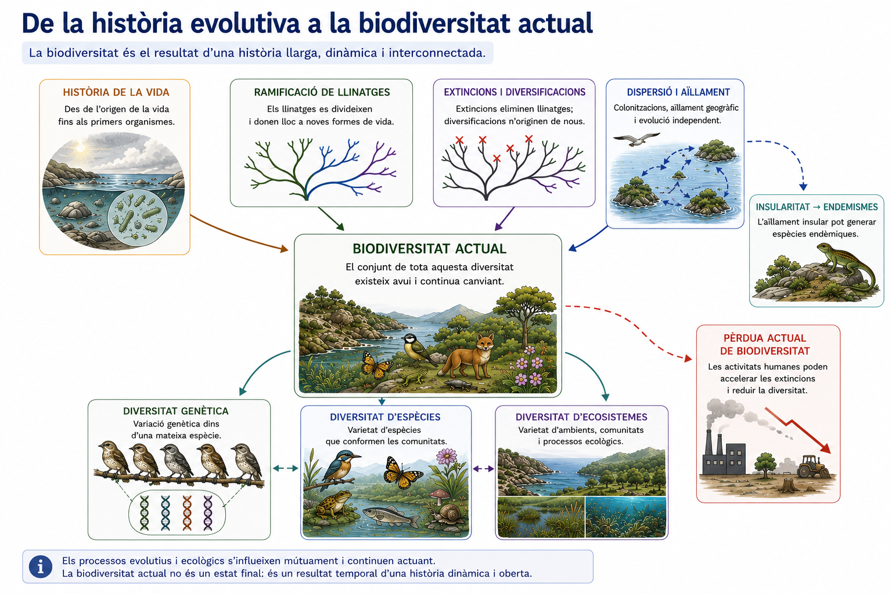

<!--
FIGURA UD03-GUIA-F15
Funció: tancament visual de tota la UD03.

Disseny:
- esquema net que connecti, sense una cadena determinista:
  història de la vida;
  ramificació de llinatges;
  extincions i diversificacions;
  dispersió i aïllament;
  diversitat genètica / d'espècies / d'ecosistemes;
  biodiversitat actual;
- incloure una petita branca específica cap a:
  insularitat → endemismes;
- incloure una indicació de pèrdua actual de biodiversitat, però sense convertir la figura en material de la futura UD d'ecologia;
- evitar una línia ascendent de "progrés";
- aspecte de mapa conceptual científic, no de pòster.
-->

### 5.15. La història que hem reconstruït

Al començament de la unitat ens demanàvem com podíem passar del registre geològic a una història de la vida.

Ara podem resumir el recorregut:

**matèria i organització**  
→ sistemes capaços de mantenir-se i evolucionar

**vida primerenca**  
→ una biosfera que comença a modificar el planeta

**fotosíntesi oxigènica**  
→ transformació progressiva dels oceans i de l’atmosfera

**nous llinatges i noves formes d’organització**  
→ eucariotes i pluricel·lularitat

**evolució, extinció i diversificació**  
→ una història amb crisis, supervivències i noves ramificacions

**arbre de la vida**  
→ parentius que podem reconstruir combinant evidències

**biodiversitat actual**  
→ diversitat genètica, d’espècies, d’ecosistemes i d’històries evolutives

Aquesta seqüència no és una escala de progrés ni una cadena simple de causes.

És una reconstrucció d’un sistema en què **vida i planeta han canviat conjuntament**, i en què cada espècie actual ocupa una branca d’una història molt més antiga que ella mateixa.

---

> **Idees clau del bloc 5**
>
> - La **biodiversitat** inclou diversitat genètica, diversitat d’espècies i diversitat d’ecosistemes; no és simplement el nombre d’espècies.
> - La riquesa específica és útil, però comunitats amb la mateixa riquesa poden diferir en abundància relativa, endemismes, diversitat genètica, ecosistemes i història evolutiva.
> - La **diversitat filogenètica** considera quanta història evolutiva representen els llinatges presents.
> - Una espècie **endèmica** té una distribució natural restringida a un territori; endèmic no significa necessàriament rar ni amenaçat.
> - L’aïllament insular pot afavorir divergència i especiació, però la biodiversitat d’una illa depèn també de colonització, extinció, superfície, distància, hàbitats i història geològica.
> - Les Illes Balears combinen endemismes, poblacions insulars diferenciades, espècies mediterrànies compartides i una gran diversitat d’ambients.
> - **Autòcton, endèmic, introduït i invasor** són conceptes diferents i no s’han d’utilitzar com a sinònims.
> - El risc d’extinció s’avalua utilitzant dades sobre poblacions, distribució i amenaces; una distribució petita no implica per si sola que una espècie estigui amenaçada.
> - Conservar biodiversitat pot implicar conservar gens, poblacions, espècies, llinatges, hàbitats i processos ecològics i evolutius.
> - Per estudiar la biodiversitat actual cal **seleccionar fonts adequades, actualitzades i contrastables** i distingir entre dades, inferències i conclusions.
> - La biodiversitat actual és el resultat d’una història evolutiva i continua essent **dinàmica**.

---

